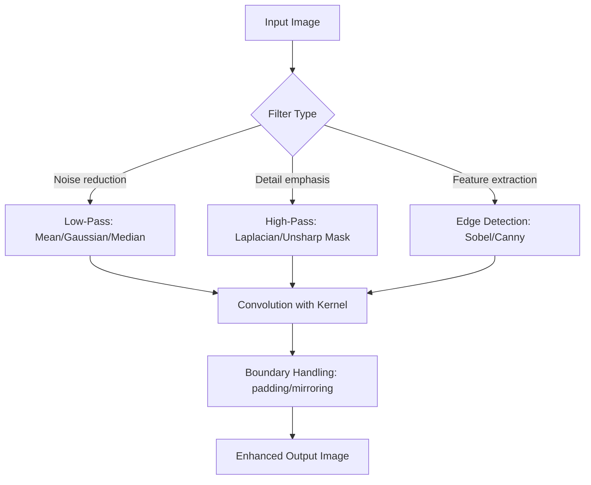

## Image Enhancement Methods

### Overview

Image enhancement encompasses techniques that improve the visual interpretability or analytical utility of remotely sensed imagery without adding new information — unlike correction procedures (radiometric/atmospheric), enhancement manipulates existing pixel values to emphasize features, improve contrast, sharpen detail, or combine spectral information in ways more useful for visual interpretation or subsequent classification. Enhancement is typically applied after radiometric and geometric correction, as a preprocessing step for visualization or feature extraction.

### Contrast Enhancement (Radiometric Enhancement)

Raw satellite imagery often occupies only a narrow portion of the available dynamic range (e.g., 8-bit or 16-bit), resulting in low-contrast, visually flat images. Contrast enhancement redistributes pixel values across the full available range.

#### Linear Contrast Stretch

Maps the input DN range linearly to the full output range:

$$DN_{out} = \left(\frac{DN_{in} - DN_{min}}{DN_{max} - DN_{min}}\right) \times (2^n - 1)$$

where $n$ is the output bit depth (e.g., 255 for 8-bit output).

- **Minimum-Maximum Stretch**: Uses the actual minimum and maximum DN values present in the image as $DN_{min}$/$DN_{max}$; highly sensitive to outlier pixels (e.g., a single noisy bright pixel compresses the stretch for the rest of the scene).
- **Percentage/Percentile Stretch**: Uses a percentile (e.g., 2nd and 98th percentile) rather than absolute min/max, clipping extreme outlier values to improve robustness — a widely used default in GIS software (e.g., QGIS's "Stretch to MinMax" with cumulative count cut).
- **Standard Deviation Stretch**: Sets stretch bounds at $\mu \pm k\sigma$ (commonly $k=2$), assuming an approximately Gaussian DN distribution.

#### Non-Linear Contrast Enhancement

- **Histogram Equalization**: Redistributes pixel values so the output histogram approximates a uniform distribution, maximizing overall contrast by allocating more output DN range to more frequently occurring input values. Can over-enhance noise in low-contrast, low-frequency regions.
- **Histogram Matching (Specification)**: Transforms an image's histogram to match a reference/target histogram, commonly used to radiometrically normalize a series of images (e.g., mosaic tiles, multi-temporal comparisons) to a consistent visual appearance.
- **Adaptive Histogram Equalization (AHE) / CLAHE (Contrast-Limited Adaptive Histogram Equalization)**: Applies histogram equalization locally within small image tiles rather than globally, better handling scenes with spatially varying contrast (e.g., simultaneously bright snow and dark forest); CLAHE adds a clip limit to prevent excessive local noise amplification.
- **Gaussian Stretch**: Applies a stretch designed to force the output histogram toward a Gaussian distribution shape, balancing global contrast improvement against outlier sensitivity.

**Key Points**

- Percentile/percentage stretches are generally preferred over strict min-max stretches for operational visualization because they are robust to sensor noise, dropped-line artifacts, or isolated extreme values that would otherwise dominate a min-max scaling.
- Histogram equalization is a global, non-reversible nonlinear transform — the exact mapping is data-dependent, meaning it does not preserve consistent DN-to-brightness relationships across different images, making it generally unsuitable when comparing raw DN/reflectance values is required (as opposed to purely visual interpretation).

### Practical Example: Contrast Stretching (Python/NumPy)

```python
import numpy as np
import rasterio

def percentile_stretch(band, lower_pct=2, upper_pct=98):
    lo = np.percentile(band, lower_pct)
    hi = np.percentile(band, upper_pct)
    stretched = np.clip((band - lo) / (hi - lo), 0, 1)
    return (stretched * 255).astype(np.uint8)

with rasterio.open("landsat_band4.tif") as src:
    band = src.read(1).astype(float)

enhanced = percentile_stretch(band, 2, 98)
```

```python
import cv2

def apply_clahe(band_uint8, clip_limit=2.0, tile_grid_size=(8, 8)):
    clahe = cv2.createCLAHE(clipLimit=clip_limit, tileGridSize=tile_grid_size)
    return clahe.apply(band_uint8)

clahe_enhanced = apply_clahe(enhanced)
```

**Key Points**

- `clip_limit` in CLAHE caps the height of the local histogram before equalization, redistributing clipped counts across bins to prevent excessive noise/contrast amplification in near-uniform local regions (e.g., water bodies, shadow).
- `tile_grid_size` controls the spatial scale of local adaptation; smaller tiles adapt more aggressively to local contrast but risk introducing visible tile-boundary artifacts if too small relative to image content scale.

### Spatial Filtering (Convolution-Based Enhancement)

Spatial filters apply a moving kernel (convolution matrix) across the image, computing each output pixel from a weighted combination of its neighborhood.

#### Smoothing (Low-Pass) Filters

Reduce high-frequency noise/detail, producing a smoother image:

- **Mean/Average Filter**: Replaces each pixel with the average of its neighborhood (e.g., 3×3 kernel of equal weights $1/9$); simple but blurs edges.
- **Gaussian Filter**: Weights neighborhood pixels by a Gaussian function of distance from center, providing smoother, more natural blurring than a uniform mean filter, with less edge-blurring for a given noise-reduction level.
- **Median Filter**: Replaces each pixel with the median (not mean) of its neighborhood; particularly effective for removing salt-and-pepper/impulse noise (e.g., dropped-line sensor artifacts) while better preserving edges than mean filtering.

#### Sharpening (High-Pass) Filters

Emphasize high-frequency detail (edges, fine texture):

- **Laplacian Filter**: A second-derivative-based kernel highlighting rapid intensity changes (edges) in any direction; commonly used as $\text{sharpened} = \text{original} - c \times \text{Laplacian}(\text{original})$.
- **High-Boost Filtering**: Generalizes unsharp masking by amplifying the high-frequency component before adding it back to the original: $\text{output} = A \times \text{original} - \text{low-pass}(\text{original})$, where $A \geq 1$ controls sharpening strength.
- **Unsharp Masking**: Subtracts a blurred (low-pass) version of the image from the original to isolate high-frequency detail, then adds a scaled version of that detail back to the original image to increase apparent sharpness.

$$\text{Sharpened} = \text{Original} + k \times (\text{Original} - \text{Blurred})$$

#### Edge Detection Filters

- **Sobel Operator**: Computes approximate horizontal and vertical intensity gradients using two 3×3 kernels; commonly used for edge/boundary detection preceding feature extraction (e.g., road/coastline delineation).
- **Prewitt Operator**: Similar to Sobel but with slightly different kernel weighting, generally comparable in practical edge-detection performance.
- **Canny Edge Detector**: A multi-stage algorithm (Gaussian smoothing, gradient computation, non-maximum suppression, hysteresis thresholding) producing thin, well-localized edges; widely used beyond raw remote sensing in general computer vision but applicable to geospatial feature extraction tasks.

### Spatial Filtering Pipeline



### Practical Example: Spatial Filtering (Python/SciPy)

```python
from scipy import ndimage
import numpy as np

def apply_gaussian_smooth(band, sigma=1.5):
    return ndimage.gaussian_filter(band, sigma=sigma)

def apply_median_filter(band, size=3):
    return ndimage.median_filter(band, size=size)

def apply_laplacian_sharpen(band, strength=1.0):
    laplacian_kernel = np.array([
        [0, -1, 0],
        [-1, 4, -1],
        [0, -1, 0]
    ])
    edges = ndimage.convolve(band, laplacian_kernel)
    return band + strength * edges

def apply_sobel_edges(band):
    sx = ndimage.sobel(band, axis=0)
    sy = ndimage.sobel(band, axis=1)
    magnitude = np.hypot(sx, sy)
    return magnitude / magnitude.max() * 255
```

**Key Points**

- `sigma` in the Gaussian filter controls the effective blur radius; larger values remove more noise but also increasingly attenuate genuine fine-scale spatial detail.
- Median filtering (`size` parameter defining the neighborhood window) is generally preferred over mean/Gaussian filtering specifically for impulse-noise removal (isolated erroneous pixels) since it does not blend the outlier value into surrounding pixels the way averaging-based filters do.
- Boundary/edge handling (padding mode: reflect, constant, nearest) affects filter output near image borders and should be chosen deliberately based on application requirements.

### Spectral (Band) Enhancement Techniques

#### Band Ratioing

Dividing one band by another highlights spectral differences while reducing the influence of topographic shading and illumination variation (since illumination effects are largely multiplicative and cancel in the ratio):

$$\text{Ratio} = \frac{Band_i}{Band_j}$$

Common derived indices are specialized band ratios/combinations:

- **NDVI (Normalized Difference Vegetation Index)**: $\frac{NIR - Red}{NIR + Red}$, highlighting vegetation vigor.
- **NDWI (Normalized Difference Water Index)**: $\frac{Green - NIR}{Green + NIR}$, highlighting open water.
- **NDBI (Normalized Difference Built-up Index)**: $\frac{SWIR - NIR}{SWIR + NIR}$, highlighting built-up/urban surfaces.

#### Principal Component Analysis (PCA)

Transforms correlated multi-band imagery into a new set of uncorrelated bands (principal components) ordered by the proportion of total scene variance each explains. The first component (PC1) typically captures overall brightness/albedo variance, while later components often isolate more subtle spectral differences (vegetation type, moisture, geology) that may be visually obscured in the original bands due to high inter-band correlation.

$$\mathbf{Y} = \mathbf{E}^T (\mathbf{X} - \boldsymbol{\mu})$$

where $\mathbf{X}$ is the original multi-band pixel vector, $\boldsymbol{\mu}$ is the band-wise mean vector, $\mathbf{E}$ is the matrix of eigenvectors of the band covariance matrix, and $\mathbf{Y}$ is the resulting principal component vector.

**Key Points**

- PCA is commonly used both for visualization (e.g., displaying PC1-PC2-PC3 as an RGB composite to reveal spectral structure not apparent in true/false color composites) and as a dimensionality-reduction preprocessing step before classification, reducing redundant correlated information and computational cost.
- The proportion of variance explained by each component is available from the corresponding eigenvalues, commonly used to decide how many components to retain for downstream analysis.

#### Tasseled Cap Transformation

A fixed-coefficient linear transformation (originally derived empirically for Landsat MSS, later extended to TM, ETM+, OLI) producing physically interpretable components — commonly **Brightness**, **Greenness**, and **Wetness** — via sensor-specific coefficient sets, rather than data-dependent coefficients as in PCA.

$$TC_k = \sum_{i} c_{k,i} \cdot Band_i$$

where $c_{k,i}$ are fixed, published transformation coefficients specific to the sensor and component $k$ (Brightness, Greenness, Wetness).

**Key Points**

- Unlike PCA, Tasseled Cap coefficients are fixed per sensor (not derived from the specific scene's statistics), making Tasseled Cap components directly comparable across different images from the same sensor without re-deriving a transformation each time.

#### Pan-Sharpening

Combines a high-spatial-resolution panchromatic band with lower-spatial-resolution multispectral bands to produce a synthetic high-resolution multispectral product, exploiting the common design of many satellites (e.g., Landsat 8's 15 m panchromatic vs. 30 m multispectral bands; WorldView's sub-meter panchromatic vs. multi-meter multispectral).

Common algorithms:

- **Brovey Transform**: A simple ratio-based method preserving spectral proportions while injecting panchromatic spatial detail; computationally efficient but can introduce color distortion in vegetated/heterogeneous areas.
- **IHS (Intensity-Hue-Saturation) Transform**: Converts RGB bands to IHS color space, replaces the intensity component with the panchromatic band, then converts back to RGB — effective spatially but can cause spectral distortion, particularly for more than three input bands.
- **Gram-Schmidt Pan-Sharpening**: Uses Gram-Schmidt orthogonalization to simulate a low-resolution panchromatic band from the multispectral bands, then substitutes the true high-resolution panchromatic band, generally preserving spectral fidelity better than Brovey/IHS methods.
- **Wavelet-based / PCA-based Pan-Sharpening**: Decomposes the panchromatic band into frequency components (or principal components) and selectively injects high-frequency spatial detail into the multispectral bands, often achieving a superior spectral-spatial fidelity trade-off compared to simpler algebraic methods.

**Key Points**

- Pan-sharpening method choice involves a trade-off between spatial detail injection and spectral fidelity preservation; algorithm selection should consider the specific downstream use (visual interpretation may tolerate more spectral distortion than quantitative spectral analysis).

### Practical Example: Band Ratio and Simple Brovey Pan-Sharpening (Python)

```python
import numpy as np
import rasterio

def compute_ndvi(nir_band, red_band):
    nir = nir_band.astype(float)
    red = red_band.astype(float)
    return (nir - red) / (nir + red + 1e-10)

def brovey_pansharpen(red, green, blue, pan):
    red, green, blue, pan = [b.astype(float) for b in (red, green, blue, pan)]
    dnf = pan / (red + green + blue + 1e-10)
    return red * dnf, green * dnf, blue * dnf
```

**Key Points**

- The `+ 1e-10` epsilon in both functions prevents division-by-zero errors in pixels where band sums approach zero (e.g., deep shadow or nodata regions), a standard defensive-programming practice in raster band arithmetic.
- The Brovey `dnf` (density normalization factor) scales each multispectral band by the ratio of the panchromatic value to the sum of the input RGB bands, distributing the panchromatic spatial detail proportionally across the color bands.

### Color Composite Generation

- **True Color Composite**: RGB display using Red, Green, Blue bands mapped to their natural corresponding display channels, approximating natural human color perception.
- **False Color Composite (Standard/CIR)**: Commonly maps NIR-Red-Green to RGB display channels, making vegetation appear vivid red/pink due to high NIR reflectance — a long-standing standard in vegetation and land-cover interpretation.
- **False Color Composite (Other band combinations)**: Various SWIR-NIR-Red or other combinations are used for specialized interpretation tasks (e.g., burn scar mapping, geological lineament analysis, urban feature discrimination), with combination choice driven by which spectral bands best discriminate the target features.

### Common Error Sources and Limitations

- **Over-stretching amplifying noise**: Aggressive contrast stretching (especially histogram equalization) in low-signal regions (shadow, water) can amplify sensor noise to a degree that creates spurious visual texture unrelated to genuine surface variation.
- **Edge artifacts from spatial filtering boundary handling**: Improper boundary/padding choice in convolution-based filters can introduce artificial edge effects at image borders or tile boundaries in a tiled processing workflow.
- **PCA component interpretation instability across scenes**: Because PCA coefficients are derived from each specific image's statistics, the physical meaning of a given principal component (e.g., "PC2 correlates with moisture") is not guaranteed to be consistent across different images/scenes, unlike the fixed-coefficient Tasseled Cap transform — this limits direct PCA component comparison across a multi-temporal series without additional normalization.
- **Pan-sharpening spectral distortion**: Simpler algebraic pan-sharpening methods (Brovey, basic IHS) can introduce color/spectral distortion sufficient to compromise quantitative spectral analysis (e.g., computing NDVI from pan-sharpened bands is generally discouraged in favor of computing indices from the original, non-pan-sharpened multispectral bands).
- **Loss of quantitative meaning after nonlinear enhancement**: Histogram equalization and similar nonlinear, data-dependent enhancements should generally be treated as visualization-only outputs; using enhanced DN values in place of original reflectance/radiance for quantitative analysis introduces incorrect and inconsistent value relationships.

**Related Topics**

- Radiometric and geometric image correction (prerequisite processing stage)
- Atmospheric correction techniques
- Multispectral and hyperspectral image classification methods
- Vegetation, water, and built-up spectral index applications
- Texture analysis and GLCM (Gray-Level Co-occurrence Matrix) features
- Object-based image analysis (OBIA) preprocessing
- Deep learning-based image super-resolution for remote sensing
- Change detection preprocessing and radiometric normalization