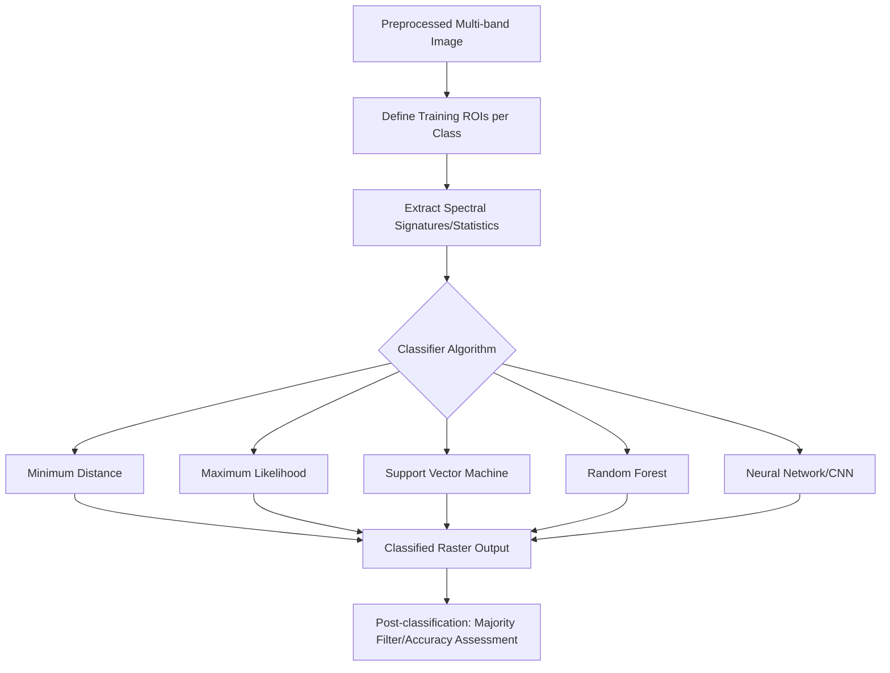
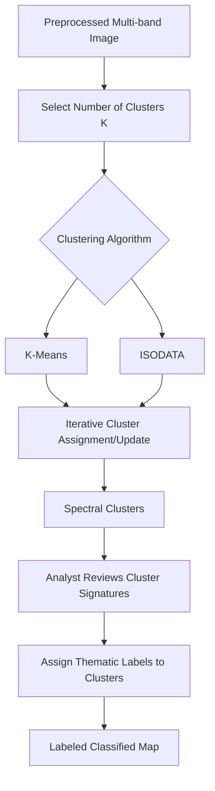

## Supervised and Unsupervised Classification


### Overview

Image classification assigns each pixel (or, in object-based approaches, each segmented object) in remotely sensed imagery to a discrete thematic class — land cover types, vegetation species, urban features, water bodies. The two foundational paradigms are **supervised classification**, which uses analyst-provided labeled training samples to guide the algorithm, and **unsupervised classification**, which groups pixels into spectrally distinct clusters without prior labels, requiring post-hoc class labeling by the analyst. Both remain foundational to land-cover mapping workflows, even as deep learning approaches increasingly supplement traditional pixel-based methods.

### Supervised Classification

#### Core Workflow

1. **Training data collection**: The analyst defines representative sample areas (regions of interest, ROIs) for each target class, based on field knowledge, high-resolution reference imagery, or existing land-cover maps.
2. **Signature/feature extraction**: Statistical characteristics (mean, covariance, spectral signature) are computed for each class from the training samples.
3. **Classification/decision rule application**: Every pixel in the image is evaluated against the class signatures and assigned to the most probable class according to the chosen algorithm's decision rule.
4. **Accuracy assessment**: Independent validation samples (not used in training) are compared against classified output to quantify classification accuracy.



#### Classical Statistical Classifiers

**Minimum Distance to Mean**

Assigns each pixel to the class whose mean spectral signature is closest in feature (spectral) space, using Euclidean distance:

$$d(x, \mu_c) = \sqrt{\sum_{i=1}^{n} (x_i - \mu_{c,i})^2}$$

where $x$ is the pixel's spectral vector across $n$ bands and $\mu_c$ is the mean spectral vector of class $c$. Simple and computationally efficient, but ignores class variance/covariance structure, making it less accurate than methods that account for spectral spread and inter-band correlation.

**Parallelepiped Classifier**

Defines a multidimensional rectangular decision region (parallelepiped) around each class's training data range in feature space (typically mean ± some multiple of standard deviation per band). Fast but suffers from unclassified pixels (falling outside all parallelepipeds) and overlapping/ambiguous regions where parallelepipeds intersect.

**Maximum Likelihood Classifier (MLC)**

Assumes each class follows a multivariate Gaussian (normal) distribution in spectral space, computing the probability that a given pixel belongs to each class based on the class's mean vector and covariance matrix, then assigning the pixel to the class with highest posterior probability.

$$p(x|c) = \frac{1}{(2\pi)^{n/2}|\Sigma_c|^{1/2}} \exp\left(-\frac{1}{2}(x-\mu_c)^T \Sigma_c^{-1} (x-\mu_c)\right)$$

**Key Points**

- MLC generally outperforms minimum distance and parallelepiped methods because it explicitly accounts for class variance and inter-band covariance structure, but it requires a sufficiently large training sample size per class (rule-of-thumb guidance often suggests at least 10× the number of bands per class) to reliably estimate the covariance matrix; small or non-representative training samples can degrade its accuracy advantage.
- MLC's Gaussian distribution assumption is a simplification that may not hold for all land-cover classes, particularly heterogeneous or mixed classes with multi-modal spectral distributions.

#### Machine Learning-Based Classifiers

**Support Vector Machine (SVM)**

Finds the optimal hyperplane (or, via kernel functions, a nonlinear decision boundary in a transformed higher-dimensional space) that maximizes the margin between classes in spectral feature space. Effective with relatively small training sample sizes and high-dimensional data (e.g., hyperspectral imagery), and does not assume any particular underlying data distribution.

$$\min_{w,b} \frac{1}{2}\|w\|^2 \quad \text{subject to} \quad y_i(w \cdot x_i + b) \geq 1 \; \forall i$$

for the linear, separable case; kernel functions (RBF, polynomial) extend SVM to nonlinear decision boundaries.

**Random Forest**

An ensemble of decision trees, each trained on a bootstrap-sampled subset of training data and a random subset of features at each split, with final classification determined by majority vote across all trees. Widely used in operational land-cover mapping due to robustness to noise, ability to handle high-dimensional feature spaces (including derived indices, texture measures, and multi-temporal stacks), and relatively few hyperparameters requiring tuning.

**Key Points**

- Random Forest and SVM are currently among the most widely used classifiers in operational remote sensing land-cover mapping (e.g., underlying many Google Earth Engine-based classification workflows), generally outperforming classical statistical classifiers (MLC) on complex, high-dimensional feature spaces while remaining more computationally efficient and interpretable than deep learning approaches for typical multispectral classification tasks.
- Random Forest provides built-in variable importance measures (e.g., mean decrease in Gini impurity or permutation importance), useful for understanding which input bands/derived features contribute most to class discrimination.

**Deep Learning Approaches (Convolutional Neural Networks)**

CNNs learn hierarchical spatial-spectral features directly from imagery (often as image patches rather than individual pixels), capturing spatial context and texture patterns that pixel-based classifiers cannot. Common architectures adapted for remote sensing include U-Net (for semantic segmentation producing per-pixel class maps) and various patch-based CNN classifiers.

**Key Points**

- Deep learning classifiers typically require substantially larger labeled training datasets than traditional classifiers to achieve comparable or superior accuracy, and greater computational resources (GPU acceleration) for training; the accuracy advantage over Random Forest/SVM varies considerably depending on data volume, task complexity, and available spatial context, so the improvement is not universal or guaranteed [Inference — recommend evaluating both approaches against project-specific validation data].

### Practical Example: Random Forest Classification (Python/scikit-learn)

```python
import numpy as np
import rasterio
from sklearn.ensemble import RandomForestClassifier
from sklearn.model_selection import train_test_split
from sklearn.metrics import classification_report, confusion_matrix

with rasterio.open("multiband_stack.tif") as src:
    image = src.read()
    profile = src.profile

n_bands, height, width = image.shape
image_reshaped = image.reshape(n_bands, -1).T

training_pixels = np.load("training_samples.npy")
training_labels = np.load("training_labels.npy")

X_train, X_test, y_train, y_test = train_test_split(
    training_pixels, training_labels, test_size=0.3, stratify=training_labels, random_state=42
)

rf_classifier = RandomForestClassifier(
    n_estimators=500,
    max_depth=None,
    min_samples_leaf=5,
    n_jobs=-1,
    random_state=42
)
rf_classifier.fit(X_train, y_train)

y_pred = rf_classifier.predict(X_test)
print(classification_report(y_test, y_pred))
print(confusion_matrix(y_test, y_pred))

classified_flat = rf_classifier.predict(image_reshaped)
classified_map = classified_flat.reshape(height, width)

profile.update(count=1, dtype=rasterio.uint8)
with rasterio.open("classified_output.tif", "w", **profile) as dst:
    dst.write(classified_map.astype(rasterio.uint8), 1)
```

**Key Points**

- `stratify=training_labels` in the train/test split preserves the relative class proportions between training and testing subsets, important when class distributions are imbalanced (a common situation in land-cover data, e.g., water often being a minority class).
- `n_estimators=500` sets the number of trees in the forest; increasing tree count generally improves stability of predictions up to a point of diminishing returns, at the cost of increased computation and memory.
- `min_samples_leaf` constrains minimum leaf node size, acting as a regularization parameter to reduce overfitting on noisy or small training samples.

### Unsupervised Classification

#### Core Workflow

Unsupervised classification requires no prior training labels; instead, a clustering algorithm groups pixels based purely on spectral similarity, and the analyst subsequently assigns thematic meaning (labels) to each resulting cluster by comparing cluster spectral characteristics against reference imagery or field knowledge.



**K-Means Clustering**

Partitions pixels into $K$ clusters by iteratively: (1) assigning each pixel to the nearest cluster centroid (typically Euclidean distance in spectral space), and (2) recomputing each centroid as the mean of all pixels assigned to it, repeating until convergence (centroids stabilize or a maximum iteration count is reached).

$$J = \sum_{k=1}^{K} \sum_{x_i \in C_k} \|x_i - \mu_k\|^2$$

the within-cluster sum of squared distances objective that K-Means minimizes.

**ISODATA (Iterative Self-Organizing Data Analysis Technique)**

An extension of K-Means that dynamically adjusts the number of clusters during iteration by splitting clusters with excessive internal variance and merging clusters that are too close together or contain too few members, guided by analyst-specified parameters (minimum/maximum cluster count, minimum cluster size, splitting/merging thresholds).

**Key Points**

- K-Means requires the analyst to specify $K$ (number of clusters) in advance, which can be a nontrivial choice since the "true" number of spectrally distinct land-cover classes is often not known beforehand; ISODATA's dynamic split/merge behavior partially addresses this by allowing the final cluster count to differ from the initial specification.
- Both algorithms are sensitive to initial centroid placement; multiple runs with different random initializations (or K-Means++ smart initialization) are commonly used to improve the likelihood of converging to a good (though not guaranteed globally optimal) solution.
- Unsupervised classification is often used as an exploratory step even within supervised workflows — reviewing unsupervised cluster output can help an analyst identify spectrally distinct sub-classes or refine training sample definitions before running a supervised classifier.

### Practical Example: K-Means Unsupervised Classification (Python)

```python
import numpy as np
import rasterio
from sklearn.cluster import KMeans

with rasterio.open("multiband_stack.tif") as src:
    image = src.read()
    profile = src.profile

n_bands, height, width = image.shape
pixels = image.reshape(n_bands, -1).T

valid_mask = ~np.any(np.isnan(pixels), axis=1)
valid_pixels = pixels[valid_mask]

kmeans = KMeans(n_clusters=8, n_init=10, random_state=42)
cluster_labels = kmeans.fit_predict(valid_pixels)

full_labels = np.full(pixels.shape[0], -1, dtype=int)
full_labels[valid_mask] = cluster_labels
cluster_map = full_labels.reshape(height, width)

for cluster_id in range(8):
    cluster_pixels = valid_pixels[cluster_labels == cluster_id]
    print(f"Cluster {cluster_id}: mean spectral signature = {cluster_pixels.mean(axis=0)}")

profile.update(count=1, dtype=rasterio.int16)
with rasterio.open("kmeans_clusters.tif", "w", **profile) as dst:
    dst.write(cluster_map.astype(rasterio.int16), 1)
```

**Key Points**

- `n_init=10` runs K-Means 10 times with different centroid initializations, keeping the result with the lowest within-cluster sum of squares, mitigating sensitivity to poor initial centroid placement.
- Printing each cluster's mean spectral signature supports the manual labeling step — the analyst compares these signatures (and spatial pattern) against reference data to assign meaningful class names (e.g., "Cluster 3 → Water" based on characteristically low NIR reflectance).

### Object-Based Image Analysis (OBIA)

An alternative to pixel-based classification, OBIA first segments the image into homogeneous, spatially contiguous objects (groups of spectrally/texturally similar adjacent pixels) using algorithms such as multiresolution segmentation or SLIC (Simple Linear Iterative Clustering) superpixels, then classifies each object (rather than each pixel) using both spectral and additional object-level features (shape, size, texture, spatial context, neighbor relationships).

**Key Points**

- OBIA is particularly advantageous for high-spatial-resolution imagery (sub-meter to a few meters) where individual land-cover features (a single tree crown, a building roof) span many pixels, since pixel-based classification on such imagery tends to produce noisy "salt-and-pepper" classification artifacts that OBIA's object-level aggregation naturally mitigates.
- Popular implementations include eCognition (commercial) and open-source alternatives built on Python libraries (e.g., scikit-image segmentation algorithms combined with scikit-learn classifiers).

### Accuracy Assessment

Classification accuracy is standardly assessed using an **error matrix (confusion matrix)** comparing classified output against independent reference/validation data:

- **Overall Accuracy**: Proportion of correctly classified validation samples across all classes, $\frac{\text{sum of diagonal}}{\text{total samples}}$.
- **Producer's Accuracy**: For a given reference class, the proportion of samples correctly classified (relates to omission error: $1 - \text{Producer's Accuracy}$).
- **User's Accuracy**: For a given classified (map) class, the proportion of samples that are actually correct on the ground (relates to commission error: $1 - \text{User's Accuracy}$).
- **Kappa Coefficient**: A chance-corrected agreement statistic, accounting for the possibility of agreement occurring by random chance alone.

$$\kappa = \frac{p_o - p_e}{1 - p_e}$$

where $p_o$ is observed overall accuracy and $p_e$ is the expected accuracy under random chance given the marginal class distributions.

**Key Points**

- Kappa has been increasingly critiqued in the remote sensing accuracy literature as potentially misleading or less informative than simpler metrics (overall accuracy alongside per-class producer's/user's accuracy), particularly given known sensitivity to class prevalence imbalance; current practice varies across the field regarding whether Kappa should be reported as a primary accuracy metric [Unverified — reflects an ongoing methodological discussion rather than settled consensus].
- Validation samples must be independent of training samples (not spatially or otherwise overlapping) to produce an unbiased accuracy estimate; using training pixels for validation systematically overstates accuracy.

### Post-Classification Processing

- **Majority/Modal Filtering**: Applies a moving-window majority filter to the classified raster to remove isolated single-pixel misclassifications ("salt-and-pepper" noise), producing a more spatially coherent, cartographically cleaner output.
- **Minimum Mapping Unit (MMU) Enforcement**: Removes or merges classified regions smaller than a specified minimum area threshold, often required for compliance with mapping product specifications.
- **Class Aggregation/Recoding**: Combining detailed classification schemes into broader thematic categories for specific downstream applications (e.g., merging multiple forest-type classes into a single "Forest" class for a land-cover change summary).

### Common Error Sources and Limitations

- **Non-representative or insufficient training data**: Training samples that do not adequately capture a class's full spectral variability (e.g., sampling only healthy vegetation while missing stressed/senescent vegetation of the same class) lead to systematic misclassification of underrepresented spectral variants.
- **Spectral confusion between classes**: Classes with genuinely overlapping spectral signatures (e.g., certain urban materials and bare soil, or different crop types at similar phenological stages) are fundamentally difficult to separate using spectral information alone, regardless of classifier sophistication, and may require additional data (texture, multi-temporal, elevation) to resolve.
- **Mixed pixels (spectral mixing)**: Pixels covering a spatial area containing multiple land-cover types (common at class boundaries or with coarser-resolution imagery) produce a blended spectral signature not representative of any single pure class, a limitation partially addressed by spectral unmixing techniques or finer spatial resolution imagery.
- **Overfitting in complex classifiers**: Highly flexible classifiers (deep neural networks, unconstrained decision trees) risk overfitting to training data idiosyncrasies rather than learning generalizable class discrimination, particularly with limited training sample sizes — cross-validation and appropriately held-out test sets are standard mitigations.
- **Class labeling ambiguity in unsupervised results**: Assigning thematic labels to unsupervised clusters is inherently subjective and can be genuinely ambiguous when a cluster's spectral signature does not clearly correspond to a single intuitive land-cover category, sometimes requiring cluster splitting/merging or auxiliary data to resolve.
- **Temporal/atmospheric inconsistency in multi-date training**: Training samples collected from one image date and applied to classify imagery from a different date/season without accounting for seasonal spectral variability (e.g., crop phenology, vegetation senescence) can systematically degrade classification accuracy.

**Related Topics**

- Image enhancement methods (contrast stretching, band ratios feeding classification features)
- Spectral unmixing and sub-pixel classification techniques
- Deep learning semantic segmentation architectures (U-Net, DeepLab) for remote sensing
- Change detection using post-classification comparison
- Texture analysis (GLCM) as auxiliary classification features
- Time-series/multi-temporal classification approaches
- Accuracy assessment design and sampling strategies
- Google Earth Engine and cloud-based classification workflows