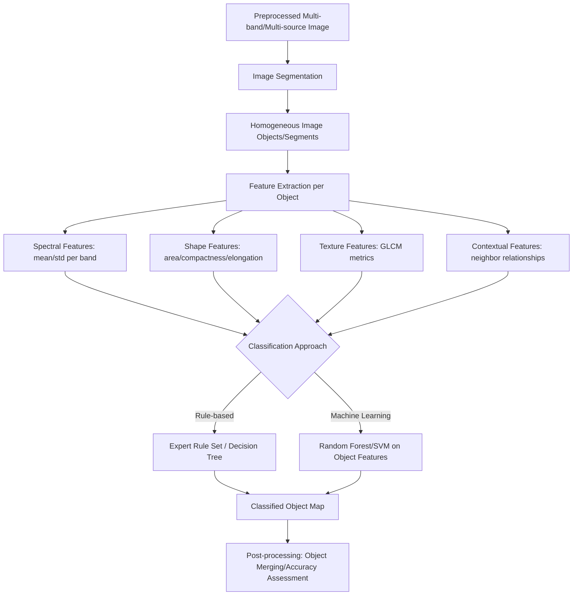

## Object-Based Image Analysis

### Overview

Object-Based Image Analysis (OBIA), also referred to as GEOBIA (Geographic Object-Based Image Analysis), is an image classification paradigm that departs from traditional pixel-based classification by first grouping spectrally and spatially homogeneous pixels into discrete image objects (segments) before classification, then classifying those objects using spectral, spatial, textural, and contextual features rather than per-pixel spectral values alone. OBIA emerged as a response to the limitations of pixel-based approaches on high-spatial-resolution imagery, where individual real-world features span many pixels and where pixel-based methods tend to produce noisy, fragmented "salt-and-pepper" classification output.

### Motivation: Why Object-Based Over Pixel-Based

- **Spatial resolution mismatch**: In high-resolution imagery (sub-meter to a few meters), a single land-cover feature (tree crown, rooftop, vehicle, individual crop row) spans many pixels, and per-pixel spectral variability within that single feature (shadow, illumination angle, material variation) can exceed the spectral variability between different feature types, confusing pixel-based classifiers.
- **Loss of spatial context in pixel-based methods**: Pixel-based classification typically evaluates each pixel independently, discarding valuable contextual information — shape, size, texture, adjacency to other features — that a human interpreter would naturally use.
- **Semantic gap**: Real-world geographic features (buildings, individual trees, agricultural parcels) are inherently objects, not isolated pixels; OBIA's object-based representation more directly matches how humans and GIS databases conceptualize geographic features.

### Core OBIA Workflow



### Image Segmentation Algorithms

Segmentation is the foundational and most consequential step in OBIA — the quality and scale of resulting segments directly determines the ceiling of achievable classification accuracy, since misdrawn segment boundaries cannot be corrected by subsequent classification.

**Multiresolution Segmentation (MRS)**

A region-growing, bottom-up algorithm (most notably implemented in the commercial software eCognition) that iteratively merges adjacent pixels/small objects into larger objects, minimizing the average heterogeneity of resulting objects subject to a user-defined scale parameter. Merging decisions balance spectral (color) homogeneity against shape homogeneity (smoothness vs. compactness) via user-defined weighting parameters.

$$f = w_{color} \cdot h_{color} + w_{shape} \cdot h_{shape}$$

where $h_{color}$ and $h_{shape}$ are heterogeneity measures for color and shape respectively, and $w_{color} + w_{shape} = 1$ are analyst-defined weights controlling their relative influence on the merging decision.

**Key Points**

- The **scale parameter** is the primary control on resulting object size — larger scale values produce larger, more generalized objects (fewer, coarser segments), while smaller values produce finer-grained, more numerous segments; appropriate scale selection is application- and feature-size-dependent, often requiring iterative visual assessment or quantitative scale-selection methods (e.g., ESP tool — Estimation of Scale Parameter).
- The shape/color weighting trade-off matters: emphasizing shape homogeneity tends to produce more geometrically regular, compact objects (useful for built-up features like buildings), while emphasizing color homogeneity better preserves natural, irregular feature boundaries (useful for vegetation patches).

**Simple Linear Iterative Clustering (SLIC) Superpixels**

A widely used open-source-compatible algorithm that generates compact, roughly uniform-sized superpixels by performing a localized k-means clustering in a combined spatial-spectral feature space, constrained to a search region proportional to the desired superpixel size. Computationally efficient and produces regular, predictable segment sizes compared to region-growing methods.

**Watershed Segmentation**

Treats the image (or a gradient/edge-strength transform of it) as a topographic surface, identifying watershed boundaries (ridge lines) that separate distinct "basins," typically corresponding to spectrally or texturally distinct regions. Prone to over-segmentation on noisy imagery unless combined with marker-based initialization or gradient smoothing.

**Mean Shift Segmentation**

A non-parametric, density-based clustering approach that iteratively shifts each pixel toward the mode (local density peak) of its neighborhood in a joint spatial-spectral feature space, with pixels converging to the same mode grouped into one segment. Does not require specifying the number of segments in advance, unlike SLIC or K-Means-based approaches, though it requires tuning spatial and spectral bandwidth parameters that similarly control resulting segment scale.

### Practical Example: SLIC Segmentation (Python/scikit-image)

```python
import numpy as np
import rasterio
from skimage.segmentation import slic
from skimage.measure import regionprops

with rasterio.open("multiband_stack.tif") as src:
    image = src.read()
    profile = src.profile

image_for_slic = np.transpose(image, (1, 2, 0)).astype(np.float64)
image_normalized = (image_for_slic - image_for_slic.min()) / (
    image_for_slic.max() - image_for_slic.min()
)

segments = slic(
    image_normalized,
    n_segments=5000,
    compactness=10,
    sigma=1,
    channel_axis=-1
)

print(f"Number of segments generated: {len(np.unique(segments))}")

profile.update(count=1, dtype=rasterio.int32)
with rasterio.open("segments.tif", "w", **profile) as dst:
    dst.write(segments.astype(rasterio.int32), 1)
```

**Key Points**

- `n_segments` sets the approximate target number of superpixels (inversely related to average segment size); `compactness` controls the trade-off between spatial regularity and adherence to spectral boundaries — higher values produce more square/regular-shaped segments, lower values produce segments that more closely follow actual spectral edges.
- `sigma` applies Gaussian smoothing before segmentation, reducing sensitivity to pixel-level noise that could otherwise fragment segments unnecessarily.

### Object Feature Extraction

Once segments are generated, each object is characterized by a feature vector spanning multiple categories, extending well beyond what pixel-based classification can use:

**Spectral Features**

- Mean, standard deviation, minimum, maximum, and sum of DN/reflectance values per band within the object.
- Band ratios and spectral indices (NDVI, NDWI) computed at the object level.

**Shape/Geometric Features**

- **Area**: Total pixel count or ground area of the object.
- **Compactness/Shape Index**: Ratio comparing object perimeter to area (or to a circle/square of equivalent area), distinguishing compact features (buildings) from elongated/irregular ones (roads, rivers, natural vegetation edges).
- **Length/Width Ratio (Elongation)**: Useful for discriminating linear features (roads, streams) from more equant features.
- **Rectangularity/Roundness**: Measures how closely an object's shape approximates a rectangle or circle, useful for built-structure discrimination.

**Texture Features**

- **Gray-Level Co-occurrence Matrix (GLCM) statistics**: Contrast, homogeneity, entropy, correlation, and angular second moment computed within each object, capturing internal spatial texture patterns (e.g., distinguishing textured forest canopy from smooth agricultural fields even with similar mean spectral values).

**Contextual/Topological Features**

- **Neighbor relationships**: Adjacency to objects of a particular class (e.g., a small object adjacent to a large water body object is more likely to be a dock or shoreline feature).
- **Relative position**: Distance to specific reference features, elevation context (from an integrated DEM/DTM layer), or hierarchical relationships in a multi-scale segmentation (super-objects/sub-objects).

**Key Points**

- The ability to incorporate shape, texture, and contextual features — not available in standard per-pixel classification — is OBIA's central analytical advantage, particularly valuable for discriminating classes with similar spectral signatures but distinct geometric or contextual characteristics (e.g., a tennis court vs. a parking lot, both often spectrally similar impervious surfaces but geometrically and contextually distinguishable).

### Practical Example: Object Feature Extraction and Classification (Python)

```python
import numpy as np
import pandas as pd
from skimage.measure import regionprops_table
from skimage.feature import graycomatrix, graycoprops
from sklearn.ensemble import RandomForestClassifier

def extract_texture_features(gray_patch):
    patch_uint8 = ((gray_patch - gray_patch.min()) /
                   (gray_patch.max() - gray_patch.min() + 1e-10) * 255).astype(np.uint8)
    glcm = graycomatrix(patch_uint8, distances=[1], angles=[0], symmetric=True, normed=True)
    return {
        "contrast": graycoprops(glcm, "contrast")[0, 0],
        "homogeneity": graycoprops(glcm, "homogeneity")[0, 0],
        "entropy": -np.sum(glcm * np.log2(glcm + 1e-10))
    }

props = regionprops_table(
    segments,
    intensity_image=image_for_slic[:, :, 0],
    properties=["label", "area", "perimeter", "eccentricity", "mean_intensity"]
)
object_features = pd.DataFrame(props)

object_features["compactness"] = (
    object_features["perimeter"] ** 2 / (4 * np.pi * object_features["area"])
)

X = object_features[["area", "perimeter", "eccentricity", "mean_intensity", "compactness"]]
y = object_labels

rf = RandomForestClassifier(n_estimators=300, random_state=42)
rf.fit(X, y)
```

**Key Points**

- `regionprops_table` from scikit-image computes standard shape/intensity descriptors per labeled segment efficiently in a vectorized manner, avoiding the need to manually loop through each object for basic geometric statistics.
- The `compactness` formula shown ($\frac{perimeter^2}{4\pi \cdot area}$) equals 1.0 for a perfect circle and increases for more irregular/elongated shapes, providing a normalized shape-complexity measure independent of object size.
- GLCM-based texture features require converting the object's pixel intensities to a discretized (typically 8-bit) representation and computing the co-occurrence matrix within the object's bounding region or exact pixel mask.

### Classification Approaches within OBIA

**Rule-Based (Expert System) Classification**

Analysts define explicit decision rules combining multiple object features (e.g., "IF NDVI > 0.4 AND compactness < 1.5 AND area > 50 m² THEN class = Forest"), often structured as a hierarchical rule set or fuzzy logic membership functions. Historically the dominant approach in commercial OBIA software (eCognition's rule-based classifier), valued for interpretability and direct incorporation of domain expertise.

**Machine Learning Classification on Object Features**

Standard supervised classifiers (Random Forest, SVM) trained on the full object feature vector (spectral + shape + texture + context) rather than raw per-pixel spectral bands, following the same general training/validation workflow as pixel-based supervised classification but operating on object-level feature tables rather than pixel arrays.

**Key Points**

- Machine learning-based object classification has become increasingly favored over purely manual rule-based systems in recent practice, since it can automatically learn complex feature interactions and thresholds from training data rather than requiring an analyst to hand-tune rule thresholds, though rule-based approaches retain value where interpretability or the direct encoding of established domain expertise is prioritized [Inference — relative prevalence varies by application domain and organizational practice].

### Multi-Scale/Hierarchical Segmentation

Many OBIA workflows use hierarchical, multi-scale segmentation — generating a nested set of segmentations at different scale parameters (e.g., coarse segments representing land-cover zones, containing finer sub-segments representing individual features within each zone) — allowing classification to draw on both fine-scale object detail and coarse-scale contextual information simultaneously (e.g., classifying individual tree crowns while also knowing which broader forest stand/zone each crown belongs to).

### Applications

- **Urban feature extraction**: Building footprint delineation, impervious surface mapping, individual tree/vegetation canopy delineation in urban environments.
- **Precision agriculture**: Individual crop row/parcel-level classification and health assessment from UAV or very-high-resolution satellite imagery.
- **Forestry**: Individual tree crown delineation and species classification, particularly valuable when combined with LiDAR-derived Canopy Height Model data as an additional object feature.
- **Coastal/wetland mapping**: Discriminating fine-scale habitat boundaries in complex, heterogeneous coastal environments where pixel-based classification often struggles with mixed pixels at habitat transition zones.
- **Damage assessment**: Post-disaster building damage classification from very-high-resolution imagery, where object shape and context (e.g., debris pattern around a building footprint) provide critical discriminating information beyond spectral change alone.

### OBIA Software and Tools

- **eCognition (Trimble)**: The original and most established commercial OBIA platform, providing multiresolution segmentation and both rule-based and machine-learning classification within an integrated GUI environment.
- **Orfeo ToolBox (OTB)**: Open-source remote sensing processing library including segmentation (mean shift, watershed) and object-based classification capabilities, usable via command line, GUI, QGIS plugin, or Python API.
- **scikit-image + scikit-learn (Python ecosystem)**: A flexible open-source alternative combining scikit-image's segmentation algorithms (SLIC, watershed, mean shift via `skimage.segmentation`) with scikit-learn's classification models, offering full programmatic control at the cost of requiring more custom workflow assembly compared to integrated commercial platforms.
- **GRASS GIS (i.segment module)**: Open-source GIS with region-growing segmentation functionality suitable for OBIA workflows, integrated within GRASS's broader raster/vector analysis ecosystem.

### Common Error Sources and Limitations

- **Over-segmentation**: Excessively small scale parameters produce segments smaller than the real-world objects of interest, fragmenting single features into multiple objects and reintroducing some of the noise/fragmentation problems OBIA is meant to avoid, though generally less severely than pure pixel-based classification.
- **Under-segmentation**: Excessively large scale parameters merge genuinely distinct adjacent features (e.g., a building and adjacent shadow, or two different crop parcels) into a single object with a blended, non-representative feature signature, causing systematic misclassification of the merged object.
- **Scale parameter sensitivity and lack of a universally optimal value**: There is no single scale parameter that is simultaneously optimal for all feature types typically present in a real scene (e.g., individual trees vs. large agricultural fields require very different appropriate scales), often necessitating multi-scale segmentation approaches or accepting some sub-optimality for less-prioritized feature classes.
- **Segmentation boundary errors propagate directly to classification accuracy**: Because classification operates on pre-defined objects, an incorrectly drawn segment boundary cannot be corrected by even a highly accurate downstream classifier — errors introduced at the segmentation stage set a hard ceiling on achievable classification accuracy for that region.
- **Increased computational and workflow complexity**: OBIA workflows generally involve more processing stages (segmentation parameter tuning, multi-category feature extraction, object-level training data collection) than pixel-based classification, requiring greater analyst expertise and processing time, particularly for large-area or high-resolution datasets.
- **Training data collection complexity**: Collecting representative object-level training samples (rather than simple point/pixel samples) can be more labor-intensive, since the analyst must identify or manually correct segment boundaries in addition to assigning class labels.

**Related Topics**

- Supervised and unsupervised pixel-based classification
- Texture analysis and GLCM feature engineering
- LiDAR-derived Canopy Height Model integration as an object feature
- Deep learning semantic and instance segmentation (Mask R-CNN, U-Net) as OBIA alternatives
- Accuracy assessment methodologies for object-based classification
- UAV/drone very-high-resolution imagery workflows
- Change detection using object-based multi-temporal comparison
- Precision agriculture remote sensing applications