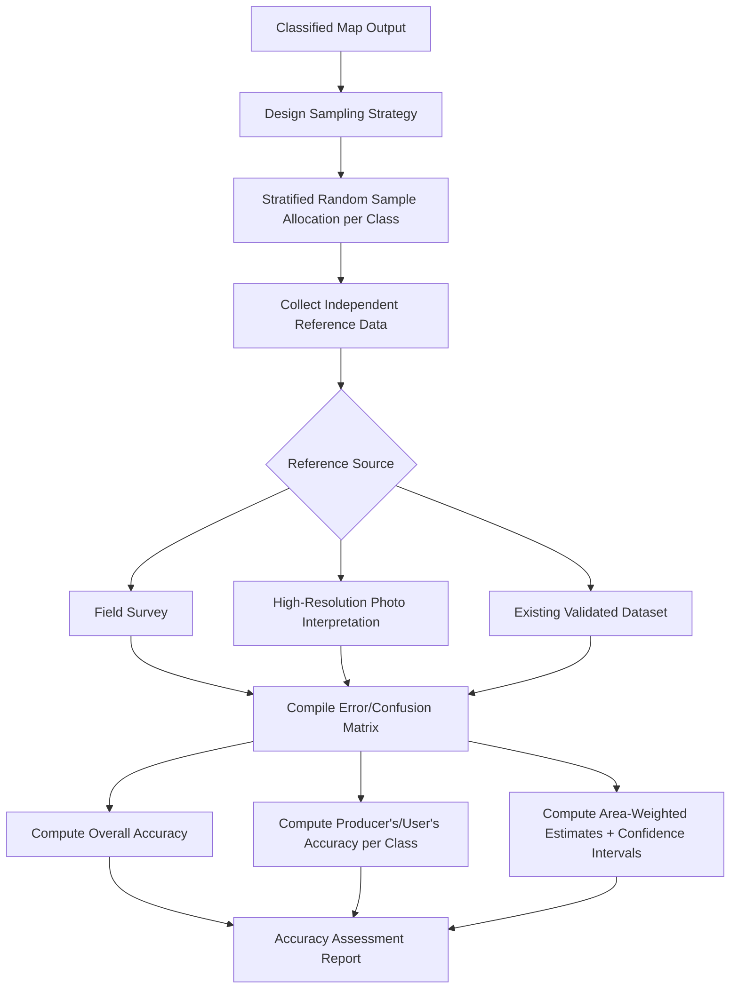

## Accuracy Assessment of Classified Imagery

### Overview

Accuracy assessment is the process of quantifying how well a classified map represents actual ground/reference conditions, providing a statistically defensible measure of map reliability essential for scientific credibility, operational decision-making, and regulatory/reporting compliance. It requires comparing classified map output against independent reference data at a carefully designed sample of locations, then summarizing agreement/disagreement through standardized statistical metrics. Rigorous accuracy assessment design — sampling strategy, reference data quality, and appropriate metric selection — is as methodologically important as the classification algorithm itself.

### Reference Data Requirements

Reference (ground truth) data must be **independent** of the training data used to build the classifier — using training pixels for both model fitting and accuracy assessment produces a systematically inflated, biased accuracy estimate that does not reflect true map performance on unseen locations.

**Sources of Reference Data**

- **Field surveys/ground visits**: Direct in-situ observation and labeling of land cover at sample locations; generally the highest-confidence reference source but costly and logistically constrained, particularly for remote or large study areas.
- **High-resolution reference imagery interpretation**: Manual photo-interpretation of very-high-resolution imagery (aerial photography, sub-meter satellite imagery, or historical imagery for retrospective assessment) as a proxy for field visits, widely used when field access is impractical.
- **Existing authoritative maps/databases**: Cadastral records, prior validated land-cover products, or administrative datasets, used cautiously given potential temporal mismatch or differing classification scheme definitions.
- **Crowdsourced/citizen science data**: Increasingly used as a supplementary reference source (e.g., Geo-Wiki, LACO-Wiki platforms), though typically requiring quality-control filtering given variable contributor reliability.

**Key Points**

- Reference data temporal alignment with the classified imagery matters significantly — using reference data collected years apart from the classified image date introduces genuine land-cover change as a confounding source of apparent "error" unrelated to actual classifier performance.
- Reference data should ideally be collected at a finer level of positional and thematic precision than the map being assessed, to avoid the reference data itself becoming the limiting source of uncertainty in the accuracy estimate.

### Sampling Design for Accuracy Assessment

The design of the reference sample — how many samples, where they are located, and how they are selected — fundamentally determines whether the resulting accuracy statistics are statistically valid and unbiased.

#### Sampling Strategies

- **Simple Random Sampling**: Reference points selected with equal probability across the entire study area; simple and statistically unbiased but can result in very few samples in rare/small classes, producing unreliable per-class accuracy estimates for those classes.
- **Stratified Random Sampling**: Samples are allocated separately within each mapped class (stratum), commonly with a minimum sample size per class (e.g., at least 50–100 samples per class, per commonly cited guidance in the accuracy assessment literature) regardless of that class's areal proportion, ensuring statistically reliable per-class accuracy estimates even for rare classes.
- **Systematic Sampling**: Samples placed at regular intervals across a grid; simple to implement but risks aliasing with periodic spatial patterns in the landscape (e.g., regularly spaced agricultural field boundaries), potentially biasing the sample.
- **Cluster Sampling**: Groups of nearby sample points are collected together (e.g., multiple points within a single field visit area), reducing field logistics cost but requiring accuracy statistic calculations that properly account for the resulting spatial non-independence between clustered samples.

**Key Points**

- Stratified random sampling is generally the most widely recommended design in the remote sensing accuracy assessment literature for classified thematic maps, because it directly addresses the practical problem that purely random sampling under-samples rare but often analytically important classes (e.g., a rare wetland class occupying 2% of a study area).
- Sample size determination should account for the number of classes, desired precision (confidence interval width) of the accuracy estimate, and expected accuracy level; various sample-size formulas exist based on binomial/multinomial proportion estimation theory, though practical guidance often defaults to established minimum-per-class heuristics when formal power analysis is not performed.

### The Error (Confusion) Matrix

The foundational structure for accuracy assessment is the **error matrix** (also called confusion matrix or contingency table), cross-tabulating classified map categories (rows or columns, by convention) against reference/ground-truth categories.

|  | Ref: Class A | Ref: Class B | Ref: Class C | Row Total |
| --- | --- | --- | --- | --- |
| **Map: Class A** | 45 | 3 | 2 | 50 |
| **Map: Class B** | 5 | 38 | 4 | 47 |
| **Map: Class C** | 1 | 6 | 41 | 48 |
| **Column Total** | 51 | 47 | 47 | 145 |

Diagonal cells represent correctly classified samples; off-diagonal cells represent misclassification, with the specific off-diagonal pattern revealing which classes are most commonly confused with one another.

### Core Accuracy Metrics

**Overall Accuracy**

$$OA = \frac{\sum_{i} n_{ii}}{N}$$

The proportion of all reference samples correctly classified — the sum of the diagonal divided by the total number of samples. Provides a single summary figure but can mask substantial variation in per-class performance, particularly for imbalanced class distributions.

**Producer's Accuracy (Omission Error)**

$$PA_i = \frac{n_{ii}}{n_{+i}}$$

For reference class $i$, the proportion of reference samples correctly identified as class $i$ on the map (column total $n_{+i}$ is the reference class total). Relates directly to **omission error**: $1 - PA_i$ is the proportion of that class's actual area omitted from (excluded from) that class on the map.

**User's Accuracy (Commission Error)**

$$UA_i = \frac{n_{ii}}{n_{i+}}$$

For mapped class $i$, the proportion of samples mapped as class $i$ that are actually correct on the ground (row total $n_{i+}$ is the map class total). Relates directly to **commission error**: $1 - UA_i$ is the proportion of that mapped class that was incorrectly included (erroneously committed to that class).

**Key Points**

- Producer's and User's Accuracy answer fundamentally different practical questions: Producer's Accuracy tells a map *user* how well the map captures the true extent of a given ground category (relevant to someone asking "how much of the actual forest did the map find?"), while User's Accuracy tells them how much they can trust a specific mapped label (relevant to "if the map says this pixel is forest, how likely is that correct?"). Reporting only Overall Accuracy obscures this important asymmetry, particularly for classes with high omission but low commission error (or vice versa).
- Overall accuracy alone can be misleadingly high on imbalanced datasets — a map that classifies a dominant class (e.g., 90% of the area as "forest" in a heavily forested region) reasonably well can achieve high overall accuracy even while performing poorly on rarer classes, a limitation per-class Producer's/User's Accuracy specifically surfaces.

### Kappa Coefficient

$$\kappa = \frac{p_o - p_e}{1 - p_e}$$

where $p_o$ is the observed overall accuracy proportion, and $p_e$ is the expected accuracy under chance agreement, computed from the row and column marginal totals:

$$p_e = \sum_{i} \frac{n_{i+} \cdot n_{+i}}{N^2}$$

Kappa is a chance-corrected agreement statistic ranging from -1 to 1, where 0 indicates agreement no better than random chance and 1 indicates perfect agreement.

**Key Points**

- Kappa has faced increasing methodological criticism in the remote sensing accuracy literature over recent years — concerns include its sensitivity to marginal class distribution (prevalence), non-intuitive interpretation, and questionable added value over directly reporting Overall Accuracy alongside per-class Producer's/User's Accuracy; whether Kappa should remain a standard reported metric is an area of ongoing methodological discussion in the field rather than settled consensus [Unverified — reflects an active, not fully resolved, debate; check current literature/journal guidance for the specific application context].
- Some accuracy assessment guidance now recommends reporting Overall Accuracy, per-class Producer's/User's Accuracy, and a formal confidence interval instead of, or in addition to, Kappa, to provide a more directly interpretable and complete accuracy picture.

### Confidence Intervals for Accuracy Estimates

Because accuracy estimates are computed from a finite sample, they carry sampling uncertainty that should be reported alongside point estimates, typically via a binomial (for overall accuracy) or multinomial proportion confidence interval:

$$CI = \hat{p} \pm z_{\alpha/2} \sqrt{\frac{\hat{p}(1-\hat{p})}{n}}$$

using a standard normal approximation to the binomial proportion, or more rigorously via methods accounting for the stratified sampling design (e.g., using the stratum-weighted variance estimator appropriate to stratified random sampling, as detailed in widely-cited good-practice accuracy assessment guidance such as Olofsson et al.).

**Key Points**

- When stratified sampling is used (the common recommended design), area-weighted accuracy estimation — where per-stratum accuracy is weighted by each class's actual mapped area proportion — is required to produce an unbiased overall accuracy estimate and correctly propagated confidence interval; naively computing overall accuracy directly from the raw (non-area-weighted) stratified sample can produce a biased estimate if strata (classes) were not sampled in proportion to their true area.

### Accuracy Assessment Workflow



### Practical Example: Error Matrix and Accuracy Metrics (Python)

```python
import numpy as np
import pandas as pd
from sklearn.metrics import confusion_matrix, cohen_kappa_score

y_true = np.array(reference_labels)
y_pred = np.array(classified_labels)
class_names = ["Water", "Forest", "Urban", "Agriculture"]

cm = confusion_matrix(y_true, y_pred, labels=class_names)
cm_df = pd.DataFrame(cm, index=[f"Map: {c}" for c in class_names],
                      columns=[f"Ref: {c}" for c in class_names])

overall_accuracy = np.trace(cm) / np.sum(cm)

producers_accuracy = {}
users_accuracy = {}
for i, cls in enumerate(class_names):
    col_total = cm[:, i].sum()
    row_total = cm[i, :].sum()
    producers_accuracy[cls] = cm[i, i] / col_total if col_total > 0 else np.nan
    users_accuracy[cls] = cm[i, i] / row_total if row_total > 0 else np.nan

kappa = cohen_kappa_score(y_true, y_pred)

print(f"Overall Accuracy: {overall_accuracy:.3f}")
print(f"Kappa Coefficient: {kappa:.3f}")
for cls in class_names:
    print(f"{cls}: Producer's = {producers_accuracy[cls]:.3f}, "
          f"User's = {users_accuracy[cls]:.3f}")
```

```python
def area_weighted_accuracy(cm, class_areas, class_names):
    """
    cm: confusion matrix (rows=map class, cols=ref class), from stratified sample
    class_areas: dict mapping class name to total mapped area (or pixel count)
    """
    total_area = sum(class_areas.values())
    weighted_correct = 0.0

    for i, cls in enumerate(class_names):
        row_total = cm[i, :].sum()
        if row_total == 0:
            continue
        stratum_user_accuracy = cm[i, i] / row_total
        area_weight = class_areas[cls] / total_area
        weighted_correct += area_weight * stratum_user_accuracy

    return weighted_correct
```

**Key Points**

- The `area_weighted_accuracy` function implements the core principle of area-weighted (stratum-weighted) accuracy estimation required when stratified sampling was used with strata not proportional to true class area — each stratum's user's accuracy contributes to the overall estimate weighted by that class's actual proportion of total mapped area, not by its (potentially disproportionate) sample count.
- `cohen_kappa_score` from scikit-learn computes the standard Kappa statistic directly from paired classified/reference labels, equivalent to manual computation from the confusion matrix's observed and chance-expected agreement.

### Positional Accuracy vs. Thematic Accuracy

Accuracy assessment as described above addresses **thematic accuracy** (is the assigned class label correct). A related but distinct concept is **positional accuracy** — how precisely the boundaries/locations of mapped features align with their true ground position, typically assessed separately (e.g., via RMSE of well-defined boundary points) and governed by different standards (e.g., NSSDA for positional accuracy of geospatial products). Both dimensions of accuracy are relevant to overall map quality but require distinct assessment methodologies.

### Common Error Sources and Limitations

- **Non-independent training/validation data**: The single most common and consequential methodological error — using the same pixels (or spatially overlapping/highly correlated pixels) for both training and accuracy assessment produces an optimistically biased accuracy estimate that overstates true map reliability.
- **Reference data errors treated as map errors**: Errors, misregistration, or genuine ambiguity in the reference data itself (e.g., photo-interpretation error, outdated reference imagery, boundary/edge pixel ambiguity) are conflated with classifier error in the resulting matrix if reference data quality is not itself carefully controlled and ideally independently validated.
- **Inadequate sample size for rare classes**: Applying simple random sampling without stratification frequently yields too few validation samples for minority classes to produce statistically reliable per-class accuracy estimates, even when overall sample size appears adequate in aggregate.
- **Ignoring the sampling design in accuracy computation**: Computing simple, non-area-weighted accuracy directly from a stratified sample (where strata were not sampled proportionally to true area) produces a biased overall accuracy estimate; the sampling design must be explicitly accounted for in the estimation formulas used.
- **Temporal mismatch between classified image and reference data**: Genuine land-cover change occurring between the image acquisition date and reference data collection date introduces error attributed to the classifier that actually reflects real-world change, particularly relevant for slower field-campaign-based reference collection relative to a single-date satellite image.
- **Boundary/edge pixel ambiguity**: Samples falling near class boundaries (mixed pixels, transitional zones) are inherently more likely to be "incorrect" regardless of classifier quality, and some accuracy assessment protocols explicitly exclude or separately analyze boundary-adjacent samples to avoid this systematic effect dominating the overall statistic.

**Related Topics**

- Supervised and unsupervised classification methodologies
- Object-based image analysis accuracy assessment considerations
- Stratified sampling design and statistical sample size determination
- Change detection accuracy assessment (post-classification comparison error propagation)
- Positional accuracy standards (NSSDA) for geometric correction validation
- Crowdsourced and citizen-science reference data quality control
- Time-series and multi-temporal classification validation approaches
- Cross-validation techniques for machine learning classifier evaluation