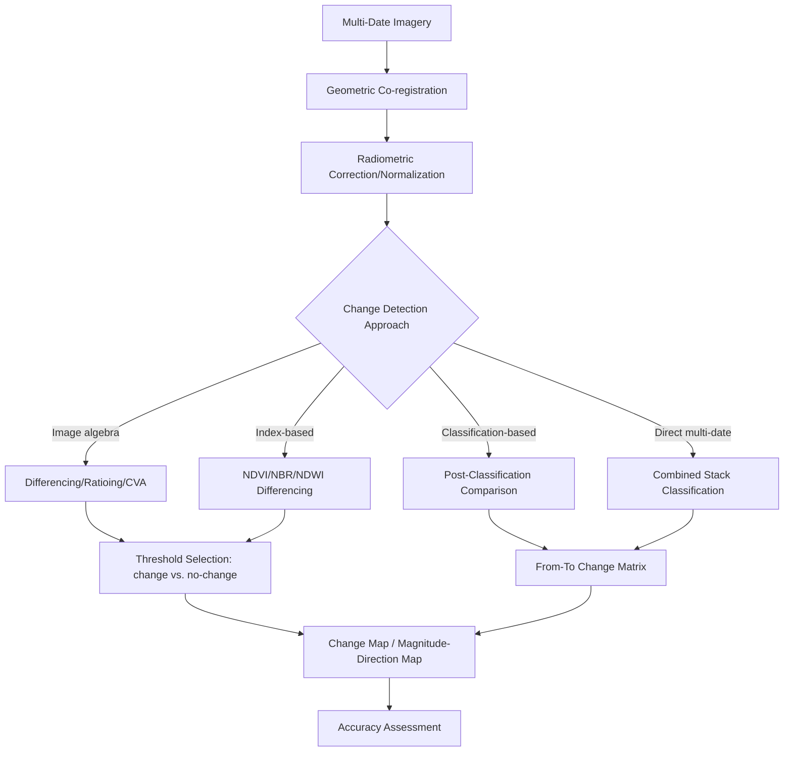

## Change Detection and Multitemporal Analysis


### Overview

Change detection is the process of identifying and characterizing differences in land surface conditions between two or more time periods using multi-temporal remotely sensed imagery. Multitemporal analysis extends this to time-series of three or more dates, enabling trend detection, seasonal/phenological pattern characterization, and disturbance monitoring over extended periods. Applications span deforestation monitoring, urban expansion tracking, disaster damage assessment, agricultural monitoring, and long-term land-cover trend analysis. Robust change detection requires careful preprocessing to ensure that detected differences reflect genuine surface change rather than artifacts of differing acquisition conditions, sensor characteristics, or processing inconsistencies between dates.

### Prerequisites for Valid Change Detection

Before any change detection algorithm is applied, multi-date imagery must be carefully harmonized, since differences arising from non-surface-change sources will otherwise be misinterpreted as real change:

- **Precise geometric co-registration**: Sub-pixel spatial alignment between image dates is essential — even small (sub-pixel) misregistration produces spurious apparent change concentrated at feature edges/boundaries, often one of the largest sources of false change detection in practice.
- **Radiometric normalization/consistency**: Images from different acquisition dates typically have different illumination geometry (solar zenith/azimuth), atmospheric conditions, and potentially different sensors, all of which alter pixel values independent of actual surface change; radiometric correction and/or relative normalization between dates is required to isolate genuine surface reflectance change.
- **Consistent phenological/seasonal timing**: For vegetation-related change detection, comparing images from different seasons (e.g., summer vs. winter) introduces massive apparent "change" driven by normal phenological cycles rather than land-cover conversion; anniversary-date or seasonally-matched image selection is standard practice to avoid this confound.
- **Consistent spatial resolution and sensor characteristics**: Comparing imagery from sensors with substantially different spatial resolution or spectral band definitions complicates direct pixel-value comparison and may require resampling or cross-sensor harmonization.

### Radiometric Normalization for Multi-Temporal Comparison

Beyond standard atmospheric correction (converting each date independently to surface reflectance), **relative radiometric normalization** specifically calibrates one image to match another using the imagery itself, often as a complement to or substitute for full physically-based atmospheric correction when absolute atmospheric parameters are unavailable for historical imagery:

- **Pseudo-Invariant Feature (PIF) normalization**: Identifies features expected to have stable reflectance over time (e.g., parking lots, exposed bedrock, deep water) and derives a linear regression relating their DN/reflectance values between the two dates, then applies that regression to normalize the entire image.
- **Histogram matching**: Adjusts one image's histogram to match a reference image's histogram per band, a simpler but less physically-grounded normalization approach than PIF-based regression.
- **Multivariate Alteration Detection (MAD) / Iteratively Reweighted MAD (IR-MAD)**: A statistically-driven method that identifies no-change pixels iteratively during the normalization process itself, using canonical correlation analysis to find the linear combinations of bands maximizing variance related to change while minimizing variance from unrelated (no-change) sources.

**Key Points**

- PIF-based normalization requires the analyst (or an automated procedure) to correctly identify genuinely stable reference features — if selected "invariant" features have actually changed between dates (e.g., a parking lot resurfaced, water turbidity varying seasonally), the resulting normalization will itself introduce systematic bias.

### Change Detection Techniques

#### Image Algebra (Differencing/Ratioing) Methods

**Image Differencing**

$$\Delta = Band_{t2} - Band_{t1}$$

Simple subtraction of corresponding bands/indices between two dates; values near zero indicate no change, while large positive or negative values indicate increase or decrease respectively. Requires selecting a threshold (often based on the statistical distribution of the difference image, e.g., $\mu \pm k\sigma$) to separate "change" from "no-change" pixels.

**Image Ratioing**

$$R = \frac{Band_{t2}}{Band_{t1}}$$

Ratio-based comparison, where a ratio near 1.0 indicates no change; can be more robust to certain multiplicative illumination differences between dates than simple differencing, though it introduces a non-symmetric, non-linear response around the no-change value.

**Change Vector Analysis (CVA)**

Treats each pixel's multi-band values at two dates as vectors in spectral space, computing both the **magnitude** (overall degree of change) and **direction/angle** (the specific type or nature of spectral change, e.g., vegetation loss vs. moisture increase) of the vector connecting the pixel's position at $t_1$ to its position at $t_2$.

$$\text{Magnitude} = \sqrt{\sum_{i=1}^{n} (Band_{i,t2} - Band_{i,t1})^2}$$


$$\theta = \arctan\left(\frac{\Delta Band_j}{\Delta Band_i}\right)$$

**Key Points**

- CVA's key advantage over simple differencing is its ability to characterize both how much change occurred (magnitude) and what kind of spectral change occurred (direction), which can be used to distinguish different change types (e.g., differentiating deforestation from seasonal senescence) that a scalar difference value alone cannot separate.

#### Index-Based Change Detection

Applying image differencing to derived indices rather than raw bands, isolating change in a specific biophysical/thematic dimension:

- **NDVI Differencing**: $\Delta NDVI = NDVI_{t2} - NDVI_{t1}$, widely used for vegetation loss/gain detection (e.g., deforestation, agricultural abandonment, drought stress).
- **NBR (Normalized Burn Ratio) Differencing**: $dNBR = NBR_{pre-fire} - NBR_{post-fire}$, using NIR and SWIR bands, a standard method for burn severity mapping in wildfire assessment.
- **NDWI/MNDWI Differencing**: Used for detecting surface water extent change (flooding, drought, reservoir level change, coastal erosion).

#### Classification-Based Change Detection

**Post-Classification Comparison**

Each date is independently classified into thematic land-cover classes, then the two classification maps are directly compared pixel-by-pixel (or object-by-object in OBIA workflows) to produce a "from-to" change matrix identifying specific class transitions (e.g., "Forest → Agriculture," "Agriculture → Urban").

$$\text{Change Matrix}_{i,j} = \text{count of pixels transitioning from class } i \text{ at } t_1 \text{ to class } j \text{ at } t_2$$

**Key Points**

- Post-classification comparison is widely used operationally because it directly yields interpretable "from-to" change information (not just "change occurred" but specifically what type of change), which is often the actual information need in applications like land-use planning or deforestation attribution.
- A significant limitation is **error propagation**: since each date's classification carries its own classification error, the change detection result compounds errors from both independent classifications — a change detection accuracy assessment must account for this compounded uncertainty rather than assuming each date's classification accuracy directly translates to change accuracy.

**Direct Multi-Date Classification**

Rather than classifying each date independently and comparing afterward, this approach classifies change directly by treating the stacked multi-temporal, multi-band imagery (or derived features) as input to a single classifier trained specifically to recognize "change" vs. "no-change" categories (or specific change-type categories) directly, often achieving higher accuracy than post-classification comparison since a single classifier can learn more nuanced multi-temporal spectral-temporal signatures of genuine change versus noise.

#### Change Detection Workflow



### Practical Example: NDVI Differencing and CVA (Python)

```python
import numpy as np
import rasterio

def compute_ndvi(nir, red):
    nir, red = nir.astype(float), red.astype(float)
    return (nir - red) / (nir + red + 1e-10)

with rasterio.open("t1_stack.tif") as src1, rasterio.open("t2_stack.tif") as src2:
    t1 = src1.read()
    t2 = src2.read()
    profile = src1.profile

ndvi_t1 = compute_ndvi(t1[3], t1[2])
ndvi_t2 = compute_ndvi(t2[3], t2[2])
delta_ndvi = ndvi_t2 - ndvi_t1

mean_diff, std_diff = np.nanmean(delta_ndvi), np.nanstd(delta_ndvi)
threshold = 1.5 * std_diff
change_mask = np.abs(delta_ndvi) > threshold

change_type = np.where(delta_ndvi < -threshold, -1,
                        np.where(delta_ndvi > threshold, 1, 0))
```

```python
def change_vector_analysis(t1_bands, t2_bands):
    diff = t2_bands.astype(float) - t1_bands.astype(float)
    magnitude = np.sqrt(np.sum(diff ** 2, axis=0))
    angle = np.degrees(np.arctan2(diff[1], diff[0]))
    return magnitude, angle

magnitude, direction = change_vector_analysis(t1[:2], t2[:2])
```

**Key Points**

- The `1.5 * std_diff` threshold is a commonly used heuristic (statistical thresholding, with the specific multiplier often tuned per application) separating genuine change from normal image-to-image spectral noise/variability; more rigorous approaches may derive thresholds from labeled validation samples rather than a fixed statistical rule.
- `np.arctan2` (rather than `arctan`) correctly handles the full 360-degree direction range and sign conventions across all four quadrants of the two-band difference space, which is necessary for interpreting CVA direction correctly.

### Time-Series (Multitemporal) Analysis Methods

Beyond simple two-date change detection, dense time-series analysis (leveraging frequent revisit satellites like Sentinel-2, Landsat, or MODIS) enables more sophisticated trend and disturbance detection:

**LandTrendr (Landsat-based Detection of Trends in Disturbance and Recovery)**

A temporal segmentation algorithm that fits piecewise linear trajectories to a per-pixel spectral index time series (commonly NBR or a similar disturbance-sensitive index), identifying discrete segments representing stable periods, disturbance events (abrupt drops), and recovery trends — widely used for forest disturbance and recovery monitoring using the full Landsat archive.

**BFAST (Breaks For Additive Seasonal and Trend)**

Decomposes a time series into seasonal, trend, and remainder components, then statistically detects breakpoints (abrupt changes) in the trend and/or seasonal components, useful for distinguishing genuine abrupt disturbance from gradual trend change or normal seasonal variation within a single unified framework.

**CCDC (Continuous Change Detection and Classification)**

Fits a per-pixel harmonic regression model (capturing seasonal patterns) to a dense time series continuously, flagging a "break" (change event) when new observations deviate significantly from the model's prediction beyond a specified threshold, enabling near-real-time continuous monitoring rather than only fixed-interval two-date comparison.

**Key Points**

- These time-series-based methods provide significant advantages over simple two-date change detection: they are more robust to noise from a single anomalous observation (e.g., residual cloud contamination, transient atmospheric effects) since they leverage information from many dates rather than just two, and they can characterize the *temporal pattern* of change (abrupt vs. gradual, with or without subsequent recovery) which two-date comparison cannot capture.
- These algorithms generally require a sufficiently dense, cloud-filtered time series to perform reliably; performance in regions with persistent cloud cover (limiting usable optical observations) can be degraded relative to regions with more frequent clear-sky imagery availability [Inference — exact degradation depends on the specific algorithm's robustness to observation gaps and the regional cloud climatology].

### Change Detection Accuracy Assessment

Change detection accuracy assessment follows the same general error matrix framework as standard classification accuracy assessment (Overall Accuracy, Producer's/User's Accuracy), but applied specifically to change/no-change categories, or to the full from-to change matrix for post-classification comparison approaches:

- **Change/No-Change binary accuracy assessment**: Simplifies validation to a two-class problem (did change occur or not), often easier to validate with available reference imagery than full multi-class from-to transition accuracy.
- **From-to transition accuracy**: Validates the specific class-to-class transition assignments, requiring reference data with sufficient thematic detail and temporal precision to confirm not just that change occurred but specifically what type of transition took place.
- **Compounded error consideration**: As noted above, change accuracy resulting from post-classification comparison reflects the combined error of both independent single-date classifications; accuracy assessment protocols and sample designs should be constructed with this compounding in mind rather than assuming single-date accuracy figures directly apply to the derived change product.

### Common Error Sources and Limitations

- **Geometric misregistration artifacts**: Even sub-pixel co-registration errors concentrate spurious "change" signal along linear features and boundaries (roads, field edges, coastlines), which can dominate a poorly-registered change detection output and must be specifically checked for during quality control.
- **Phenological/seasonal confounding**: Comparing non-anniversary-date imagery for vegetation change detection conflates normal seasonal vegetation cycling with genuine land-cover change, a frequent and significant source of false-positive change detection when seasonal timing is not carefully controlled.
- **Atmospheric/illumination inconsistency between dates**: Incomplete radiometric normalization between dates leaves residual systematic differences that manifest as spurious low-magnitude "change" spread broadly across the scene rather than localized to genuine change areas.
- **Threshold selection sensitivity**: Change/no-change threshold choice in differencing-based methods directly and often substantially affects the resulting change map's extent and character; statistically-derived thresholds (e.g., based on difference image standard deviation) provide a defensible starting point but may not correspond to the threshold that best matches actual ground-truth change extent for a specific application.
- **Cloud/shadow contamination in optical time series**: Undetected residual cloud or cloud-shadow pixels in either date can produce dramatic spurious spectral differences misinterpreted as major land-cover change; robust cloud masking prior to change detection is essential, and time-series methods (which can statistically down-weight anomalous single observations) are generally more robust to this than simple two-date comparison.
- **Minimum mapping unit and change magnitude thresholds**: Very small, isolated "change" pixels are sometimes genuine sub-pixel-scale change but are frequently noise; applying a minimum area or magnitude threshold to filter the change output is common practice but introduces a trade-off between noise suppression and sensitivity to genuine small-scale change events.

**Related Topics**

- Radiometric and geometric image correction (prerequisite normalization steps)
- Supervised and unsupervised classification (feeding post-classification comparison)
- Object-based change detection approaches
- Accuracy assessment methodology and stratified sampling design
- Forest disturbance and wildfire burn severity mapping (NBR/dNBR applications)
- Google Earth Engine time-series analysis workflows
- Synthetic Aperture Radar (SAR) change detection for cloud-persistent regions
- Land-use/land-cover trend analysis and driver attribution