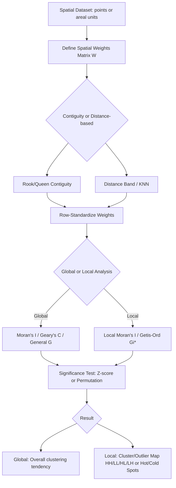

## Spatial Autocorrelation and Pattern Analysis


### Overview

Spatial autocorrelation measures the degree to which the value of a variable at one location is related to (correlated with) values of that same variable at nearby locations — the statistical formalization of Tobler's First Law of Geography: "everything is related to everything else, but near things are more related than distant things." Pattern analysis extends this concept to characterizing the spatial arrangement of point events or values across a study area, distinguishing clustered, dispersed, and random spatial patterns. These techniques are foundational to spatial statistics and underpin geostatistical interpolation, spatial regression model specification, hotspot detection, and epidemiological/environmental cluster analysis.

### Conceptual Foundation

**Positive spatial autocorrelation**: Similar values tend to cluster spatially (high values near high values, low values near low values) — e.g., elevation, temperature, or pollutant concentration typically exhibit strong positive spatial autocorrelation.

**Negative spatial autocorrelation**: Dissimilar values tend to be spatially adjacent (a checkerboard-like pattern) — less common in natural environmental phenomena but can occur in specific contexts (e.g., competitive spatial processes, certain land-use zoning patterns).

**No spatial autocorrelation (spatial randomness)**: Values are spatially independent — the value at one location provides no information about values at nearby locations.

### Spatial Weights Matrices

Nearly all spatial autocorrelation statistics require first defining a **spatial weights matrix** $W$, which formalizes the concept of "neighboring" or "nearby" for each location in the dataset — this choice materially affects analysis results and should be justified by the underlying spatial process being studied.

**Contiguity-Based Weights**

- **Rook contiguity**: Neighbors share an edge (applicable to polygon/areal data), analogous to a rook's movement in chess.
- **Queen contiguity**: Neighbors share an edge or a vertex (corner), a broader neighbor definition than rook contiguity.

**Distance-Based Weights**

- **Fixed distance band**: All locations within a specified distance threshold are considered neighbors, with weight often set uniformly (binary) or distance-decayed.
- **K-nearest neighbors (KNN)**: Each location's neighbors are defined as its $k$ closest locations by distance, ensuring a consistent number of neighbors per location regardless of local point density — useful for irregularly distributed point data where a fixed distance band might yield very different neighbor counts in dense versus sparse regions.
- **Inverse distance weighting**: Weight decreases continuously with distance (e.g., $w_{ij} = 1/d_{ij}$ or $1/d_{ij}^2$), giving nearer locations proportionally greater influence than a simple binary neighbor definition.

**Key Points**

- Spatial weights matrices are conventionally **row-standardized** (each row sums to 1) in many autocorrelation statistic formulations, which interprets each location's spatial lag as a weighted average of its neighbors' values rather than a raw sum, aiding interpretability and comparability across locations with differing neighbor counts.
- The choice of weights matrix definition is not merely a technical detail — different reasonable weight specifications can produce meaningfully different autocorrelation statistic values and significance results for the same dataset, so weights choice should be theoretically motivated by the spatial process under study rather than selected arbitrarily or purely for computational convenience.

### Global Spatial Autocorrelation Statistics

Global statistics summarize the overall degree of spatial autocorrelation across an entire study area with a single value.

#### Moran's I

The most widely used global spatial autocorrelation statistic, essentially a spatially-weighted version of the standard Pearson correlation coefficient:

$$I = \frac{n}{\sum_{i}\sum_{j} w_{ij}} \cdot \frac{\sum_{i}\sum_{j} w_{ij}(x_i - \bar{x})(x_j - \bar{x})}{\sum_{i}(x_i - \bar{x})^2}$$

where $n$ is the number of locations, $w_{ij}$ is the spatial weight between locations $i$ and $j$, and $x_i$, $\bar{x}$ are the observed value and mean respectively. Moran's I ranges approximately from -1 (strong negative/dispersed autocorrelation) through 0 (no spatial autocorrelation/random) to +1 (strong positive/clustered autocorrelation), though the exact theoretical range can vary slightly from [-1, 1] depending on the specific weights matrix.

**Key Points**

- Statistical significance of Moran's I is typically assessed via a z-score test under an assumed null hypothesis of spatial randomness (either a normality assumption or, more robustly, a permutation/Monte Carlo approach that randomly reshuffles observed values across locations many times to build an empirical reference distribution), since the theoretical sampling distribution assumptions of the simple z-test can be violated by real-world spatial data characteristics.
- Moran's I is a global statistic — it summarizes overall clustering tendency across the entire study area but cannot identify *where* specific clusters are located; local variants (below) are needed for that purpose.

#### Geary's C

An alternative global autocorrelation statistic, more sensitive to local differences than Moran's I due to its use of squared value differences rather than value-mean deviations:

$$C = \frac{(n-1)}{2\sum_{i}\sum_{j}w_{ij}} \cdot \frac{\sum_{i}\sum_{j} w_{ij}(x_i - x_j)^2}{\sum_{i}(x_i - \bar{x})^2}$$

Geary's C ranges from 0 to typically around 2, where values near 0 indicate strong positive autocorrelation, 1 indicates no spatial autocorrelation, and values above 1 (up to approximately 2) indicate negative autocorrelation — an inverted interpretation scale relative to Moran's I.

**Key Points**

- Because Geary's C directly compares each pair of neighboring values (rather than each value's deviation from the global mean), it can be more sensitive to local-scale spatial autocorrelation variation than Moran's I, which some analyses find advantageous, though Moran's I remains the more commonly reported statistic in practice across most application domains.

#### Getis-Ord General G

A global statistic specifically designed to detect the overall degree of spatial clustering of high or low values (as opposed to Moran's I, which detects general similarity clustering without distinguishing high-value from low-value clusters at the global level):

$$G = \frac{\sum_{i}\sum_{j} w_{ij} x_i x_j}{\sum_{i}\sum_{j} x_i x_j} \quad (i \neq j)$$

### Local Indicators of Spatial Association (LISA)

Local spatial statistics decompose a global statistic into location-specific values, enabling identification of *where* specific clusters or spatial outliers occur — critical for hotspot detection and localized pattern interpretation that global statistics cannot provide.

#### Local Moran's I (Anselin's LISA)

$$I_i = \frac{(x_i - \bar{x})}{\sum_{k}(x_k - \bar{x})^2/n} \sum_{j} w_{ij}(x_j - \bar{x})$$

Computes a Moran's I-like statistic for each individual location, classifying each into one of several categories based on the location's own value relative to the mean and its neighbors' average value relative to the mean:

- **High-High (HH)**: A high value surrounded by high-value neighbors (a "hot spot" cluster core).
- **Low-Low (LL)**: A low value surrounded by low-value neighbors (a "cold spot" cluster core).
- **High-Low (HL)**: A high value surrounded by low-value neighbors (a positive spatial outlier).
- **Low-High (LH)**: A low value surrounded by high-value neighbors (a negative spatial outlier).

**Key Points**

- The sum of all Local Moran's I values across a study area is proportional to the Global Moran's I statistic, formalizing the decomposition relationship between the global and local versions of the statistic.
- Because Local Moran's I involves many simultaneous per-location significance tests, **multiple comparison correction** (e.g., False Discovery Rate adjustment) is often recommended to control the overall Type I error rate across the full set of local tests, though in practice this correction is not always applied and results reported without it should be interpreted with awareness of the increased chance false-positive cluster identification.

#### Getis-Ord Gi* (Local Getis-Ord)

$$G_i^* = \frac{\sum_{j} w_{ij} x_j - \bar{X}\sum_{j} w_{ij}}{S\sqrt{\frac{n\sum_{j}w_{ij}^2 - (\sum_{j}w_{ij})^2}{n-1}}}$$

Produces a z-score for each location indicating whether it is part of a statistically significant cluster of high values (a "hot spot," large positive z-score) or low values (a "cold spot," large negative z-score). Unlike Local Moran's I, Gi* (the "star" variant includes the location itself in its own neighborhood sum, distinguishing it from the plain Gi statistic which excludes self) directly classifies clusters as hot or cold without the additional outlier categories that Local Moran's I provides.

**Key Points**

- Getis-Ord Gi* is specifically and widely used for hotspot mapping (e.g., crime hotspot analysis, disease cluster detection, environmental contamination hotspot identification) precisely because its output directly and simply answers "where are the statistically significant clusters of high/low values," which is often the exact practical question motivating the analysis, compared to Local Moran's I's more nuanced but less immediately actionable four-category output.
- ArcGIS's "Hot Spot Analysis" tool and similar implementations in open-source packages (PySAL's `esda.G_Local`) are standard implementations of the Gi* statistic in practice.

### Spatial Autocorrelation Workflow



### Practical Example: Global and Local Moran's I (Python/PySAL)

```python
import geopandas as gpd
import numpy as np
from libpysal.weights import Queen, KNN
from esda.moran import Moran, Moran_Local

gdf = gpd.read_file("study_area_polygons.shp")

w = Queen.from_dataframe(gdf, use_index=True)
w.transform = "r"

values = gdf["target_variable"].values

moran_global = Moran(values, w, permutations=999)
print(f"Global Moran's I: {moran_global.I:.4f}")
print(f"Expected I under randomness: {moran_global.EI:.4f}")
print(f"p-value (permutation-based): {moran_global.p_sim:.4f}")

moran_local = Moran_Local(values, w, permutations=999)

gdf["local_I"] = moran_local.Is
gdf["quadrant"] = moran_local.q
gdf["p_sim"] = moran_local.p_sim

quadrant_labels = {1: "High-High", 2: "Low-High", 3: "Low-Low", 4: "High-Low"}
gdf["cluster_type"] = gdf["quadrant"].map(quadrant_labels)
gdf.loc[gdf["p_sim"] > 0.05, "cluster_type"] = "Not Significant"

gdf.to_file("lisa_cluster_map.gpkg", driver="GPKG")
```

**Key Points**

- `permutations=999` specifies a Monte Carlo permutation-based significance test (randomly reshuffling values across locations 999 times to build an empirical null distribution), generally preferred over the analytical normality-assumption z-test for robustness to non-normal data distributions common in real environmental/socioeconomic datasets.
- `w.transform = "r"` applies row-standardization to the weights matrix, a standard preprocessing step before computing most spatial autocorrelation statistics in PySAL and comparable software.
- Filtering results by `p_sim > 0.05` to reclassify non-significant locations as "Not Significant" is standard LISA cluster map practice, since the raw quadrant classification alone does not indicate statistical significance — only locations passing the significance threshold should be interpreted as genuine clusters/outliers rather than potentially random quadrant assignment.

### Point Pattern Analysis

Distinct from areal-unit spatial autocorrelation, point pattern analysis specifically characterizes the spatial arrangement of discrete point events (e.g., disease cases, crime incidents, tree locations, species occurrence records).

**Quadrat Analysis**

Divides the study area into a regular grid of quadrats (cells) and compares the observed variance in point counts per quadrat to the variance expected under Complete Spatial Randomness (CSR, a Poisson process), using a Variance-to-Mean Ratio (VMR):

$$VMR = \frac{s^2}{\bar{x}}$$

$VMR \approx 1$ suggests a pattern consistent with random (Poisson) distribution; $VMR > 1$ suggests clustering; $VMR < 1$ suggests a more regular/dispersed pattern than random.

**Nearest Neighbor Analysis (Clark-Evans statistic)**

Compares the observed mean distance between each point and its nearest neighbor to the expected mean nearest-neighbor distance under CSR:

$$R = \frac{\bar{r}_{observed}}{\bar{r}_{expected}} = \frac{\bar{r}_{observed}}{\frac{1}{2\sqrt{n/A}}}$$

where $n$ is point count and $A$ is study area. $R \approx 1$ indicates a random pattern, $R < 1$ indicates clustering (points closer together than expected by chance), and $R > 1$ indicates a dispersed/regular pattern.

**Ripley's K-Function**

Unlike quadrat and nearest-neighbor analysis (which assess pattern at a single characteristic scale), Ripley's K-function evaluates clustering/dispersion across a *range* of distances simultaneously, making it particularly valuable for detecting scale-dependent spatial patterns (e.g., a point pattern that is clustered at short distances but appears random or dispersed at larger distances).

$$K(d) = \frac{A}{n^2}\sum_{i}\sum_{j \neq i} I(d_{ij} < d)$$

where $I(\cdot)$ is an indicator function counting point pairs within distance $d$ of each other. The related, variance-stabilized **L-function** ($L(d) = \sqrt{K(d)/\pi}$) is commonly plotted against the CSR expectation, with observed values above the CSR envelope indicating clustering at that distance scale, and below indicating dispersion.

**Key Points**

- Ripley's K/L-function's ability to reveal scale-dependent pattern structure is its primary advantage over simpler single-scale statistics (VMR, nearest-neighbor R) — many real-world point processes exhibit different clustering behavior at different spatial scales (e.g., trees clustered at the scale of individual seed dispersal but more randomly distributed at the scale of an entire forest stand), which single-scale statistics cannot detect.
- Edge effects (points near the study area boundary having artificially fewer neighbors within the study area, purely due to boundary truncation rather than genuine pattern) are a well-known methodological concern in point pattern analysis; standard edge-correction methods (e.g., Ripley's isotropic correction, translation correction, or buffer/guard zones) are commonly applied to mitigate this bias.

### Practical Example: Point Pattern Analysis (Python)

```python
import numpy as np
from scipy.spatial import cKDTree

def nearest_neighbor_index(points, area):
    n = len(points)
    tree = cKDTree(points)
    distances, _ = tree.query(points, k=2)
    observed_mean_distance = distances[:, 1].mean()
    expected_mean_distance = 0.5 / np.sqrt(n / area)
    R = observed_mean_distance / expected_mean_distance
    z_score = (observed_mean_distance - expected_mean_distance) / (
        0.26136 / np.sqrt(n**2 / area)
    )
    return R, z_score

points = np.column_stack([point_x_coords, point_y_coords])
study_area_km2 = 100.0
R_statistic, z = nearest_neighbor_index(points, study_area_km2)
print(f"Nearest Neighbor Ratio (R): {R_statistic:.3f}, Z-score: {z:.3f}")
```

**Key Points**

- `k=2` in the KDTree query retrieves each point's two nearest neighbors (the first being the point itself at distance 0), so the second column (`[:, 1]`) provides the true nearest *other* point distance for each observation.
- The standard error formula (`0.26136 / sqrt(n²/area)`) is the theoretical standard error of the mean nearest-neighbor distance under Complete Spatial Randomness, used to compute a z-score testing whether the observed pattern significantly deviates from random.

### Applications

- **Environmental hotspot detection**: Identifying statistically significant clusters of pollutant concentration, disease incidence, or environmental hazard exposure using Getis-Ord Gi*.
- **Species distribution and ecology**: Analyzing spatial clustering of species occurrence data to infer habitat preference, dispersal mechanisms, or competitive spatial exclusion patterns.
- **Spatial regression model diagnostics**: Testing regression residuals for spatial autocorrelation (via Moran's I on residuals) to determine whether a standard (non-spatial) regression model is misspecified and whether a spatial regression model (spatial lag, spatial error) is needed instead.
- **Urban and land-use pattern analysis**: Characterizing spatial clustering of land values, urban growth, or specific land-use types to inform planning and zoning analysis.
- **Epidemiology and public health**: Detecting disease clusters (e.g., cancer incidence clusters) for public health investigation, a historically significant application area for both LISA and point pattern methods.

### Common Error Sources and Limitations

- **Modifiable Areal Unit Problem (MAUP)**: Spatial autocorrelation statistics computed on areal (polygon) data can produce different results depending on how the underlying spatial units are defined or aggregated (e.g., census tract vs. county boundaries), a fundamental and unavoidable limitation of areal spatial statistics that should be acknowledged when interpreting results, particularly when comparing studies using different administrative or analytical unit definitions.
- **Spatial weights matrix specification sensitivity**: As noted above, different reasonable weights matrix choices can yield materially different autocorrelation results for the same underlying data; results should ideally be checked for robustness across multiple reasonable weights specifications rather than reported from a single, potentially arbitrary choice.
- **Multiple comparison inflation in local statistics**: Computing many simultaneous local significance tests (one per location) without correction inflates the overall probability of at least one false-positive cluster identification purely by chance, a concern frequently underappreciated in applied LISA/Gi* mapping.
- **Edge effects in point pattern analysis**: Uncorrected boundary effects can bias point pattern statistics toward apparent dispersion near study area edges, an artifact of the analysis boundary rather than a genuine feature of the underlying point process.
- **Confusing spatial autocorrelation with spatial regression model misspecification**: Significant spatial autocorrelation in a regression model's residuals can indicate either a genuinely spatially-structured underlying process requiring a spatial model, or simply an omitted spatially-structured covariate in an otherwise correctly specified non-spatial model — distinguishing between these explanations requires substantive domain knowledge beyond the autocorrelation statistic itself.
- **Scale mismatch between analysis and true process scale**: Applying a single-scale statistic (e.g., simple nearest-neighbor analysis) to a point process that exhibits genuinely different clustering behavior at different spatial scales can produce a misleading single-number summary that masks important scale-dependent structure a method like Ripley's K would reveal.

**Related Topics**

- Geostatistical interpolation methods (Kriging and variogram modeling)
- Spatial regression models (spatial lag, spatial error, geographically weighted regression)
- Hotspot mapping and cluster detection applications in public health
- Modifiable Areal Unit Problem and ecological fallacy in spatial analysis
- Species distribution modeling and habitat suitability analysis
- Spatial sampling design for environmental monitoring networks
- Time-space clustering methods (space-time scan statistics)
- Geographically Weighted Regression (GWR) for non-stationary spatial relationships