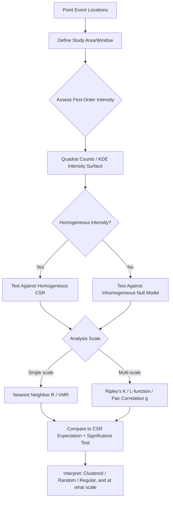

## Point Pattern Analysis


### Overview

Point Pattern Analysis (PPA) is the branch of spatial statistics concerned with characterizing the spatial arrangement, intensity, and structure of discrete point events distributed across a study region — disease cases, crime incidents, tree locations, species occurrence records, earthquake epicenters. Its central question is whether an observed point configuration is consistent with a random spatial process (Complete Spatial Randomness) or instead exhibits statistically significant clustering, dispersion/regularity, or more complex dependence structure (e.g., clustering around a second point process, scale-dependent pattern variation). PPA underlies applications ranging from epidemiological cluster detection to ecological habitat analysis and crime hotspot mapping.

### Complete Spatial Randomness (CSR)

The foundational null hypothesis against which most point pattern statistics test observed patterns is **Complete Spatial Randomness**, formally a homogeneous Poisson process, characterized by two properties:

1. **Constant intensity (first-order stationarity)**: The expected number of points per unit area is constant across the entire study region — no systematic spatial trend in point density.
2. **Independence (second-order stationarity/no interaction)**: The presence of a point at one location has no influence on the probability of a point occurring nearby — points are placed independently of one another.

Deviations from CSR are classified as:

- **Clustered (aggregated)**: Points occur closer together than expected under CSR, often reflecting an underlying attractive process (contagion, shared resource dependency, common causal driver).
- **Regular (dispersed/inhibited)**: Points are more evenly spaced than expected under CSR, often reflecting a repulsive process (competition for space/resources, systematic spacing such as planted orchards).

**Key Points**

- CSR is a deliberately simple theoretical baseline, not necessarily a realistic model of most real-world point processes — its primary analytical role is as a null hypothesis for statistical testing, not as an assumed accurate description of the underlying generating process.
- First-order effects (variation in underlying point *intensity*, e.g., population density affecting disease case counts) must be distinguished from second-order effects (true point *interaction*, e.g., contagion between cases) — failing to account for first-order intensity variation (such as population density) can produce spurious apparent clustering that actually reflects heterogeneous background intensity rather than genuine point interaction.

### Intensity Estimation

Before testing for clustering/dispersion, characterizing the underlying **intensity function** $\lambda(s)$ — the expected number of points per unit area at location $s$ — is often a necessary preliminary step, particularly for distinguishing first-order intensity variation from second-order interaction effects.

**Quadrat Counts**

Overlaying a regular grid and counting points per cell provides a simple, coarse intensity estimate; cell size selection involves a bias-variance trade-off (larger cells produce smoother but less spatially detailed estimates, smaller cells produce noisier but more locally responsive estimates).

**Kernel Density Estimation (KDE)**

Estimates a continuous intensity surface by centering a kernel function (commonly Gaussian or quartic) over each point and summing overlapping kernel contributions across the study area:

$$\hat{\lambda}(s) = \sum_{i=1}^{n} \frac{1}{h^2} K\left(\frac{s - s_i}{h}\right)$$

where $K$ is the kernel function, $h$ is the bandwidth (smoothing parameter), and $s_i$ are the observed point locations.

**Key Points**

- Bandwidth ($h$) selection is the most consequential parameter in KDE — too small a bandwidth produces an overly noisy, spiky surface dominated by individual point locations; too large a bandwidth over-smooths and can obscure genuine local clustering structure. Common bandwidth selection approaches include rule-of-thumb formulas (e.g., based on point count and study area) and cross-validation-based optimization (e.g., likelihood cross-validation), though the optimal choice remains somewhat application- and dataset-dependent.

### Global (Summary) Point Pattern Statistics

#### Quadrat Analysis / Variance-to-Mean Ratio (VMR)

$$VMR = \frac{s^2}{\bar{x}}$$

Compares the observed variance in per-quadrat point counts to the mean count; under CSR (Poisson process), variance equals the mean, so $VMR \approx 1$. $VMR > 1$ indicates overdispersion consistent with clustering; $VMR < 1$ indicates underdispersion consistent with a more regular pattern than random.

**Key Points**

- Quadrat analysis assesses pattern at a single scale determined by the chosen quadrat size, and results can be sensitive to this choice — the same point pattern can appear clustered, random, or even regular depending on quadrat size relative to the true scale of clustering in the underlying process, a manifestation of the broader Modifiable Areal Unit Problem in a point-pattern context.

#### Nearest Neighbor Analysis (Clark-Evans R Statistic)

$$R = \frac{\bar{r}_{observed}}{\bar{r}_{expected}} = \frac{\bar{r}_{observed}}{\frac{1}{2\sqrt{n/A}}}$$

Compares the observed mean nearest-neighbor distance to the theoretical expected mean nearest-neighbor distance under CSR (a function of point count $n$ and study area $A$). $R \approx 1$ indicates random pattern; $R < 1$ indicates clustering (points closer together than expected); $R > 1$ indicates regularity/dispersion.

$$z = \frac{\bar{r}_{observed} - \bar{r}_{expected}}{SE}, \quad SE = \frac{0.26136}{\sqrt{n^2/A}}$$

**Key Points**

- Nearest-neighbor analysis, like quadrat analysis, characterizes pattern at effectively a single scale (the typical nearest-neighbor spacing), and is well-suited for a quick, simple overall summary but cannot reveal scale-dependent pattern structure that more sophisticated distance-based functions (Ripley's K) can detect.

#### Ripley's K-Function and L-Function

Unlike single-scale statistics, Ripley's K-function evaluates the expected number of additional points within distance $d$ of a typical point, across a continuous range of distances $d$, enabling detection of scale-dependent clustering or dispersion:

$$K(d) = \frac{A}{n^2}\sum_{i=1}^{n}\sum_{j \neq i} \frac{I(d_{ij} < d)}{w_{ij}}$$

where $I(\cdot)$ is an indicator function, $A$ is study area, $n$ is point count, and $w_{ij}$ is an edge-correction weight. Under CSR, $K(d) = \pi d^2$.

The variance-stabilizing **L-function** transform is commonly used for visualization and interpretation:

$$L(d) = \sqrt{\frac{K(d)}{\pi}}$$

Under CSR, $L(d) = d$, so plotting $L(d) - d$ against $d$ produces a horizontal line at zero under CSR — values above zero indicate clustering at that distance, values below zero indicate dispersion, and the specific distances at which deviations occur reveal the characteristic scale(s) of the underlying spatial process.

**Key Points**

- Ripley's K/L-function's central strength is precisely this multi-scale sensitivity — many real point processes exhibit different behavior at different scales (e.g., disease cases might cluster tightly at a household scale due to person-to-person transmission while appearing essentially random at a city-wide scale due to independent introduction events), which single-scale statistics cannot detect but K/L-functions directly reveal.
- Statistical significance is typically assessed by comparing the observed K/L curve against a simulation envelope generated from many CSR (or other specified null model) simulations — the observed curve falling outside the simulated envelope at a given distance indicates statistically significant deviation from the null model at that specific scale.

#### Pair Correlation Function (g-function)

A closely related but non-cumulative alternative to Ripley's K, describing the relative density of point pairs at exactly distance $d$ (rather than K's cumulative count within distance $d$):

$$g(d) = \frac{1}{2\pi d} \frac{dK(d)}{dd}$$

Under CSR, $g(d) = 1$ for all $d$; values above 1 indicate clustering at that specific distance, values below 1 indicate dispersion.

**Key Points**

- Because the pair correlation function is non-cumulative (unlike K, which accumulates all pairs within distance $d$), it can sometimes reveal finer-scale structure that the cumulative K-function's inherent smoothing can obscure, though both are widely used and often examined together in thorough point pattern analyses.

### Point Pattern Analysis Workflow



### Practical Example: Ripley's K-Function with Simulation Envelope (Python)

```python
import numpy as np
from scipy.spatial.distance import pdist, squareform

def ripleys_k(points, area, distances):
    n = len(points)
    dist_matrix = squareform(pdist(points))
    K_values = []
    for d in distances:
        count = np.sum(dist_matrix < d) - n  # exclude self-pairs (diagonal)
        K = (area / (n ** 2)) * count
        K_values.append(K)
    return np.array(K_values)

def csr_simulation_envelope(n_points, area, bounds, distances, n_sims=99):
    sim_K_values = np.zeros((n_sims, len(distances)))
    for i in range(n_sims):
        sim_points = np.column_stack([
            np.random.uniform(bounds[0], bounds[1], n_points),
            np.random.uniform(bounds[2], bounds[3], n_points)
        ])
        sim_K_values[i] = ripleys_k(sim_points, area, distances)
    lower_envelope = np.min(sim_K_values, axis=0)
    upper_envelope = np.max(sim_K_values, axis=0)
    return lower_envelope, upper_envelope

points = np.column_stack([event_x_coords, event_y_coords])
distances = np.linspace(0, 5000, 50)
study_area = 1e7
bounds = (0, 3000, 0, 3300)

observed_K = ripleys_k(points, study_area, distances)
theoretical_K = np.pi * distances ** 2
lower_env, upper_env = csr_simulation_envelope(len(points), study_area, bounds, distances)

observed_L = np.sqrt(observed_K / np.pi) - distances
```

**Key Points**

- The simulation envelope approach (generating `n_sims` random CSR realizations and taking the min/max K-value at each distance) constructs an empirical significance envelope directly from simulation rather than relying on an analytical approximation, generally the preferred approach in practice given the complexity of deriving exact analytical significance bounds for K-function comparisons, particularly with edge correction applied.
- This simplified implementation omits edge correction (accounting for points near the study boundary having artificially truncated neighbor counts); production implementations (e.g., R's `spatstat` package, Python's `pointpats`) apply standard corrections (Ripley's isotropic correction, translation correction, or border/guard-area methods) that this example does not include, and results without correction can be biased, particularly for points near study area boundaries.

### Marked Point Patterns and Multivariate Point Processes

**Marked point patterns** associate an additional attribute (mark) with each point location — a continuous value (e.g., tree diameter, disease severity) or categorical label (e.g., species type, case type) — extending analysis beyond pure location to the relationship between spatial arrangement and the mark itself.

**Bivariate/Multivariate K-functions ($K_{12}$)**

Extend Ripley's K to assess spatial relationships *between* two distinct point types (e.g., predator vs. prey locations, disease cases vs. control locations), testing whether the two point types are spatially independent, attracted to one another (cross-clustering), or spatially segregated from one another.

**Key Points**

- Bivariate point pattern methods are particularly important in epidemiological case-control study designs, where the spatial relationship between disease case locations and a control population's locations (rather than case locations analyzed in isolation) is often the analytically and substantively relevant comparison — analyzing case locations alone without accounting for the underlying population distribution risks conflating population density patterns with genuine disease clustering.

### Software and Implementation

- **R `spatstat` package**: The most comprehensive and widely used point pattern analysis software, providing extensive functions for intensity estimation, CSR testing, Ripley's K/L/pair-correlation functions with multiple edge-correction methods, marked point pattern analysis, and point process model fitting.
- **Python `pointpats` (part of the PySAL ecosystem)**: Open-source Python implementation of core point pattern analysis methods (quadrat statistics, nearest-neighbor statistics, Ripley's K/L-functions with edge correction, centrography statistics), designed for integration with the broader PySAL spatial analysis ecosystem.
- **ArcGIS Spatial Statistics Tools**: Includes Average Nearest Neighbor, Multi-Distance Spatial Cluster Analysis (Ripley's K), and Kernel Density tools within a GUI-driven commercial GIS environment.
- **QGIS**: Supports kernel density estimation natively and point pattern analysis through plugins and Processing Toolbox integration with underlying libraries.

### Applications

- **Epidemiology**: Detecting disease case clustering (e.g., cancer clusters, infectious disease outbreak spatial spread) to inform public health investigation, often incorporating population-at-risk denominators via inhomogeneous or case-control point pattern methods.
- **Ecology**: Characterizing tree/plant spatial distribution to infer competitive exclusion, seed dispersal mechanisms, or habitat preference at different spatial scales.
- **Criminology**: Crime incident hotspot identification and pattern characterization to inform resource allocation and predictive policing research (noting significant ongoing methodological and ethical discussion regarding predictive policing applications specifically).
- **Seismology**: Earthquake epicenter clustering analysis (aftershock sequences typically show strong clustering, informing seismic hazard models).
- **Environmental monitoring network design**: Assessing whether existing monitoring station locations exhibit unwanted clustering or gaps, informing optimal placement of additional stations.

### Common Error Sources and Limitations

- **Confounding first-order intensity variation with second-order clustering**: Failing to account for underlying population/background intensity heterogeneity is one of the most significant and common analytical errors in point pattern analysis — apparent "clustering" in raw point locations may simply reflect underlying population density variation (more people, more cases) rather than genuine spatial interaction/contagion between events; inhomogeneous versions of K-function and related statistics, or explicit case-control comparison designs, are needed to properly separate these effects.
- **Edge effects**: Points near the study area boundary have artificially truncated neighbor counts purely due to the analysis window's edge, not genuine pattern — uncorrected analyses can produce spurious apparent dispersion near boundaries; standard edge-correction methods should be applied, particularly for smaller study areas where boundary effects represent a larger proportion of the analysis area.
- **Study area/window definition sensitivity**: The choice of study area boundary itself affects point pattern statistic results (a form of the broader MAUP), and an inappropriately defined study window (e.g., including areas where points genuinely cannot occur, like water bodies for terrestrial species) can bias intensity and pattern estimates.
- **Scale mismatch in single-scale statistics**: As with spatial autocorrelation more broadly, single-scale statistics (VMR, nearest-neighbor R) can produce misleading single-number summaries for point processes with genuinely scale-dependent structure, which multi-scale methods (K/L-function, pair correlation) are specifically designed to reveal.
- **Multiple testing when scanning across many distances**: Examining K/L-function significance across many distance values without appropriate correction increases the chance of identifying spurious "significant" deviations purely by chance at some distance, even under a true null hypothesis — global envelope tests (rather than pointwise significance at each distance independently) are a recommended more rigorous alternative.
- **Ignoring spatial heterogeneity in the observation/detection process**: Point locations recorded through non-uniform sampling or reporting effort (e.g., wildlife sightings more frequently reported near roads/trails, disease cases more completely reported in areas with better healthcare access) can produce apparent spatial pattern that reflects sampling/reporting bias rather than the true underlying ecological or epidemiological process.

**Related Topics**

- Spatial autocorrelation and areal-unit pattern analysis (Moran's I, Getis-Ord Gi*)
- Geostatistical interpolation and Kriging for continuous surface estimation
- Kernel density estimation bandwidth selection methods
- Space-time point pattern analysis and scan statistics
- Case-control spatial epidemiology study design
- Modifiable Areal Unit Problem and spatial scale effects
- Species distribution modeling and habitat suitability analysis
- Geographically Weighted Regression for spatially varying relationships