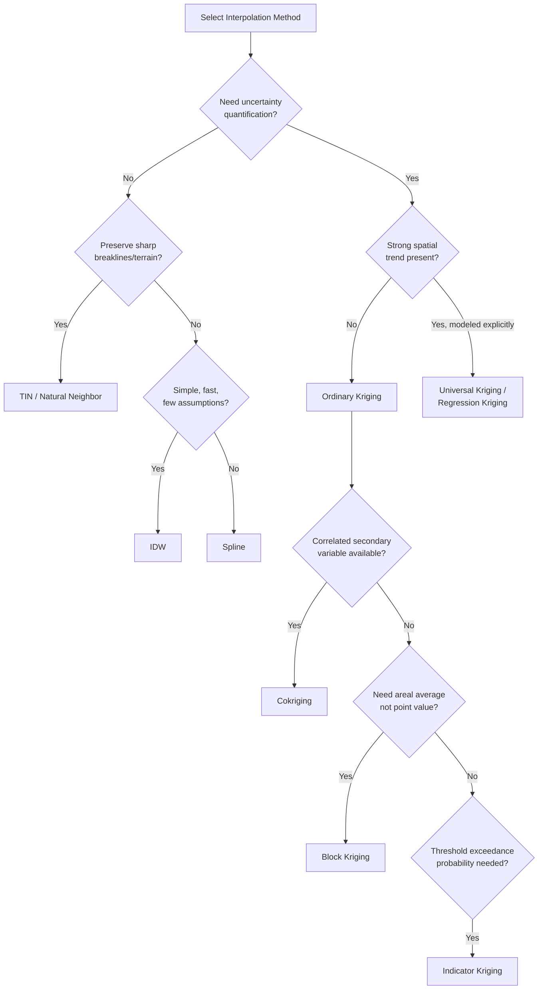

## Interpolation Methods and Kriging

### Overview

Spatial interpolation estimates values at unsampled locations from a set of known point observations, producing continuous surfaces from discrete measurements. This underpins digital elevation models, precipitation surfaces, pollutant concentration maps, and soil property mapping. Methods split into two broad families: **deterministic interpolators**, which compute values from mathematical formulas based on distance or geometry with no explicit statistical model, and **geostatistical interpolators** (kriging), which model spatial variation as a stochastic process with a defined spatial autocorrelation structure, producing both predictions and prediction uncertainty.

### Deterministic Interpolation Methods

#### Inverse Distance Weighting (IDW)

IDW estimates the value at an unsampled point as a weighted average of nearby known points, with weights inversely proportional to distance raised to a power $p$:

$$\hat{Z}(s_0) = \frac{\sum_{i=1}^{n} w_i Z(s_i)}{\sum_{i=1}^{n} w_i}, \quad w_i = \frac{1}{d_i^p}$$

where $d_i$ is the distance from the prediction location $s_0$ to sample point $s_i$, and $p$ is typically set to 2. Larger $p$ values concentrate influence on nearby points, producing sharper local detail; smaller $p$ values smooth the surface. IDW is exact (interpolated surface passes through sample points), fast to compute, and requires no variogram modeling, but it cannot extrapolate beyond the sample value range and produces characteristic "bullseye" artifacts around clustered high or low values.

**Example**: Estimating rainfall at an ungauged station from five nearby rain gauges, weighting each gauge's contribution by $1/d^2$.

#### Nearest Neighbor / Thiessen Polygons (Voronoi)

Assigns each unsampled location the value of its closest sample point, partitioning space into polygons where every location within a polygon is closer to that polygon's sample point than to any other. Common for categorical data (e.g., climate zone assignment) or as a quick baseline, but produces discontinuous, blocky surfaces unsuitable for continuous phenomena.

#### Triangulated Irregular Network (TIN) / Linear Interpolation

Constructs a triangular mesh (commonly via Delaunay triangulation) connecting sample points, then linearly interpolates values within each triangle's planar facet. Preserves breaklines and sharp features well (ridges, streams), making it common for terrain modeling, but produces faceted, non-smooth surfaces unless supplemented by higher-order surface fitting (e.g., natural neighbor or spline-based TIN smoothing).

#### Natural Neighbor Interpolation

Uses Voronoi tessellation to determine weights: the interpolated value at $s_0$ is a weighted average of neighboring samples, where weights equal the proportion of the "new" Voronoi cell around $s_0$ that would be stolen from each neighbor's existing cell. Produces smoother, more locally adaptive results than IDW without requiring a distance-decay parameter, and behaves well with irregularly spaced data.

#### Spline Interpolation

Fits a mathematically defined smooth surface through data points by minimizing overall surface curvature, analogous to bending a flexible sheet through pinned points. Two common variants:

- **Regularized spline**: Smoother, allows some overshoot beyond the sample value range — suited to gradually varying phenomena.
- **Tension spline**: Constrains surface stiffness to reduce overshoot, better for surfaces with abrupt changes.

Splines can produce values outside the observed data range, which is a limitation for strictly bounded variables (e.g., percentages, concentrations that cannot be negative).

#### Trend Surface Analysis

Fits a global polynomial regression surface (as a function of $x, y$ coordinates) to the entire dataset using least squares:

$$Z(x,y) = \beta_0 + \beta_1 x + \beta_2 y + \beta_3 x^2 + \beta_4 xy + \beta_5 y^2 + \dots + \varepsilon$$

Captures broad, large-scale spatial trends but is not an exact interpolator (does not honor sample points) and performs poorly at capturing local variation. Often used as a first step to remove trend before geostatistical modeling of the residuals.

### Geostatistical Foundations: The Variogram

Kriging methods rest on the theory of **regionalized variables** — quantities that vary continuously in space with spatial autocorrelation (values close together tend to be more similar than values far apart), but whose exact pattern is treated as one realization of a random process.

#### The Empirical Semivariogram

The semivariogram quantifies how dissimilarity between point pairs grows with separation distance $h$ (the "lag"):

$$\hat{\gamma}(h) = \frac{1}{2N(h)} \sum_{i=1}^{N(h)} \left[ Z(s_i) - Z(s_i + h) \right]^2$$

where $N(h)$ is the number of point pairs separated by distance $h$ (within a tolerance band). Plotting $\hat{\gamma}(h)$ against $h$ produces the experimental variogram cloud, typically binned into lag classes.

#### Key Variogram Parameters

- **Nugget** ($C_0$): The semivariance at $h \to 0$. A nonzero nugget indicates measurement error or unresolved spatial variation at distances smaller than the sampling interval.
- **Sill** ($C_0 + C$): The semivariance value at which the variogram levels off, representing the total variance of the field. At this point, pairs of points are no longer spatially correlated.
- **Range** ($a$): The lag distance at which the sill is reached — beyond this separation, points are considered spatially independent.

#### Theoretical Variogram Models

The empirical variogram is fitted with a theoretical model to ensure a valid (positive semi-definite) covariance structure for kriging equations. Common models:

$$\text{Spherical: } \gamma(h) = C_0 + C\left[\frac{3h}{2a} - \frac{1}{2}\left(\frac{h}{a}\right)^3\right] \text{ for } h \le a; \quad \gamma(h) = C_0 + C \text{ for } h > a$$


$$\text{Exponential: } \gamma(h) = C_0 + C\left[1 - e^{-h/a}\right]$$


$$\text{Gaussian: } \gamma(h) = C_0 + C\left[1 - e^{-h^2/a^2}\right]$$

Spherical models reach the sill at a finite range and are common for soil and geological properties. Exponential and Gaussian models approach the sill asymptotically; Gaussian models produce very smooth surfaces and are prone to numerical instability if oversmoothed.

#### Stationarity and Anisotropy

Kriging assumes **second-order (weak) stationarity**: the mean is constant across the study area and covariance depends only on separation distance and direction, not absolute location. **Isotropy** assumes spatial correlation is identical in all directions; **anisotropy** occurs when correlation varies by direction (e.g., stronger correlation along a prevailing wind direction for air pollution, or along a river valley for groundwater properties), requiring directional variograms and an anisotropy ratio/angle in the model.

### Kriging Methods

Kriging is the **Best Linear Unbiased Predictor (BLUP)**: among all linear combinations of observed values, it selects weights that are unbiased and minimize prediction variance, given the fitted variogram model. Ordinary Kriging handles stationary fields where the mean is constant but unknown, while Universal Kriging extends this to fields that carry a deterministic spatial trend. [geostatistical-modeling](https://www.geostatistical-modeling.com/kriging-interpolation-surface-generation-techniques/ordinary-universal-kriging/)

#### Simple Kriging

Assumes the mean $\mu$ is known and constant across the entire domain. The predictor is:

$$\hat{Z}(s_0) = \mu + \sum_{i=1}^{n} \lambda_i \left[Z(s_i) - \mu\right]$$

Rarely used in practice since the true mean is almost never known with certainty, but serves as the theoretical baseline for other kriging variants.

#### Ordinary Kriging (OK)

Ordinary Kriging is considered the best linear unbiased estimation method among available kriging methods for spatial interpolation. It assumes the mean is constant but *unknown*, estimating it implicitly through the constraint that kriging weights sum to one ($\sum \lambda_i = 1$). The fitting quality of the semivariogram has a significant impact on interpolation accuracy, and the Gaussian, spherical, and exponential models are the most commonly used semivariogram forms. [plos](https://journals.plos.org/plosone/article?id=10.1371%2Fjournal.pone.0266942)[nih](https://www.ncbi.nlm.nih.gov/pmc/articles/PMC9032399/)

The OK system of equations (in matrix form) solves for weights $\lambda$ and a Lagrange multiplier $\mu$:

$$\begin{bmatrix} C & \mathbf{1} \\ \mathbf{1}^T & 0 \end{bmatrix} \begin{bmatrix} \lambda \\ \mu \end{bmatrix} = \begin{bmatrix} c_0 \\ 1 \end{bmatrix}$$

where C is the n×n covariance matrix and the unbiasedness constraint requires the weights to sum to 1. OK is the default, most widely used kriging variant because it requires fewer assumptions than Simple Kriging and is more tractable than Universal Kriging. [geostatistical-modeling](https://www.geostatistical-modeling.com/kriging-interpolation-surface-generation-techniques/ordinary-universal-kriging/)

**Example**: Interpolating soil organic carbon (%) across a field from 40 auger samples using a fitted spherical variogram (nugget = 0.05, sill = 0.4, range = 250 m).

#### Universal Kriging (UK) / Kriging with a Trend (KT)

Also called 'Kriging with a trend', Universal Kriging uses a regression model as part of the kriging process, typically modeling the unknown local mean as having a local linear or quadratic trend. The random field is decomposed into a deterministic drift component $m(s)$ plus a stationary residual: [spatialanalysisonline](https://www.spatialanalysisonline.com/HTML/kriging_interpolation.htm)

$$Z(s) = m(s) + \varepsilon(s), \quad m(s) = \sum_{k=0}^{K} \beta_k f_k(s)$$

with drift functions such as f₀=1, f₁=x, f₂=y for a linear drift, adding a drift matrix F of dimension n × (K+1) to the kriging system, with both Ordinary and Universal Kriging solving for weights λ and Lagrange multipliers that minimize prediction variance. In practice, Universal Kriging semivariogram fitting is done on the residuals after removing linear or quadratic drift. [Inference] Because the variogram must be estimated from residuals rather than raw data, UK requires more careful diagnostic checking than OK, and practitioners often prefer removing a trend externally and applying OK to the residuals for a simpler, more transparent workflow. Ordinary Kriging with a deterministic trend removed beforehand is often used in preference to Universal Kriging because the modeling process is simpler and results from the two approaches are often very similar. [Ordinary & Universal Kriging in Python +2](https://www.geostatistical-modeling.com/kriging-interpolation-surface-generation-techniques/ordinary-universal-kriging/)

**Example**: Interpolating elevation-dependent temperature across a mountainous region, where a first-order trend with elevation is modeled as drift before kriging the residuals.

#### Block Kriging

Predicts the *average* value over a spatial block (e.g., a grid cell, watershed, or administrative unit) rather than a point value, integrating the point-support kriging predictor over the block area. Produces smoother output than point kriging and is preferred when the target application (e.g., zonal resource estimates) requires areal averages.

#### Cokriging

Cokriging uses additional observed variables, which are often correlated with each other and the variable of interest, to enhance the precision of interpolation of the primary variable of interest at each location. Requires modeling not only the variogram of the primary variable but also the cross-variogram between primary and secondary variables. Most valuable when the primary variable is expensive or sparse to sample and a correlated secondary variable is densely sampled (e.g., interpolating sparse soil moisture point data using densely sampled elevation or satellite-derived NDVI as a covariate). [columbia](https://www.publichealth.columbia.edu/research/population-health-methods/kriging-interpolation)

#### Indicator Kriging

Transforms continuous data into binary indicators (1 if value exceeds a threshold, 0 otherwise) and krigs the indicator variable directly, producing the probability that the true value exceeds the threshold at each location. Used for exceedance-probability mapping — e.g., probability that groundwater nitrate concentration exceeds a regulatory limit.

#### Poisson Kriging

Used for incidence counts and disease rates, accounting for the heteroscedastic variance inherent to rate data computed from populations of differing sizes — relevant to environmental epidemiology applications such as mapping disease incidence relative to pollution exposure. [columbia](https://www.publichealth.columbia.edu/research/population-health-methods/kriging-interpolation)

#### Regression Kriging

Fits a regression model (often incorporating environmental covariates such as elevation, slope, or land cover) to explain the deterministic trend, then krigs the regression residuals using OK, and sums the regression prediction and kriged residual surface. Functionally similar to Universal Kriging but performed as two explicit, separately diagnosable steps — widely used in digital soil mapping (e.g., the SCORPAN framework).

### Model Diagnostics and Validation

#### Cross-Validation

**Leave-one-out cross-validation (LOOCV)** removes each sample point in turn, predicts its value from the remaining points using the fitted model, and compares predicted versus observed values. Key diagnostic statistics:

- **Mean Error (ME)**: Should be near zero (unbiasedness check).
- **Root Mean Square Error (RMSE)**: Overall prediction accuracy; lower is better.
- **Mean Standardized Error (MSE)**: Should be near zero.
- **Root Mean Square Standardized Error (RMSSE)**: Should be near 1 — values greater than 1 indicate the model underestimates prediction variance (overconfident), values less than 1 indicate overestimation of variance (underconfident).

#### Kriging Variance

Unlike deterministic methods, kriging produces an explicit prediction error variance surface at every location:

$$\sigma^2_K(s_0) = C(0) - \sum_{i=1}^{n} \lambda_i C(s_i, s_0) - \mu$$

Variance is lowest near clustered sample points and highest in data-sparse regions, providing a spatially explicit confidence map — a capability deterministic interpolators like IDW and splines do not natively provide.

### Method Selection Criteria



### Semivariogram Model Comparison (svg_diagram)

<svg xmlns="http://www.w3.org/2000/svg" viewBox="0 0 700 420">
<rect x="0" y="0" width="700" height="420" fill="#ffffff" />
<text x="350" y="25" font-family="Arial" font-size="16" font-weight="bold" text-anchor="middle" fill="#1a1a1a">Semivariogram Models (svg_diagram)</text>
<line x1="60" y1="360" x2="640" y2="360" stroke="#333" stroke-width="2" />
<line x1="60" y1="360" x2="60" y2="50" stroke="#333" stroke-width="2" />
<text x="350" y="400" font-family="Arial" font-size="13" text-anchor="middle" fill="#333">Lag Distance (h)</text>
<text x="25" y="200" font-family="Arial" font-size="13" text-anchor="middle" fill="#333" transform="rotate(-90 25 200)">Semivariance γ(h)</text>
<line x1="60" y1="110" x2="640" y2="110" stroke="#999" stroke-width="1" stroke-dasharray="4,4" />
<text x="645" y="114" font-family="Arial" font-size="11" fill="#666">Sill</text>
<line x1="60" y1="340" x2="60" y2="340" stroke="#999" />
<text x="65" y="340" font-family="Arial" font-size="11" fill="#666">Nugget</text>
<circle cx="60" cy="340" r="3" fill="#333" />
<line x1="350" y1="360" x2="350" y2="110" stroke="#999" stroke-width="1" stroke-dasharray="4,4" />
<text x="352" y="378" font-family="Arial" font-size="11" fill="#666">Range (a)</text>
<path d="M 60 340 Q 205 130 350 110 L 640 110" fill="none" stroke="#2563eb" stroke-width="2.5" />
<text x="420" y="150" font-family="Arial" font-size="12" fill="#2563eb">Spherical</text>
<path d="M 60 340 Q 150 200 250 150 Q 400 115 640 111" fill="none" stroke="#dc2626" stroke-width="2.5" />
<text x="450" y="190" font-family="Arial" font-size="12" fill="#dc2626">Exponential</text>
<path d="M 60 340 C 150 335, 220 250, 350 110 L 640 110" fill="none" stroke="#16a34a" stroke-width="2.5" />
<text x="230" y="260" font-family="Arial" font-size="12" fill="#16a34a">Gaussian</text>
<circle cx="60" cy="340" r="4" fill="#1a1a1a" />
<text x="55" y="365" font-family="Arial" font-size="11" fill="#333" text-anchor="end">C₀</text>
</svg>

### Implementation Notes (Python / PyKrige)

```python
import numpy as np
from pykrige.ok import OrdinaryKriging

# Sample data: x, y coordinates and measured values
x = np.array([10, 25, 40, 55, 70])
y = np.array([15, 30, 20, 45, 60])
z = np.array([2.1, 3.4, 1.9, 4.7, 3.2])

# Fit ordinary kriging with a spherical variogram model
OK = OrdinaryKriging(
    x, y, z,
    variogram_model="spherical",
    verbose=False,
    enable_plotting=False
)

# Interpolate onto a regular grid
grid_x = np.linspace(0, 80, 100)
grid_y = np.linspace(0, 80, 100)
z_pred, ss = OK.execute("grid", grid_x, grid_y)
# z_pred: interpolated surface; ss: kriging variance surface
```

[Unverified] Exact variogram parameter values and cross-validation thresholds (e.g., "acceptable" RMSSE ranges) vary by domain convention and dataset; practitioners should validate against domain-specific literature and local data characteristics rather than applying universal cutoffs. Numerical instability from duplicate or near-duplicate coordinates is commonly addressed by deduplicating coordinates, adding a small nugget effect, or tightening the search neighborhood. [geostatistical-modeling](https://www.geostatistical-modeling.com/kriging-interpolation-surface-generation-techniques/ordinary-universal-kriging/)

### Common Pitfalls

- **Insufficient sample density**: Kriging requires enough pairs at each lag to fit a reliable variogram (rule of thumb: 30+ points minimum, ideally 100+).
- **Ignoring anisotropy**: Fitting an isotropic variogram to directionally correlated data (e.g., along a coastline or river) understates prediction accuracy in the dominant correlation direction.
- **Extrapolation beyond the convex hull**: Kriging variance grows rapidly outside the sampled area's spatial extent; predictions there are unreliable regardless of method.
- **Confusing kriging weights with IDW weights**: Kriging weights can be negative (screening effect from clustered points), unlike IDW's strictly positive weights.
- **Overfitting the variogram**: Fitting too flexible a model to a noisy empirical variogram produces an unstable, non-generalizable structure.

**Related Topics**

- Variogram Modeling and Anisotropy Analysis
- Geographically Weighted Regression (GWR)
- Point Pattern Analysis and Spatial Clustering (Ripley's K, Moran's I)
- Digital Soil Mapping and the SCORPAN Framework
- Uncertainty Propagation in Spatial Analysis
- Conditional Simulation and Stochastic Surface Realizations
- Machine Learning Approaches to Spatial Prediction (Random Forest Kriging, Gaussian Process Regression)