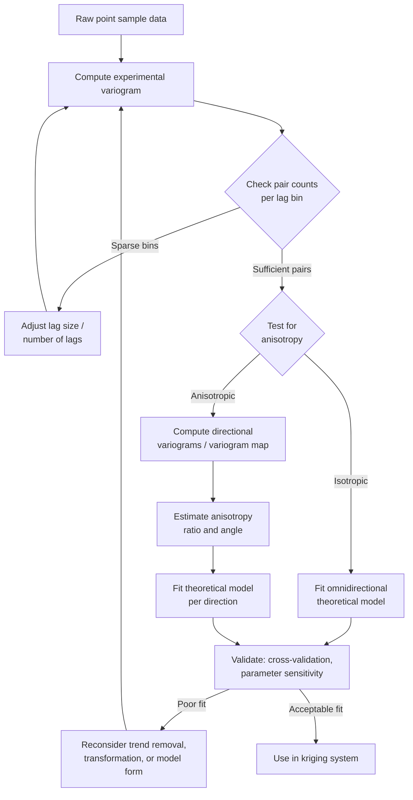

## Variogram Modeling

### Overview

Variogram modeling is the process of characterizing and quantifying spatial dependence in a regionalized variable by fitting a theoretical mathematical function to empirical measures of dissimilarity between sample pairs at varying separation distances. It is the central diagnostic and predictive tool of geostatistics: every kriging method depends directly on a valid, well-fitted variogram, making variogram modeling arguably the most consequential step in the geostatistical workflow. A poorly fitted variogram propagates error into every downstream prediction and its associated variance estimate.

### Theoretical Foundation

#### Regionalized Variable Theory

A regionalized variable $Z(s)$ is treated as one realization of a random function — a collection of correlated random variables indexed by spatial location $s$. Rather than assuming complete spatial randomness, the theory formalizes the intuitive geographic principle that values close together in space tend to be more similar than values far apart (Tobler's First Law of Geography).

#### Stationarity Assumptions

Variogram estimation and kriging require assumptions about how the statistical properties of $Z(s)$ behave across space:

- **Strict stationarity**: The full joint probability distribution is invariant under translation. Rarely testable or assumed in practice.
- **Second-order (weak) stationarity**: The mean $E[Z(s)] = \mu$ is constant, and the covariance between any two points depends only on the separation vector $h$, not on absolute location: $\text{Cov}[Z(s), Z(s+h)] = C(h)$.
- **Intrinsic stationarity**: A weaker, more commonly invoked assumption — only the variance of increments (differences) is required to be constant and dependent solely on $h$: $\text{Var}[Z(s) - Z(s+h)] = 2\gamma(h)$. This is the minimum requirement for the variogram to be well defined, and it permits an unbounded variance (a variogram that keeps rising, i.e., no sill), which second-order stationarity does not.

#### Relationship Between Variogram and Covariance

Under second-order stationarity, the semivariogram and covariance function are directly related:

$$\gamma(h) = C(0) - C(h)$$

where $C(0)$ is the a priori variance (the sill, when it exists). This relationship means a variogram that reaches a stable sill is equivalent to a decaying covariance function; a variogram with no sill (pure intrinsic stationarity) has no equivalent covariance function, which has implications for which kriging systems can be solved.

### Computing the Experimental (Empirical) Variogram

#### The Classical (Matheron) Estimator

$$\hat{\gamma}(h) = \frac{1}{2N(h)} \sum_{i=1}^{N(h)} \left[ Z(s_i) - Z(s_i + h) \right]^2$$

This computes, for each lag distance class $h$, the average squared difference between all pairs of points separated by approximately that distance, divided by two. The division by two makes $\gamma(h)$ directly comparable to covariance, since $\gamma(h) = C(0) - C(h)$ under stationarity.

#### Lag Binning Parameters

Since sample points rarely fall at exact, uniform separation distances, pairs are grouped into **lag bins**:

- **Lag size (lag increment)**: The width of each distance bin. Too small produces noisy, erratic bins with few pairs each; too large blurs fine-scale spatial structure.
- **Number of lags**: Total bins to compute, typically extending to about half the maximum extent of the study area (pairs at very large separations become sparse and statistically unreliable).
- **Angular tolerance and bandwidth**: When computing directional variograms, pairs are further filtered by direction, with an angular tolerance (e.g., ±22.5°) and a bandwidth limiting how far off-axis a pair may lie.

#### Robust Estimators

The classical estimator is sensitive to outliers because it squares differences. Alternative estimators reduce this sensitivity:

$$\text{Cressie-Hawkins: } 2\hat{\gamma}(h) = \frac{\left(\frac{1}{N(h)} \sum |Z(s_i) - Z(s_i+h)|^{1/2}\right)^4}{0.457 + 0.494/N(h)}$$

This estimator downweights the influence of extreme pairwise differences relative to the classical squared-difference approach, producing a more stable variogram when the data distribution is heavy-tailed or contains outliers not attributable to measurement error.

### Variogram Cloud and h-Scatterplot Diagnostics

Before fitting a model, exploratory diagnostics help detect anomalies:

- **Variogram cloud**: A scatterplot of all individual squared pairwise differences against separation distance, before binning/averaging. Reveals outlier pairs that disproportionately inflate specific lag bins.
- **h-scatterplot**: Plots $Z(s_i)$ against $Z(s_i+h)$ for a fixed lag $h$. A tight cloud along the 1:1 line indicates strong spatial correlation at that lag; a diffuse cloud indicates weak correlation.
- **Pair count per lag**: Bins with very few pairs (commonly fewer than 30–50) produce unreliable semivariance estimates and should be treated with caution or excluded from fitting.

### Anisotropy Detection and Modeling

#### Geometric Anisotropy

Spatial correlation strength (range) varies by direction, but the sill remains constant — the variogram surface forms an ellipse rather than a circle. Corrected via an anisotropy ratio (major range / minor range) and an anisotropy angle (orientation of the major axis, typically measured clockwise from north). Common in phenomena with directional physical drivers: groundwater contamination along flow direction, precipitation along a mountain range, or soil properties along a river's depositional axis.

#### Zonal Anisotropy

The sill (not just the range) varies by direction. More complex to model, sometimes handled by summing two nested structures with different anisotropy parameters.

#### Directional Variogram Construction

Directional variograms are computed by restricting pair selection to a specific azimuth (e.g., 0°, 45°, 90°, 135°) with an angular tolerance window, then comparing the fitted range in each direction. A **variogram map** (semivariance plotted in 2D lag-vector space, $h_x$ vs $h_y$) provides a visual surface for identifying the anisotropy axis directly, rather than testing discrete directions one at a time.



### Theoretical Variogram Models

Fitting a theoretical model to the experimental variogram is mandatory for kriging, since the kriging system requires a mathematically valid (conditionally negative semi-definite) function to guarantee a solvable, non-negative-variance system. Fitting the empirical points directly (without a theoretical model) does not guarantee this property.

#### Bounded (Transitive) Models

Reach a finite sill at a finite or asymptotic range.

$$\text{Spherical: } \gamma(h) = \begin{cases} C_0 + C\left[\dfrac{3h}{2a} - \dfrac{1}{2}\left(\dfrac{h}{a}\right)^3\right] & h \le a \\ C_0 + C & h > a \end{cases}$$

The most commonly used model for many earth science applications; reaches the sill at a well-defined finite range $a$, with a linear-then-curving approach that produces a visible inflection.

$$\text{Exponential: } \gamma(h) = C_0 + C\left(1 - e^{-h/a}\right)$$

Approaches the sill asymptotically; the *practical range* (distance at which 95% of the sill is reached) is conventionally taken as $3a$. Suited to phenomena with a rapid initial decorrelation followed by a long tail of weak correlation.

$$\text{Gaussian: } \gamma(h) = C_0 + C\left(1 - e^{-h^2/a^2}\right)$$

Produces very smooth, parabolic behavior near the origin (unlike the linear-at-origin behavior of spherical and exponential models), appropriate for smoothly varying continuous phenomena. Gaussian models are prone to numerical instability in the kriging matrix when the nugget is very small, because near-collinear covariance rows can make the system ill-conditioned.

$$\text{Circular: } \gamma(h) = C_0 + C\left[1 - \frac{2}{\pi}\cos^{-1}\left(\frac{h}{a}\right) + \frac{2h}{\pi a}\sqrt{1 - \frac{h^2}{a^2}}\right], \quad h \le a$$

#### Unbounded Models

Do not reach a sill; valid only under intrinsic stationarity (not second-order stationarity), and cannot be used with Simple Kriging, which requires a known constant mean and finite variance.

$$\text{Power: } \gamma(h) = C_0 + b\,h^{\omega}, \quad 0 < \omega < 2$$


$$\text{Linear (special case, } \omega=1\text{): } \gamma(h) = C_0 + bh$$

Used when the phenomenon exhibits a persistent trend or fractal-like behavior with no clear range of spatial correlation, such as some geochemical or topographic variables.

#### Nested Models (Nested Structures)

Real-world spatial variation often reflects multiple superimposed processes operating at different scales (e.g., local soil texture variation plus regional climatic gradient). Nested models sum two or more basic structures:

$$\gamma(h) = \gamma_1(h) + \gamma_2(h) + \dots + \gamma_k(h)$$

Each nested structure requires its own sill and range (and, if anisotropic, its own ratio and angle), permitted because the sum of valid (conditionally negative semi-definite) variogram models is itself valid.

#### Hole-Effect Model

$$\gamma(h) = C_0 + C\left[1 - \cos\left(\frac{\pi h}{a}\right)\right]$$

Captures periodic or pseudo-periodic spatial patterns (e.g., regularly spaced geological strata, agricultural field patterns from crop rows), producing a variogram that oscillates around the sill rather than monotonically rising.

### Fitting Procedures

#### Weighted Least Squares (WLS)

The most common practical fitting approach, minimizing:

$$\text{WLS} = \sum_{j=1}^{K} N(h_j) \left[\frac{\hat{\gamma}(h_j) - \gamma(h_j; \theta)}{\gamma(h_j; \theta)^2}\right]^2$$

Weighting by $N(h_j)$ (pair count) gives more influence to well-supported lag bins; weighting by $1/\gamma^2$ down-weights the typically noisier, larger-magnitude semivariances at large lags. Cressie's weighted least squares is a widely used variant of this general form.

#### Maximum Likelihood Estimation (MLE) and Restricted Maximum Likelihood (REML)

Fits variogram (equivalently, covariance) parameters by maximizing the likelihood of the observed data under an assumed multivariate Gaussian spatial process. REML corrects for the loss of degrees of freedom from simultaneously estimating trend/mean parameters, producing less biased variance component estimates than ordinary MLE. [Inference] MLE/REML approaches are generally considered more statistically principled than WLS because they use the full likelihood rather than a summary (binned) statistic, but they are more computationally demanding and more sensitive to violations of the Gaussian assumption.

#### Manual (Visual) Fitting

Interactive adjustment of sill, range, and nugget against the plotted empirical variogram, guided by domain knowledge (e.g., known correlation length from process understanding). Still common in applied GIS workflows and often used to sanity-check or constrain automated fits.

### Nugget Effect: Sources and Interpretation

The nugget represents semivariance at zero separation distance that, in principle, should be zero (a variable should be perfectly correlated with itself). A nonzero nugget arises from:

- **Measurement error**: Instrument imprecision, digitization error, or reporting rounding.
- **Micro-scale spatial variation**: Genuine spatial structure operating at distances finer than the minimum sample spacing, which cannot be resolved and appears as an apparent discontinuity at the origin.
- **Combination of both**: In practice, the nugget cannot be decomposed into these two sources without replicate samples at very close spacing (sometimes called "nested sampling design" specifically for nugget estimation).

A high **nugget-to-sill ratio** (sometimes used as a spatial dependence classification: <25% strong, 25–75% moderate, >75% weak spatial dependence) indicates the variable is dominated by unstructured, random variation, limiting how much benefit kriging provides over a simple global mean.

### Trend Removal Prior to Variogram Modeling

Intrinsic stationarity requires that spatial dependence, not a deterministic trend, governs the increments. When the data exhibit a strong first-order or second-order trend, the empirical variogram fails to level off at a sill (it rises continuously, reflecting non-stationary drift rather than genuine long-range correlation). Two standard remedies:

- **External trend removal**: Fit a polynomial trend surface, subtract it from the data, and model the variogram of the residuals (feeding into a Universal Kriging or Regression Kriging workflow).
- **Median polish or robust detrending**: Alternative detrending methods less sensitive to outliers than least-squares trend surfaces.

Failing to detect and address trend is one of the most common practical errors in variogram modeling — a rising, non-leveling empirical variogram should be treated as a diagnostic warning rather than fit with an unbounded model by default.

### Model Validation

#### Cross-Validation

Leave-one-out or k-fold cross-validation refits the kriging predictor with each point held out in turn, compares predicted to observed values, and evaluates:

- **Mean Error (ME)** near zero — unbiasedness.
- **Root Mean Square Standardized Error (RMSSE)** near 1 — confirms the fitted variogram's implied uncertainty matches actual prediction error (values above 1 indicate the model understates uncertainty; values below 1 indicate it overstates uncertainty).

#### Sensitivity Analysis

Because variogram parameters (especially range and nugget) are often estimated with considerable uncertainty from limited sample sizes, examining how kriging predictions and variance change under plausible parameter perturbations is good practice before relying on the model for decision-critical mapping (e.g., contamination remediation boundaries).

### Software Implementation Notes

```python
import numpy as np
import skgstat as skg

# coordinates and observed values
coords = np.array([[10, 15], [25, 30], [40, 20], [55, 45], [70, 60]])
values = np.array([2.1, 3.4, 1.9, 4.7, 3.2])

# compute experimental variogram and fit a theoretical model
V = skg.Variogram(coords, values, model="spherical", n_lags=15, normalize=False)

print(V.parameters)   # [range, sill, nugget]
V.plot()               # experimental points + fitted curve
```

[Unverified] Default lag-binning and fitting-weight behavior differs across software packages (e.g., ArcGIS Geostatistical Analyst, `gstat` in R, `skgstat`/`PyKrige` in Python, SGeMS); practitioners should consult package-specific documentation for exact default estimators and weighting schemes rather than assuming uniform behavior across tools.

### Common Pitfalls

- **Fitting a model to a trending (non-stationary) empirical variogram** without first checking for and removing drift.
- **Overfitting nested structures**: Adding too many nested components to chase noise in the empirical variogram, producing an unstable model that generalizes poorly.
- **Ignoring anisotropy**: Fitting a single omnidirectional model when directional structure is present understates local prediction accuracy along the dominant correlation axis.
- **Insufficient lag pairs**: Fitting to bins with very few point pairs, producing an empirical variogram driven by sampling noise rather than genuine spatial structure.
- **Confusing the nugget with pure measurement error**: Attributing the entire nugget to instrument error when unresolved micro-scale spatial variation may be the dominant contributor.

**Related Topics**

- Interpolation Methods and Kriging (Ordinary, Universal, Cokriging)
- Spatial Autocorrelation (Moran's I, Geary's C)
- Trend Surface Analysis and Regression Kriging
- Anisotropy Analysis and Directional Statistics
- Uncertainty Propagation in Spatial Analysis
- Conditional Simulation (Sequential Gaussian Simulation)
- Sampling Design for Geostatistical Surveys