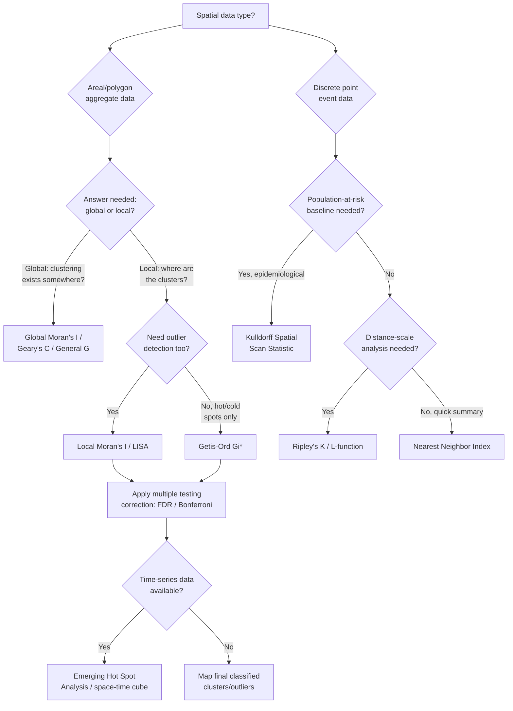

## Hot Spot and Cluster Analysis

### Overview

Hot spot and cluster analysis identifies statistically significant spatial concentrations of high values (hot spots), low values (cold spots), and unusual groupings of similar or dissimilar features across a study area. Unlike simple visual inspection of a choropleth map, these methods apply formal inferential statistics to distinguish genuine spatial clustering from patterns that could plausibly arise by random chance, producing a defensible, quantified answer to "where is this phenomenon statistically concentrated?" Applications span crime hotspot mapping, disease cluster detection, wildfire risk zoning, precipitation anomaly detection, and species distribution clustering.

### Foundational Concepts

#### Spatial Autocorrelation

The statistical basis for cluster detection is spatial autocorrelation — the degree to which a variable's value at one location is correlated with its values at nearby locations. Positive spatial autocorrelation means similar values cluster together (high near high, low near low); negative spatial autocorrelation means dissimilar values are adjacent (a checkerboard pattern); zero autocorrelation implies complete spatial randomness (CSR).

#### Spatial Weights Matrices

Every cluster and hot spot statistic requires a formal definition of spatial neighborhood relationships, encoded as a spatial weights matrix $W$, where element $w_{ij}$ quantifies the spatial relationship between features $i$ and $j$. Common conceptualizations:

- **Contiguity-based**: Rook (shared edge) or Queen (shared edge or vertex) adjacency for polygon data.
- **Distance-based**: Fixed distance band — all features within a threshold distance are neighbors, weighted equally or by inverse distance.
- **K-nearest neighbors**: Each feature's weights matrix row includes exactly its $k$ closest neighbors, ensuring a consistent number of neighbors regardless of local point density — important for irregularly distributed point data.
- **Inverse distance weighting**: Continuous decay of influence with distance, rather than a binary in/out neighbor definition.

The choice of conceptualization and distance threshold materially affects results; sensitivity analysis across multiple weights specifications is standard practice.

### Global Spatial Autocorrelation Statistics

Global statistics summarize spatial clustering as a single value for the entire study area, answering "is there clustering somewhere?" without indicating location.

#### Global Moran's I

$$I = \frac{n}{\sum_{i}\sum_{j} w_{ij}} \cdot \frac{\sum_{i}\sum_{j} w_{ij}(x_i - \bar{x})(x_j - \bar{x})}{\sum_{i}(x_i - \bar{x})^2}$$

Ranges approximately from $-1$ (perfect dispersion) to $+1$ (perfect clustering), with an expected value of $E[I] = -1/(n-1)$ under the null hypothesis of spatial randomness (approaching 0 as $n$ grows). A z-score and p-value are computed against this expectation (via either a normality assumption or, more robustly, a randomization/permutation approach) to test statistical significance.

#### Global Geary's C

$$C = \frac{(n-1)}{2\sum_i\sum_j w_{ij}} \cdot \frac{\sum_i\sum_j w_{ij}(x_i - x_j)^2}{\sum_i (x_i - \bar{x})^2}$$

Ranges from 0 to approximately 2, with an expected value of 1 under spatial randomness; values below 1 indicate positive autocorrelation (clustering), values above 1 indicate negative autocorrelation (dispersion). Geary's C is more sensitive to local differences between neighboring values than Moran's I, which is more sensitive to the extremity of individual values relative to the global mean.

#### Getis-Ord General G

$$G = \frac{\sum_i\sum_j w_{ij}x_ix_j}{\sum_i\sum_j x_ix_j}, \quad i \ne j$$

Specifically detects whether high values or low values are clustered, distinguishing General G from Moran's I, which detects clustering of similar values without distinguishing whether the cluster is high or low. A significantly high G indicates clustering of high values; a significantly low G indicates clustering of low values.

### Local Indicators of Spatial Association (LISA)

Global statistics answer whether clustering exists; local statistics answer *where*, decomposing the global measure into a per-feature contribution.

#### Local Moran's I (Anselin Local Indicators of Spatial Association)

$$I_i = \frac{(x_i - \bar{x})}{S^2} \sum_j w_{ij}(x_j - \bar{x}), \quad S^2 = \frac{\sum_i (x_i - \bar{x})^2}{n-1}$$

Each feature receives its own $I_i$ value and associated pseudo-significance level (typically via conditional permutation, since the many simultaneous local tests violate independence assumptions needed for standard parametric inference). Local Moran's classifies each significant feature into one of four cluster/outlier types:

- **High-High (HH)**: A high value surrounded by high values — part of a hot spot cluster.
- **Low-Low (LL)**: A low value surrounded by low values — part of a cold spot cluster.
- **High-Low (HL)**: A high value surrounded by low values — a spatial outlier.
- **Low-High (LH)**: A low value surrounded by high values — a spatial outlier.

This HH/LL/HL/LH classification is the distinguishing output of Local Moran's I relative to the Getis-Ord family, since it identifies spatial outliers in addition to clusters.

#### Getis-Ord Gi* (Gi-star)

$$G_i^* = \frac{\sum_{j=1}^{n} w_{ij}x_j - \bar{X}\sum_{j=1}^{n} w_{ij}}{S\sqrt{\dfrac{n\sum_{j=1}^{n}w_{ij}^2 - \left(\sum_{j=1}^{n}w_{ij}\right)^2}{n-1}}}$$

where $\bar{X}$ and $S$ are the mean and standard deviation of all feature values, and the summation for $G_i^*$ (unlike the original $G_i$) includes feature $i$ itself in its own neighborhood. The output is a z-score directly: a high positive z-score with statistical significance indicates a hot spot (a feature with a high value, surrounded by other high-value features, more pronounced than would occur by random chance); a low negative z-score indicates a cold spot. This is the statistic underlying Esri's "Hot Spot Analysis" (Getis-Ord Gi*) geoprocessing tool and the equivalent implementations in PySAL's `esda` module.

#### Comparing Local Moran's I and Gi*

Local Moran's I identifies clusters *and* spatial outliers (four categories); Getis-Ord Gi* identifies only hot and cold spots (it cannot detect a high value surrounded by low values as a distinct outlier category — such a feature would simply show a non-significant or weak z-score). Gi* is generally preferred when the analytical goal is purely hot/cold spot mapping (e.g., crime hotspot maps for patrol allocation); Local Moran's I is preferred when identifying anomalous outlier locations is also analytically important (e.g., detecting an isolated disease case surrounded by unaffected areas).

### Multiple Testing Correction

Because LISA and Gi* compute a separate significance test for every feature in the dataset, applying a standard $\alpha = 0.05$ threshold across thousands of simultaneous tests produces a high expected number of false positives (Type I errors) purely by chance. Standard corrections:

- **Bonferroni correction**: Divides $\alpha$ by the number of tests ($n$), producing a very conservative (low false-positive, higher false-negative) threshold.
- **False Discovery Rate (FDR)**: Controls the expected proportion of false positives among all rejected null hypotheses, less conservative than Bonferroni and widely preferred in modern spatial cluster detection workflows (e.g., implemented as an option in ArcGIS Hot Spot Analysis and in PySAL).

### Point Pattern-Based Cluster Detection

For event/point data (rather than polygon or areal aggregate data), a different family of methods applies.

#### Ripley's K-Function

$$\hat{K}(d) = \frac{A}{n^2} \sum_{i}\sum_{j \ne i} \frac{I(d_{ij} < d)}{w_{ij}}$$

Counts the expected number of additional events within distance $d$ of a typical event, compared against the expectation under complete spatial randomness ($\pi d^2$ for a homogeneous Poisson process). Values of $\hat{K}(d)$ above the CSR expectation indicate clustering at that distance scale; values below indicate dispersion. The variance-stabilized **L-function** transformation, $L(d) = \sqrt{K(d)/\pi} - d$, is commonly plotted instead, since it produces a horizontal reference line at zero under CSR, making deviations easier to read visually.

#### Kernel Density Estimation (KDE)

$$\hat{f}(s) = \frac{1}{nh^2} \sum_{i=1}^{n} K\left(\frac{s - s_i}{h}\right)$$

Produces a smoothed, continuous intensity surface from discrete point events by centering a kernel function (commonly Gaussian or quartic) over each point and summing contributions, with bandwidth $h$ controlling smoothness. KDE is descriptive (visualizing where events concentrate) rather than inferential (it does not, by itself, produce a significance test), though it is frequently paired with Monte Carlo simulation envelopes to add statistical testing.

#### Nearest Neighbor Index (NNI)

$$\text{NNI} = \frac{\bar{D}_{observed}}{\bar{D}_{expected}}, \quad \bar{D}_{expected} = \frac{1}{2\sqrt{n/A}}$$

A simple global ratio comparing the observed average nearest-neighbor distance to the expected average distance under CSR. NNI < 1 indicates clustering; NNI > 1 indicates dispersion; NNI ≈ 1 indicates a random pattern. Provides a single summary statistic but no spatial location of clusters, unlike Ripley's K or LISA-based methods.

#### Scan Statistics (Kulldorff's Spatial Scan Statistic)

Systematically scans the study area with a moving window (commonly circular or elliptical) of variable size, computing a likelihood ratio test at each window location and size comparing observed event counts inside versus outside the window against the expectation under the null (e.g., Poisson-distributed events proportional to an at-risk population). Statistical significance for the most likely cluster (and secondary clusters) is assessed via Monte Carlo simulation. Widely used in disease surveillance and epidemiology (implemented in the SaTScan software package) because it naturally accounts for varying population density as a baseline expectation, distinguishing genuine disease clustering from clustering that merely reflects where people live.

### Emerging Hot Spot Analysis (Space-Time)

Extends Getis-Ord Gi* into the temporal dimension by computing the statistic independently for each time-step bin (a space-time cube of location × location × time), then classifying each location's overall pattern across the full time series into categories such as:

- **New Hot Spot**: Statistically significant hot spot only in the final time step, with no prior history of significance.
- **Consecutive Hot Spot**: A single uninterrupted run of significant hot spot bins in the most recent time period, preceded by never being significant.
- **Intensifying Hot Spot**: Significant hot spot for the entire time series, with the intensity trend increasing over time (tested via Mann-Kendall trend statistic).
- **Persistent Hot Spot**: Significant hot spot for at least 90% of time-step bins, with no discernible increasing or decreasing trend.
- **Oscillating Hot Spot**: A location that was a significant hot spot in at least one time step, was a significant cold spot in at least one other, with the overall trend statistically significant as a hot spot.

This taxonomy is characteristic of Esri's Emerging Hot Spot Analysis tool and is commonly applied to time-stamped event data such as crime incidents, disease case reports, or repeated environmental monitoring readings.



### LISA Cluster Map Interpretation (svg_diagram)

<svg xmlns="http://www.w3.org/2000/svg" viewBox="0 0 700 400">
<rect x="0" y="0" width="700" height="400" fill="#ffffff" />
<text x="350" y="28" font-family="Arial" font-size="16" font-weight="bold" text-anchor="middle" fill="#1a1a1a">LISA Cluster Classification (svg_diagram)</text>
<rect x="60" y="60" width="280" height="280" fill="none" stroke="#333" stroke-width="1.5" />
<line x1="200" y1="60" x2="200" y2="340" stroke="#999" stroke-width="1" />
<line x1="60" y1="200" x2="340" y2="200" stroke="#999" stroke-width="1" />

<text x="200" y="365" font-family="Arial" font-size="12" text-anchor="middle" fill="#333">Neighboring values</text>

<text x="30" y="200" font-family="Arial" font-size="12" text-anchor="middle" fill="#333" transform="rotate(-90 30 200)">Feature value</text>

<rect x="200" y="60" width="140" height="140" fill="#dc2626" fill-opacity="0.15" />
<text x="270" y="120" font-family="Arial" font-size="14" font-weight="bold" text-anchor="middle" fill="#991b1b">High-High</text>
<text x="270" y="140" font-family="Arial" font-size="11" text-anchor="middle" fill="#991b1b">(Hot Spot)</text>
<rect x="60" y="200" width="140" height="140" fill="#2563eb" fill-opacity="0.15" />
<text x="130" y="260" font-family="Arial" font-size="14" font-weight="bold" text-anchor="middle" fill="#1e3a8a">Low-Low</text>
<text x="130" y="280" font-family="Arial" font-size="11" text-anchor="middle" fill="#1e3a8a">(Cold Spot)</text>
<rect x="60" y="60" width="140" height="140" fill="#f59e0b" fill-opacity="0.15" />
<text x="130" y="120" font-family="Arial" font-size="14" font-weight="bold" text-anchor="middle" fill="#92400e">Low-High</text>
<text x="130" y="140" font-family="Arial" font-size="11" text-anchor="middle" fill="#92400e">(Outlier)</text>
<rect x="200" y="200" width="140" height="140" fill="#16a34a" fill-opacity="0.15" />
<text x="270" y="260" font-family="Arial" font-size="14" font-weight="bold" text-anchor="middle" fill="#14532d">High-Low</text>
<text x="270" y="280" font-family="Arial" font-size="11" text-anchor="middle" fill="#14532d">(Outlier)</text>

<text x="480" y="90" font-family="Arial" font-size="12" fill="#333" font-weight="bold">Interpretation:</text>

<text x="480" y="115" font-family="Arial" font-size="11" fill="#333">HH / LL = spatial clusters</text>

<text x="480" y="135" font-family="Arial" font-size="11" fill="#333">HL / LH = spatial outliers</text>

<text x="480" y="160" font-family="Arial" font-size="11" fill="#333">Significance requires</text>

<text x="480" y="178" font-family="Arial" font-size="11" fill="#333">permutation-based p-value</text>

<text x="480" y="196" font-family="Arial" font-size="11" fill="#333">below corrected threshold</text>

</svg>

### Implementation Notes (Python / PySAL)

```python
import geopandas as gpd
import libpysal as lps
from esda.getisord import G_Local
from esda.moran import Moran_Local

gdf = gpd.read_file("study_area.shp")  # polygon features with attribute "value"

# construct Queen contiguity spatial weights, row-standardized
w = lps.weights.Queen.from_dataframe(gdf)
w.transform = "r"

# Local Moran's I (LISA) with conditional permutation inference
lisa = Moran_Local(gdf["value"], w, permutations=999)
gdf["lisa_q"] = lisa.q          # 1=HH, 2=LH, 3=LL, 4=HL
gdf["lisa_p"] = lisa.p_sim      # pseudo p-value

# Getis-Ord Gi* (star form includes self in neighborhood)
gi_star = G_Local(gdf["value"], w, star=True, permutations=999)
gdf["gi_z"] = gi_star.Zs
gdf["gi_p"] = gi_star.p_sim
```

[Unverified] Exact default permutation counts, weights transformation conventions, and multiple-testing options differ between PySAL, ArcGIS Hot Spot Analysis, GeoDa, and R's `spdep` package; consult package-specific documentation for defaults before comparing results across tools.

### Common Pitfalls

- **Ignoring the Modifiable Areal Unit Problem (MAUP)**: Cluster results for polygon-aggregated data can shift substantially depending on how zones are drawn or aggregated, independent of the underlying point process.
- **Skipping multiple testing correction**: Reporting raw p < 0.05 significance across thousands of simultaneous local tests inflates false-positive cluster detections.
- **Mismatched spatial weights specification**: An inappropriate neighborhood definition (e.g., a distance band too small for sparse rural areas) can suppress genuine clusters or manufacture spurious ones.
- **Conflating KDE "hot spots" with statistically tested hot spots**: A visually dense KDE surface is descriptive, not inferential, unless paired with a formal significance test.
- **Applying areal statistics (Moran's I, Gi*) to raw point event data without first aggregating or switching to point-pattern methods** (Ripley's K, scan statistics) designed for that data structure.

**Related Topics**

- Variogram Modeling and Spatial Autocorrelation Structure
- Interpolation Methods and Kriging
- Spatial Regression Models (Spatial Lag, Spatial Error)
- Point Pattern Analysis and Marked Point Processes
- Geographically Weighted Regression (GWR)
- Space-Time Cube Construction and Analysis
- Epidemiological Cluster Detection and Disease Mapping