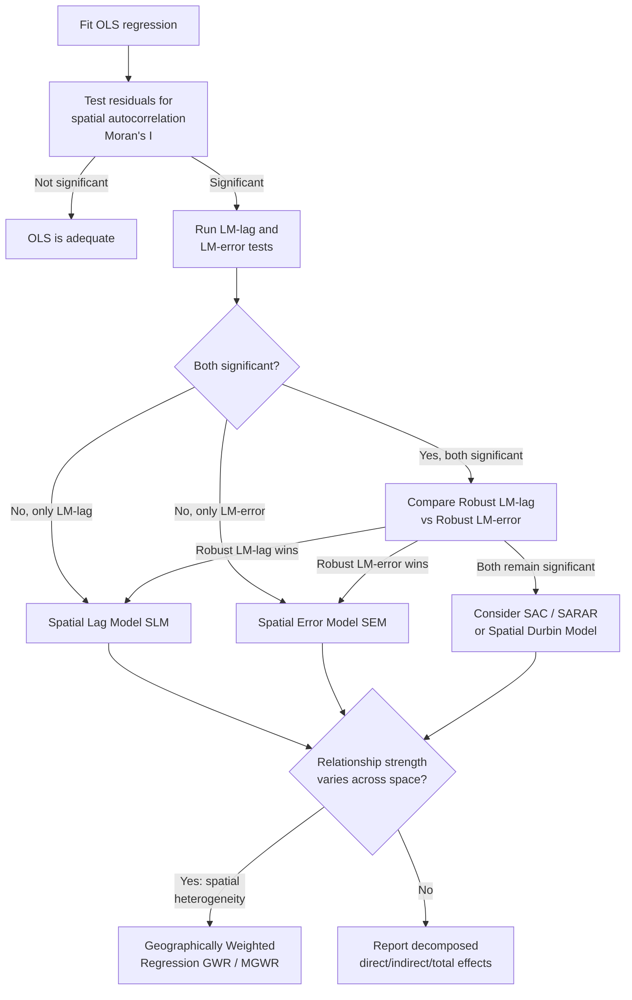

## Spatial Regression Models

### Overview

Spatial regression models extend classical regression to explicitly account for spatial dependence and spatial heterogeneity in the data. Ordinary Least Squares (OLS) regression assumes observations are independent; when applied to spatial data, this assumption is frequently violated because nearby locations tend to share unmeasured influences (spillover effects, omitted spatially structured variables, or genuine spatial interaction processes). Ignoring this violation produces biased or inefficient coefficient estimates, understated standard errors, and misleadingly significant p-values — a problem broadly termed spatial autocorrelation in the regression residuals.

### Why OLS Fails on Spatial Data

#### The Problem of Spatially Autocorrelated Residuals

If OLS residuals exhibit spatial autocorrelation (detectable via Moran's I applied to the residuals), the Gauss-Markov assumption of independent errors is violated. Consequences include:

- **Inefficient estimates**: OLS is no longer the Best Linear Unbiased Estimator (BLUE); more efficient estimators exist.
- **Biased standard errors**: Typically understated, since positive spatial autocorrelation reduces the effective sample size (nearby observations carry redundant information), leading to overstated statistical significance.
- **Potential coefficient bias**: If the spatial dependence stems from a missing spatially structured explanatory variable or from genuine spatial spillover in the dependent variable itself, coefficient estimates on included variables can be biased, not just their standard errors.

#### Diagnosing Spatial Dependence

- **Moran's I on OLS residuals**: The standard first diagnostic; significant residual autocorrelation signals a spatial regression model is warranted.
- **Lagrange Multiplier (LM) tests**: The Anselin-Florax-Rey LM test framework distinguishes whether the misspecification is better characterized as a spatial lag process (LM-lag) or a spatial error process (LM-error), including robust versions (Robust LM-lag, Robust LM-error) that remain valid when both forms of dependence are present simultaneously. The general decision rule: if both simple LM tests are significant, compare the robust versions — whichever robust statistic remains significant indicates the more appropriate model specification.

### Core Spatial Regression Model Families

#### Spatial Lag Model (SLM) / Spatial Autoregressive Model (SAR)

$$y = \rho W y + X\beta + \varepsilon$$

Incorporates a spatially lagged dependent variable ($Wy$) directly into the regression, capturing the idea that the outcome at one location is directly influenced by outcomes at neighboring locations — a genuine spatial spillover or diffusion process. $\rho$ (the spatial autoregressive coefficient) measures the strength of this dependence; $W$ is the row-standardized spatial weights matrix. Appropriate when the underlying theoretical process suggests direct interaction between units (e.g., property values influenced by neighboring property values through comparable-sales effects, or policy diffusion between adjacent jurisdictions).

Because $y$ appears on both sides of the equation (through $Wy$), OLS estimation is biased and inconsistent due to simultaneity; SLM requires **Maximum Likelihood (ML)** estimation or **instrumental variables / two-stage least squares (IV/2SLS)** using spatially lagged explanatory variables as instruments.

#### Spatial Error Model (SEM)

$$y = X\beta + u, \quad u = \lambda W u + \varepsilon$$

Places the spatial dependence in the error structure rather than the dependent variable itself, appropriate when spatial autocorrelation is believed to arise from unmeasured, spatially clustered omitted variables (e.g., unobserved soil quality affecting crop yield, unobserved neighborhood amenities affecting housing price) rather than a genuine spillover process in the outcome. $\lambda$ measures the strength of spatial dependence in the error term. Estimated via ML or Generalized Method of Moments (GMM), since OLS with spatially correlated errors, while technically unbiased, is inefficient and produces incorrect standard errors.

#### Spatial Durbin Model (SDM)

$$y = \rho Wy + X\beta + WX\theta + \varepsilon$$

Generalizes the Spatial Lag Model by also including spatially lagged explanatory variables ($WX$), capturing the idea that not only a location's own outcome depends on neighbors' outcomes, but also that a location's outcome depends on neighbors' *characteristics* directly. The SDM nests both SLM (when $\theta = 0$) and, under certain parameter restrictions, a form equivalent to SEM, making it a useful general specification for testing down to a simpler nested model via likelihood ratio tests.

#### Spatial Durbin Error Model (SDEM)

$$y = X\beta + WX\theta + u, \quad u = \lambda Wu + \varepsilon$$

Combines spatially lagged explanatory variables with a spatially autoregressive error structure, without a spatial lag on the dependent variable itself.

#### General Nesting Spatial Model (Manski / SAC / SARAR)

$$y = \rho Wy + X\beta + WX\theta + u, \quad u = \lambda Wu + \varepsilon$$

The most general specification, nesting all the preceding models as special cases (SLM when $\theta=0, \lambda=0$; SEM when $\rho=0,\theta=0$; SDM when $\lambda=0$; SDEM when $\rho=0$). [Inference] Because this fully general model is often weakly identified in finite samples — the parameters $\rho$, $\theta$, and $\lambda$ can be difficult to separately estimate with precision — most applied workflows use theory or LM-test diagnostics to select a more parsimonious nested specification rather than defaulting to the fully general model.

### Interpreting Coefficients: Direct, Indirect, and Total Effects

A critical distinction from OLS: in models containing a spatially lagged dependent variable (SLM, SDM, SAC), a change in an explanatory variable at location $i$ affects not only $y_i$ (a **direct effect**) but also propagates through the spatial multiplier $(I - \rho W)^{-1}$ to affect $y_j$ at neighboring locations (an **indirect effect** or spillover effect). The raw $\beta$ coefficient from an SLM cannot be interpreted as a marginal effect the way an OLS coefficient can; a formal decomposition is required:

$$\frac{\partial y}{\partial x_k} = (I - \rho W)^{-1}\beta_k$$

- **Direct effect**: The average diagonal element of this matrix — a location's own explanatory variable affecting its own outcome (includes feedback effects looping back through neighbors).
- **Indirect effect**: The average of off-diagonal elements — the effect of a location's explanatory variable on outcomes elsewhere.
- **Total effect**: The sum of direct and indirect effects.

This distinction matters substantively: policy analysis based on a spatial lag model that reports only the raw $\beta$ coefficient, without decomposing direct and indirect effects, misrepresents the true marginal impact of a policy variable.

### Geographically Weighted Regression (GWR)

GWR addresses **spatial heterogeneity** (non-stationarity in the relationship between variables across the study area) rather than spatial dependence in residuals. It fits a separate, locally weighted regression at every location $u_i$:

$$y_i = \beta_0(u_i) + \sum_k \beta_k(u_i)x_{ik} + \varepsilon_i$$

Each local regression is estimated using a kernel-weighted subset of nearby observations, with weights decaying with distance from the regression point (commonly a Gaussian or bi-square kernel). The bandwidth (kernel decay rate) can be fixed (constant distance) or adaptive (constant number of neighboring points, useful for irregular sample density), and is typically selected by minimizing cross-validation error or the corrected Akaike Information Criterion (AICc).

GWR output includes a full set of local coefficient estimates at each location, allowing mapping of how a relationship's strength or even direction varies across space (e.g., the relationship between income and housing price might be strongly positive in one region and weak or negative in another) — a pattern a single global OLS or spatial-lag coefficient cannot reveal.

#### Multiscale GWR (MGWR)

Extends GWR by allowing each explanatory variable to have its own, independently optimized bandwidth, rather than forcing all relationships to vary over the same spatial scale. Recognizes that some processes are genuinely local (varying block-by-block) while others operate at a broader regional scale, and a single shared bandwidth in standard GWR misrepresents variables operating at different characteristic scales.

### Spatial Panel Models

Extend spatial regression to data observed repeatedly over time across the same spatial units (e.g., annual county-level unemployment), combining spatial dependence structures (SAR, SEM) with panel data fixed or random effects to control for time-invariant unobserved heterogeneity across units, while still modeling cross-sectional spatial spillovers within each time period.

### Model Selection Workflow



### GWR Local Coefficient Variation (svg_diagram)

<svg xmlns="http://www.w3.org/2000/svg" viewBox="0 0 700 380">
<rect x="0" y="0" width="700" height="380" fill="#ffffff" />
<text x="350" y="26" font-family="Arial" font-size="16" font-weight="bold" text-anchor="middle" fill="#1a1a1a">GWR: Global vs. Local Coefficients (svg_diagram)</text>

<text x="150" y="60" font-family="Arial" font-size="13" font-weight="bold" text-anchor="middle" fill="#333">OLS (Global)</text>

<rect x="40" y="80" width="220" height="220" fill="`#f3f4f6`" stroke="#333" />

<rect x="40" y="80" width="220" height="220" fill="`#7c3aed`" fill-opacity="0.25" />

<text x="150" y="195" font-family="Arial" font-size="14" text-anchor="middle" fill="`#4c1d95`">Single β applies</text>

<text x="150" y="215" font-family="Arial" font-size="14" text-anchor="middle" fill="`#4c1d95`">uniformly everywhere</text>

<text x="500" y="60" font-family="Arial" font-size="13" font-weight="bold" text-anchor="middle" fill="#333">GWR (Local)</text>

<rect x="390" y="80" width="220" height="220" fill="`#f3f4f6`" stroke="#333" />

<rect x="390" y="80" width="73" height="73" fill="`#dc2626`" fill-opacity="0.4" />

<rect x="463" y="80" width="73" height="73" fill="`#f59e0b`" fill-opacity="0.4" />

<rect x="536" y="80" width="74" height="73" fill="`#eab308`" fill-opacity="0.4" />

<rect x="390" y="153" width="73" height="74" fill="`#16a34a`" fill-opacity="0.4" />

<rect x="463" y="153" width="73" height="74" fill="`#2563eb`" fill-opacity="0.4" />

<rect x="536" y="153" width="74" height="74" fill="`#dc2626`" fill-opacity="0.4" />

<rect x="390" y="227" width="73" height="73" fill="`#eab308`" fill-opacity="0.4" />

<rect x="463" y="227" width="73" height="73" fill="`#16a34a`" fill-opacity="0.4" />

<rect x="536" y="227" width="74" height="73" fill="`#2563eb`" fill-opacity="0.4" />

<text x="500" y="330" font-family="Arial" font-size="12" text-anchor="middle" fill="#333">Each cell: locally estimated β(uᵢ)</text>

<text x="500" y="348" font-family="Arial" font-size="11" text-anchor="middle" fill="#666">varies in magnitude/direction by location</text>

</svg>

### Implementation Notes (Python / PySAL spreg + mgwr)

```python
import geopandas as gpd
import libpysal as lps
from spreg import ML_Lag, ML_Error

gdf = gpd.read_file("study_area.shp")
y = gdf[["outcome"]].values
X = gdf[["predictor1", "predictor2"]].values

w = lps.weights.Queen.from_dataframe(gdf)
w.transform = "r"

# Spatial Lag Model via Maximum Likelihood
sar_model = ML_Lag(y, X, w=w, name_y="outcome", name_x=["predictor1", "predictor2"])
print(sar_model.summary)  # includes rho, direct/indirect/total effect decomposition

# Spatial Error Model via Maximum Likelihood
sem_model = ML_Error(y, X, w=w, name_y="outcome", name_x=["predictor1", "predictor2"])
print(sem_model.summary)  # includes lambda (spatial error coefficient)
```

```python
from mgwr.gwr import GWR
from mgwr.sel_bw import Sel_BW

coords = list(zip(gdf.geometry.centroid.x, gdf.geometry.centroid.y))

# adaptive bandwidth selection via corrected AIC
bw_selector = Sel_BW(coords, y, X)
optimal_bw = bw_selector.search()

gwr_model = GWR(coords, y, X, bw=optimal_bw)
gwr_results = gwr_model.fit()
# gwr_results.params: n x k array of local coefficients, one row per location
```

[Unverified] Exact default kernel functions, bandwidth search ranges, and standard error corrections differ between PySAL's `spreg`/`mgwr` modules, R's `spdep`/`GWmodel`, and ArcGIS's GWR tool; consult package-specific documentation before comparing coefficient estimates across implementations.

### Common Pitfalls

- **Interpreting raw SLM/SDM coefficients as OLS-style marginal effects** without decomposing into direct, indirect, and total effects.
- **Skipping the LM-test diagnostic stage** and defaulting to SEM or SLM based on convention rather than evidence of which process actually generates the residual dependence.
- **Applying GWR without checking for local multicollinearity**, which becomes more severe in local windows than in the global sample and can produce unstable local coefficient estimates.
- **Treating GWR's spatial heterogeneity as a substitute for spatial dependence modeling**: GWR does not inherently correct for spatially autocorrelated residuals; residual diagnostics should still be checked.
- **Using an inappropriate or unjustified spatial weights matrix**, since spatial regression results (like cluster statistics) are sensitive to the neighborhood definition chosen.

**Related Topics**

- Hot Spot and Cluster Analysis (Moran's I, Getis-Ord Gi*)
- Variogram Modeling and Geostatistical Interpolation
- Spatial Panel Data Econometrics
- Multiscale Geographically Weighted Regression (MGWR)
- Spatial Weights Matrix Construction and Sensitivity
- Bayesian Spatial Models (CAR, SAR priors in disease mapping)
- Machine Learning Approaches to Spatial Prediction