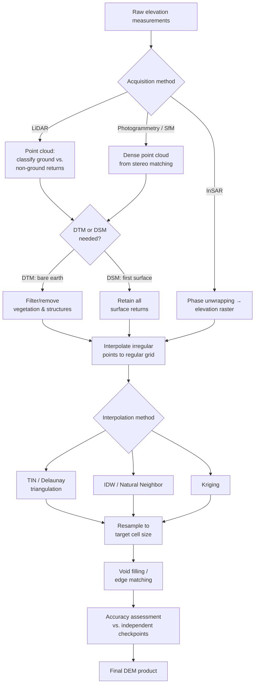

## DEM Sources and Creation Methods

### Overview

A Digital Elevation Model (DEM) is a raster or TIN representation of the Earth's surface topography, with each cell or vertex storing a height value. DEMs underpin nearly all terrain analysis: hydrological modeling, viewshed and line-of-sight analysis, slope and aspect derivation, orthorectification of imagery, landslide susceptibility mapping, and flood inundation modeling. Understanding DEM sources requires distinguishing the underlying acquisition technology (how the elevation data was measured), the resulting product type (what surface is actually represented), and the derivation/processing workflow (how raw measurements become a usable gridded model) — since each choice carries distinct implications for accuracy, resolution, and appropriate application.

### DSM vs. DTM vs. DEM Terminology

- **Digital Surface Model (DSM)**: Represents the *first reflective surface* — the top of vegetation canopy, building rooftops, and bare ground where nothing else is present. Most raw remote-sensing-derived elevation products (SAR, photogrammetry, first-return LiDAR) are DSMs by default.
- **Digital Terrain Model (DTM) / Bare-earth DEM**: Represents the *bare ground surface* with vegetation and structures algorithmically removed or filtered out. Requires additional processing (e.g., last-return LiDAR filtering, or machine-learning-based canopy/building removal applied to a DSM).
- **DEM (generic term)**: Often used loosely to mean either, though careful technical usage reserves "DEM" as the general/ambiguous term and requires DSM or DTM to be specified for precision-critical applications (e.g., hydrological flow modeling requires a true bare-earth DTM; visibility/line-of-sight analysis often requires a DSM that includes buildings and canopy).

### Acquisition Technologies

#### LiDAR (Light Detection and Ranging)

Airborne or terrestrial laser scanning measures the time-of-flight of laser pulses reflected off the ground and surface features, producing a dense 3D point cloud. Modern airborne LiDAR routinely achieves sub-meter to few-centimeter point spacing and vertical accuracies in the 5–15 cm range under good conditions, producing the highest-accuracy DEMs generally available.

- **Multiple-return recording**: Each laser pulse can register several returns as it penetrates a forest canopy; classifying the *last return* (typically the ground) versus *first return* (canopy top) enables direct derivation of both DSM (first returns) and DTM (ground-classified last returns) from the same acquisition.
- **Ground classification algorithms**: Point cloud classification (e.g., progressive TIN densification, cloth simulation filtering) statistically distinguishes ground points from vegetation/structure points before DTM interpolation.
- **Bathymetric LiDAR**: Uses a green-wavelength laser capable of penetrating clear water to map submerged nearshore topography, used for coastal and riverbed mapping where water is not overly turbid.

#### Photogrammetry (Stereo Imagery / Structure from Motion)

Derives elevation from the parallax between overlapping stereo image pairs, either from aerial photography, satellite stereo pairs (e.g., WorldView, Pléiades), or Structure from Motion (SfM) processing of overlapping drone (UAV) imagery.

- **Traditional stereo photogrammetry**: Requires known camera geometry/calibration and ground control points (GCPs) for absolute georeferencing accuracy.
- **SfM/MVS (Structure from Motion / Multi-View Stereo)**: Automatically reconstructs camera positions and a dense point cloud from highly overlapping imagery without requiring precise a priori camera position knowledge, making consumer/prosumer drone-based DEM generation accessible. Accuracy is strongly dependent on image overlap (commonly 70–80% forward, 60–70% side overlap recommended), ground control point density, and surface texture (poor for featureless or water surfaces).
- Photogrammetric DEMs are inherently DSMs (surface reflectance-based), requiring the same bare-earth filtering challenges as first-return LiDAR when a DTM is needed.

#### Interferometric Synthetic Aperture Radar (InSAR)

Derives elevation from the phase difference between two radar images acquired from slightly different positions (either two antennas simultaneously, as in the Shuttle Radar Topography Mission and TanDEM-X, or repeat-pass acquisitions from a single satellite). Radar penetrates cloud cover, enabling global-scale mapping regardless of persistent cloud cover (a major advantage over optical photogrammetry in tropical or high-latitude regions), but radar backscatter reflects off canopy and structures similarly to a DSM, and is subject to characteristic artifacts:

- **Layover**: Radar signal from a steep near-side slope arrives before the signal from the base of the same feature, compressing or reversing the apparent geometry.
- **Shadow**: Steep far-side slopes receive no radar illumination, leaving data voids.
- **Speckle noise**: Coherent radar interference produces a grainy noise pattern requiring filtering.

#### Global Navigation Satellite System (GNSS) and Total Station Surveying

Direct ground-based point measurement using RTK/PPK-corrected GNSS receivers or optical total stations, producing very high accuracy (centimeter-level) but sparse point coverage suitable for control points, spot-check validation, or small-area high-precision surveys rather than continuous surface generation on its own.

#### Laser Altimetry (Spaceborne)

Satellite-based laser altimeters — ICESat/ICESat-2 (ATLAS instrument) and GEDI (Global Ecosystem Dynamics Investigation, mounted on the ISS) — provide sparse, high-precision elevation profiles along discrete ground tracks rather than continuous surface coverage. Used primarily as independent validation/reference data for assessing the vertical accuracy of continuous global DEM products, and increasingly as training/calibration input for machine-learning-based bare-earth correction models.

### Major Global and Regional DEM Products

#### SRTM (Shuttle Radar Topography Mission)

Single-pass C-band and X-band InSAR data collected during an 11-day Space Shuttle mission in February 2000, providing near-global coverage (60°N to 56°S) at 1 arc-second (~30 m) resolution (originally 3 arc-second for public release outside the US, later opened to full 1 arc-second resolution globally). A foundational, long-standing free global DEM, though its InSAR-derived nature means it is effectively a DSM in vegetated and urban areas, with known artifacts (voids in steep terrain, radar layover/shadow effects).

#### Copernicus DEM (GLO-30 / GLO-90 / EEA-10)

The Copernicus 30-meter global Digital Elevation Model, GLO-30, is a Digital Surface Model that characterizes the surface of the Earth including buildings, infrastructure and vegetation, primarily derived from the TanDEM-X WorldDEM dataset acquired via bistatic single-pass InSAR between December 2010 and January 2015, infilled locally with other DEM sources including SRTM, ALOS, and ASTER. It is provided in three instances: COP-DEM-EEA-10 at approximately 10 m resolution covering the European Economic Area, COP-DEM-GLO-30 at approximately 30 m global coverage, and COP-DEM-GLO-90 at approximately 90 m global coverage, and is generally considered the most accurate, up-to-date radar-derived global DEM among widely available free products. Global validation against ICESat data reported an RMSE around 1.68 m for the GLO-30 product.

#### NASADEM

A NASA-led reprocessing of the original SRTM raw radar signal data using improved algorithms and control from ICESat laser altimetry, void-filled and merged with contributions from ASTER GDEM and other sources, generally producing improved accuracy over the original SRTM release while remaining a DSM-type product.

#### ASTER GDEM

Derived from stereo photogrammetric processing of ASTER (Advanced Spaceborne Thermal Emission and Reflection Radiometer) optical satellite imagery, providing near-global (83°N to 83°S) coverage at approximately 30 m resolution. Comparative validation studies have consistently found ASTER GDEM to be the least accurate among the major free global 30 m products, with the largest mean errors relative to Copernicus GLO-30 and NASADEM.

#### ALOS World 3D (AW3D30)

JAXA's global DEM derived from stereo photogrammetric processing of the ALOS PRISM optical sensor's panchromatic stereo imagery, distributed at approximately 30 m resolution (with a commercial 5 m version available), generally competitive in accuracy with Copernicus GLO-30 and NASADEM though relative performance varies by terrain type.

#### FABDEM (Forest And Buildings removed Copernicus DEM)

A derived bare-earth product built on top of Copernicus GLO-30, using a random forest machine learning algorithm to statistically remove forest canopy and building height biases from the underlying DSM, producing the first global DEM with forests and buildings removed at 30 m resolution — an important resource for hydrological and flood modeling applications where a true bare-earth surface, rather than a canopy/building surface, is required.

#### National/Regional High-Resolution Programs

Many national mapping agencies maintain LiDAR-derived DTM/DSM programs at substantially finer resolution than global products — for example, national 1 m or finer LiDAR-based elevation datasets covering full national territories, typically offering markedly better vertical and planimetric accuracy than any global 30 m product, though geographic coverage is limited to the issuing country and access/licensing terms vary.

### DEM Creation Workflow (From Point Data to Raster Surface)



### Point-to-Raster Interpolation Methods for DEM Generation

Converting an irregular point cloud (LiDAR returns, photogrammetric tie points) into a regular DEM grid requires spatial interpolation:

- **TIN-based interpolation**: Constructs a Delaunay triangulation of the point cloud, then interpolates grid cell values from the enclosing triangle facet — preserves breaklines and sharp terrain features well, commonly used as an intermediate step before final raster conversion.
- **Inverse Distance Weighting (IDW)**: Fast, simple, weights nearby points by inverse distance; can produce bullseye artifacts around sparse or clustered points.
- **Kriging**: Statistically optimal given a valid variogram model, providing an associated prediction uncertainty surface, but computationally more expensive and less commonly used for dense LiDAR-derived DEMs where point density already provides high local fidelity.
- **Spline-based gridding**: Smooth surface fitting, common for hydrologically-enforced DEM products where a continuous, differentiable surface is desired for downstream flow modeling.

### Void Filling and Edge Matching

Radar-derived DEMs (SRTM, Copernicus) commonly contain data voids from layover, shadow, or water-body no-return zones. Standard remediation approaches:

- **Interpolation-based fill**: Using surrounding valid pixels via spline, IDW, or kriging to fill small voids.
- **Multi-source infill**: Substituting values from a secondary DEM source in void areas (e.g., Copernicus GLO-30 infilling gaps with GLO-90 data where 30 m tiles are not available).
- **Tile edge matching**: Adjacent DEM tiles from different acquisition swaths or processing runs can exhibit visible seams; edge-matching algorithms blend overlapping margins to eliminate discontinuities at tile boundaries.

### Accuracy Assessment

DEM vertical accuracy is typically reported using RMSE (root mean square error) and Linear Error at a given confidence interval (commonly LE90, the linear error not exceeded by 90% of checkpoints) computed against independent, higher-accuracy reference data — most rigorously, ground-surveyed GNSS checkpoints or airborne LiDAR, and increasingly ICESat-2/GEDI spaceborne laser altimetry for global-scale validation where dense ground truth is unavailable. Comparative global evaluations have found that GLO-30 achieves lower elevation bias and RMSE against spaceborne lidar reference data than SRTM and NASADEM in bare-ground areas, while accuracy for all radar and photogrammetric global products commonly degrades in dense forest canopy, steep terrain, and urban areas with tall structures — factors that should guide DEM source selection for a specific application and terrain type.

### DEM Product Comparison

| Source | Technology | Resolution | Coverage | Product Type | Free/Open |
| --- | --- | --- | --- | --- | --- |
| SRTM | InSAR (C/X-band) | ~30 m | 60°N–56°S | DSM | Yes |
| Copernicus GLO-30 | InSAR (TanDEM-X) | ~30 m | Global | DSM | Yes |
| Copernicus EEA-10 | InSAR (TanDEM-X) | ~10 m | European Economic Area | DSM | Registration required |
| NASADEM | InSAR (reprocessed SRTM) | ~30 m | Near-global | DSM | Yes |
| ASTER GDEM | Optical stereo photogrammetry | ~30 m | 83°N–83°S | DSM | Yes |
| AW3D30 | Optical stereo photogrammetry | ~30 m (5 m commercial) | Global | DSM | Yes (30 m) |
| FABDEM | Derived (ML bare-earth filter on GLO-30) | ~30 m | Global | DTM (bare-earth) | Yes, research/non-commercial terms |
| National LiDAR programs | Airborne LiDAR | ~0.5–1 m | National | DSM & DTM | Varies by country |

### Implementation Notes (Python / rasterio + PDAL)

```python
import pdal

# PDAL pipeline: classify ground points and generate a bare-earth DTM from LiDAR
pipeline_json = {
    "pipeline": [
        "input.laz",
        {
            "type": "filters.smrf",       # Simple Morphological Filter for ground classification
            "cell": 1.0,
            "slope": 0.15,
            "window": 18,
            "threshold": 0.5
        },
        {
            "type": "filters.range",
            "limits": "Classification[2:2]"  # keep only ground-classified points
        },
        {
            "type": "writers.gdal",
            "filename": "dtm_output.tif",
            "resolution": 1.0,
            "output_type": "idw"
        }
    ]
}

pipeline = pdal.Pipeline(json.dumps(pipeline_json))
pipeline.execute()
```

[Unverified] Optimal ground-classification filter parameters (cell size, slope threshold, window size) are terrain- and vegetation-density-dependent; values above are illustrative starting points, not universal defaults, and should be tuned and validated against local reference data.

### Common Pitfalls

- **Using a DSM where a DTM is required** (e.g., hydrological flow modeling on an unfiltered canopy surface produces physically implausible flow paths).
- **Ignoring radar layover/shadow voids** in steep terrain when using SRTM or Copernicus-family products without checking a data quality/void mask layer.
- **Mixing DEM sources of differing vertical datums** without reconciling geoid/ellipsoid height references, introducing systematic offset errors.
- **Assuming uniform accuracy across terrain types**: accuracy for all major global DEM products varies substantially between open terrain, dense forest canopy, and steep or urban terrain — a single reported global RMSE does not represent local accuracy everywhere.
- **Over-trusting resampled low-resolution products for fine-scale analysis**: downsampling or resampling a coarse DEM to a finer nominal cell size does not add real information content.

**Related Topics**

- Terrain Derivatives: Slope, Aspect, Curvature, and Hillshade
- Hydrological Modeling and Flow Accumulation from DEMs
- LiDAR Point Cloud Classification and Processing
- Viewshed and Line-of-Sight Analysis
- DEM Accuracy Assessment and Vertical Datum Reconciliation
- Structure from Motion (SfM) Drone Survey Workflows
- Interpolation Methods and Kriging