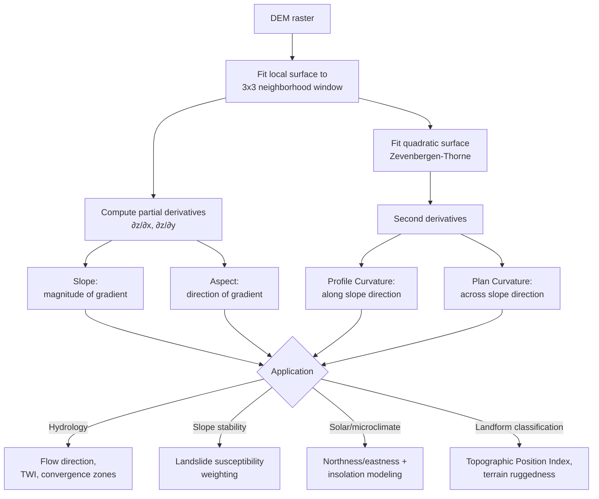

## Slope, Aspect, and Curvature Analysis

### Overview

Slope, aspect, and curvature are first- and second-order derivatives of a Digital Elevation Model's surface, computed from the local rate of change of elevation across a neighborhood of cells. These terrain derivatives underpin an enormous range of applications: slope stability and landslide susceptibility, solar radiation and microclimate modeling, hydrological flow direction, habitat suitability modeling, viewshed weighting, and agricultural land capability assessment. All three derivatives are computed from the same underlying mathematical foundation — the local gradient of the elevation surface — making understanding the gradient computation the prerequisite for understanding all three.

### Mathematical Foundation: The Elevation Gradient

For a continuous elevation surface $z = f(x,y)$, the gradient is the vector of partial derivatives:

$$\nabla z = \left(\frac{\partial z}{\partial x}, \frac{\partial z}{\partial y}\right)$$

Slope is derived from the magnitude of this gradient vector; aspect is derived from its direction. Since DEMs are discrete raster grids rather than continuous surfaces, partial derivatives must be approximated using finite-difference methods over a local neighborhood window (most commonly a 3×3 cell window).

### Slope Computation

#### Third-Order Finite Difference (Horn's Method)

The most widely implemented algorithm (used as the default in most major GIS software) estimates the partial derivatives using a weighted 3×3 neighborhood, where the center cell's derivatives are estimated from all eight surrounding cells:

$$\frac{\partial z}{\partial x} = \frac{(z_3 + 2z_6 + z_9) - (z_1 + 2z_4 + z_7)}{8 \Delta x}$$


$$\frac{\partial z}{\partial y} = \frac{(z_1 + 2z_2 + z_3) - (z_7 + 2z_8 + z_9)}{8 \Delta y}$$

where $z_1$ through $z_9$ denote the 3×3 neighborhood cells (row-major order) and $\Delta x$, $\Delta y$ are the cell size in each direction. Slope in degrees is then:

$$\text{Slope} = \arctan\left(\sqrt{\left(\frac{\partial z}{\partial x}\right)^2 + \left(\frac{\partial z}{\partial y}\right)^2}\right) \times \frac{180}{\pi}$$

Slope can alternatively be expressed as **percent slope** (rise/run × 100), which is common in engineering and regulatory contexts (e.g., building code maximum grade requirements) but is not linearly related to degree slope — a 100% slope corresponds to 45°, not 90°.

#### Alternative Finite-Difference Methods

- **Simple/unweighted difference (2-cell method)**: Uses only the immediate 4 neighbors (N, S, E, W), the simplest and fastest but most sensitive to noise.
- **Fleming and Hoffer / Ritter's method**: Uses the four diagonal neighbors instead of orthogonal ones.
- **Zevenbergen and Thorne's method**: Fits a full quadratic (second-order polynomial) surface to the 3×3 window, simultaneously providing first derivatives (for slope/aspect) and second derivatives (for curvature) from a single consistent polynomial fit, generally regarded as more internally consistent than computing slope and curvature via separate independent algorithms.

The choice among these methods affects computed slope values, particularly in high-relief or noisy terrain; Horn's method is the most common default due to its balance of smoothing (reducing sensitivity to single-cell noise) and computational efficiency.

### Aspect Computation

Aspect is the compass direction of steepest descent — the direction the slope faces — computed from the same partial derivatives:

$$\text{Aspect} = 270° + \arctan\left(\frac{\partial z / \partial y}{\partial z / \partial x}\right) - 90° \times \frac{\partial z/\partial x}{|\partial z/\partial x|}$$

In practice, most implementations compute aspect via `atan2(∂z/∂y, -∂z/∂x)` and convert the result to a compass bearing (0–360°, with 0°/360° = North, 90° = East, 180° = South, 270° = West), with a special flag value (commonly $-1$) reserved for flat cells where slope is zero and aspect is undefined.

#### Circular Statistics Problem

Aspect is a **circular variable** — 359° and 1° are nearly identical directions but numerically far apart, so standard linear statistics (mean, standard deviation, linear regression) applied directly to raw aspect degree values produce meaningless results (e.g., averaging 359° and 1° linearly yields 180°, the opposite direction). Aspect analysis requires circular statistics:

$$\bar{\theta} = \arctan2\left(\frac{1}{n}\sum_i \sin\theta_i, \; \frac{1}{n}\sum_i \cos\theta_i\right)$$

decomposing each aspect angle into sine and cosine components, averaging those linearly, and recombining — this is the standard correct approach for computing mean aspect, aspect variance, or using aspect as a regression predictor. A common practical workaround for regression modeling is to decompose aspect directly into two continuous predictors, $\text{northness} = \cos(\theta)$ and $\text{eastness} = \sin(\theta)$, both bounded $[-1, 1]$ and free of the wraparound discontinuity.

### Curvature Computation

Curvature is the second derivative of the elevation surface — the rate of change of slope — describing whether the surface is convex, concave, or flat, computed from a full quadratic surface fit to the 3×3 (or larger) neighborhood:

$$z = Ax^2y^2 + Bx^2y + Cxy^2 + Dx^2 + Ey^2 + Fxy + Gx + Hy + I$$

with coefficients A–I solved from the 3×3 neighborhood cell values (the Zevenbergen and Thorne quadratic fit is the standard basis for this computation).

#### Profile Curvature

Curvature measured in the direction of the slope (i.e., the direction of steepest descent) — describes the rate of change of slope gradient along the downhill flow line, directly affecting flow acceleration and deceleration of water and sediment moving down the slope.

$$\text{Profile Curvature} = -2\left(D\left(\frac{\partial z}{\partial x}\right)^2 + E\left(\frac{\partial z}{\partial y}\right)^2 + F\frac{\partial z}{\partial x}\frac{\partial z}{\partial y}\right) \big/ \left(\left(\frac{\partial z}{\partial x}\right)^2 + \left(\frac{\partial z}{\partial y}\right)^2\right)$$

- **Negative profile curvature**: Surface is convex in the downhill direction (flow accelerates — e.g., a convex slope shoulder or ridge nose).
- **Positive profile curvature**: Surface is concave in the downhill direction (flow decelerates — e.g., a concave slope base, footslope, or depositional area).
- **Zero**: Linear (straight) slope profile.

Sign conventions for profile (and plan) curvature vary by software package — some report the sign inverted relative to the convention above — so consulting the specific tool's documentation before interpreting output sign is necessary.

#### Plan Curvature

Curvature measured perpendicular to the slope direction (across the contour) — describes convergence or divergence of flow across the hillslope.

- **Negative plan curvature (convex/divergent)**: Flow diverges laterally — a ridge or spur, where water spreads out as it moves downhill.
- **Positive plan curvature (concave/convergent)**: Flow converges laterally — a valley or hollow, where water from multiple directions concentrates.

Plan curvature is a primary input to hydrological flow accumulation modeling and landslide initiation susceptibility, since convergent zones concentrate both surface and subsurface water flow, elevating pore-water pressure and erosion potential.

#### General (Total) Curvature

A composite measure combining profile and plan curvature (commonly their sum, or in some formulations a related but distinct combination) to characterize overall surface convexity/concavity without distinguishing flow direction, useful as a general morphometric classification input but less diagnostically specific than the separate profile/plan measures for hydrological applications.

#### Curvature Sign Convention Summary

| Curvature Type | Direction Measured | Positive Value | Negative Value |
| --- | --- | --- | --- |
| Profile | Along slope (downhill) | Concave, flow decelerates | Convex, flow accelerates |
| Plan | Across slope (perpendicular) | Concave, flow converges | Convex, flow diverges |

*(Sign convention as commonly implemented; some software inverts this — always verify against the specific tool's documentation.)*

### Compound and Derived Terrain Indices

Slope, aspect, and curvature are frequently combined into compound indices for specific applications:

- **Topographic Wetness Index (TWI)**: $\ln(a / \tan\beta)$, where $a$ is upslope contributing area (from flow accumulation) and $\beta$ is local slope — a widely used proxy for soil moisture accumulation potential, combining slope with drainage network structure.
- **Topographic Position Index (TPI)**: The difference between a cell's elevation and the mean elevation of its surrounding neighborhood, used to classify landform position (ridge, valley, flat, slope) — related to but distinct from curvature since it operates over a configurable, often larger neighborhood radius.
- **Solar radiation / insolation modeling**: Combines slope and aspect (via northness/eastness decomposition) with latitude and time-of-year sun angle to estimate incident solar radiation, informing microclimate and vegetation modeling (e.g., south-facing slopes in the Northern Hemisphere receive substantially more direct insolation than north-facing slopes).
- **Terrain Ruggedness Index (TRI)**: Sum of the absolute elevation differences between a cell and its 8 surrounding neighbors, a roughness measure related to but distinct from slope magnitude.

### Neighborhood Window Size and Scale Dependence

While the standard 3×3 window is most common, larger neighborhood windows (5×5, 9×9, or larger) can be used to compute slope, aspect, and curvature at a coarser generalization scale, smoothing out fine-scale noise to reveal broader landform structure. [Inference] Because these derivatives are inherently scale-dependent — the same terrain can appear differently rugged, curved, or steep depending on the analysis window size relative to the DEM's native resolution — practitioners generally treat the choice of neighborhood size as a deliberate analytical decision tied to the phenomenon being studied (e.g., fine-scale erosion processes warrant a small window; regional landform classification warrants a larger one) rather than defaulting uncritically to the software's 3×3 default in every context.



### Curvature Types Illustrated (svg_diagram)

<svg xmlns="http://www.w3.org/2000/svg" viewBox="0 0 700 380">
<rect x="0" y="0" width="700" height="380" fill="#ffffff" />
<text x="350" y="26" font-family="Arial" font-size="16" font-weight="bold" text-anchor="middle" fill="#1a1a1a">Profile vs. Plan Curvature (svg_diagram)</text>

<text x="175" y="60" font-family="Arial" font-size="13" font-weight="bold" text-anchor="middle" fill="#333">Profile Curvature (along slope)</text>

<line x1="60" y1="320" x2="300" y2="320" stroke="#ccc" stroke-width="1" />

<path d="M 60 200 Q 180 320 300 330" fill="none" stroke="`#dc2626`" stroke-width="3" />

<text x="175" y="230" font-family="Arial" font-size="11" text-anchor="middle" fill="`#991b1b`">Convex (negative)</text>

<text x="175" y="248" font-family="Arial" font-size="10" text-anchor="middle" fill="`#991b1b`">flow accelerates</text>

<path d="M 60 250 Q 180 260 300 130" fill="none" stroke="#2563eb" stroke-width="3" transform="translate(0,60)" />
<text x="175" y="365" font-family="Arial" font-size="11" text-anchor="middle" fill="#1e3a8a">Concave (positive) — flow decelerates</text>

<text x="525" y="60" font-family="Arial" font-size="13" font-weight="bold" text-anchor="middle" fill="#333">Plan Curvature (across slope)</text>

<ellipse cx="525" cy="180" rx="140" ry="60" fill="none" stroke="`#16a34a`" stroke-width="2.5" />

<path d="M 400 180 Q 460 140 525 130 Q 590 140 650 180" fill="none" stroke="`#16a34a`" stroke-width="3" />

<text x="525" y="115" font-family="Arial" font-size="11" text-anchor="middle" fill="`#14532d`">Ridge: divergent (negative)</text>

<path d="M 400 280 Q 460 320 525 330 Q 590 320 650 280" fill="none" stroke="#7c3aed" stroke-width="3" />
<text x="525" y="350" font-family="Arial" font-size="11" text-anchor="middle" fill="#4c1d95">Valley: convergent (positive)</text>
<text x="525" y="368" font-family="Arial" font-size="10" text-anchor="middle" fill="#4c1d95">flow concentrates here</text>
</svg>

### Implementation Notes (Python / rasterio + numpy)

```python
import numpy as np
import rasterio

with rasterio.open("dem.tif") as src:
    z = src.read(1).astype(float)
    dx, dy = src.res  # cell size in x, y

# Horn's method: 3x3 weighted finite difference
def horn_slope_aspect(z, dx, dy):
    kernel_x = np.array([[-1, 0, 1], [-2, 0, 2], [-1, 0, 1]]) / (8 * dx)
    kernel_y = np.array([[-1, -2, -1], [0, 0, 0], [1, 2, 1]]) / (8 * dy)

    from scipy.signal import convolve2d
    dzdx = convolve2d(z, kernel_x, mode="same", boundary="symm")
    dzdy = convolve2d(z, kernel_y, mode="same", boundary="symm")

    slope_deg = np.degrees(np.arctan(np.sqrt(dzdx**2 + dzdy**2)))
    aspect_rad = np.arctan2(dzdy, -dzdx)
    aspect_deg = (450 - np.degrees(aspect_rad)) % 360  # convert to compass bearing

    return slope_deg, aspect_deg

slope, aspect = horn_slope_aspect(z, dx, dy)
```

[Unverified] Exact default finite-difference algorithm, edge-handling behavior, and sign convention for curvature outputs differ between ArcGIS, QGIS/GDAL, SAGA GIS, and GRASS GIS; consult package-specific documentation before comparing derivative values or curvature signs across tools.

### Common Pitfalls

- **Applying linear statistics directly to aspect values** without circular-statistics correction, producing meaningless averages near the 0°/360° wraparound.
- **Confusing profile and plan curvature**, or assuming a universal sign convention without checking the specific software's documented convention.
- **Ignoring scale dependence**: Computing slope/curvature at the DEM's native resolution when the analytical question concerns a coarser landform scale, producing overly noisy, locally-dominated results.
- **Computing slope/aspect from a low-resolution or heavily voided DEM** (e.g., SRTM in steep radar-shadow terrain) without accounting for propagated error into the derivative surfaces.
- **Treating percent slope and degree slope as linearly interchangeable**: they are related by a nonlinear arctangent transformation, not a simple scale factor.

**Related Topics**

- DEM Sources and Creation Methods
- Hydrological Modeling: Flow Direction and Accumulation
- Topographic Wetness Index and Compound Terrain Indices
- Viewshed and Line-of-Sight Analysis
- Landslide Susceptibility Modeling
- Solar Radiation and Insolation Modeling
- Landform Classification and Geomorphometry