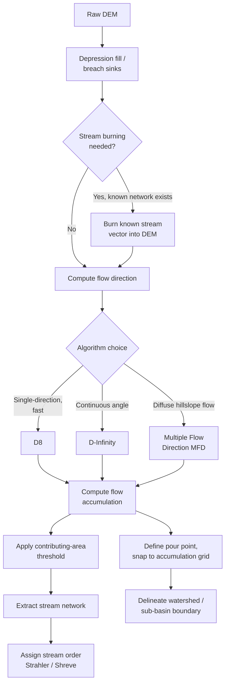

## Hydrological Terrain Modeling

### Overview

Hydrological terrain modeling derives the drainage structure of a landscape — flow direction, flow accumulation, stream networks, watershed boundaries, and related hydrological surfaces — directly from a Digital Elevation Model. This forms the foundation for watershed delineation, flood risk mapping, stream network extraction, erosion and sediment transport modeling, and non-point-source pollution routing. Because these derivations depend entirely on accurate local slope and drainage direction, hydrological terrain modeling is exceptionally sensitive to DEM quality, resolution, and pre-processing choices — a poorly conditioned DEM can produce a physically nonsensical drainage network.

### DEM Pre-Processing: Depression Filling and Conditioning

#### The Sink/Depression Problem

Real DEMs, particularly those derived from noisy remote sensing sources or coarse resolution grids, contain spurious local depressions (sinks) — cells or clusters of cells surrounded entirely by higher elevation, with no downslope outlet. Some sinks reflect genuine landscape features (natural closed basins, sinkholes, quarries), but most in typical DEM data are artifacts of interpolation error, vertical resolution limits, or resampling. Flow direction and accumulation algorithms cannot route water out of an unfilled depression, causing flow to terminate prematurely and fragmenting the drainage network.

#### Fill Algorithms

- **Priority-flood / Planchon-Darboux fill**: The standard modern approach — raises the elevation of depression cells to the minimum level required to establish an outlet, processing cells in priority order from the DEM edges inward using a priority queue, efficiently handling depressions of any size and complexity in a single pass.
- **Simple iterative fill**: Repeatedly raises depression cells by the smallest possible increment until an outlet is found; conceptually simple but slower and less efficient for large or nested depressions than priority-flood approaches.
- **Breaching (depression breaching)**: Instead of raising the depression's elevation, carves a downslope channel through the barrier separating the depression from a lower area — often preferred over filling in low-relief terrain because filling can create artificially flat plateaus that distort downstream slope-dependent calculations (e.g., flow velocity, erosion potential), whereas breaching preserves more of the original terrain's slope structure. [Inference] Because complete breaching alone cannot always resolve very large or complex nested depressions without excessive channel carving, many production workflows use a hybrid strategy — breach first where feasible, then fill any remaining unresolved depressions.

#### Stream Burning and Flow Enforcement

Where an independently mapped, higher-accuracy stream network vector layer already exists (e.g., from national hydrography datasets), **stream burning** artificially lowers DEM cells along the known stream path to force the computed flow network to align with the known-correct channel location — compensating for cases where DEM vertical resolution or error is too coarse to naturally reveal the true channel, particularly in very flat terrain where natural elevation differences along the true channel are smaller than the DEM's vertical error.

### Flow Direction Algorithms

Flow direction assigns, for each DEM cell, the direction water is assumed to flow toward one or more downslope neighbors — the foundational computation from which all subsequent hydrological derivatives (accumulation, stream networks, watersheds) are built.

#### D8 (Deterministic Eight-Direction)

The most widely implemented algorithm: each cell flows entirely into a single one of its 8 neighboring cells — whichever neighbor has the steepest downhill gradient. Simple, computationally efficient, and the long-standing default in most GIS software, but constrains flow to only 8 possible directions (multiples of 45°), producing characteristic angular, "staircase" artifacts in flow paths that do not reflect the true continuous flow direction, particularly problematic on broad, gently sloping planar surfaces where the true flow direction may fall between the 8 discrete options.

#### D-Infinity (D∞)

Represents flow direction as a continuous angle (0–360°) rather than one of 8 discrete directions, computed by considering the steepest downslope direction across the eight triangular facets formed by each cell and its neighbors, then partitioning flow proportionally between the two nearest D8 directions bracketing that continuous angle. Produces smoother, more realistic flow paths and reduces artificial flow convergence along the 8 cardinal/diagonal directions, at somewhat greater computational cost than D8.

#### Multiple Flow Direction (MFD) Algorithms

Rather than routing all of a cell's outflow to a single downslope neighbor (as D8 and D∞ effectively do, D∞ splitting between only two), MFD algorithms (e.g., FD8, MFD-md) distribute flow proportionally among *all* downslope neighbors, weighted by slope steepness — generally regarded as more physically realistic for diffuse, unconcentrated overland flow (e.g., sheet flow on hillslopes before channelization), though it can over-disperse flow in channelized areas where concentrated single-thread flow is the physically correct behavior. Many modern hydrological modeling toolkits implement hybrid schemes that apply MFD on hillslopes and converge to single-direction (D8-like) routing once flow accumulation exceeds a channel-initiation threshold.

### Flow Accumulation

Flow accumulation computes, for each cell, the number of upslope cells (or, when weighted by a source raster such as precipitation, the total upstream volume) that drain through that cell, based on the flow direction grid — the standard measure of upstream contributing area used to identify channel locations and estimate discharge potential.

$$\text{FlowAcc}(cell) = \sum_{\text{all upslope cells } i} w_i$$

where $w_i = 1$ for a simple cell-count accumulation, or a weighted value (e.g., precipitation depth × cell area) for a hydrologically weighted accumulation surface.

### Stream Network Extraction

A **flow accumulation threshold** is applied to the accumulation raster to classify cells as channel (stream) versus non-channel hillslope: cells exceeding the threshold (a minimum contributing area, e.g., 1 km²) are classified as stream cells, producing a raster or vectorized stream network. This threshold is a critical, somewhat subjective parameter:

- **Lower threshold**: Produces a denser network extending further into headwater/hillslope zones, more sensitive to DEM noise producing spurious channels.
- **Higher threshold**: Produces a sparser network matching only well-established, higher-order channels, potentially omitting genuine small headwater streams.

[Inference] Because the "correct" threshold is landscape- and climate-dependent (varying with rainfall regime, soil infiltration capacity, and underlying geology), most workflows calibrate the threshold against a known reference stream network (e.g., a national hydrography dataset) for the specific study area rather than applying a universal default value.

#### Stream Ordering

Once a network is extracted, ordering schemes classify stream segments by their position in the branching hierarchy:

- **Strahler order**: A stream segment's order increases only when two segments of the *same* order join (two 1st-order streams joining form a 2nd-order stream; a 1st-order joining a 2nd-order remains 2nd-order) — the most widely used scheme, reflecting overall network branching complexity.
- **Shreve (magnitude) order**: Simply sums the orders of joining tributaries at every confluence, producing a value that increases at every single junction — a cumulative measure more directly proportional to expected discharge than Strahler order.

### Watershed and Basin Delineation

A **watershed** (catchment or basin) is the total contributing drainage area upstream of a specified pour point (outlet), delineated by tracing all cells whose flow direction ultimately drains to that point, computed as the connected upstream region in the flow direction grid.

- **Pour point placement accuracy** is critical: since watershed delineation follows the flow direction grid exactly, a pour point placed even one cell off the true channel location (a common issue when snapping a gauge station coordinate to a coarse-resolution flow accumulation grid) can produce a substantially incorrect, truncated, or merged watershed boundary. Standard practice snaps the nominal pour point coordinate to the nearest cell exceeding a flow accumulation threshold before delineation.
- **Nested watersheds**: Sub-basins can be delineated at any point along the network, with smaller upstream sub-watersheds nested within larger downstream watersheds — supporting hierarchical basin analysis (e.g., HUC — Hydrologic Unit Code — delineation in the US National Hydrography framework).



### Flow Direction Algorithms Compared (svg_diagram)

<svg xmlns="http://www.w3.org/2000/svg" viewBox="0 0 700 320">
<rect x="0" y="0" width="700" height="320" fill="#ffffff" />
<text x="350" y="26" font-family="Arial" font-size="16" font-weight="bold" text-anchor="middle" fill="#1a1a1a">D8 vs. D-Infinity vs. MFD (svg_diagram)</text>

<text x="115" y="60" font-family="Arial" font-size="13" font-weight="bold" text-anchor="middle" fill="#333">D8</text>

<circle cx="115" cy="160" r="8" fill="#333" />

<line x1="115" y1="160" x2="115" y2="260" stroke="`#dc2626`" stroke-width="3" />

<polygon points="115,260 108,246 122,246" fill="`#dc2626`" />

<text x="115" y="285" font-family="Arial" font-size="10" text-anchor="middle" fill="#666">1 of 8 discrete directions</text>

<text x="350" y="60" font-family="Arial" font-size="13" font-weight="bold" text-anchor="middle" fill="#333">D-Infinity</text>

<circle cx="350" cy="160" r="8" fill="#333" />

<line x1="350" y1="160" x2="330" y2="255" stroke="`#2563eb`" stroke-width="3" />

<polygon points="330,255 328,240 342,246" fill="`#2563eb`" />

<text x="350" y="285" font-family="Arial" font-size="10" text-anchor="middle" fill="#666">Continuous angle, split 2 ways</text>

<text x="580" y="60" font-family="Arial" font-size="13" font-weight="bold" text-anchor="middle" fill="#333">MFD</text>

<circle cx="580" cy="160" r="8" fill="#333" />

<line x1="580" y1="160" x2="540" y2="250" stroke="`#16a34a`" stroke-width="2" stroke-opacity="0.8" />

<line x1="580" y1="160" x2="580" y2="260" stroke="`#16a34a`" stroke-width="3" stroke-opacity="0.8" />

<line x1="580" y1="160" x2="620" y2="250" stroke="`#16a34a`" stroke-width="2" stroke-opacity="0.8" />

<text x="580" y="285" font-family="Arial" font-size="10" text-anchor="middle" fill="#666">Proportional split, all downslope</text>

</svg>

### Implementation Notes (Python / WhiteboxTools)

```python
import whitebox

wbt = whitebox.WhiteboxTools()
wbt.set_working_dir("/path/to/data")

# Fill depressions using priority-flood algorithm
wbt.fill_depressions("dem.tif", "dem_filled.tif")

# D8 flow direction and accumulation
wbt.d8_pointer("dem_filled.tif", "flow_dir_d8.tif")
wbt.d8_flow_accumulation("dem_filled.tif", "flow_acc_d8.tif", out_type="cells")

# D-Infinity flow direction and accumulation
wbt.d_inf_pointer("dem_filled.tif", "flow_dir_dinf.tif")
wbt.d_inf_flow_accumulation("dem_filled.tif", "flow_acc_dinf.tif")

# Extract stream network above a contributing-area threshold
wbt.extract_streams("flow_acc_d8.tif", "streams.tif", threshold=1000)

# Delineate watershed from a pour point
wbt.watershed("flow_dir_d8.tif", "pour_points.shp", "watershed.tif")
```

[Unverified] Exact default fill algorithm, flow-routing convention, and threshold units differ across WhiteboxTools, ArcGIS Hydrology toolset, TauDEM, GRASS GIS r.watershed, and SAGA GIS; consult package-specific documentation for default behavior before comparing outputs across tools.

### Common Pitfalls

- **Skipping depression filling/breaching**: Running flow accumulation on an unconditioned DEM fragments the drainage network at every spurious sink.
- **Over-filling in low-relief terrain**: Aggressive fill algorithms can create unrealistically flat plateaus that distort slope-dependent hydrological calculations downstream — breaching or hybrid approaches are often preferable in flat landscapes.
- **Using a single universal flow accumulation threshold across heterogeneous terrain**: Arid, low-infiltration landscapes and humid, high-infiltration landscapes require materially different thresholds to produce a realistic channel network.
- **Misplacing pour points relative to the flow accumulation grid**: An unsnapped pour point can silently produce a severely truncated or incorrect watershed with no obvious error indication.
- **Relying on D8 for very flat or gently undulating terrain**: The 8-direction constraint produces pronounced angular artifacts precisely where continuous-direction algorithms (D∞) or MFD are most needed.

**Related Topics**

- DEM Sources and Creation Methods
- Slope, Aspect, and Curvature Analysis
- Topographic Wetness Index and Compound Terrain Indices
- Flood Inundation and Hydraulic Modeling
- Stream Network Vectorization and Hydrography Standards
- Watershed Delineation for Water Resources Management
- Erosion and Sediment Transport Modeling