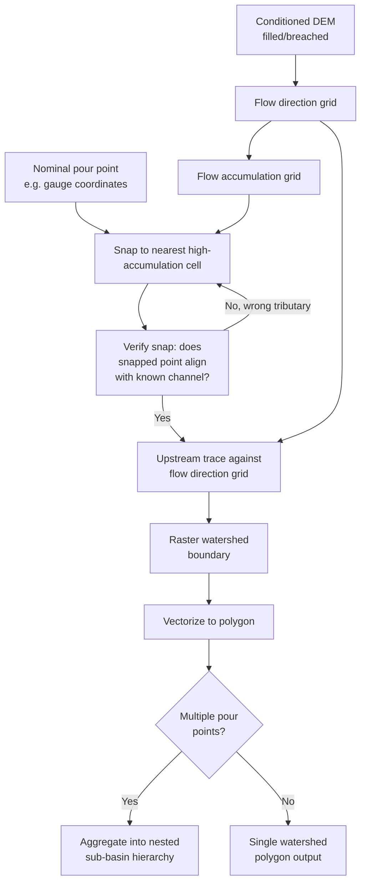

## Watershed Delineation

### Overview

Watershed delineation is the process of identifying the boundary of the total land area that drains surface water to a common outlet point — a stream gauge, reservoir intake, pollution monitoring station, or any specified location along a drainage network. The delineated watershed (also called a catchment, basin, or drainage area) is the fundamental spatial unit for water resources management, flood risk assessment, non-point-source pollution modeling, and hydrologic design, since virtually all hydrological processes (streamflow, sediment yield, nutrient loading) are budgeted and modeled at the watershed scale rather than at arbitrary administrative boundaries.

### Conceptual Basis: The Watershed as a Hydrological Unit

A watershed boundary (the **drainage divide**) traces the topographic high points separating one basin's contributing area from adjacent basins — every raindrop falling within the boundary is assumed, under the surface-water routing model, to eventually reach the specified outlet. This assumption holds well for surface-water-dominated hydrology but can break down where subsurface flow paths (karst groundwater systems, fractured bedrock aquifers) diverge significantly from surface topographic drainage divides — a limitation worth flagging explicitly when watershed analysis informs groundwater-sensitive decisions.

### Prerequisite: Hydrologically Conditioned DEM and Flow Direction

Watershed delineation is computed entirely from a flow direction grid, making it directly dependent on all upstream terrain-processing steps:

1. **Depression filling or breaching** of the source DEM to remove spurious sinks that would otherwise fragment flow paths.
2. **Flow direction computation** (D8, D-Infinity, or Multiple Flow Direction), establishing for every cell which direction water moves.
3. **Flow accumulation computation**, used both to identify the channel network and to accurately snap pour points to the correct cell.

Any error introduced at these upstream stages (an unfilled sink, a coarse or noisy DEM, an inappropriate flow direction algorithm for the terrain type) propagates directly into the delineated watershed boundary, since the delineation algorithm itself is a deterministic trace through the flow direction grid with no independent error-correction mechanism.

### Pour Point Definition and Snapping

The **pour point** (also called the outlet or watershed seed point) is the location at which the watershed boundary is computed — every upslope cell whose flow path terminates at this point is included in the delineated watershed.

#### The Snapping Problem

A pour point coordinate is typically obtained from an independent source — a stream gauge's GPS location, a facility's permitted discharge point, a dam's coordinates — which rarely aligns precisely with the corresponding cell in the flow accumulation/flow direction grid, particularly at coarser DEM resolutions. If delineation is run using the raw, unsnapped coordinate, the algorithm may select a hillslope cell adjacent to but not on the actual channel, producing a watershed boundary that is severely truncated, merged with an adjacent sub-basin, or otherwise hydrologically nonsensical.

**Standard snapping procedure**: Search a small radius (e.g., a fixed number of cells or a fixed real-world distance) around the nominal pour point coordinate for the cell with the locally maximum flow accumulation value, and snap the delineation seed to that cell before running the watershed trace. Snap search radius should be calibrated to DEM resolution and the expected positional uncertainty of the original point source — too small a radius may fail to reach the true channel; too large a radius risks snapping to the wrong tributary entirely near a confluence.

### Delineation Algorithm

Given a correctly snapped pour point and a flow direction grid, the delineation algorithm performs an upstream trace: starting from the pour point, it iteratively identifies all cells whose flow direction points toward any cell already included in the watershed set, continuing until no further upstream cells can be added (a connected-component / flood-fill style traversal against the flow direction graph, moving upstream rather than downstream). The result is a raster (or subsequently vectorized polygon) representing the complete contributing drainage area.

### Nested and Multi-Outlet Watersheds

#### Nested Sub-Basin Delineation

Watersheds naturally nest hierarchically: a small headwater sub-watershed lies entirely within a larger downstream watershed, which in turn lies within an even larger basin. Delineating multiple pour points along the same stream network (e.g., every tributary confluence, or every gauge station on a river system) produces a set of nested sub-basins, supporting hierarchical drainage analysis and standardized basin-coding schemes such as the USGS Hydrologic Unit Code (HUC) system, which assigns progressively longer numeric codes to progressively smaller nested sub-basins.

#### Batch/Multi-Outlet Processing

Most hydrological modeling toolkits support delineating many watersheds in a single operation from a point layer containing multiple pour points, efficiently computing all sub-basins from one shared flow direction grid rather than repeating the full processing chain per point — essential for applications like statewide gauge-network watershed characterization or nationwide catchment delineation datasets (e.g., NHDPlus catchments in the United States).

#### Watershed Splitting at Confluences

For fully automated, network-wide basin delineation (rather than delineation at user-specified points), an alternative workflow delineates a sub-catchment for every individual stream segment between confluences, producing a complete tessellation of elementary catchments across the study area that can be aggregated upward to any larger basin of interest — the approach underlying most national hydrography catchment datasets.



### Nested Watershed Hierarchy (svg_diagram)

<svg xmlns="http://www.w3.org/2000/svg" viewBox="0 0 700 380">
<rect x="0" y="0" width="700" height="380" fill="#ffffff" />
<text x="350" y="26" font-family="Arial" font-size="16" font-weight="bold" text-anchor="middle" fill="#1a1a1a">Nested Watershed Delineation (svg_diagram)</text>
<path d="M 100 340 L 150 100 L 550 90 L 600 340 Z" fill="#dbeafe" stroke="#2563eb" stroke-width="2.5" />
<text x="580" y="120" font-family="Arial" font-size="12" fill="#1e3a8a" font-weight="bold">Basin (largest)</text>
<path d="M 200 340 L 230 180 L 400 170 L 420 340 Z" fill="#bfdbfe" stroke="#1d4ed8" stroke-width="2" />
<text x="410" y="200" font-family="Arial" font-size="11" fill="#1e3a8a" font-weight="bold">Sub-basin</text>
<path d="M 260 340 L 275 240 L 340 235 L 350 340 Z" fill="#93c5fd" stroke="#1e40af" stroke-width="1.5" />
<text x="345" y="255" font-family="Arial" font-size="10" fill="#1e3a8a">Headwater</text>
<path d="M 350 90 Q 340 150 300 200 Q 290 260 280 340" fill="none" stroke="#0284c7" stroke-width="3" />
<circle cx="300" cy="200" r="5" fill="#dc2626" />
<text x="305" y="205" font-family="Arial" font-size="10" fill="#991b1b">Pour point A</text>
<circle cx="350" cy="340" r="5" fill="#dc2626" />
<text x="358" y="345" font-family="Arial" font-size="10" fill="#991b1b">Pour point B (outlet)</text>
</svg>

### Implementation Notes (Python / WhiteboxTools + PySheds)

```python
# Option A: WhiteboxTools
import whitebox
wbt = whitebox.WhiteboxTools()
wbt.set_working_dir("/path/to/data")

wbt.fill_depressions("dem.tif", "dem_filled.tif")
wbt.d8_pointer("dem_filled.tif", "flow_dir.tif")
wbt.d8_flow_accumulation("dem_filled.tif", "flow_acc.tif", out_type="cells")

# Snap pour points to the nearest high-accumulation cell within a search radius
wbt.snap_pour_points("pour_points.shp", "flow_acc.tif", "snapped_points.shp", snap_dist=100.0)

# Delineate watershed(s) from the snapped pour points
wbt.watershed("flow_dir.tif", "snapped_points.shp", "watershed.tif")
```

```python
# Option B: PySheds (pure Python, common for lightweight scripting)
from pysheds.grid import Grid

grid = Grid.from_raster("dem.tif")
dem = grid.read_raster("dem.tif")

filled_dem = grid.fill_depressions(dem)
inflated_dem = grid.resolve_flats(filled_dem)
fdir = grid.flowdir(inflated_dem)
acc = grid.accumulation(fdir)

# Snap pour point and delineate
x, y = -97.294, 32.737  # example outlet coordinate
x_snap, y_snap = grid.snap_to_mask(acc > 1000, (x, y))
catch = grid.catchment(x=x_snap, y=y_snap, fdir=fdir, xytype="coordinate")
```

[Unverified] Exact default snap search radius, flow accumulation units, and watershed-boundary vectorization behavior differ between WhiteboxTools, PySheds, ArcGIS Hydrology tools, TauDEM, and GRASS GIS r.water.outlet; consult package-specific documentation before comparing delineated boundaries across tools.

### Accuracy Considerations and Validation

- **Comparison against authoritative reference boundaries**: Where available (e.g., USGS StreamStats, national hydrography catchment datasets), comparing a DEM-derived delineation against an authoritative pre-existing watershed boundary is the standard validation step before using a delineation for regulatory or engineering decisions.
- **DEM resolution sensitivity**: Coarser DEM resolution systematically smooths and simplifies watershed boundaries, potentially misrepresenting true divide locations in low-relief terrain where subtle elevation differences control the true drainage divide.
- **Karst and groundwater-influenced terrain**: In karst landscapes, surface-topography-derived watershed boundaries can diverge substantially from true contributing areas governed by subsurface conduit flow — a limitation that should be explicitly disclosed when delineation results inform decisions in known karst or heavily fractured-bedrock regions.

### Common Pitfalls

- **Failing to snap pour points to the flow accumulation grid**, producing silently truncated or merged watershed boundaries with no obvious error signal.
- **Using an unconditioned (unfilled) DEM**, causing the upstream trace to terminate at spurious sinks before reaching the true watershed extent.
- **Snapping to the wrong tributary near a confluence** when the snap search radius is too large relative to the local channel network density.
- **Ignoring DEM resolution mismatch** when delineating watersheds intended to align with a finer- or coarser-resolution reference dataset.
- **Treating a topographically delineated watershed as equivalent to the true hydrological contributing area in karst or strongly groundwater-influenced settings** without appropriate caveats.

**Related Topics**

- Hydrological Terrain Modeling (Flow Direction and Accumulation)
- DEM Sources and Creation Methods
- Slope, Aspect, and Curvature Analysis
- Flood Inundation and Hydraulic Modeling
- Stream Network Vectorization and Hydrography Standards
- Non-Point-Source Pollution Modeling
- Hydrologic Unit Code (HUC) Systems and Basin Coding Standards