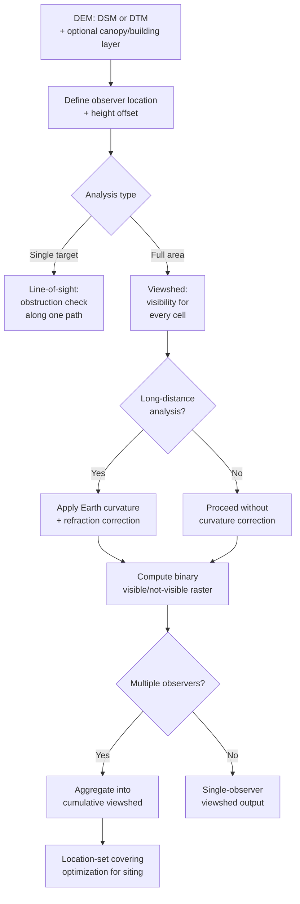

## Viewshed and Line-of-Sight Analysis

### Overview

Viewshed and line-of-sight analysis determines which locations in a landscape are visible from a specified observer point (or, conversely, from which locations an observer can be seen), computed by evaluating whether an unobstructed sight line exists between the observer and each target location across the intervening terrain surface. This underpins telecommunications tower siting, wind turbine visual impact assessment, wildfire lookout and surveillance placement, military and security observation post planning, landscape aesthetics and scenic protection analysis, and archaeological intervisibility studies between ancient sites.

### Core Concepts

#### Line-of-Sight (LOS) Analysis

Evaluates visibility along a single path between two specific points — an observer and one target — determining whether the terrain between them obstructs the direct sight line, and if obstructed, precisely where the obstruction occurs and by how much (the target's "hidden" elevation below the sight line).

#### Viewshed Analysis

Generalizes line-of-sight to every cell in a DEM simultaneously: for a given observer location, a viewshed computes a binary (visible/not visible) raster covering the entire study area (or a defined radius), identifying the complete set of locations visible from that one observer point.

#### Cumulative Viewshed

Aggregates individual viewsheds from multiple observer points into a single composite surface, where each cell's value represents the count (or proportion) of observer points from which that cell is visible — used for siting problems requiring maximum coverage (e.g., minimizing the total number of cell towers needed to cover a service area) or, conversely, identifying locations visible from the fewest observers (e.g., minimizing visual impact of a proposed development).

### Line-of-Sight Computation Method

For an observer at height $h_o$ above the terrain at location $(x_o, y_o, z_o)$ and a target at $(x_t, y_t, z_t)$, the algorithm samples elevation along the straight-line path connecting them (in plan view) at regular intervals, computing the expected sight-line elevation at each sampled point via linear interpolation between observer and target heights:

$$z_{sightline}(d) = (z_o + h_o) + \frac{d}{D}\left[(z_t + h_t) - (z_o + h_o)\right]$$

where $D$ is the total horizontal distance to the target, $d$ is the distance to the current sampled point, and $h_t$ is the target's own height offset (e.g., for assessing visibility of a building or tower of known height rather than bare ground). If the actual terrain elevation at any sampled point along the path exceeds $z_{sightline}(d)$, the line of sight is obstructed at that point, and the target is not visible from the observer.

### Viewshed Algorithm Approaches

#### Naive Point-by-Point (Radial Line-of-Sight)

The conceptually simplest approach: for every cell within the analysis radius, independently run a full line-of-sight computation from the observer to that cell. Computationally expensive at scale ($O(n)$ line-of-sight computations, each itself $O(\sqrt{n})$ or worse along its path), since no information from one target's computation is reused for adjacent targets.

#### Reference Plane / Sweep Algorithms

Modern efficient viewshed algorithms (e.g., the reference-plane sweep approach, sometimes called R2 or R3 depending on the interpolation order used) process cells along expanding rings or radial sweeps outward from the observer, reusing previously computed horizon/obstruction information from nearer cells to determine visibility of farther cells along the same or adjacent sight-line directions, achieving significantly better computational complexity than the naive point-by-point approach while producing equivalent or more accurate results — the standard algorithm family implemented in modern GIS viewshed tools (e.g., ArcGIS's default viewshed algorithm, GRASS GIS `r.viewshed`).

#### Horizon-Based / Silhouette Methods

Precompute the terrain's horizon profile (the maximum elevation angle in every direction) as an intermediate structure, allowing rapid visibility queries against the precomputed horizon rather than repeated per-cell path tracing — particularly efficient for repeated cumulative viewshed computations across many observer points sharing the same terrain.

### Refinements and Correction Factors

#### Earth Curvature and Atmospheric Refraction

For long-distance viewsheds (beyond a few kilometers), the Earth's curvature causes distant terrain to appear lower than its true elevation relative to a flat-plane sight-line assumption, while atmospheric refraction bends light rays slightly downward, partially counteracting the curvature effect. The standard correction applies a combined curvature-and-refraction adjustment to the apparent target elevation:

$$z_{apparent} = z_{true} - \frac{d^2}{2R}(1 - k)$$

where $R$ is Earth's radius (~6,371 km) and $k$ is the refraction coefficient (a commonly used standard atmospheric value is approximately 0.13, though it varies with atmospheric conditions and is sometimes omitted entirely, or set to zero, for short-range or conservative worst-case analyses). Omitting this correction for regional-scale viewsheds (tens of kilometers) systematically understates visibility to the correct degree, since it fails to account for the true geometric drop-off of the visible horizon.

#### Observer and Target Offset Heights

Both the observer and target locations typically require a height offset above the bare-earth DEM surface to represent realistic conditions — an observer standing at eye height (~1.7 m), a fire lookout tower platform, a proposed wind turbine's hub height, or a cell tower's antenna elevation. Failing to apply an appropriate offset (running a viewshed directly from bare-ground elevation) systematically understates true visibility for any realistically elevated observer or target.

#### Vegetation and Surface Feature Consideration

Because bare-earth DTMs exclude vegetation canopy and structures, a viewshed computed on a DTM may substantially overstate real-world visibility in forested or urban areas where actual sightlines are blocked by canopy or buildings not represented in the terrain surface — for realistic visual-impact assessment, a DSM (or a DTM supplemented with a separate canopy/building height layer added to the bare-earth surface) is generally the more appropriate input than a pure bare-earth DTM.

### Cumulative Viewshed and Multi-Observer Siting

For infrastructure siting problems (e.g., minimizing the number of communication towers or fire lookouts needed to achieve full coverage of a study area), cumulative viewshed analysis is often combined with a **maximum coverage location-set covering** optimization: iteratively selecting candidate observer locations that add the greatest incremental visible area not already covered by previously selected sites, continuing until either full coverage is achieved or a fixed budget of observer sites is exhausted — a classic application of location-allocation / set-covering optimization built directly on cumulative viewshed output.



### Viewshed Geometry (svg_diagram)

<svg xmlns="http://www.w3.org/2000/svg" viewBox="0 0 700 380">
<rect x="0" y="0" width="700" height="380" fill="#ffffff" />
<text x="350" y="26" font-family="Arial" font-size="16" font-weight="bold" text-anchor="middle" fill="#1a1a1a">Line-of-Sight and Obstruction (svg_diagram)</text>
<path d="M 60 330 L 150 280 L 230 300 L 320 180 L 420 220 L 500 150 L 600 300 L 650 330" fill="none" stroke="#78716c" stroke-width="3" />
<path d="M 60 330 L 150 280 L 230 300 L 320 180 L 420 220 L 500 150 L 600 300 L 650 330 L 650 360 L 60 360 Z" fill="#e7e5e4" />
<circle cx="150" cy="280" r="4" fill="#1e293b" />
<line x1="150" y1="280" x2="150" y2="240" stroke="#1e293b" stroke-width="2" />
<text x="150" y="228" font-family="Arial" font-size="11" text-anchor="middle" fill="#1e293b" font-weight="bold">Observer</text>
<line x1="150" y1="240" x2="500" y2="150" stroke="#16a34a" stroke-width="2" stroke-dasharray="6,3" />
<circle cx="500" cy="150" r="4" fill="#16a34a" />
<text x="510" y="140" font-family="Arial" font-size="11" fill="#14532d" font-weight="bold">Visible target</text>
<line x1="150" y1="240" x2="600" y2="300" stroke="#dc2626" stroke-width="2" stroke-dasharray="6,3" />
<circle cx="500" cy="150" r="0" />
<text x="605" y="290" font-family="Arial" font-size="11" fill="#991b1b" font-weight="bold">Obstructed target</text>
<circle cx="420" cy="220" r="5" fill="#dc2626" />
<text x="380" y="215" font-family="Arial" font-size="10" fill="#991b1b">Obstruction point</text>
</svg>

### Implementation Notes (Python / GRASS GIS r.viewshed)

```python
import grass.script as gs

# r.viewshed: reference-plane sweep algorithm, with curvature/refraction and observer offset
gs.run_command(
    "r.viewshed",
    input="dem",
    output="viewshed_result",
    coordinates="512300,4901200",   # observer x,y
    observer_elevation=1.7,          # eye height offset, meters
    target_elevation=0,              # target offset (0 = bare ground visibility)
    max_distance=15000,              # analysis radius, meters
    refraction_coeff=0.14286,        # standard atmospheric refraction coefficient
    flags="c"                        # apply curvature correction
)
```

```python
# Cumulative viewshed: sum multiple single-observer viewsheds
import grass.script as gs

observer_points = [("512300,4901200"), ("515800,4903400"), ("509600,4899100")]
outputs = []
for i, coord in enumerate(observer_points):
    outname = f"viewshed_{i}"
    gs.run_command("r.viewshed", input="dem", output=outname,
                    coordinates=coord, observer_elevation=10.0, flags="c")
    outputs.append(outname)

gs.run_command("r.series", input=",".join(outputs), output="cumulative_viewshed", method="sum")
```

[Unverified] Exact default refraction coefficient, curvature-correction flag behavior, and viewshed algorithm variant differ between GRASS GIS, ArcGIS, QGIS visibility analysis plugins, and SAGA GIS; consult package-specific documentation before comparing viewshed extents across tools.

### Common Pitfalls

- **Omitting Earth curvature/refraction correction for long-range viewsheds**, systematically overstating visibility at distances beyond a few kilometers.
- **Using a bare-earth DTM where a surface-inclusive DSM (or canopy/building-augmented DTM) is needed**, overstating real-world visibility in vegetated or urban areas.
- **Failing to apply realistic observer/target height offsets**, understating visibility relative to actual eye-level or infrastructure-height conditions.
- **Running naive point-by-point viewsheds at large analysis radii** without leveraging a modern sweep algorithm, incurring unnecessary computational cost.
- **Treating raw DEM-derived viewsheds as ground-truth for legal or regulatory visual-impact determinations** without field verification, given the sensitivity of results to DEM resolution, vegetation representation, and correction-factor choices.

**Related Topics**

- DEM Sources and Creation Methods
- Slope, Aspect, and Curvature Analysis
- Location-Allocation and Coverage Optimization
- Telecommunications and Infrastructure Siting Analysis
- Archaeological Intervisibility Studies
- 3D GIS and Digital Surface Model Applications
- Solar Radiation and Insolation Modeling