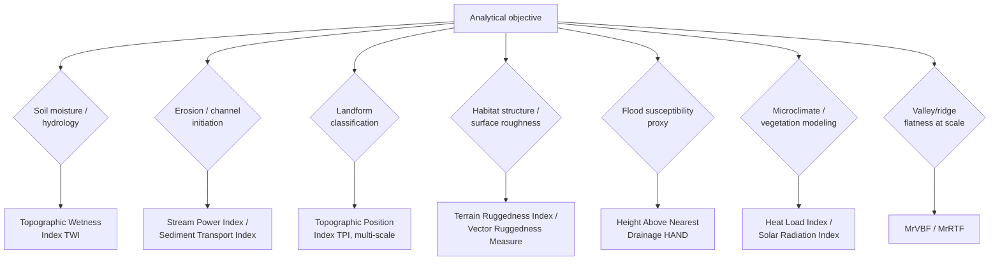

## Terrain-Derived Indices


### Overview

Terrain-derived indices are composite quantitative metrics computed from a DEM and its primary derivatives (slope, aspect, curvature, flow accumulation) that characterize specific landscape processes or properties beyond what any single first-order derivative captures alone. Where slope, aspect, and curvature describe local surface geometry directly, terrain-derived indices combine these geometric properties — often with contextual information like upslope contributing area or neighborhood statistics — into ecologically, hydrologically, or geomorphologically meaningful composite measures. These indices are widely used as predictor variables in digital soil mapping, species distribution modeling, landslide susceptibility assessment, and precision agriculture management-zone delineation.

### Hydrologically-Oriented Indices

#### Topographic Wetness Index (TWI)

$$\text{TWI} = \ln\left(\frac{a}{\tan\beta}\right)$$

where $a$ is the specific catchment area (upslope contributing area per unit contour width, derived from flow accumulation) and $\beta$ is the local slope angle. TWI is the most widely used static index of soil moisture accumulation potential, with high values indicating locations that both receive substantial upslope drainage and have low local slope (favoring water retention rather than rapid runoff) — characteristic of valley bottoms and footslopes, while low values characterize ridges and steep convex slopes where water drains away quickly. TWI is a core input to the TOPMODEL hydrological modeling framework and widely used as a soil moisture proxy predictor in digital soil mapping and species distribution models.

#### Stream Power Index (SPI)

$$\text{SPI} = a \times \tan\beta$$

Estimates the erosive power of overland flow, combining contributing area (proxying discharge) with slope (proxying flow velocity/energy) — high SPI values indicate locations with both substantial upstream drainage and steep local gradient, where erosive potential is greatest (e.g., gully initiation zones, channel headcuts). Unlike TWI, which favors deposition-prone flat, high-contributing-area zones, SPI specifically favors steep, high-contributing-area zones associated with active erosion.

#### Sediment Transport Index (STI) / LS Factor

$$\text{STI} = \left(\frac{a}{22.13}\right)^{0.6} \times \left(\frac{\sin\beta}{0.0896}\right)^{1.3}$$

A refinement of the stream power concept specifically calibrated to match the slope-length (L) and slope-steepness (S) factor used in the Universal Soil Loss Equation (USLE) and its revised variants (RUSLE), replacing USLE's original one-dimensional hillslope-length assumption with a two-dimensional flow-accumulation-based contributing area, better capturing convergent/divergent flow effects on erosion potential across complex terrain.

### Landform Position and Ruggedness Indices

#### Topographic Position Index (TPI)

$$\text{TPI} = z_0 - \bar{z}_{neighborhood}$$

The difference between a cell's own elevation $z_0$ and the mean elevation of a defined surrounding neighborhood (a circular or annular window of configurable radius). Positive TPI indicates the cell sits above its local surroundings (ridge, hilltop, upper slope); negative TPI indicates it sits below its surroundings (valley, depression, channel bottom); near-zero TPI on a sloped area indicates a mid-slope position, while near-zero TPI on flat terrain indicates a plain. Because TPI's characterization depends entirely on the analysis neighborhood radius relative to the landform scale of interest, small-radius TPI captures fine local relief while large-radius TPI captures broad regional landform position — this scale-dependence is deliberate and central to TPI-based landform classification schemes (e.g., the Weiss landform classification, which combines TPI at multiple radii with slope thresholds to classify terrain into categories like canyon, midslope drainage, upland drainage, plains, open slopes, upper slopes, local ridges, and mountain tops/high ridges).

#### Terrain Ruggedness Index (TRI)

$$\text{TRI} = \sqrt{\sum_{i=1}^{8} (z_0 - z_i)^2}$$

Sums the squared elevation differences between a cell and its 8 immediate neighbors (the Riley et al. formulation), producing a measure of local surface roughness/heterogeneity distinct from slope magnitude — two locations can have identical mean slope but very different TRI if one has a smooth uniform gradient and the other has chaotic, irregular micro-topography. Widely applied in wildlife habitat suitability modeling (many species show strong ruggedness preferences independent of slope) and in landscape ecology as a habitat structural complexity proxy.

#### Vector Ruggedness Measure (VRM)

An alternative ruggedness metric that decomposes each neighborhood cell's surface normal vector into its 3D components, then computes the resultant vector magnitude of the neighborhood's averaged normals — a value near 1 indicates a smooth, uniformly oriented surface, while a value near 0 indicates a highly irregular surface with normals pointing in many different directions. [Inference] VRM is generally considered less confounded with slope than TRI or standard-deviation-based ruggedness measures, because it decomposes orientation variability (true ruggedness) somewhat more independently from overall gradient magnitude, though the two remain correlated in most real terrain.

#### Relative Elevation / Normalized Height

Expresses a cell's elevation relative to a local reference — commonly the elevation above the nearest drainage channel (height above nearest drainage, HAND), a specific hydrologically meaningful normalization that removes broad regional elevation trends to isolate local relief relevant to flood susceptibility and near-channel soil/vegetation zonation. HAND is widely used as a rapid, DEM-derived flood-extent proxy, since cells with low HAND values sit close to the drainage network in elevation terms and are disproportionately flood-prone regardless of their absolute elevation above sea level.

### Solar Radiation and Microclimate Indices

#### Heat Load Index / Solar Radiation Index

Combines slope, aspect (via the northness/eastness decomposition), and latitude to estimate relative potential solar insolation received at a location — commonly formulated to peak for south-facing (Northern Hemisphere) steep slopes and reach minimum values for north-facing steep slopes, with flat terrain receiving an intermediate, latitude-dependent baseline value. Widely used as a microclimate proxy predictor in vegetation and species distribution modeling, since insolation strongly influences soil temperature, evapotranspiration, and snowmelt timing independent of broader climatic variables.

#### Potential Annual Direct Incident Radiation

A more physically detailed calculation integrating slope, aspect, and a full solar path model (sun position by hour and day of year, accounting for topographic self-shading from surrounding terrain) to estimate cumulative annual or seasonal direct solar radiation received at each DEM cell — computationally intensive relative to simpler heat-load-index approximations but providing a more physically grounded insolation estimate, particularly important in high-relief terrain where self-shading from surrounding peaks and ridges substantially modifies simple slope/aspect-based estimates.

### Compound Topographic Indices for Soil and Agriculture

#### Multiresolution Valley Bottom Flatness (MrVBF) / Ridge Top Flatness (MrRTF)

Combines slope and elevation percentile computed across multiple spatial resolutions to identify valley bottoms and ridge tops respectively, designed to correctly classify very broad, gently sloping valley floors that a single fixed-resolution slope threshold would fail to distinguish from equally gentle upland plains — a landform classification challenge that motivated the specifically multi-scale design of this index family.

#### Convergence Index

A directional variant related to plan curvature, quantifying the degree to which flow directions of surrounding cells converge toward or diverge away from the center cell, expressed as a percentage (from $-100$, complete divergence, to $+100$, complete convergence) — used similarly to plan curvature for identifying channels and ridges but computed via a somewhat different flow-direction-based algorithm rather than direct curvature fitting.

### Index Selection by Application Domain



### TPI-Based Landform Classification (svg_diagram)

<svg xmlns="http://www.w3.org/2000/svg" viewBox="0 0 700 360">
<rect x="0" y="0" width="700" height="360" fill="#ffffff" />
<text x="350" y="26" font-family="Arial" font-size="16" font-weight="bold" text-anchor="middle" fill="#1a1a1a">Topographic Position Index: Landform Types (svg_diagram)</text>
<path d="M 40 300 Q 150 80 300 60 Q 450 50 550 150 Q 620 220 660 300 L 660 320 L 40 320 Z" fill="#e7e5e4" stroke="#78716c" stroke-width="2" />
<circle cx="300" cy="62" r="6" fill="#dc2626" />
<text x="300" y="45" font-family="Arial" font-size="11" text-anchor="middle" fill="#991b1b" font-weight="bold">Ridge (TPI ≫ 0)</text>
<circle cx="180" cy="180" r="6" fill="#f59e0b" />
<text x="150" y="165" font-family="Arial" font-size="11" text-anchor="middle" fill="#92400e" font-weight="bold">Upper slope</text>
<circle cx="230" cy="260" r="6" fill="#eab308" />
<text x="230" y="290" font-family="Arial" font-size="11" text-anchor="middle" fill="#713f12" font-weight="bold">Mid-slope (TPI ≈ 0)</text>
<path d="M 350 300 Q 380 240 420 230 Q 460 240 480 300" fill="#dbeafe" stroke="#2563eb" stroke-width="2" />
<circle cx="420" cy="270" r="6" fill="#2563eb" />
<text x="420" y="320" font-family="Arial" font-size="11" text-anchor="middle" fill="#1e3a8a" font-weight="bold">Valley (TPI ≪ 0)</text>
<line x1="40" y1="335" x2="660" y2="335" stroke="#333" stroke-width="1" />
<text x="600" y="350" font-family="Arial" font-size="11" text-anchor="middle" fill="#333">Classification depends on neighborhood radius</text>
</svg>

### Implementation Notes (Python / SAGA GIS via PySAGA / whitebox)

```python
import whitebox
wbt = whitebox.WhiteboxTools()
wbt.set_working_dir("/path/to/data")

# Topographic Wetness Index: requires slope and specific catchment area
wbt.slope("dem.tif", "slope.tif", units="degrees")
wbt.d_inf_flow_accumulation("dem.tif", "sca.tif", out_type="specific contributing area")
wbt.wetness_index("sca.tif", "slope.tif", "twi.tif")

# Topographic Position Index at a given neighborhood radius (in cells)
wbt.relative_topographic_position("dem.tif", "tpi.tif", filterx=11, filtery=11)

# Terrain Ruggedness Index
wbt.ruggedness_index("dem.tif", "tri.tif")

# Stream Power Index
wbt.stream_power_index("sca.tif", "slope.tif", "spi.tif", exponent=1.0)
```

[Unverified] Exact formulas, default neighborhood sizes, and required unit conventions (degrees vs. radians for slope; specific catchment area vs. raw accumulation cell count) differ across WhiteboxTools, SAGA GIS, GRASS GIS, and ArcGIS implementations of these indices; consult package-specific documentation before combining outputs from different tools.

### Common Pitfalls

- **Combining indices computed with inconsistent units** (e.g., mixing a slope-in-degrees TWI calculation with a slope-in-radians SPI calculation) without verifying each tool's expected input convention.
- **Applying a single fixed neighborhood radius for TPI or TRI across a study area with highly variable landform scale**, producing a classification that suits one part of the landscape but misrepresents another.
- **Using flow accumulation cell counts directly in TWI/SPI formulas without converting to specific catchment area** (accounting for cell size and contour width), introducing a resolution-dependent bias that prevents valid comparison across DEMs of different cell sizes.
- **Treating heat-load/solar-radiation indices as fully physical radiation estimates** when using simplified slope-aspect-latitude formulations that omit self-shading from surrounding terrain.
- **Overlooking correlation between compound indices** (e.g., TWI and TPI are correlated with each other through shared dependence on slope) when using multiple indices as independent predictors in a statistical or machine-learning model.

**Related Topics**

- Slope, Aspect, and Curvature Analysis
- Hydrological Terrain Modeling
- Digital Soil Mapping and the SCORPAN Framework
- Landslide Susceptibility Modeling
- Species Distribution Modeling and Environmental Predictors
- Solar Radiation and Insolation Modeling
- DEM Sources and Creation Methods