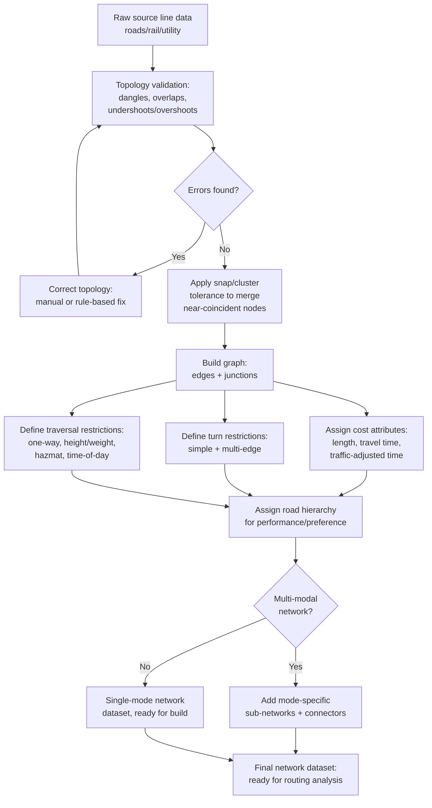

## Network Dataset Construction

### Overview

A network dataset is a topologically connected graph representation of a linear feature system — most commonly a road network, but equally applicable to rail lines, hydrographic stream networks, utility distribution systems, or pedestrian path networks — structured specifically to support routing, service area, and connectivity analysis. Constructing a valid, analysis-ready network dataset from raw line-feature GIS data is a foundational prerequisite for all downstream network analysis (shortest-path routing, drive-time service areas, closest-facility problems, vehicle routing), and is frequently the stage at which real-world network analysis projects encounter the most data-quality friction, since source line data captured for cartographic or reference purposes is rarely topologically clean enough for routing without dedicated preparation.

### Graph Theory Foundations

A network dataset is fundamentally a mathematical graph $G = (V, E)$, where:

- **Edges** represent traversable network segments — road centerline segments, rail segments, pipe segments — each carrying attributes relevant to traversal cost (length, speed limit, travel time, one-way restriction).
- **Vertices (nodes/junctions)** represent points where edges meet, terminate, or intersect — intersections, dead ends, or arbitrary points inserted for routing purposes (e.g., a facility location snapped onto the nearest edge).
- **Connectivity** is established when edges share a common endpoint vertex; a network's analytical validity depends entirely on this connectivity being geometrically and topologically correct — coincident endpoints must actually be registered as the same node, not merely visually overlapping at the same map location.

Most road and utility networks are represented as **directed graphs**, since travel cost, speed, and permissibility frequently differ by direction of travel along the same physical segment (one-way streets, uphill vs. downhill grades affecting travel time, flow direction in a one-directional pipe).

### Source Data Preparation

#### Topological Cleaning

Raw line data digitized or sourced from cartographic datasets frequently contains topology errors invisible at typical map display scales but fatal to network analysis:

- **Undershoots and overshoots**: A line segment that should connect to another but falls just short (undershoot) or extends slightly past the intended connection point (overshoot), leaving no shared vertex and therefore no graph connectivity at that location.
- **Dangling nodes**: Line endpoints that terminate without connecting to any other feature — sometimes legitimate (a genuine dead-end street) and sometimes an error (an unintended gap in what should be a continuous road).
- **Duplicate/overlapping segments**: Multiple coincident line features representing the same physical road, which can cause routing algorithms to double-count segment length or produce ambiguous path results.
- **Pseudo-nodes**: Vertices that split a single continuous road into multiple segments without any actual intersection or attribute change — not inherently an error, but unnecessary segmentation that increases graph size without adding analytical value, sometimes dissolved during network preparation for efficiency.

Standard GIS topology validation rules (e.g., "must not have dangles," "must not overlap," "must be single part") are commonly run as a rule-based topology check against the source line layer before network dataset build, flagging errors for manual or semi-automated correction.

#### Node Snapping and Cluster Tolerance

Network dataset build processes apply a **snap tolerance** (also called cluster tolerance) — a small distance threshold within which vertex endpoints are automatically merged into a single shared node, resolving minor digitizing misalignment without requiring manual correction of every near-miss connection. Setting this tolerance too small leaves genuine near-miss disconnections unresolved; setting it too large risks erroneously merging genuinely distinct, nearby-but-separate features (e.g., two parallel roads passing close together at an underpass) into a false connection.

### Turn Restrictions and Intersection Modeling

#### Simple Turn Restrictions

Prohibit or restrict specific turning movements at an intersection (e.g., "no left turn," "no U-turn") — modeled as a restriction on traversing from one specific edge to another specific edge through a shared junction, rather than a restriction on the junction itself, since a junction with four approaching roads has many possible edge-to-edge turning movements, most of which remain unrestricted even when one specific turn is prohibited.

#### Complex/Multi-Edge Turn Restrictions

Some real-world restrictions depend on the sequence of multiple preceding edges, not just the immediately prior one (e.g., "no left turn if approaching from a specific upstream road," reflecting a restriction that only applies to a specific multi-segment approach path) — requiring the network dataset's turn model to support multi-edge turn definitions rather than simple single-junction restrictions.

#### Signalized vs. Unsignalized Intersection Delay

Realistic travel-time modeling often incorporates an additional fixed or variable delay cost at intersections beyond simple segment traversal time, reflecting stop-sign, signal-cycle, or yield-related delay not otherwise captured in a pure edge-length/speed-limit cost model — modeled either as a junction-level cost attribute or folded into an adjusted edge travel-time attribute for segments approaching controlled intersections.

### Impedance and Cost Attributes

Every edge (and often junction) in a network dataset carries one or more **cost attributes** (impedances) used by routing algorithms to compute optimal paths — the specific attribute(s) selected fundamentally determine what "shortest" or "best" means for a given analysis:

- **Length / distance-based cost**: The simplest impedance, purely geometric segment length, used for shortest-physical-distance routing.
- **Travel time**: Segment length divided by an assigned or modeled travel speed, the most common impedance for realistic routing (drive-time, walk-time), since minimum-distance and minimum-time routes frequently diverge substantially (a longer highway route is often faster than a shorter route through congested local streets).
- **Historical or live traffic-adjusted travel time**: Time-of-day or real-time traffic speed data applied as a dynamic cost multiplier, supporting time-dependent routing that reflects actual congestion patterns rather than a static free-flow speed assumption.
- **Hierarchical/multi-attribute cost**: Combining multiple weighted factors (time, distance, road-class preference, toll cost) into a composite impedance for more nuanced routing preferences (e.g., "fastest route avoiding tolls").

### Restrictions and Vehicle-Specific Attributes

Beyond turn restrictions, network datasets commonly model additional traversal restrictions relevant to specific vehicle types or use cases:

- **One-way restrictions**: Directional traversal constraints on specific edges.
- **Height, weight, and length restrictions**: Physical vehicle-dimension limits (low bridge clearances, weight-limited bridges, roads unsuitable for long vehicles) relevant to freight and oversized-vehicle routing.
- **Hazmat and vehicle-class restrictions**: Roads prohibited to specific cargo classes or vehicle categories (e.g., no hazardous materials through a tunnel, no commercial trucks on a residential parkway).
- **Time-of-day and day-of-week restrictions**: Access windows that vary temporally (e.g., delivery-only access during specific hours, seasonal road closures).

### Hierarchy and Multi-Modal Considerations

#### Road Hierarchy

Large-scale routing networks (regional or national) commonly assign a functional classification hierarchy (e.g., freeway, arterial, collector, local street) to edges, which routing algorithms use both as a cost-preference signal (favoring higher-hierarchy roads for long-distance segments of a route, consistent with real driver behavior) and, in hierarchical routing implementations, as a computational optimization allowing the algorithm to prune consideration of low-hierarchy roads once sufficiently far from the origin/destination, substantially improving performance on very large networks.

#### Multi-Modal Network Modeling

Networks supporting multiple travel modes (walking, cycling, driving, transit) within a single analytical framework require mode-specific edges, restrictions, and impedances, plus explicit **connector edges** linking mode-specific sub-networks at appropriate transition points (e.g., a pedestrian path connecting to a transit stop, a parking facility connecting a driving network to a walking network) — a substantially more complex construction task than single-mode network building, since each mode's connectivity, cost structure, and restriction rules can differ entirely from the others sharing the same geographic space.



### Network Topology: Nodes and Edges (svg_diagram)

<svg xmlns="http://www.w3.org/2000/svg" viewBox="0 0 700 340">
<rect x="0" y="0" width="700" height="340" fill="#ffffff" />
<text x="350" y="26" font-family="Arial" font-size="16" font-weight="bold" text-anchor="middle" fill="#1a1a1a">Network Graph: Edges and Junctions (svg_diagram)</text>
<line x1="100" y1="100" x2="280" y2="100" stroke="#2563eb" stroke-width="3" />
<line x1="280" y1="100" x2="280" y2="220" stroke="#2563eb" stroke-width="3" />
<line x1="280" y1="100" x2="460" y2="100" stroke="#2563eb" stroke-width="3" />
<line x1="280" y1="220" x2="460" y2="220" stroke="#2563eb" stroke-width="3" />
<line x1="460" y1="100" x2="460" y2="220" stroke="#2563eb" stroke-width="3" />
<line x1="460" y1="100" x2="600" y2="60" stroke="#dc2626" stroke-width="3" stroke-dasharray="5,4" />
<circle cx="100" cy="100" r="7" fill="#1e293b" />
<circle cx="280" cy="100" r="7" fill="#1e293b" />
<circle cx="280" cy="220" r="7" fill="#1e293b" />
<circle cx="460" cy="100" r="7" fill="#1e293b" />
<circle cx="460" cy="220" r="7" fill="#1e293b" />

<text x="280" y="90" font-family="Arial" font-size="10" text-anchor="middle" fill="`#1e293b`">Junction (intersection)</text>

<text x="190" y="90" font-family="Arial" font-size="10" text-anchor="middle" fill="`#1e40af`">Edge (segment)</text>

<circle cx="600" cy="60" r="6" fill="#dc2626" />
<text x="605" y="45" font-family="Arial" font-size="10" fill="#991b1b">Dangling node</text>
<text x="605" y="75" font-family="Arial" font-size="9" fill="#991b1b">(unconnected — possible error)</text>

<text x="100" y="270" font-family="Arial" font-size="11" fill="#333">Connectivity requires exact coincident</text>

<text x="100" y="288" font-family="Arial" font-size="11" fill="#333">endpoint coordinates (within snap tolerance)</text>

<text x="100" y="306" font-family="Arial" font-size="11" fill="#333">— not merely visual proximity on the map</text>

</svg>

### Implementation Notes (Python / NetworkX for Custom Graph Construction)

```python
import geopandas as gpd
import networkx as nx
from shapely.geometry import Point

roads = gpd.read_file("road_centerlines.shp")

G = nx.DiGraph()

for idx, row in roads.iterrows():
    coords = list(row.geometry.coords)
    start_node = coords[0]
    end_node = coords[-1]
    length_m = row.geometry.length
    speed_kmh = row.get("speed_limit", 50)
    travel_time_min = (length_m / 1000) / speed_kmh * 60

    # add edge in allowed direction(s) based on one-way attribute
    oneway = row.get("oneway", "no")
    G.add_edge(start_node, end_node, length=length_m, time=travel_time_min, road_id=idx)
    if oneway != "yes":
        G.add_edge(end_node, start_node, length=length_m, time=travel_time_min, road_id=idx)

# Snap-tolerance node merging (simplified illustration)
def snap_nodes(graph, tolerance=0.5):
    # production workflows typically use a spatial index (e.g., STRtree)
    # to efficiently find and merge near-coincident nodes within `tolerance`
    pass

# Shortest-time path between two snapped node coordinates
path = nx.shortest_path(G, source=(0, 0), target=(1000, 1000), weight="time")
```

[Unverified] Production network dataset construction (topology validation, snap tolerance merging, turn restriction modeling, and multi-modal connectors) is substantially more involved than the illustrative NetworkX example above; dedicated platforms such as Esri's Network Analyst, pgRouting (PostGIS extension), OSRM, or Valhalla implement the full topology-cleaning and restriction-modeling pipeline described in this document, and exact default tolerances and build behavior differ across these platforms — consult platform-specific documentation before production use.

### Common Pitfalls

- **Assuming visual coincidence equals topological connectivity**: Two line endpoints that appear to touch on a map at typical zoom levels may have subtly different coordinates and remain disconnected in the graph without an appropriate snap tolerance.
- **Setting snap tolerance without considering the network's finest true feature spacing**: An overly generous tolerance can erroneously merge genuinely separate, closely-spaced features (parallel roads, over/underpasses).
- **Omitting turn restrictions**, producing routes that include real-world-illegal turning movements.
- **Using pure geometric length as the sole impedance** when realistic travel-time-based routing is the actual analytical goal.
- **Neglecting to rebuild/re-index the network dataset after editing source line features**, leaving stale connectivity or cost attribute information in the built network graph.

**Related Topics**

- Shortest Path and Routing Algorithms
- Service Area and Drive-Time Analysis
- Location-Allocation Modeling
- Vehicle Routing Problem (VRP) Optimization
- Multi-Modal Transportation Network Analysis
- Topology Rules and Spatial Data Quality
- Transit Network Modeling (GTFS Integration)