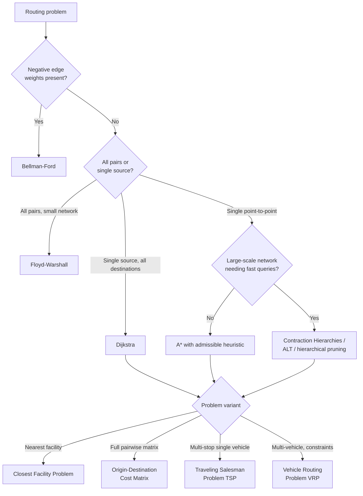

## Shortest Path and Routing Analysis

### Overview

Shortest path and routing analysis computes the optimal path (or set of paths) through a network dataset between an origin and one or more destinations, where "optimal" is defined by whatever impedance/cost attribute the analysis targets — physical distance, travel time, monetary cost, or a weighted combination. This is the foundational analytical operation of network GIS, underlying everything from consumer turn-by-turn navigation to logistics fleet optimization, emergency response dispatch, and utility network fault isolation.

### Graph-Theoretic Foundations

#### Problem Formulation

Given a graph $G = (V, E)$ with non-negative edge weights $w(e)$ representing traversal cost, the shortest path problem seeks the path $P$ from source $s$ to target $t$ minimizing:

$$\text{cost}(P) = \sum_{e \in P} w(e)$$

Real road networks are typically modeled as **directed graphs** (digraphs) since travel cost frequently differs by direction (one-way restrictions, asymmetric grade/elevation effects on travel time).

### Classical Shortest Path Algorithms

#### Dijkstra's Algorithm

The foundational algorithm for single-source shortest paths with non-negative edge weights. Maintains a running set of tentative shortest distances from the source to every vertex, repeatedly selecting the unvisited vertex with the smallest tentative distance, "relaxing" (potentially improving) the distances to its neighbors, and marking it visited — guaranteed to find the true shortest path to every vertex once all reachable vertices are visited.

$$\text{Time complexity: } O((|V| + |E|) \log |V|) \text{ with a binary heap priority queue}$$

Dijkstra's algorithm computes shortest paths to *all* vertices from a single source simultaneously, making it efficient for one-to-many routing scenarios, but it explores the graph in all directions from the source without any goal-directed bias toward the target, which is computationally wasteful for a single point-to-point query on a large network.

#### A* (A-Star) Search

Extends Dijkstra's algorithm with a **heuristic function** $h(v)$ estimating the remaining cost from any vertex $v$ to the target, guiding the search preferentially toward the destination rather than expanding uniformly in all directions:

$$f(v) = g(v) + h(v)$$

where $g(v)$ is the actual accumulated cost from the source to $v$, and $h(v)$ is the heuristic estimate of remaining cost to the target. For road-network routing, a common heuristic is straight-line (Euclidean or great-circle) distance to the destination divided by the maximum possible travel speed in the network, providing a valid **admissible heuristic** (one that never overestimates true remaining cost) — a required property to guarantee A* still finds the true optimal path rather than merely a good approximation. A* substantially outperforms plain Dijkstra for single point-to-point queries on large networks by focusing search effort toward the destination, at the cost of losing Dijkstra's simultaneous all-destinations result.

#### Bellman-Ford Algorithm

Handles graphs with **negative edge weights** (which Dijkstra's algorithm cannot correctly handle), using a different relaxation strategy that iterates over all edges repeatedly rather than greedily selecting the closest unvisited vertex. Rarely needed for standard travel-cost routing (physical time/distance costs are never negative), but relevant for specialized network flow or optimization contexts where an edge might represent a net gain rather than a cost. Also capable of detecting negative-weight cycles, which would make the shortest-path problem ill-defined (an infinitely improvable path).

$$\text{Time complexity: } O(|V| \cdot |E|)$$

— substantially slower than Dijkstra's algorithm, so Bellman-Ford is used specifically when negative weights are present, not as a general-purpose substitute.

#### Floyd-Warshall Algorithm

Computes shortest paths between **all pairs** of vertices simultaneously via dynamic programming, iteratively considering whether routing through each intermediate vertex improves any pair's shortest path:

$$\text{Time complexity: } O(|V|^3)$$

Appropriate for dense, relatively small networks where all-pairs shortest path information is needed (e.g., precomputing a full travel-time matrix between a modest number of facility locations), but the cubic complexity makes it impractical for large road networks with hundreds of thousands of vertices, where repeated single-source Dijkstra/A* runs (or specialized many-to-many algorithms) are far more efficient.

### Modern Speedup Techniques for Large-Scale Road Networks

Continent-scale road networks (millions of edges) make naive Dijkstra/A* too slow for interactive routing applications; production routing engines employ specialized preprocessing-based speedup techniques.

#### Contraction Hierarchies (CH)

A widely used preprocessing technique that iteratively "contracts" (removes) vertices from the graph in an order determined by a node-importance heuristic, adding shortcut edges that preserve shortest-path distances between remaining vertices — producing a hierarchical structure that allows extremely fast bidirectional query-time search (querying "upward" in importance from both the source and target simultaneously), at the cost of substantial one-time preprocessing effort. Contraction hierarchies underlie the routing performance of several major open-source routing engines and are the standard approach for interactive, sub-second point-to-point routing on continental-scale networks. [Inference] Exact implementation details (contraction ordering heuristics, shortcut pruning strategies) vary meaningfully across specific routing engine implementations and continue to be an active area of applied research, so specific engines' published benchmarks should not be assumed to generalize uniformly across all network types and query patterns.

#### Hierarchical Road Network Pruning

A simpler, road-classification-based speedup approach: once a search has moved sufficiently far from the origin/destination, the algorithm restricts further exploration to higher-hierarchy roads only (freeways, major arterials), consistent with real driver behavior (long trips predominantly use major roads) and substantially reducing the search space for long-distance queries, though less rigorously optimal than contraction hierarchies for guaranteeing true shortest paths in all cases.

#### ALT (A*, Landmarks, Triangle Inequality)

Precomputes shortest-path distances from a small set of strategically selected "landmark" vertices to all other vertices, then uses the triangle inequality with these precomputed distances to derive a tighter, more effective A* heuristic than simple Euclidean distance — improving A* search efficiency without the full preprocessing cost of contraction hierarchies.

### Multi-Destination and Variant Routing Problems

#### Closest Facility Problem

Given a set of candidate facility locations and one or more incident/demand locations, determines the nearest (by cost) facility to each incident — the standard formulation for emergency response dispatch (nearest ambulance/fire station to an incident) and customer-to-store assignment problems, typically solved via multiple single-source Dijkstra/A* runs from candidate facilities or a specialized many-to-many shortest-path algorithm.

#### Origin-Destination (OD) Cost Matrix

Computes the shortest-path cost (not the full path geometry, for efficiency) between every origin in one set and every destination in another set, producing a matrix of travel costs — foundational input to gravity models, accessibility analysis, and many location-allocation optimization formulations that require pairwise travel cost as an input rather than individual route paths.

#### Traveling Salesman Problem (TSP) and Route Sequencing

Given a single vehicle that must visit a set of stops exactly once and return to the origin (or reach a final destination), determines the optimal visiting sequence minimizing total travel cost — an NP-hard combinatorial optimization problem for which exact solutions become computationally intractable beyond a modest number of stops, commonly addressed via heuristic and metaheuristic approaches (nearest-neighbor construction, 2-opt local search improvement, simulated annealing, genetic algorithms) that produce high-quality, though not provably optimal, solutions in practical time.

#### Vehicle Routing Problem (VRP)

Generalizes TSP to multiple vehicles with capacity constraints, time windows, and other real-world logistics constraints, determining both the assignment of stops to vehicles and each vehicle's optimal route — the standard formulation underlying commercial delivery/logistics route optimization software, solved via specialized heuristics and metaheuristics (the general VRP family, including its many constrained variants, is itself NP-hard).

### Turn-by-Turn Directions and Path Reconstruction

Once a shortest path is computed as a sequence of graph edges, generating human-readable turn-by-turn directions requires additional post-processing: identifying the specific turning maneuver at each junction transition (straight, left, right, U-turn, merge, exit), associating each maneuver with relevant street names and route numbers from the source attribute data, and applying maneuver-simplification logic (e.g., consolidating several consecutive same-direction segments along a single named road into one "continue on X" instruction rather than announcing each underlying graph edge separately).



### Dijkstra vs. A* Search Expansion (svg_diagram)

<svg xmlns="http://www.w3.org/2000/svg" viewBox="0 0 700 340">
<rect x="0" y="0" width="700" height="340" fill="#ffffff" />
<text x="350" y="26" font-family="Arial" font-size="16" font-weight="bold" text-anchor="middle" fill="#1a1a1a">Search Expansion Pattern (svg_diagram)</text>

<text x="175" y="55" font-family="Arial" font-size="13" font-weight="bold" text-anchor="middle" fill="#333">Dijkstra (uniform expansion)</text>

<circle cx="175" cy="180" r="90" fill="`#93c5fd`" fill-opacity="0.3" stroke="`#2563eb`" stroke-width="1.5" />

<circle cx="175" cy="180" r="55" fill="`#60a5fa`" fill-opacity="0.35" stroke="`#2563eb`" stroke-width="1" />

<circle cx="175" cy="180" r="6" fill="`#1e3a8a`" />

<text x="175" y="200" font-family="Arial" font-size="10" text-anchor="middle" fill="`#1e3a8a`">Source</text>

<circle cx="290" cy="120" r="6" fill="`#dc2626`" />

<text x="300" y="112" font-family="Arial" font-size="10" fill="`#991b1b`">Target</text>

<text x="175" y="290" font-family="Arial" font-size="10" text-anchor="middle" fill="#666">Explores all directions equally</text>

<text x="525" y="55" font-family="Arial" font-size="13" font-weight="bold" text-anchor="middle" fill="#333">A* (goal-directed)</text>

<ellipse cx="525" cy="180" rx="95" ry="50" fill="`#86efac`" fill-opacity="0.35" stroke="`#16a34a`" stroke-width="1.5" transform="rotate(-20 525 180)" />

<circle cx="450" cy="210" r="6" fill="`#1e3a8a`" />

<text x="450" y="230" font-family="Arial" font-size="10" text-anchor="middle" fill="`#1e3a8a`">Source</text>

<circle cx="620" cy="130" r="6" fill="`#dc2626`" />

<text x="630" y="122" font-family="Arial" font-size="10" fill="`#991b1b`">Target</text>

<text x="525" y="290" font-family="Arial" font-size="10" text-anchor="middle" fill="#666">Expands preferentially toward goal</text>

</svg>

### Implementation Notes (Python / NetworkX + OSMnx)

```python
import osmnx as ox
import networkx as nx

# Download and build a drivable road network graph for an area
G = ox.graph_from_place("Manhattan, New York, USA", network_type="drive")
G = ox.add_edge_speeds(G)
G = ox.add_edge_travel_times(G)

orig_node = ox.nearest_nodes(G, X=-73.9857, Y=40.7484)
dest_node = ox.nearest_nodes(G, X=-73.9776, Y=40.7527)

# Dijkstra shortest path by travel time
route_dijkstra = nx.shortest_path(G, orig_node, dest_node, weight="travel_time")

# A* shortest path using great-circle distance heuristic
def heuristic(u, v):
    y1, x1 = G.nodes[u]["y"], G.nodes[u]["x"]
    y2, x2 = G.nodes[v]["y"], G.nodes[v]["x"]
    return ox.distance.great_circle(y1, x1, y2, x2) / 15  # assume ~15 m/s max speed

route_astar = nx.astar_path(G, orig_node, dest_node, heuristic=heuristic, weight="travel_time")
```

[Unverified] Production-grade routing engines (OSRM, GraphHopper, Valhalla, Esri Network Analyst) implement contraction hierarchies or comparable large-network speedup techniques not present in the illustrative NetworkX/OSMnx example above; exact query performance, preprocessing time, and heuristic implementations differ substantially across these platforms and should be evaluated against platform-specific documentation and benchmarks for production use.

### Common Pitfalls

- **Using an inadmissible A* heuristic** (one that can overestimate remaining cost), which breaks the algorithm's optimality guarantee and can return a suboptimal path without any obvious error indication.
- **Applying Dijkstra or A* directly to graphs with negative edge weights**, producing silently incorrect results rather than an explicit error.
- **Using Floyd-Warshall on large road networks**, where its cubic time complexity makes it computationally infeasible well before typical continental-scale network sizes.
- **Treating TSP/VRP heuristic solutions as guaranteed-optimal**, when metaheuristic approaches provide high-quality but not provably optimal solutions for these NP-hard problems.
- **Ignoring time-dependent travel costs** in scenarios where realistic routing requires accounting for congestion variation by time of day, using only static free-flow speeds.

**Related Topics**

- Network Dataset Construction
- Service Area and Drive-Time Analysis
- Location-Allocation Modeling
- Vehicle Routing Problem (VRP) Optimization in Logistics
- Origin-Destination Matrix Applications in Accessibility Analysis
- Multi-Modal Transportation Network Analysis
- Graph Theory Foundations for Spatial Networks