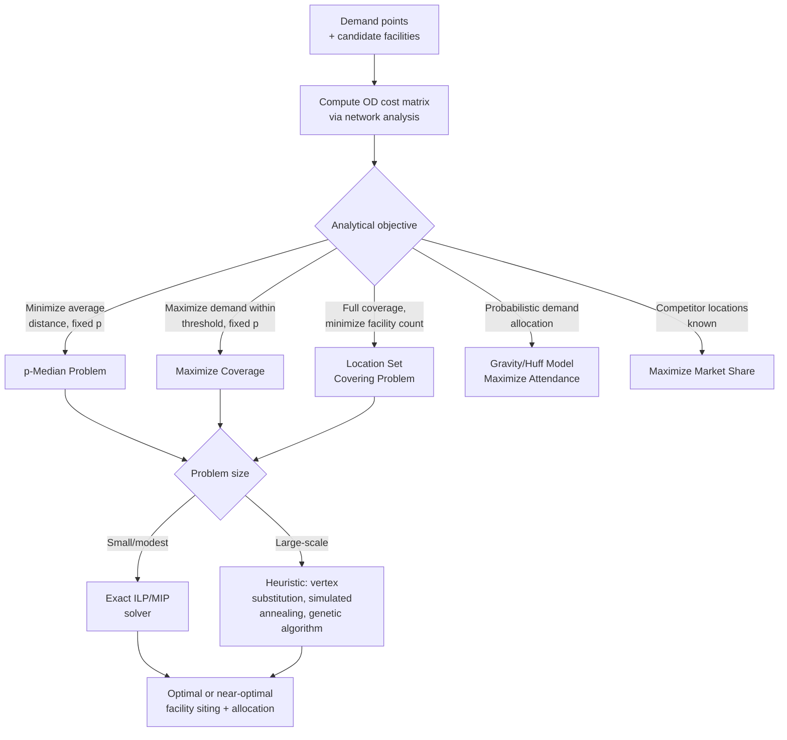

## Location-Allocation Modeling

### Overview

Location-allocation modeling addresses the combined problem of deciding *where* to site a set of facilities and *how* to assign (allocate) demand points to those facilities, optimizing a specified objective — typically minimizing total travel distance/cost, maximizing coverage, or maximizing captured demand under competition. Unlike simple proximity analysis, which assumes facility locations are already fixed, location-allocation treats facility siting itself as a decision variable, making it a combinatorial optimization problem rather than a purely descriptive spatial analysis. Applications span retail site selection, public service facility planning (schools, clinics, fire stations), emergency response resource placement, and telecommunications infrastructure siting.

### Foundational Concepts

#### Demand Points and Facility Candidates

Every location-allocation problem requires two input sets: **demand points** (locations representing population, customers, or service need, often weighted by magnitude — e.g., census block population) and **candidate facility locations** (either a predefined finite set of possible sites, or, in continuous-space formulations, any point in the plane). The network distance or travel-time cost between every demand point and every candidate facility (an Origin-Destination cost matrix) is the fundamental input data structure most location-allocation algorithms operate on.

#### The p-Median Problem

The classical formulation: given $n$ demand points and a candidate facility set, select exactly $p$ facilities to open, and assign each demand point to its nearest opened facility, minimizing the total (or weighted-average) demand-weighted distance:

$$\min \sum_{i=1}^{n} \sum_{j=1}^{p} w_i \, d_{ij} \, x_{ij}$$

subject to each demand point being assigned to exactly one facility, and facility assignment only permitted to an opened facility — where $w_i$ is demand weight at point $i$, $d_{ij}$ is the distance/cost from demand point $i$ to facility $j$, and $x_{ij}$ is a binary assignment variable. The p-median problem is NP-hard in general, though efficient heuristics (and exact solvers for modest problem sizes) are widely available.

### Core Location-Allocation Problem Types

#### Minimize Impedance (p-Median)

As described above — the standard "minimize average distance to nearest facility" objective, appropriate when the goal is overall system efficiency (e.g., minimizing total driving distance for all customers to their nearest retail location).

#### Maximize Coverage

Given a fixed service-distance or service-time threshold (e.g., "within 10 minutes"), selects $p$ facility locations to maximize the total demand that falls within the threshold of at least one opened facility:

$$\max \sum_{i=1}^{n} w_i \, y_i \quad \text{subject to } y_i = 1 \text{ only if some opened facility } j \text{ has } d_{ij} \le S$$

where $S$ is the service standard threshold and $y_i$ indicates whether demand point $i$ is covered. Commonly used for public-safety and public-health facility siting, where the analytical question is "what fraction of the population can we reach within an acceptable response time," rather than minimizing average distance across the entire population.

#### Minimize Facilities (Set Covering / Location Set Covering Problem)

Rather than fixing the number of facilities $p$ in advance, this formulation fixes the required coverage standard (every demand point must be within the service threshold of some facility) and instead minimizes the number of facilities needed to achieve full coverage:

$$\min \sum_{j} x_j \quad \text{subject to every demand point } i \text{ being covered by at least one opened facility}$$

Appropriate when full coverage is a hard requirement (e.g., a regulatory mandate that all residents be within a specified distance of emergency services) and the analytical question is the minimum infrastructure investment needed to satisfy that mandate.

#### Maximize Attendance / Gravity-Based Allocation

Rather than assuming demand is deterministically captured by the single nearest facility, gravity-based (Huff model-style) formulations allocate demand probabilistically across multiple facilities based on relative attractiveness and distance decay:

$$P_{ij} = \frac{A_j / d_{ij}^{\beta}}{\sum_{k} A_k / d_{ik}^{\beta}}$$

where $A_j$ is facility $j$'s attractiveness (e.g., store size, service quality) and $\beta$ is a distance-decay exponent calibrated from observed behavior — used in retail site selection and competitive market-share modeling, where customers do not always patronize the strictly nearest option and distance sensitivity varies by facility type and customer segment.

#### Maximize Market Share (Competitive Location)

Explicitly models the presence of competing facilities (existing competitor locations, not just the facilities being sited), optimizing new facility placement to maximize the market share captured from a specific competitive landscape — commonly implemented via a Huff-model-style demand allocation combined with an optimization layer selecting locations that best increase the sited organization's captured share relative to known competitors.

#### Minimize Facility Count with Maximum Distance Constraint

A hybrid formulation combining elements of set covering and p-median: minimizes the number of facilities subject to no demand point exceeding a maximum allowable distance to its assigned facility, distinct from pure set covering by also incorporating overall efficiency considerations in facility placement beyond the minimum coverage requirement.

### Solution Algorithms

#### Exact Methods (Integer/Mixed-Integer Programming)

For modest-sized problems, location-allocation formulations can be solved to provable optimality using integer linear programming (ILP) or mixed-integer programming (MIP) solvers, formulating the assignment and facility-opening decisions as binary decision variables subject to the relevant constraint set — guaranteed optimal but computationally intractable at scale as problem size (number of demand points × candidate facilities) grows, since the underlying problems are NP-hard.

#### Heuristic and Metaheuristic Methods

For large-scale, real-world problem sizes, exact solution becomes impractical, and location-allocation software commonly relies on heuristic algorithms:

- **Teitz and Bart vertex substitution heuristic**: An iterative local-search approach — starting from an initial candidate solution, repeatedly tests whether swapping an opened facility for a currently-unopened candidate improves the objective, continuing until no further improving swap exists (a local optimum, not guaranteed globally optimal).
- **Simulated annealing and genetic algorithms**: Metaheuristic approaches that allow occasional non-improving moves (simulated annealing) or maintain and evolve a population of candidate solutions (genetic algorithms) to escape local optima that simple local-search heuristics like vertex substitution can become trapped in, at the cost of longer computation time and no formal optimality guarantee.
- **Lagrangian relaxation**: A mathematical programming technique that relaxes hard constraints into the objective function with penalty multipliers, producing both a good feasible solution and a provable bound on how far that solution could be from true optimality — useful for assessing heuristic solution quality even without solving to full exact optimality.

### Relationship to Network Analysis

Location-allocation modeling depends entirely on an accurate, well-constructed network dataset and its derived Origin-Destination cost matrix as input — the quality of the underlying road network topology, turn restrictions, and travel-time impedances directly determines the validity of the location-allocation solution, since the optimization is only as good as the distance/cost matrix it operates on. In practice, location-allocation is typically the final analytical stage built atop network dataset construction and shortest-path/OD-matrix computation covered earlier in this chapter.



### p-Median vs. Coverage Objective (svg_diagram)

<svg xmlns="http://www.w3.org/2000/svg" viewBox="0 0 700 360">
<rect x="0" y="0" width="700" height="360" fill="#ffffff" />
<text x="350" y="26" font-family="Arial" font-size="16" font-weight="bold" text-anchor="middle" fill="#1a1a1a">p-Median vs. Maximize Coverage (svg_diagram)</text>

<text x="175" y="55" font-family="Arial" font-size="13" font-weight="bold" text-anchor="middle" fill="#333">p-Median: minimize avg. distance</text>

<circle cx="80" cy="150" r="4" fill="`#94a3b8`" />

<circle cx="130" cy="200" r="4" fill="`#94a3b8`" />

<circle cx="220" cy="120" r="4" fill="`#94a3b8`" />

<circle cx="250" cy="230" r="4" fill="`#94a3b8`" />

<circle cx="175" cy="175" r="9" fill="`#2563eb`" />

<text x="175" y="200" font-family="Arial" font-size="9" text-anchor="middle" fill="`#1e3a8a`">Facility</text>

<line x1="80" y1="150" x2="175" y2="175" stroke="`#94a3b8`" stroke-width="1" />

<line x1="130" y1="200" x2="175" y2="175" stroke="`#94a3b8`" stroke-width="1" />

<line x1="220" y1="120" x2="175" y2="175" stroke="`#94a3b8`" stroke-width="1" />

<line x1="250" y1="230" x2="175" y2="175" stroke="`#94a3b8`" stroke-width="1" />

<text x="175" y="300" font-family="Arial" font-size="10" text-anchor="middle" fill="#666">Sited to minimize total distance</text>

<text x="175" y="316" font-family="Arial" font-size="10" text-anchor="middle" fill="#666">across ALL demand points</text>

<text x="525" y="55" font-family="Arial" font-size="13" font-weight="bold" text-anchor="middle" fill="#333">Maximize Coverage: threshold-based</text>

<circle cx="440" cy="150" r="4" fill="`#16a34a`" />

<circle cx="480" cy="200" r="4" fill="`#16a34a`" />

<circle cx="570" cy="120" r="4" fill="`#dc2626`" />

<circle cx="620" cy="240" r="4" fill="`#dc2626`" />

<circle cx="460" cy="175" r="70" fill="`#86efac`" fill-opacity="0.25" stroke="`#16a34a`" stroke-width="1.5" stroke-dasharray="4,3" />

<circle cx="460" cy="175" r="9" fill="`#16a34a`" />

<text x="620" y="260" font-family="Arial" font-size="9" fill="`#991b1b`">Outside threshold</text>

<text x="525" y="300" font-family="Arial" font-size="10" text-anchor="middle" fill="#666">Maximizes demand within a fixed</text>

<text x="525" y="316" font-family="Arial" font-size="10" text-anchor="middle" fill="#666">service-distance threshold</text>

</svg>

### Implementation Notes (Python / PuLP for p-Median ILP)

```python
import pulp
import numpy as np

# distance matrix: demand points (rows) x candidate facilities (columns)
dist = np.array([
    [2.1, 5.4, 8.2],
    [3.8, 1.2, 6.5],
    [7.0, 4.3, 2.0],
    [1.5, 6.8, 5.1],
])
demand_weight = np.array([120, 85, 200, 60])
n_demand, n_candidates = dist.shape
p = 2  # number of facilities to open

prob = pulp.LpProblem("p_median", pulp.LpMinimize)
x = pulp.LpVariable.dicts("assign", (range(n_demand), range(n_candidates)), cat="Binary")
y = pulp.LpVariable.dicts("open", range(n_candidates), cat="Binary")

# objective: minimize demand-weighted total distance
prob += pulp.lpSum(demand_weight[i] * dist[i][j] * x[i][j]
                    for i in range(n_demand) for j in range(n_candidates))

# each demand point assigned to exactly one facility
for i in range(n_demand):
    prob += pulp.lpSum(x[i][j] for j in range(n_candidates)) == 1

# can only assign to an opened facility
for i in range(n_demand):
    for j in range(n_candidates):
        prob += x[i][j] <= y[j]

# exactly p facilities opened
prob += pulp.lpSum(y[j] for j in range(n_candidates)) == p

prob.solve()
```

[Unverified] Production GIS location-allocation tools (Esri Network Analyst Location-Allocation, pgRouting, commercial retail-siting platforms) implement additional heuristic solvers, network-based (not Euclidean) distance matrices, and problem-type-specific optimizations beyond the illustrative exact-ILP example above; exact default heuristics and solver behavior differ across platforms and should be verified against platform-specific documentation.

### Common Pitfalls

- **Using Euclidean (straight-line) distance instead of network distance** for facilities and demand points connected by a real road network, producing systematically inaccurate siting recommendations wherever road network structure diverges substantially from straight-line geometry (rivers, highways without crossings, one-way restrictions).
- **Selecting the wrong problem formulation for the actual policy question**: applying p-median (minimize average distance) when the real requirement is a hard coverage guarantee (set covering) produces solutions that may leave some demand points poorly served even while minimizing the overall average.
- **Treating demand points as unweighted** when population or demand magnitude varies substantially across the study area, producing solutions optimized for point count rather than actual service demand.
- **Relying on local-search heuristics without any solution-quality bound**, risking an unrecognized poor local optimum on complex, large-scale problems without at least an approximate comparison against a known lower bound.
- **Ignoring existing competitor locations** in retail or market-share-sensitive siting contexts, applying a pure coverage or p-median objective when a competitive Huff-model-based approach would better reflect real customer choice behavior.

**Related Topics**

- Network Dataset Construction
- Shortest Path and Routing Analysis
- Service Area and Drive-Time Analysis
- Origin-Destination Matrix Applications
- Spatial Accessibility Analysis
- Retail Site Selection and Market Analysis
- Vehicle Routing Problem (VRP) Optimization