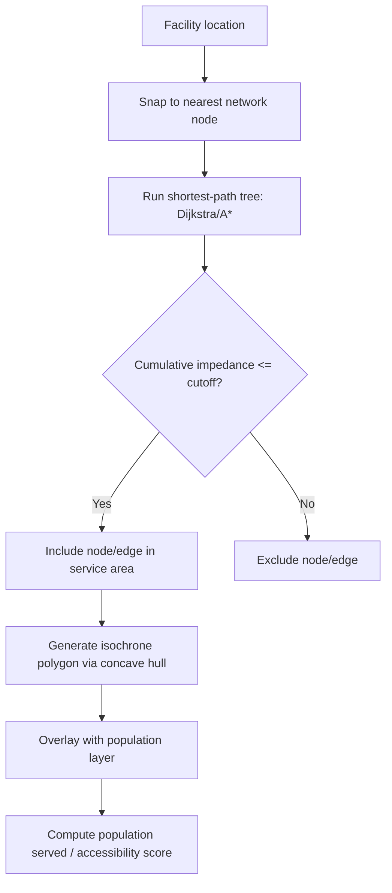

## Service Area and Accessibility Analysis

### Overview

Service area and accessibility analysis measures how well a location, population, or set of demand points can reach specific facilities, resources, or opportunities, typically constrained by a transportation network, travel cost, or travel time threshold. It underpins applications such as emergency response coverage, healthcare facility planning, retail site selection, public transit equity assessment, and urban amenity distribution. The core analytical unit is the network — nodes (intersections, stops) connected by edges (street segments, transit links) carrying impedance values (distance, time, cost).

### Core Concepts

**Service Area (Catchment Area)**

The portion of a network reachable from a facility within a specified impedance cutoff (e.g., 10-minute drive time, 1-mile walk). Represented as either a polygon (generalized boundary) or a network-constrained line/point selection.

**Accessibility**

A broader concept than service area — it measures the ease with which a location's population can reach one or more opportunities, often incorporating both proximity and the "supply" or capacity of the destination (e.g., number of hospital beds, jobs available).

**Impedance**

The cost metric used to traverse the network — commonly travel time, distance, or a generalized cost combining time, monetary cost, and other penalties (e.g., turn restrictions, elevation gain).

**Isochrone**

A polygon or line connecting points of equal travel time from an origin, forming the visual boundary of a time-based service area.

### Types of Service Area Analysis

**1. Network-Constrained Service Areas**

Computed directly on a road/path network graph, respecting actual connectivity, one-way restrictions, and turn penalties. Produced using shortest-path tree algorithms (Dijkstra's algorithm or A*) from the facility node, accumulating impedance outward until the cutoff is reached.

$$d(v) = \min_{u \in N(v)} \left[ d(u) + w(u,v) \right]$$

where $d(v)$ is the minimum cumulative impedance to reach node $v$, and $w(u,v)$ is the edge weight between neighboring nodes $u$ and $v$.

**2. Euclidean (Straight-Line) Buffers**

A simplified proxy using simple circular buffers around a facility. Computationally trivial but ignores actual network connectivity, often significantly overestimating true accessibility, especially in areas with rivers, highways, or irregular street grids acting as barriers.

**3. Travel-Time Polygons (Isochrones)**

Generated by converting the network-based shortest-path tree into a continuous polygon, typically via a concave hull or alpha-shape algorithm applied to the reachable nodes/points, since a raw convex hull would overestimate the covered area by including unreachable interior gaps.

**4. Raster-Based Cost-Distance Accessibility**

For off-network or terrain-influenced accessibility (e.g., wildfire evacuation, hiking accessibility), a cost surface raster assigns per-cell traversal cost, and cumulative cost-distance algorithms (least-cost path accumulation) compute accessibility across continuous space rather than a discrete network.

### Accessibility Metrics and Models

**Cumulative Opportunity Measures**

Counts the number of opportunities (jobs, hospitals, schools) reachable within a fixed travel time threshold:

$$A_i = \sum_{j} O_j \cdot f(c_{ij})$$

where $f(c_{ij})$ is a binary indicator function (1 if travel cost $c_{ij} \leq$ threshold, else 0), and $O_j$ is the opportunity count at destination $j$.

**Gravity-Based Accessibility**

Weights opportunities by distance decay rather than a hard cutoff, reflecting the intuition that closer opportunities matter more:

$$A_i = \sum_{j} O_j \cdot f(c_{ij})$$

with $f(c_{ij}) = e^{-\beta c_{ij}}$ (negative exponential decay) or $f(c_{ij}) = c_{ij}^{-\alpha}$ (power decay), where $\beta$ or $\alpha$ control the decay rate.

**Two-Step Floating Catchment Area (2SFCA)**

A widely used method in healthcare accessibility research that accounts for both supply and demand competition:

*Step 1*: For each facility $j$, compute a supply-to-demand ratio within its catchment:

$$R_j = \frac{S_j}{\sum_{k \in \{d_{kj} \leq d_0\}} P_k}$$

where $S_j$ is facility capacity (e.g., beds/doctors), $P_k$ is population at location $k$ within the catchment radius $d_0$.

*Step 2*: For each population location $i$, sum the ratios of all facilities within reach:

$$A_i = \sum_{j \in \{d_{ij} \leq d_0\}} R_j$$

**[Inference]** Many practical implementations use an Enhanced 2SFCA (E2SFCA) variant that applies distance-decay weighting within the catchment rather than a hard binary cutoff, since this is a commonly cited refinement in the accessibility literature, though the specific weighting scheme varies across studies and is not a single fixed standard.

**Space-Time Accessibility (Hägerstrand-based)**

Incorporates individual time budgets and time-varying network conditions (e.g., transit schedules, business hours) to model realistic reachable "prisms" rather than static catchments — relevant for activity-based transportation modeling.

### Multi-Modal and Transit Accessibility

Public transit service area analysis differs from road-network analysis because impedance is not continuous — it depends on schedules, headways, and transfer waiting time. Common approach:

1. Build a time-expanded graph where each node represents a (stop, time) pair.
2. Compute earliest-arrival or minimum-transfer paths using algorithms such as RAPTOR (Round-based Public Transit Routing) or Connection Scan Algorithm (CSA), which are optimized for schedule-based transit routing versus generic Dijkstra.
3. Aggregate results across multiple departure times to build a representative average accessibility surface (since transit accessibility fluctuates significantly by time of day).

### Practical Example: Drive-Time Service Area Workflow

**Example**

Task: Determine the population within a 15-minute drive time of a proposed hospital site.

1. Build/obtain a routable road network dataset with accurate speed limits or modeled travel speeds per segment.
2. Snap the facility location to the nearest network edge/node.
3. Run a network-based shortest-path tree (Dijkstra/A*) outward from the facility, accumulating travel time along edges up to the 15-minute cutoff.
4. Generate the isochrone polygon from the reachable network extent (concave hull of reachable points/edges).
5. Overlay the isochrone with a population raster or census block dataset.
6. Sum population within the isochrone boundary, ideally using areal interpolation or dasymetric weighting if census units are only partially contained within the isochrone (rather than simple centroid-in-polygon, which can introduce boundary error).

### Visualizing Service Area Concepts

<svg xmlns="http://www.w3.org/2000/svg" viewBox="0 0 640 320" font-family="sans-serif">
<text x="320" y="20" text-anchor="middle" font-size="14" font-weight="bold">Network vs Euclidean Service Area (svg_diagram)</text>
<circle cx="160" cy="170" r="90" fill="#dbeafe" fill-opacity="0.5" stroke="#2563eb" stroke-dasharray="4,3" />
<text x="160" y="270" text-anchor="middle" font-size="11" fill="#2563eb">Euclidean Buffer (overestimates)</text>
<circle cx="160" cy="170" r="5" fill="#1e3a8a" />
<text x="160" y="155" text-anchor="middle" font-size="10">Facility</text>
<line x1="160" y1="170" x2="230" y2="120" stroke="#374151" stroke-width="2" />
<line x1="230" y1="120" x2="290" y2="110" stroke="#374151" stroke-width="2" />
<line x1="160" y1="170" x2="100" y2="220" stroke="#374151" stroke-width="2" />
<line x1="100" y1="220" x2="60" y2="250" stroke="#374151" stroke-width="2" />
<line x1="160" y1="170" x2="220" y2="220" stroke="#374151" stroke-width="2" />
<line x1="220" y1="220" x2="260" y2="260" stroke="#374151" stroke-width="2" />
<line x1="160" y1="170" x2="110" y2="120" stroke="#374151" stroke-width="2" />
<polygon points="290,110 260,150 220,220 260,260 200,270 100,220 60,250 90,180 110,120 160,90" fill="#fecaca" fill-opacity="0.5" stroke="#dc2626" stroke-width="2" />
<text x="480" y="270" text-anchor="middle" font-size="11" fill="#dc2626">Network-Constrained Service Area</text>
<rect x="400" y="30" width="16" height="16" fill="#dbeafe" stroke="#2563eb" />
<text x="425" y="43" font-size="10">Euclidean buffer</text>
<rect x="400" y="55" width="16" height="16" fill="#fecaca" stroke="#dc2626" />
<text x="425" y="68" font-size="10">True network reach</text>
</svg>

### Barriers and Real-World Constraints

- **Physical barriers**: Rivers, highways without crossings, gated communities restricting through-traffic.
- **Temporal variability**: Congestion patterns causing service areas to shrink or shift by time of day.
- **Directional asymmetry**: One-way streets making "reach from facility" and "reach to facility" service areas non-identical.
- **Modal constraints**: Pedestrian, cyclist, and driver networks differ substantially even on the same physical street grid (sidewalks, bike lanes, highway exclusions).

### Software and Tools

**ArcGIS Network Analyst** — `Service Area` and `OD Cost Matrix` solvers, supports network datasets with turn restrictions and time-of-day impedance.

**pgRouting** (PostgreSQL/PostGIS extension) — `pgr_drivingDistance` and `pgr_alphaShape` functions for network-constrained service areas and concave hull generation.

**OpenRouteService (ORS)** and **OSRM** — open-source routing engines exposing isochrone API endpoints built on OpenStreetMap data.

**R packages**: `sfnetworks`, `dodgr`, `r5r` (interfaces with the R5 routing engine for detailed multi-modal and transit accessibility analysis, including time-expanded GTFS-based routing).

**Python**: `networkx` (generic graph algorithms), `osmnx` (OSM network extraction and routing), `pandana` (fast network accessibility calculations at scale).

**[Unverified]** Specific solver defaults (e.g., default decay function parameters or default hull algorithm) vary by software version and should be confirmed against current vendor/library documentation before being treated as fixed defaults.

### Common Pitfalls

- Using Euclidean buffers when network barriers exist, substantially overstating true accessibility.
- Ignoring time-of-day variation in travel time, presenting a single static service area as universally valid.
- Applying centroid-based population aggregation across large census units, introducing systematic bias at isochrone boundaries.
- Failing to account for facility capacity/competition (addressed by 2SFCA-style methods) when multiple facilities serve overlapping populations.

### Key Points

- Service areas are network-constrained catchments; accessibility incorporates both reach and opportunity supply.
- Euclidean buffers are a poor proxy for true network-constrained reach in most urban contexts.
- 2SFCA and its variants are the standard framework for supply-demand-aware accessibility, especially in healthcare planning.
- Transit accessibility requires schedule-aware routing algorithms (RAPTOR, CSA) rather than static-weight shortest-path methods.
- Population aggregation method (centroid vs. dasymetric/areal interpolation) materially affects service area population estimates.

**Related Topics**

- Network Dataset Construction and Turn Restrictions
- Origin-Destination (OD) Cost Matrix Analysis
- Least-Cost Path and Cost-Distance Modeling
- Transit Accessibility and GTFS Data Processing
- Spatial Equity Analysis in Urban Planning
- Dasymetric Mapping and Areal Interpolation
- Location-Allocation Modeling
- Gravity Models in Spatial Interaction Analysis