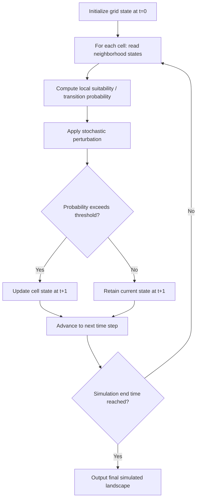

## Cellular Automata and Agent-Based Models

### Overview

Cellular Automata (CA) and Agent-Based Models (ABM) are two complementary bottom-up simulation paradigms used in geospatial and environmental science to model spatially explicit dynamic systems — urban growth, land use change, wildfire spread, epidemic diffusion, and ecological population dynamics. Both approaches generate emergent, system-level patterns from simple local rules, rather than imposing top-down aggregate equations, distinguishing them from traditional statistical or equation-based spatial models.

### Cellular Automata (CA)

**Core Definition**

A CA consists of a regular grid of cells, each in one of a finite set of states, that updates synchronously over discrete time steps according to a transition rule dependent on the states of neighboring cells.

$$S_{i,j}^{t+1} = f\left(S_{i,j}^{t}, N_{i,j}^{t}\right)$$

where $S_{i,j}^{t}$ is the state of cell $(i,j)$ at time $t$, $N_{i,j}^{t}$ is the set of neighboring cell states, and $f$ is the transition function.

**Neighborhood Definitions**

- **Von Neumann neighborhood**: the 4 orthogonally adjacent cells (N, S, E, W).
- **Moore neighborhood**: the 8 surrounding cells, including diagonals — the most common choice in land-use and urban CA models.
- **Extended/weighted neighborhoods**: larger radii with distance-decay weighting, used to represent longer-range influence (e.g., regional accessibility effects on urban growth).

**Classic CA Behavior Classes** (Wolfram's classification, originally for 1D CA, commonly referenced in spatial CA literature)

1. Homogeneous/fixed-point behavior
2. Periodic/stable structures
3. Chaotic behavior
4. Complex, locally-structured behavior capable of computation-like emergent patterns

**Common Geospatial Applications**

- **Urban growth modeling**: SLEUTH model (Slope, Land use, Exclusion, Urban, Transportation, Hillshade) — a widely cited CA-based urban expansion model using five growth rules (spontaneous, diffusive, organic, road-influenced, spread) calibrated via brute-force parameter search against historical urban extent data.
- **Land use/land cover change (LUCC)**: transition rules often derived from logistic regression or Markov transition probabilities combined with neighborhood suitability, forming hybrid CA-Markov models.
- **Wildfire spread simulation**: cell states represent fuel/burn status, transition probability driven by fuel load, wind direction, slope, and moisture.
- **Epidemic/disease diffusion**: SIR-type compartmental states (Susceptible-Infected-Recovered) mapped onto a spatial grid with neighborhood-based transmission probability.

### Agent-Based Models (ABM)

**Core Definition**

ABM simulates autonomous, heterogeneous agents (individuals, households, organisms, vehicles) that perceive their local environment, follow internal decision rules or behavioral heuristics, and interact with both the environment and other agents, generating emergent macro-level patterns from micro-level decisions.

**Key Components**

- **Agents**: discrete entities with internal state variables (e.g., income, preferences, energy level, age) and behavioral rules.
- **Environment**: often a spatial substrate (grid, network, or continuous space) that agents inhabit and modify.
- **Interaction rules**: govern agent-agent and agent-environment interactions (e.g., competition for resources, information sharing, movement decisions).
- **Scheduler**: controls the order and synchrony of agent updates (synchronous vs. asynchronous, random vs. fixed order — this materially affects simulation outcomes and is a common source of replication difficulty).

**Common Geospatial Applications**

- **Residential location choice and urban segregation**: descendants of the classic Schelling segregation model, extended with GIS-based realistic environments.
- **Pedestrian and evacuation modeling**: agents navigate physical space avoiding obstacles and other agents, often using social force models for movement dynamics.
- **Land management and farmer decision-making**: agents represent landholders making crop choice or land conversion decisions based on economic and environmental feedback.
- **Ecological and wildlife movement modeling**: agents represent individual animals with movement rules informed by habitat suitability, resource availability, and predator-prey interactions.
- **Transportation and traffic simulation**: agents represent individual vehicles or travelers with route choice and behavioral adaptation.

### CA vs. ABM: Key Distinctions

| Aspect | Cellular Automata | Agent-Based Models |
| --- | --- | --- |
| Spatial unit | Fixed grid cells | Mobile, discrete agents |
| State location | Attached to space (cell) | Attached to entity (agent) |
| Movement | Cells are static; states propagate | Agents actively move through space |
| Heterogeneity | Typically homogeneous rule set | Agents can have distinct individual rules/attributes |
| Typical use | Land cover/land use transition, diffusion processes | Individual decision-making, mobility, social interaction |

**[Inference]** In practice, many contemporary land-use change models are hybrid CA-ABM systems — a CA layer represents land parcels transitioning between states while ABM agents (households, developers, farmers) drive the transition probabilities through their decisions, since this combination is a commonly documented modeling strategy for capturing both physical land-state change and behavioral drivers, though the specific architecture varies across research implementations.

### Model Calibration and Validation

**Calibration approaches**:

- Brute-force parameter search (as in SLEUTH) across a discretized parameter space, scored against historical observed change.
- Genetic algorithms and simulated annealing for higher-dimensional ABM parameter spaces.
- Machine learning-derived transition potential surfaces (e.g., logistic regression, random forest) feeding into CA transition rules.

**Validation metrics**:

- **Kappa statistic / Kappa-simulation**: measures agreement between simulated and observed change maps, correcting for chance agreement.
- **Figure of Merit (FoM)**: ratio of correctly predicted change to the union of observed and simulated change, specifically designed to avoid the inflated accuracy scores common when using overall percent-correct on land-use change maps (where "no change" dominates and inflates naive accuracy).
- **Pattern metrics** (from landscape ecology, e.g., FRAGSTATS indices): patch density, edge density, and contagion index comparisons between simulated and observed landscape patterns.

$$\text{FoM} = \frac{\text{Hits}}{\text{Hits} + \text{Misses} + \text{False Alarms}}$$

### Practical Example: Simplified Urban Growth CA

**Example**

A basic CA urban growth transition rule for a cell to convert from non-urban to urban:

1. Define state: $S_{i,j} \in \{0 = \text{non-urban}, 1 = \text{urban}\}$.
2. Compute neighborhood urban density: $D_{i,j} = \frac{\text{count of urban cells in Moore neighborhood}}{8}$.
3. Compute a suitability score combining slope, distance to road, and distance to existing urban center:

$$P_{i,j} = w_1(1 - \text{slope}_{i,j}) + w_2(1 - d_{road,i,j}) + w_3 D_{i,j}$$

4. Apply stochastic perturbation (common in CA urban models to avoid overly deterministic, unrealistically smooth growth patterns):

$$P_{i,j}' = P_{i,j} \times \left[1 + (-\ln(\text{rand}))^{\alpha}\right]$$

5. If $P_{i,j}'$ exceeds a threshold, transition the cell to urban ($S_{i,j}^{t+1} = 1$).
6. Repeat across all cells for each time step, then advance to $t+1$.

### Visualizing CA Neighborhood Types

<svg xmlns="http://www.w3.org/2000/svg" viewBox="0 0 640 260" font-family="sans-serif">
<text x="320" y="20" text-anchor="middle" font-size="14" font-weight="bold">Von Neumann vs Moore Neighborhoods (svg_diagram)</text>

<text x="150" y="45" text-anchor="middle" font-size="11">Von Neumann (4-cell)</text>

<g transform="translate(60,60)">

<rect x="60" y="0" width="60" height="60" fill="`#dbeafe`" stroke="`#2563eb`" />

<rect x="0" y="60" width="60" height="60" fill="`#dbeafe`" stroke="`#2563eb`" />

<rect x="60" y="60" width="60" height="60" fill="`#1e3a8a`" stroke="`#2563eb`" />

<rect x="120" y="60" width="60" height="60" fill="`#dbeafe`" stroke="`#2563eb`" />

<rect x="60" y="120" width="60" height="60" fill="`#dbeafe`" stroke="`#2563eb`" />

<text x="90" y="95" text-anchor="middle" font-size="10" fill="white">center</text>

</g>

<text x="480" y="45" text-anchor="middle" font-size="11">Moore (8-cell)</text>

<g transform="translate(390,60)">

<rect x="0" y="0" width="60" height="60" fill="`#fecaca`" stroke="`#dc2626`" />

<rect x="60" y="0" width="60" height="60" fill="`#fecaca`" stroke="`#dc2626`" />

<rect x="120" y="0" width="60" height="60" fill="`#fecaca`" stroke="`#dc2626`" />

<rect x="0" y="60" width="60" height="60" fill="`#fecaca`" stroke="`#dc2626`" />

<rect x="60" y="60" width="60" height="60" fill="`#7f1d1d`" stroke="`#dc2626`" />

<rect x="120" y="60" width="60" height="60" fill="`#fecaca`" stroke="`#dc2626`" />

<rect x="0" y="120" width="60" height="60" fill="`#fecaca`" stroke="`#dc2626`" />

<rect x="60" y="120" width="60" height="60" fill="`#fecaca`" stroke="`#dc2626`" />

<rect x="120" y="120" width="60" height="60" fill="`#fecaca`" stroke="`#dc2626`" />

<text x="90" y="95" text-anchor="middle" font-size="10" fill="white">center</text>

</g>

</svg>

### Software and Tools

**NetLogo** — widely used ABM/CA platform with a built-in spatial (patch-and-turtle) architecture; strong for teaching, rapid prototyping, and coupling agents with grid-based patches natively.

**Repast Simphony / Repast HPC** — Java/C++-based ABM frameworks supporting GIS data integration and large-scale, high-performance simulations.

**Mesa** (Python) — a modern, lightweight ABM framework with grid, network, and continuous-space environments; integrates with `geomesa`/`mesa-geo` extensions for georeferenced agent environments.

**GAMA Platform** — GIS-native ABM/CA modeling platform designed explicitly for spatial simulation, supporting shapefile/GIS data import directly into the modeling environment.

**SLEUTH** — the canonical open-source CA urban growth model, still referenced as a baseline in urban CA literature.

**[Unverified]** Specific performance characteristics, current supported GIS data formats, and version-specific feature sets for these platforms should be confirmed against their current documentation, as ABM/CA software evolves independently of this reference.

### Common Pitfalls

- Treating CA transition rules as purely deterministic, producing artificially smooth, unrealistic growth patterns not seen in observed urban systems.
- Using synchronous updating without considering that asynchronous or random-order updating can produce materially different emergent patterns in some ABM formulations.
- Overfitting calibration parameters to a single historical time period, weakening predictive validity for future scenarios.
- Ignoring boundary effects at the edge of the study area grid, where neighborhood calculations are incomplete.
- Conflating high visual pattern similarity with genuine behavioral/mechanistic validity — pattern-matching validation (e.g., Kappa, FoM) does not guarantee the underlying decision rules are behaviorally realistic.

### Key Points

- CA operates on fixed spatial cells with locally-determined transition rules; ABM operates on mobile, heterogeneous agents with individual decision rules.
- Both are bottom-up, emergence-based paradigms contrasting with top-down equation-driven spatial models.
- Hybrid CA-ABM architectures are common in land-use change modeling, combining land-state transitions with behavioral agent decisions.
- Figure of Merit is generally preferred over simple percent-correct for land-use change validation because of the "no-change" class imbalance problem.
- Calibration methods range from brute-force search (SLEUTH) to machine-learning-derived transition potentials.

**Related Topics**

- Markov Chain Land Use Transition Modeling
- SLEUTH Urban Growth Model Architecture
- Schelling Segregation Model and Extensions
- Landscape Pattern Metrics (FRAGSTATS)
- Geosimulation and Complex Systems Theory
- Spatial Microsimulation
- Coupling ABM with GIS Data Pipelines
- Scenario-Based Land Use Change Forecasting