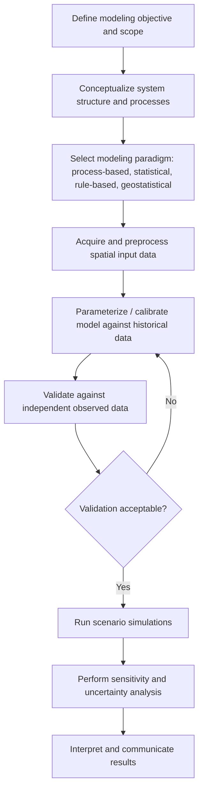

## Spatial Simulation Modeling

### Overview

Spatial simulation modeling encompasses the broad family of computational techniques used to represent, predict, and explore the evolution of geographically distributed systems over time. It sits at the intersection of geostatistics, systems dynamics, and geocomputation, providing a framework for generating plausible spatial-temporal realizations of phenomena ranging from land use change and hydrological flow to disease spread and climate impact scenarios. Unlike static spatial analysis, simulation modeling explicitly incorporates process, time, and often stochasticity, enabling "what-if" scenario testing that purely descriptive spatial analysis cannot provide.

### Taxonomy of Spatial Simulation Approaches

**1. Process-Based (Mechanistic) Models**

Grounded in physical, chemical, or ecological laws governing the phenomenon — e.g., hydrological models solving flow equations, atmospheric dispersion models solving advection-diffusion equations. These require well-characterized parameters and tend to be more transferable across regions but computationally intensive.

**2. Empirical/Statistical Simulation Models**

Derived from statistical relationships fitted to historical data (e.g., regression-based land conversion probabilities, Markov transition matrices) rather than first-principles physics. Faster to build and calibrate but less generalizable outside the conditions of the training data.

**3. Rule-Based / Individual-Based Models**

Includes Cellular Automata and Agent-Based Models (covered separately), where system-level behavior emerges from simple local rules rather than being specified directly at the aggregate level.

**4. Geostatistical Simulation**

Stochastic simulation of continuous spatial fields (e.g., Sequential Gaussian Simulation, Sequential Indicator Simulation) that generate multiple equiprobable realizations of a spatial variable conditioned on sample data and a variogram model, primarily used for uncertainty quantification rather than temporal process modeling.

**5. Network-Based Simulation**

Models flow, diffusion, or movement across a graph/network structure (transportation networks, social networks, river networks), often used for traffic simulation, epidemic spread along contact networks, or watershed routing.

**6. Hybrid/Coupled Models**

Combine multiple paradigms — for example, a hydrological process model coupled with an agent-based model of farmer irrigation decisions, or a CA land-use model coupled with a climate-driven crop suitability model.

### Core Modeling Workflow

### Model Structure Components

**State Variables**

The spatially distributed quantities being tracked over time (e.g., land cover class, population density, pollutant concentration, water table depth).

**Process Equations / Transition Rules**

The mechanism by which state variables change — differential equations for process-based models, transition probability matrices for statistical models, or local rules for CA/ABM.

**Spatial Discretization**

The representation of space — regular raster grid, irregular triangulated mesh (common in hydrological/hydrodynamic models), vector-based zones, or network graph — chosen based on the phenomenon's natural spatial structure and computational tractability tradeoffs.

**Temporal Discretization**

Time step selection, which must satisfy stability constraints for process-based numerical models. For explicit finite-difference schemes solving diffusion-type equations, the Courant-Friedrichs-Lewy (CFL) condition constrains the maximum stable time step relative to spatial resolution and process speed:

$$\Delta t \leq \frac{(\Delta x)^2}{2D}$$

where $\Delta x$ is grid spacing and $D$ is the diffusion coefficient (this specific form applies to explicit 1D diffusion schemes; exact stability bounds vary by numerical scheme and equation type).

**Boundary and Initial Conditions**

Specification of the system state at $t = 0$ and behavior at the edges of the study domain (e.g., no-flow boundaries, open boundaries, periodic boundaries).

### Key Techniques by Domain

**Hydrological Simulation**

- Distributed models (e.g., SWAT, MIKE SHE) discretize a watershed into sub-basins or grid cells, routing water through the landscape based on terrain, soil, and land cover.
- Governing physics often includes the Saint-Venant equations for channel flow and Richards' equation for unsaturated subsurface flow.

**Land Use / Land Cover Change Simulation**

- Combines transition potential modeling (statistical or ML-derived suitability surfaces) with CA-based spatial allocation, often within Markov-chain-constrained overall quantity projections (CA-Markov hybrid approach).

**Epidemiological Spatial Simulation**

- Compartmental SIR/SEIR models extended with spatial structure via metapopulation patches (discrete regions with internal mixing and between-patch movement) or fully spatially explicit network/agent-based contact models.

**Climate and Environmental Impact Simulation**

- Downscaling of coarse Global/Regional Climate Model (GCM/RCM) outputs to finer spatial resolution using statistical downscaling or dynamical downscaling, feeding into local-scale impact models (crop yield, flood risk, habitat suitability).

**Wildfire and Natural Hazard Simulation**

- Cost-distance and CA-based fire spread models incorporating fuel type, wind, slope, and moisture (e.g., FARSITE, FlamMap architecture patterns), often run as stochastic ensembles to produce burn probability maps rather than single deterministic fire perimeters.

### Calibration and Sensitivity Analysis

**Parameter Calibration Methods**

- Manual/expert-based adjustment against known benchmarks.
- Automated optimization (genetic algorithms, simulated annealing, particle swarm optimization) minimizing an objective/loss function comparing simulated vs. observed outcomes.
- Bayesian calibration, producing posterior parameter distributions rather than single point estimates, inherently propagating parameter uncertainty into simulation outputs.

**Sensitivity Analysis Approaches**

- **Local (One-at-a-Time, OAT)**: varying one parameter while holding others fixed — computationally cheap but can miss interaction effects between parameters.
- **Global (Variance-based, e.g., Sobol indices)**: apportions output variance to individual parameters and their interactions across the full parameter space simultaneously.

$$S_i = \frac{\text{Var}_{X_i}\left(E_{X_{\sim i}}(Y \mid X_i)\right)}{\text{Var}(Y)}$$

where $S_i$ is the first-order Sobol sensitivity index for parameter $X_i$, indicating the fraction of output variance $Y$ attributable to that parameter alone.

### Validation Approaches

- **Split-sample validation**: calibrating on one time period, validating against an independent, later time period.
- **Spatial pattern comparison**: using landscape metrics (patch density, edge density) or Figure of Merit for change-detection-style validation.
- **Cross-model comparison / ensemble validation**: comparing outputs across multiple independently developed models of the same system (common in climate impact modeling) to characterize structural/model uncertainty.

### Practical Example: Coupled Land Use – Hydrology Simulation

**Example**

A regional water yield impact assessment under urban expansion scenarios:

1. Calibrate a CA-based urban growth model against historical urban extent (1990–2020) using road accessibility, slope, and neighborhood urban density as suitability drivers.
2. Project future urban extent to 2050 under two scenarios: business-as-usual growth rate and accelerated growth rate.
3. Reclassify projected land cover into hydrological model input parameters (curve number, impervious fraction).
4. Run a distributed hydrological model (e.g., SWAT-like architecture) for both scenarios using identical climate forcing data, isolating the land-use-driven hydrological signal.
5. Compare simulated peak runoff and water yield between scenarios to quantify urbanization's marginal hydrological impact.
6. Conduct sensitivity analysis on curve number assumptions to bound the uncertainty in the hydrological response estimate.

### Visualizing Simulation Model Coupling

<svg xmlns="http://www.w3.org/2000/svg" viewBox="0 0 640 300" font-family="sans-serif">
<text x="320" y="20" text-anchor="middle" font-size="14" font-weight="bold">Coupled Spatial Simulation Architecture (svg_diagram)</text>
<rect x="20" y="60" width="160" height="70" rx="6" fill="#dbeafe" stroke="#2563eb" />
<text x="100" y="88" text-anchor="middle" font-size="11">Land Use Change Model</text>
<text x="100" y="105" text-anchor="middle" font-size="10">(CA / ABM)</text>
<rect x="240" y="60" width="160" height="70" rx="6" fill="#fef3c7" stroke="#d97706" />
<text x="320" y="88" text-anchor="middle" font-size="11">Land Cover Reclassification</text>
<text x="320" y="105" text-anchor="middle" font-size="10">Curve number / impervious %</text>
<rect x="460" y="60" width="160" height="70" rx="6" fill="#dcfce7" stroke="#16a34a" />
<text x="540" y="88" text-anchor="middle" font-size="11">Hydrological Model</text>
<text x="540" y="105" text-anchor="middle" font-size="10">Runoff / water yield</text>
<line x1="180" y1="95" x2="240" y2="95" stroke="#374151" stroke-width="1.5" marker-end="url(#arrow2)" />
<line x1="400" y1="95" x2="460" y2="95" stroke="#374151" stroke-width="1.5" marker-end="url(#arrow2)" />
<rect x="240" y="180" width="160" height="60" rx="6" fill="#fee2e2" stroke="#dc2626" />
<text x="320" y="205" text-anchor="middle" font-size="11">Sensitivity Analysis</text>
<text x="320" y="220" text-anchor="middle" font-size="10">Sobol / OAT on parameters</text>
<line x1="540" y1="130" x2="320" y2="180" stroke="#374151" stroke-width="1.5" marker-end="url(#arrow2)" />
</svg>

### Software and Tools

**PCRaster** — a dedicated environmental spatial modeling language purpose-built for dynamic, process-based spatial simulation with native support for iterative time-stepped raster operations.

**SWAT (Soil and Water Assessment Tool)** — widely used distributed hydrological simulation model for watershed-scale water and pollutant modeling.

**Dinamica EGO** — a platform combining CA, Markov chains, and ABM specifically for land use change scenario simulation.

**NetLogo, Repast, Mesa, GAMA** — ABM/CA platforms (see Cellular Automata and Agent-Based Models topic for detail).

**R packages**: `gstat` (geostatistical simulation), `deSolve` (differential equation solvers usable in spatial contexts), `raster`/`terra` combined with custom iterative loops for time-stepped raster simulation.

**Python**: `landlab` (a component-based framework for earth-surface process modeling, notably geomorphology and hydrology), `mesa-geo`, custom `numpy`/`xarray`-based iterative simulation loops.

**[Unverified]** Current feature sets, licensing terms, and version-specific capabilities of PCRaster, SWAT, and Dinamica EGO should be confirmed against their official documentation, as these are actively maintained research/applied tools subject to ongoing updates.

### Common Pitfalls

- Equifinality: different parameter combinations or even different model structures can produce similarly good fits to calibration data, meaning a well-calibrated model is not necessarily uniquely correct or mechanistically valid.
- Overconfidence in single deterministic runs — presenting one simulation output without an ensemble or uncertainty bound overstates certainty about future outcomes.
- Spatial and temporal resolution mismatches between coupled sub-models (e.g., feeding coarse climate model output directly into a fine-resolution hydrological model without appropriate downscaling).
- Validation exclusively on the calibration period/region, without independent out-of-sample testing, overstates transferability.

### Key Points

- Spatial simulation modeling spans process-based, statistical, rule-based, geostatistical, and hybrid paradigms, each suited to different data availability and phenomenon types.
- Calibration and validation should generally use independent time periods or regions to avoid overstating model performance.
- Global sensitivity methods (e.g., Sobol indices) capture parameter interaction effects that local OAT methods can miss.
- Equifinality means good calibration fit does not guarantee correct underlying model structure or mechanism.
- Coupled/hybrid models (e.g., land use change feeding into hydrological models) are increasingly standard for cross-domain environmental impact assessment.

**Related Topics**

- Hydrological Modeling (SWAT, MIKE SHE Architecture)
- Markov Chain and CA-Markov Land Use Modeling
- Bayesian Calibration and Uncertainty Quantification
- Sobol Sensitivity Analysis and Global Sensitivity Methods
- Climate Model Downscaling Techniques
- Coupled Human-Environment Systems Modeling
- Equifinality and Model Structural Uncertainty
- Scenario Planning in Environmental Policy Analysis