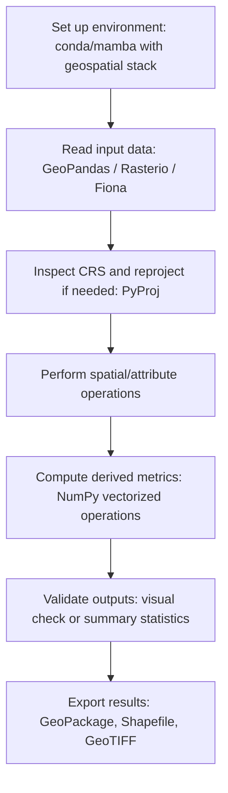

## Python Fundamentals for Geospatial Workflows


### Overview

Python has become the dominant scripting and automation language in geospatial analysis due to its extensive ecosystem of open-source libraries, readable syntax, and strong interoperability with both proprietary GIS platforms (ArcGIS's `arcpy`) and open-source stacks (GDAL/OGR-based tools). Establishing solid Python fundamentals — data structures, control flow, environment management, and core library patterns — is a prerequisite for effective geospatial scripting, automation, and reproducible analysis.

### Core Language Fundamentals Relevant to GIS Scripting

**Data Types and Structures**

- **Lists**: ordered, mutable sequences — commonly used to store collections of coordinates, feature IDs, or file paths.

```python
coordinates = [(-122.42, 37.77), (-122.41, 37.78), (-122.43, 37.76)]
```

- **Tuples**: immutable ordered sequences — frequently used for fixed coordinate pairs `(x, y)` or `(x, y, z)`, and as dictionary keys when hashable.
- **Dictionaries**: key-value mappings — ideal for representing attribute tables, feature properties, or GeoJSON-like structures.

```python
feature_properties = {"name": "Station A", "elevation_m": 152.3, "type": "monitoring"}
```

- **Sets**: unordered collections of unique elements — useful for deduplicating feature IDs or comparing attribute categories.

**Control Flow**

Loops and conditionals underpin batch processing of spatial datasets:

```python
for feature in features:
    if feature["elevation_m"] > 1000:
        high_elevation_sites.append(feature["name"])
```

List comprehensions offer a concise, Pythonic alternative frequently used in geospatial scripts for filtering or transforming feature collections:

```python
high_elevation_sites = [f["name"] for f in features if f["elevation_m"] > 1000]
```

**Functions and Modularity**

Encapsulating repeated geospatial operations (e.g., reprojecting a layer, computing a buffer) into functions promotes reusability and testability:

```python
def reproject_coordinates(x, y, transformer):
    return transformer.transform(x, y)
```

**Exception Handling**

Critical in geospatial workflows because file I/O, network requests (for web services/APIs), and CRS transformations are common failure points:

```python
try:
    dataset = open_raster(file_path)
except FileNotFoundError:
    print(f"Raster not found: {file_path}")
except Exception as e:
    print(f"Unexpected error: {e}")
```

### Essential Geospatial Python Libraries

**GDAL/OGR (via `osgeo` bindings)**

The foundational low-level library underlying most Python geospatial tools, providing raster (GDAL) and vector (OGR) read/write, reprojection, and format conversion capabilities across dozens of file formats.

**Shapely**

Provides planar geometric object representation and operations (Point, LineString, Polygon, MultiPolygon) implementing the OGC Simple Features specification, used for geometric predicates and operations (intersects, buffer, union, centroid) independent of any specific file format or CRS handling.

```python
from shapely.geometry import Point, Polygon
point = Point(-122.42, 37.77)
polygon = Polygon([(-122.5, 37.7), (-122.5, 37.8), (-122.3, 37.8), (-122.3, 37.7)])
print(polygon.contains(point))
```

**Fiona**

A lightweight, Pythonic wrapper around OGR for reading and writing vector data formats (Shapefile, GeoJSON, GeoPackage), commonly paired with Shapely for geometry manipulation.

**GeoPandas**

Extends the pandas DataFrame with a `geometry` column, enabling tabular attribute operations combined with spatial operations (spatial joins, dissolve, overlay) within a single, familiar DataFrame API — the most widely used high-level vector geospatial library in the Python ecosystem.

```python
import geopandas as gpd
gdf = gpd.read_file("study_area.shp")
gdf_reprojected = gdf.to_crs(epsg=32633)
gdf["area_km2"] = gdf_reprojected.geometry.area / 1_000_000
```

**Rasterio**

The standard library for raster I/O and array-based raster manipulation, built on GDAL but exposing a more Pythonic, NumPy-array-centric interface.

```python
import rasterio
with rasterio.open("dem.tif") as src:
    elevation = src.read(1)
    transform = src.transform
    crs = src.crs
```

**PyProj**

Handles coordinate reference system definitions and transformations, wrapping the PROJ library.

```python
from pyproj import Transformer
transformer = Transformer.from_crs("EPSG:4326", "EPSG:32633", always_xy=True)
x, y = transformer.transform(-122.42, 37.77)
```

**NumPy**

Underlies virtually all raster array computation in the geospatial Python stack — raster bands are typically represented as NumPy arrays, enabling vectorized map algebra without explicit pixel-by-pixel loops.

```python
ndvi = (nir_band.astype(float) - red_band.astype(float)) / (nir_band + red_band)
```

**Xarray (with rioxarray extension)**

Provides labeled, multi-dimensional array structures well-suited to time-series raster stacks (e.g., multi-temporal satellite imagery, climate model output), with `rioxarray` adding CRS-aware geospatial operations on top of xarray's native dimensional indexing.

### Environment and Dependency Management

Geospatial Python libraries often have complex, version-sensitive binary dependencies (notably GDAL), making environment management a practical necessity rather than an optional best practice.

**Conda/Mamba**

Generally the recommended approach for geospatial Python environments because conda-forge distributes precompiled GDAL and PROJ binaries, avoiding the compilation complexity that can arise with pip-only installs of GDAL bindings.

```bash
conda create -n geo-env python=3.11 geopandas rasterio pyproj -c conda-forge
conda activate geo-env
```

**Virtual environments (venv/pip)**

Viable when packages provide prebuilt wheels for the target platform; more prone to GDAL version-mismatch issues, particularly on Windows.

**[Unverified]** Exact current wheel availability and platform-specific installation friction for GDAL-dependent packages changes over time as packaging infrastructure (e.g., manylinux wheels) evolves, so current documentation should be checked before assuming a particular install method is friction-free on a given platform.

### Practical Example: End-to-End Vector Workflow

**Example**

A typical workflow: load a vector layer, filter by attribute, reproject, compute a derived metric, and export results.

```python
import geopandas as gpd

# Load vector data
parcels = gpd.read_file("parcels.geojson")

# Filter by attribute condition
residential = parcels[parcels["land_use"] == "residential"]

# Reproject to a projected CRS for accurate area calculation
residential_proj = residential.to_crs(epsg=32633)

# Compute area in hectares
residential_proj["area_ha"] = residential_proj.geometry.area / 10_000

# Spatial join with a flood zone layer
flood_zones = gpd.read_file("flood_zones.geojson").to_crs(epsg=32633)
at_risk = gpd.sjoin(residential_proj, flood_zones, how="inner", predicate="intersects")

# Export results
at_risk.to_file("residential_at_risk.gpkg", driver="GPKG")
```

### Practical Example: Basic Raster Workflow

**Example**

Computing and classifying NDVI from a multi-band satellite image:

```python
import rasterio
import numpy as np

with rasterio.open("satellite_image.tif") as src:
    red = src.read(3).astype(float)
    nir = src.read(4).astype(float)
    profile = src.profile

ndvi = np.where((nir + red) == 0, 0, (nir - red) / (nir + red))

# Classify vegetation presence
vegetation_mask = (ndvi > 0.3).astype(rasterio.uint8)

profile.update(dtype=rasterio.uint8, count=1)
with rasterio.open("vegetation_mask.tif", "w", **profile) as dst:
    dst.write(vegetation_mask, 1)
```

### Typical Geospatial Python Workflow



### Visualizing the Geospatial Python Stack

<svg xmlns="http://www.w3.org/2000/svg" viewBox="0 0 640 300" font-family="sans-serif">
<text x="320" y="20" text-anchor="middle" font-size="14" font-weight="bold">Geospatial Python Library Stack (svg_diagram)</text>
<rect x="220" y="240" width="200" height="40" rx="6" fill="#1e3a8a" stroke="#1e3a8a" />
<text x="320" y="265" text-anchor="middle" font-size="12" fill="white">GDAL / OGR / PROJ (C libraries)</text>
<rect x="60" y="170" width="140" height="40" rx="6" fill="#2563eb" stroke="#1e40af" />
<text x="130" y="195" text-anchor="middle" font-size="11" fill="white">Fiona</text>
<rect x="250" y="170" width="140" height="40" rx="6" fill="#2563eb" stroke="#1e40af" />
<text x="320" y="195" text-anchor="middle" font-size="11" fill="white">Rasterio</text>
<rect x="440" y="170" width="140" height="40" rx="6" fill="#2563eb" stroke="#1e40af" />
<text x="510" y="195" text-anchor="middle" font-size="11" fill="white">PyProj</text>
<rect x="60" y="90" width="240" height="40" rx="6" fill="#16a34a" stroke="#15803d" />
<text x="180" y="115" text-anchor="middle" font-size="11" fill="white">GeoPandas (+ Shapely)</text>
<rect x="320" y="90" width="260" height="40" rx="6" fill="#16a34a" stroke="#15803d" />
<text x="450" y="115" text-anchor="middle" font-size="11" fill="white">Xarray + rioxarray</text>
<line x1="130" y1="170" x2="320" y2="280" stroke="#374151" stroke-width="1" />
<line x1="320" y1="170" x2="320" y2="240" stroke="#374151" stroke-width="1" />
<line x1="510" y1="170" x2="320" y2="280" stroke="#374151" stroke-width="1" />
<line x1="180" y1="130" x2="130" y2="170" stroke="#374151" stroke-width="1" />
<line x1="450" y1="130" x2="320" y2="170" stroke="#374151" stroke-width="1" />
</svg>

### Common Pitfalls

- Mixing CRS between layers without reprojecting, causing silent misalignment or incorrect spatial join/overlay results (many libraries do not error — they simply compute against mismatched coordinates).
- Computing area or distance in a geographic (lat/lon) CRS instead of a projected CRS, producing meaningless or grossly distorted values.
- Loading entire large raster datasets fully into memory rather than using windowed reading (`rasterio`'s windowed read/write) for large-scale raster processing.
- Using pip to install GDAL-dependent packages in environments without matching system-level GDAL binaries, causing import errors or version conflicts.
- Iterating row-by-row over GeoDataFrames/DataFrames instead of using vectorized operations, resulting in significant performance degradation on large datasets.

### Key Points

- Python's geospatial ecosystem is layered: low-level C libraries (GDAL/OGR/PROJ) underpin higher-level Pythonic libraries (GeoPandas, Rasterio, PyProj).
- GeoPandas is the standard for vector/tabular spatial analysis; Rasterio is the standard for raster I/O and array-based raster computation.
- Conda/mamba with conda-forge is generally the most reliable environment management approach due to precompiled GDAL binaries.
- CRS awareness (checking, reprojecting, and using projected CRS for area/distance calculations) is a persistent and critical source of workflow errors if neglected.
- Vectorized NumPy/pandas operations should be preferred over explicit Python loops for performance on large spatial datasets.

**Related Topics**

- GeoPandas Spatial Joins and Overlay Operations
- Rasterio Windowed Reading and Raster Algebra
- Coordinate Reference Systems and PyProj Transformations
- Xarray and Multi-Dimensional Raster Time Series
- Automating GIS Workflows with Python Scripting
- Python-Based Web Mapping (Folium, Leafmap)
- Working with Remote Sensing Data in Python (Rasterio, Xarray, STAC APIs)
- Version Control and Reproducibility in Geospatial Python Projects