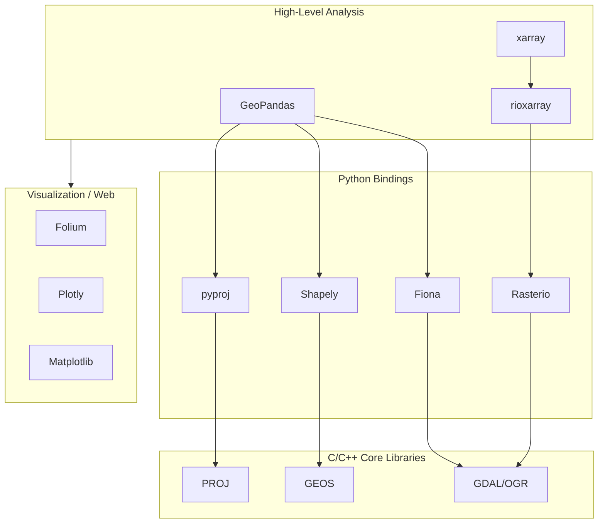
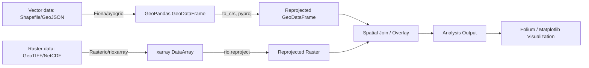

## Core Geospatial Python Libraries


### Overview

The Python geospatial ecosystem is layered: low-level bindings to C/C++ geo libraries (GDAL/OGR, GEOS, PROJ) sit at the foundation, mid-level libraries wrap these into Pythonic APIs (Shapely, Fiona, Rasterio, pyproj), and high-level libraries integrate with the data science stack (GeoPandas, xarray/rioxarray). Understanding this layering clarifies why certain errors occur (e.g., a Shapely error is often really a GEOS error) and why installation order matters.



### Core Library Stack

#### Shapely — Geometric Operations

Shapely provides planar geometric objects and operations, wrapping GEOS. It handles vector geometries (points, lines, polygons) but has no inherent concept of coordinate reference systems (CRS).

**Key Points**

- Core classes: `Point`, `LineString`, `Polygon`, `MultiPoint`, `MultiLineString`, `MultiPolygon`, `GeometryCollection`
- Supports predicates (`intersects`, `contains`, `within`, `touches`, `crosses`, `overlaps`, `disjoint`) and set operations (`union`, `intersection`, `difference`, `symmetric_difference`)
- Shapely 2.0+ is vectorized (NumPy-backed), giving substantial performance gains over 1.x for bulk geometry operations [Unverified: exact speedup is benchmark-dependent]
- All operations are purely planar/Euclidean — no geodesic correction is applied, so area/length calculations on unprojected (lat/lon) data will be numerically wrong for real-world units

**Example**

```python
from shapely.geometry import Point, Polygon
from shapely.ops import unary_union

p1 = Point(120.55, 18.05)  # lon, lat — Ilocos Norte area
poly = Polygon([(120.5, 18.0), (120.6, 18.0), (120.6, 18.1), (120.5, 18.1)])

print(poly.contains(p1))        # True
print(p1.buffer(0.01).area)     # planar area, in degrees^2 — not meaningful as m^2

merged = unary_union([poly, poly.buffer(0.05)])
print(merged.geom_type)         # Polygon
```

`[Inference]` For production area/distance calculations, geometries should be reprojected into an equal-area or equal-distance CRS appropriate to the region before calling `.area` or `.length`, since Shapely will not warn about unit mismatches.

#### Fiona — Vector I/O

Fiona reads and writes vector data formats (Shapefile, GeoJSON, GeoPackage, etc.) via GDAL/OGR, returning geometries as GeoJSON-like Python dicts rather than Shapely objects directly.

**Key Points**

- Primary interface: `fiona.open()` returns a collection object supporting iteration over features
- Each feature is a dict with `geometry` and `properties` keys
- CRS is exposed via `.crs` (as a dict or WKT/PROJ string depending on version)
- GeoPandas uses Fiona (or pyogrio) internally as its default vector I/O engine

**Example**

```python
import fiona

with fiona.open("barangay_boundaries.shp") as src:
    print(src.schema)
    print(src.crs)
    for feature in src:
        print(feature["properties"]["brgy_name"], feature["geometry"]["type"])
```

`[Unverified]` Newer GeoPandas versions default to the `pyogrio` engine instead of Fiona for I/O speed reasons; which engine is active depends on installed packages and GeoPandas version.

#### Rasterio — Raster I/O

Rasterio wraps GDAL for raster (grid-based) data — satellite imagery, DEMs, land cover rasters — exposing NumPy arrays for pixel data alongside georeferencing metadata.

**Key Points**

- `rasterio.open()` returns a dataset with `.read()`, `.width`, `.height`, `.transform` (affine transform), `.crs`, `.bounds`, `.nodata`
- The affine transform maps pixel (row, col) to geographic (x, y) coordinates
- Supports windowed reading for large rasters (avoids loading entire file into memory)
- Reprojection and resampling handled via `rasterio.warp.reproject`

**Example**

```python
import rasterio
from rasterio.plot import show

with rasterio.open("landsat_band4.tif") as src:
    band = src.read(1)               # first band as 2D NumPy array
    print(src.crs, src.transform)
    print(src.bounds)

    # Convert pixel coordinates to geographic coordinates
    x, y = src.transform * (0, 0)    # upper-left corner
```

```python
import rasterio
from rasterio.windows import Window

with rasterio.open("large_raster.tif") as src:
    window = Window(col_off=0, row_off=0, width=512, height=512)
    chunk = src.read(1, window=window)  # reads only 512x512 subset
```

#### pyproj — Coordinate Reference Systems & Transformations

pyproj wraps PROJ, handling CRS definitions and coordinate transformations between reference systems.

**Key Points**

- `CRS` objects can be constructed from EPSG codes, WKT, or PROJ strings: `CRS.from_epsg(4326)`
- `Transformer.from_crs()` creates a reusable transformer object — preferred over per-point `pyproj.transform()` (deprecated pattern) for performance and correctness
- `always_xy=True` should be set explicitly to force (lon, lat)/(x, y) ordering, since PROJ's native axis order historically follows the authority's defined order (which for EPSG:4326 is lat, lon) — a common source of silent bugs

**Example**

```python
from pyproj import Transformer

# WGS84 (EPSG:4326) to Philippine PRS92 / UTM Zone 51N (EPSG:25391 — Luzon zone example)
transformer = Transformer.from_crs("EPSG:4326", "EPSG:25391", always_xy=True)
x, y = transformer.transform(120.5960, 18.1561)  # lon, lat -> easting, northing
print(x, y)
```

`[Unverified]` The exact EPSG code for the correct PRS92/UTM zone should be confirmed against the specific province's zone, since the Philippines spans multiple UTM zones (typically 51N covering most of the archipelago).

#### GeoPandas — Tabular Vector Analysis

GeoPandas extends pandas `DataFrame` with a `GeoSeries`/`geometry` column, integrating Shapely geometries, Fiona/pyogrio I/O, and pyproj CRS handling into a single tabular API.

**Key Points**

- Core object: `GeoDataFrame`, a pandas `DataFrame` with a designated `geometry` column of Shapely objects
- `.crs` attribute tracks the CRS; `.to_crs()` reprojects the entire GeoDataFrame
- Spatial joins via `gpd.sjoin()`; spatial operations (`.buffer()`, `.intersection()`, `.area`) are vectorized across the geometry column
- Plotting via `.plot()` (Matplotlib-backed) for quick visualization
- `.dissolve()` performs group-by with geometric union — common for aggregating features by attribute (e.g., merging barangay polygons into a city boundary)

**Example**

```python
import geopandas as gpd

gdf = gpd.read_file("batac_barangays.geojson")
print(gdf.crs)

gdf_utm = gdf.to_crs(epsg=25391)
gdf_utm["area_sqm"] = gdf_utm.geometry.area

flood_zones = gpd.read_file("flood_hazard.geojson").to_crs(epsg=25391)
result = gpd.sjoin(gdf_utm, flood_zones, how="inner", predicate="intersects")

city_boundary = gdf.dissolve(by="city_name")
```

#### xarray + rioxarray — Multidimensional Raster & Climate Data

xarray provides labeled, multidimensional array structures (`Dataset`, `DataArray`) suited to time-series raster stacks (e.g., NetCDF climate data, multi-band/multi-date satellite imagery). rioxarray adds geospatial extensions (CRS, reprojection, raster I/O) on top, bridging xarray with the GDAL-based Rasterio stack.

**Key Points**

- Dimensions are named (e.g., `time`, `lat`, `lon`, `band`) rather than positional, reducing indexing errors versus raw NumPy
- Commonly used for NetCDF/HDF climate and remote sensing datasets (CHIRPS rainfall, MODIS, ERA5)
- `.rio` accessor (from rioxarray) exposes `.rio.crs`, `.rio.reproject()`, `.rio.clip()`, `.rio.to_raster()`
- Supports lazy loading and chunked computation via Dask for datasets larger than memory

**Example**

```python
import xarray as xr
import rioxarray

ds = xr.open_dataset("chirps_rainfall_2024.nc")
rainfall = ds["precip"]

rainfall_clipped = rainfall.rio.write_crs("EPSG:4326").rio.clip_box(
    minx=120.4, miny=17.9, maxx=120.7, maxy=18.3  # approx Batac City bounds
)

monthly_mean = rainfall.groupby("time.month").mean(dim="time")
```

### Supporting & Visualization Libraries

**Key Points**

- **Folium** — generates Leaflet.js-based interactive HTML maps from Python; commonly used for GeoDataFrame visualization (`gdf.explore()` in GeoPandas wraps Folium)
- **PySAL (Python Spatial Analysis Library)** — spatial statistics, spatial weights matrices, clustering (e.g., `esda` for Moran's I, `libpysal` for spatial weights)
- **Cartopy** — Matplotlib-based cartographic projections for publication-quality static maps
- **movingpandas** — trajectory analysis (GPS tracks) built on GeoPandas
- **pyogrio** — a faster alternative I/O engine (GDAL bindings via C, bypassing Fiona's Python-object overhead) increasingly used as GeoPandas' default reader/writer

### Installation Considerations

**Key Points**

- Binary dependencies (GDAL, GEOS, PROJ) are the primary source of installation friction; `pip install gdal` frequently fails without matching system-level GDAL headers
- `conda`/`mamba` with the `conda-forge` channel is generally recommended over pip for this stack, since it distributes pre-built binaries with matched library versions
- Version mismatches between GDAL, Fiona, and Rasterio's underlying GDAL builds are a common source of `AttributeError` or segfault-type failures — pinning compatible versions matters

```python
# Recommended conda-forge based environment setup
# conda create -n geo python=3.11 -c conda-forge
# conda install -n geo geopandas rasterio rioxarray fiona shapely pyproj folium -c conda-forge
```

### Typical Pipeline Pattern



**Next Steps**

- GDAL/OGR command-line utilities and their relationship to Python bindings
- Coordinate reference systems and projection theory (datums, EPSG registry, geodetic vs projected CRS)
- Vector data formats in depth (Shapefile limitations, GeoPackage, GeoParquet)
- Raster data formats in depth (GeoTIFF internals, Cloud-Optimized GeoTIFF/COG, NetCDF/HDF5)
- Spatial joins and overlay operations
- Spatial statistics and autocorrelation with PySAL
- Working with Dask for out-of-core/distributed geospatial processing
- STAC (SpatioTemporal Asset Catalog) and cloud-native geospatial data access patterns