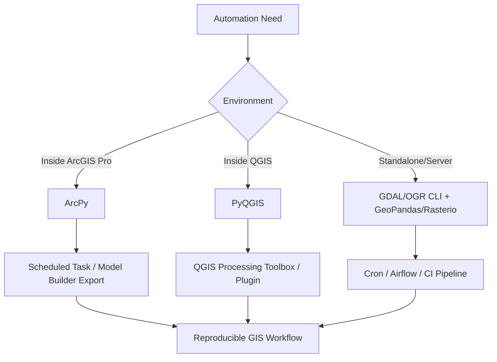

## Automating GIS Workflows with Scripts


### Overview

Automating GIS workflows replaces manual, click-driven operations in desktop GIS software with reproducible scripts — enabling batch processing, scheduled execution, version control, and integration into larger data pipelines. Automation approaches fall into two broad categories: scripting against a desktop GIS's embedded Python API (ArcPy for ArcGIS, PyQGIS for QGIS), and standalone scripting using open-source geospatial libraries independent of any GIS application.



### Automation Paradigms

#### Desktop-Embedded Scripting (ArcPy / PyQGIS)

**Key Points**

- ArcPy is proprietary, bundled with ArcGIS Pro/ArcGIS Desktop, and provides direct access to geoprocessing tools (`arcpy.management`, `arcpy.analysis`, `arcpy.sa` for Spatial Analyst)
- PyQGIS is the Python API embedded in QGIS, accessible via the built-in Python console, the Script Editor, or as standalone QGIS Processing scripts
- Both APIs require the host application's Python environment (or a licensed/linked interpreter) — scripts using `arcpy` will not run in a plain `python` environment without ArcGIS installed and licensed
- `[Unverified]` Exact API surface and licensing requirements vary by ArcGIS/QGIS version; some ArcPy functionality (e.g., Spatial Analyst tools) requires separate extension licenses

**Example — ArcPy batch clip**

```python
import arcpy

arcpy.env.workspace = r"C:\GIS\batac_project"
arcpy.env.overwriteOutput = True

fc_list = arcpy.ListFeatureClasses()
clip_boundary = "city_boundary.shp"

for fc in fc_list:
    out_name = f"clipped_{fc}"
    arcpy.analysis.Clip(fc, clip_boundary, out_name)
    print(f"Clipped: {fc} -> {out_name}")
```

**Example — PyQGIS standalone script**

```python
from qgis.core import (
    QgsApplication, QgsVectorLayer, QgsProject,
    QgsCoordinateReferenceSystem
)

QgsApplication.setPrefixPath("/usr", True)
qgs = QgsApplication([], False)
qgs.initQgis()

layer = QgsVectorLayer("/data/barangays.shp", "barangays", "ogr")
if not layer.isValid():
    print("Layer failed to load")
else:
    layer.setCrs(QgsCoordinateReferenceSystem("EPSG:4326"))
    QgsProject.instance().addMapLayer(layer)

qgs.exitQgis()
```

`[Inference]` PyQGIS standalone scripts (run outside the QGIS GUI) require correctly initializing `QgsApplication` and setting `QGIS_PREFIX_PATH`/`PYTHONPATH` environment variables pointing to the QGIS installation, which is a frequent source of import errors.

#### Standalone Open-Source Scripting

**Key Points**

- Uses GDAL/OGR (command-line or Python bindings), GeoPandas, Rasterio, and Shapely without dependency on a desktop GIS license
- Preferred for server-side automation, CI/CD pipelines, and cloud deployment since it avoids licensing and headless-GUI constraints
- GDAL command-line utilities (`ogr2ogr`, `gdalwarp`, `gdal_translate`, `gdal_calc.py`) are frequently invoked via `subprocess` from Python for operations that are simpler as CLI calls than API calls

**Example — subprocess-driven GDAL automation**

```python
import subprocess
from pathlib import Path

input_dir = Path("raw_rasters")
output_dir = Path("reprojected")
output_dir.mkdir(exist_ok=True)

for tif in input_dir.glob("*.tif"):
    out_path = output_dir / tif.name
    subprocess.run([
        "gdalwarp",
        "-t_srs", "EPSG:32651",   # UTM Zone 51N
        "-r", "bilinear",
        str(tif), str(out_path)
    ], check=True)
    print(f"Reprojected: {tif.name}")
```

**Example — GeoPandas batch processing pipeline**

```python
import geopandas as gpd
from pathlib import Path

def process_shapefile(path, boundary, target_crs="EPSG:32651"):
    gdf = gpd.read_file(path).to_crs(target_crs)
    clipped = gpd.clip(gdf, boundary)
    clipped["area_sqm"] = clipped.geometry.area
    return clipped

boundary = gpd.read_file("city_boundary.shp").to_crs("EPSG:32651")
results = []

for shp in Path("input_layers").glob("*.shp"):
    processed = process_shapefile(shp, boundary)
    processed.to_file(f"output/{shp.stem}_processed.gpkg", driver="GPKG")
    results.append(processed)

merged = gpd.pd.concat(results, ignore_index=True)
```

### Batch Processing Patterns

#### File-Iteration Pattern

The most common automation pattern: iterate over a directory of input files, apply a fixed transformation, write outputs with a naming convention.

```python
from pathlib import Path
import rasterio
from rasterio.enums import Resampling

def resample_raster(src_path, dst_path, scale_factor=0.5):
    with rasterio.open(src_path) as src:
        data = src.read(
            out_shape=(
                src.count,
                int(src.height * scale_factor),
                int(src.width * scale_factor)
            ),
            resampling=Resampling.bilinear
        )
        transform = src.transform * src.transform.scale(
            (src.width / data.shape[-1]),
            (src.height / data.shape[-2])
        )
        profile = src.profile
        profile.update(transform=transform, height=data.shape[-2], width=data.shape[-1])

        with rasterio.open(dst_path, "w", **profile) as dst:
            dst.write(data)

for tif in Path("dem_tiles").glob("*.tif"):
    resample_raster(tif, Path("dem_resampled") / tif.name)
```

#### Error-Resilient Batch Pattern

Production automation should isolate per-file failures so one corrupt input doesn't halt an entire batch job.

```python
import logging
from pathlib import Path

logging.basicConfig(
    filename="gis_pipeline.log",
    level=logging.INFO,
    format="%(asctime)s %(levelname)s %(message)s"
)

def safe_process(path, process_fn):
    try:
        process_fn(path)
        logging.info(f"SUCCESS: {path.name}")
    except Exception as e:
        logging.error(f"FAILED: {path.name} — {e}")

for f in Path("input_data").glob("*.shp"):
    safe_process(f, lambda p: process_shapefile(p, boundary))
```

### Scheduling & Orchestration

**Key Points**

- **Cron (Linux)** / **Task Scheduler (Windows)** — simplest mechanism for time-triggered script execution; suitable for periodic single-script jobs (e.g., nightly rainfall data ingestion)
- **Apache Airflow** — DAG-based orchestration for multi-step pipelines with dependencies, retries, and monitoring; appropriate when a workflow involves multiple ordered stages (download → reproject → analyze → publish)
- **GitHub Actions / GitLab CI** — for automation tied to repository events (e.g., regenerating derived datasets when source data changes in version control)
- Environment reproducibility (via `conda`/`mamba` environment files or Docker containers) is important for automated pipelines since GDAL-stack binary dependencies are sensitive to version drift


### Logging, Validation & Idempotency

**Key Points**

- Scripts should validate inputs (CRS presence, geometry validity via `.is_valid`, expected schema/fields) before processing, since silent failures on malformed geospatial data are common
- Idempotent design (safe to re-run without duplicating or corrupting output) is important for scheduled jobs — typically achieved via overwrite flags, checksums, or output existence checks
- Structured logging (timestamps, per-file status, error tracebacks) is essential for diagnosing failures in unattended scheduled runs

```python
import geopandas as gpd

def validate_geodataframe(gdf):
    issues = []
    if gdf.crs is None:
        issues.append("Missing CRS")
    invalid = gdf[~gdf.geometry.is_valid]
    if len(invalid) > 0:
        issues.append(f"{len(invalid)} invalid geometries")
    if gdf.geometry.isna().any():
        issues.append("Null geometries present")
    return issues

gdf = gpd.read_file("input.geojson")
problems = validate_geodataframe(gdf)
if problems:
    print("Validation issues:", problems)
```

### ArcGIS Model Builder → Python Export

**Key Points**

- ArcGIS Model Builder workflows can be exported directly to Python scripts (`Export > To Python Script`), producing an ArcPy script that replicates the visual model — a common bridge from GUI prototyping to scriptable automation
- Exported scripts typically require manual cleanup (hardcoded paths, variable naming) before being suitable for parameterized batch use

### Practical Pipeline Example: End-to-End Automation

```python
"""
Automated pipeline: ingest raw parcel shapefiles, standardize CRS,
validate geometry, join with assessment data, export to GeoPackage.
"""
import geopandas as gpd
import pandas as pd
import logging
from pathlib import Path

logging.basicConfig(level=logging.INFO)
TARGET_CRS = "EPSG:32651"

def ingest(shp_path):
    gdf = gpd.read_file(shp_path)
    if gdf.crs is None:
        raise ValueError(f"No CRS defined: {shp_path}")
    return gdf.to_crs(TARGET_CRS)

def clean(gdf):
    gdf = gdf[gdf.geometry.is_valid & gdf.geometry.notna()]
    gdf = gdf.drop_duplicates(subset="geometry")
    return gdf

def join_assessment(gdf, assessment_csv):
    df = pd.read_csv(assessment_csv)
    return gdf.merge(df, on="parcel_id", how="left")

def run_pipeline(input_dir, assessment_csv, output_gpkg):
    all_parcels = []
    for shp in Path(input_dir).glob("*.shp"):
        try:
            gdf = ingest(shp)
            gdf = clean(gdf)
            all_parcels.append(gdf)
            logging.info(f"Processed {shp.name}: {len(gdf)} records")
        except Exception as e:
            logging.error(f"Skipped {shp.name}: {e}")

    merged = pd.concat(all_parcels, ignore_index=True)
    final = join_assessment(merged, assessment_csv)
    final.to_file(output_gpkg, driver="GPKG")
    logging.info(f"Pipeline complete: {len(final)} total records written")

run_pipeline("parcel_shapefiles", "assessment_data.csv", "output/parcels_final.gpkg")
```

**Next Steps**

- ArcPy geoprocessing tool categories (management, analysis, spatial analyst, data management)
- PyQGIS Processing framework and custom algorithm/plugin development
- Building GDAL/OGR command chains for raster and vector conversion pipelines
- Apache Airflow DAG design for geospatial ETL
- Containerizing geospatial pipelines with Docker (GDAL binary dependency management)
- Integrating automated GIS scripts with PostGIS as a persistent spatial data store
- CI/CD patterns for geospatial data validation and testing