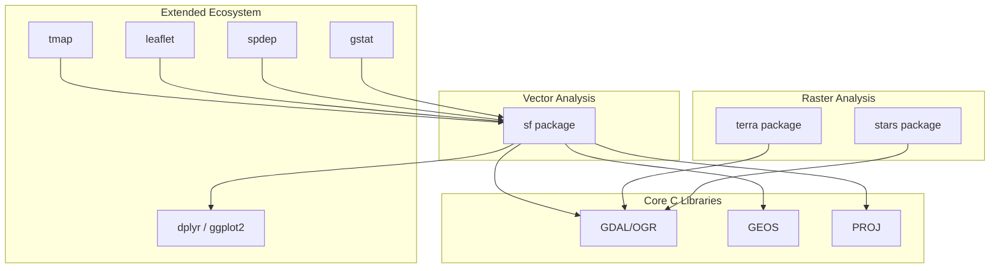

## R for Spatial Data Analysis


### Overview

R's spatial ecosystem has consolidated around the `sf` package (Simple Features), which represents vector data as data frames with a geometry list-column, integrating cleanly with the tidyverse. Raster analysis is handled primarily by `terra` (successor to the now-retired `raster` package), with `stars` available for multidimensional/spatiotemporal raster and array data. Both `sf` and `terra` bind to the same underlying C libraries (GDAL, GEOS, PROJ) as Python's geospatial stack, so CRS and format support are largely equivalent between the two languages.



### sf — Simple Features for Vector Data

#### Core Concepts

**Key Points**

- An `sf` object is a standard R `data.frame`/`tibble` with a special `geometry` column (class `sfc`, a list-column of `sfg` geometry objects)
- Because `sf` objects are data frames, standard R subsetting, `dplyr` verbs (`filter`, `mutate`, `select`, `group_by`/`summarise`), and `ggplot2::geom_sf()` all work directly on them
- Geometry types follow the Simple Features standard (OGC): `POINT`, `LINESTRING`, `POLYGON`, `MULTIPOINT`, `MULTILINESTRING`, `MULTIPOLYGON`, `GEOMETRYCOLLECTION`
- `sf` largely superseded the older `sp` package (which used S4 classes rather than data frames); `[Unverified]` `sp` is still encountered in legacy codebases and some older package dependencies but is considered legacy for new work

**Example**

```r
library(sf)

# Read vector data (Shapefile, GeoJSON, GeoPackage, etc. via GDAL)
barangays <- st_read("batac_barangays.shp")

print(st_crs(barangays))
print(class(barangays))          # "sf" "data.frame"
print(st_geometry_type(barangays)[1])

# dplyr integration
library(dplyr)
coastal_brgy <- barangays %>%
  filter(brgy_type == "coastal") %>%
  mutate(area_sqm = as.numeric(st_area(.)))
```

#### CRS Handling and Reprojection

**Key Points**

- `st_crs()` retrieves/sets CRS; `st_transform()` reprojects (analogous to `to_crs()` in GeoPandas)
- `st_set_crs()` assigns a CRS to data without existing CRS metadata (does not reproject — only labels); `st_transform()` performs the actual mathematical reprojection
- CRS can be specified via EPSG code (`st_transform(x, 32651)`) or WKT/PROJ strings

**Example**

```r
# Philippines: UTM Zone 51N is EPSG:32651 (WGS84) or 25391 (PRS92)
barangays_utm <- st_transform(barangays, crs = 32651)

barangays_utm$area_sqm <- st_area(barangays_utm)  # returns units-tagged values (m^2)
barangays_utm$area_sqm <- as.numeric(barangays_utm$area_sqm)  # strip units class
```

`[Inference]` `st_area()` and similar measurement functions return objects with a `units` class (from the `units` package) rather than plain numerics, which affects downstream arithmetic unless explicitly converted with `as.numeric()` or `units::set_units()`.

#### Geometric Operations and Spatial Joins

**Key Points**

- Predicates: `st_intersects()`, `st_within()`, `st_contains()`, `st_touches()`, `st_disjoint()` — return sparse lists of indices by default, or logical matrices with `sparse = FALSE`
- Operations: `st_buffer()`, `st_union()`, `st_intersection()`, `st_difference()`
- Spatial joins via `st_join()`, analogous to GeoPandas' `sjoin()`
- `st_join()` defaults to `st_intersects` as the join predicate but accepts any predicate function via the `join` argument

**Example**

```r
flood_zones <- st_read("flood_hazard.geojson") %>% st_transform(32651)

# Spatial join: barangays intersecting flood zones
at_risk <- st_join(barangays_utm, flood_zones, join = st_intersects, left = FALSE)

# Dissolve barangays into a single city boundary
city_boundary <- barangays %>%
  summarise(geometry = st_union(geometry))
```

### terra — Raster Analysis

#### Core Concepts

**Key Points**

- `terra` represents raster data as `SpatRaster` objects (single or multi-layer) and vector data as `SpatVector` objects, both implemented in C++ for performance
- `terra` replaced the older `raster` package; `[Unverified]` the `raster` package's CRAN status and maintenance state should be checked directly if encountered in an existing project, as the ecosystem has shifted toward `terra`
- Core functions: `rast()` to load/create rasters, `values()` to access cell values, `crs()`, `res()`, `ext()` for georeferencing metadata
- Raster algebra is vectorized: arithmetic operators and functions applied directly to `SpatRaster` objects operate cell-wise

**Example**

```r
library(terra)

dem <- rast("dem_batac.tif")
print(dem)
print(crs(dem, describe = TRUE))
print(res(dem))          # pixel resolution
print(ext(dem))          # spatial extent

slope <- terrain(dem, v = "slope", unit = "degrees")
aspect <- terrain(dem, v = "aspect", unit = "degrees")

# Raster algebra
dem_reclass <- classify(dem, matrix(c(0, 50, 1, 50, 200, 2, 200, Inf, 3), ncol = 3, byrow = TRUE))
```

#### Raster-Vector Interaction

**Key Points**

- `crop()` clips a raster to a vector/extent bounding box; `mask()` sets cells outside a vector's polygon boundaries to `NA`
- `extract()` retrieves raster values at point locations or summarizes raster values within polygons (analogous to zonal statistics)
- `terra` functions generally accept both `SpatVector` and `sf` objects directly, since `terra` includes conversion handling for `sf` interoperability

**Example**

```r
city_boundary_v <- vect(city_boundary)   # sf -> SpatVector

dem_clipped <- crop(dem, city_boundary_v)
dem_masked <- mask(dem_clipped, city_boundary_v)

# Zonal statistics: mean elevation per barangay
barangays_v <- vect(barangays_utm)
zonal_stats <- extract(dem, barangays_v, fun = mean, na.rm = TRUE)
```

### stars — Spatiotemporal Arrays

**Key Points**

- `stars` handles raster and vector data cubes with arbitrary dimensions (x, y, time, band), suited to NetCDF climate data, satellite time series, and multi-band imagery with a shared temporal dimension
- Provides tighter integration with `sf` for mixed vector-raster workflows than `terra` in some spatiotemporal contexts, though `[Unverified: use-case dependent]` the choice between `terra` and `stars` often comes down to whether the data is fundamentally a simple grid stack (`terra`) or a true multidimensional array with named dimensions (`stars`)

**Example**

```r
library(stars)

rainfall_cube <- read_stars("chirps_rainfall_2024.nc")
print(rainfall_cube)

monthly_mean <- aggregate(rainfall_cube, by = "months", FUN = mean)
```

### Visualization

**Key Points**

- `ggplot2::geom_sf()` — the standard for static, publication-quality maps, integrating directly with `sf` objects and the full `ggplot2` grammar-of-graphics API
- `tmap` — thematic mapping package with a dedicated cartographic API (`tm_shape()`, `tm_fill()`, `tm_borders()`) and both static and interactive (`tmap_mode("view")`) rendering
- `leaflet` — direct bindings to Leaflet.js for interactive web maps, analogous to Python's Folium
- `mapview` — quick interactive exploration of `sf`/`SpatRaster` objects with minimal syntax, commonly used for ad hoc data inspection during analysis

**Example**

```r
library(ggplot2)

ggplot() +
  geom_sf(data = barangays, aes(fill = brgy_type)) +
  geom_sf(data = flood_zones, fill = NA, color = "red", linewidth = 0.8) +
  theme_minimal() +
  labs(title = "Barangay Boundaries and Flood Hazard Zones")
```

```r
library(tmap)
tmap_mode("view")

tm_shape(barangays) +
  tm_polygons(col = "brgy_type", alpha = 0.7) +
  tm_shape(flood_zones) +
  tm_borders(col = "red", lwd = 2)
```

### Spatial Statistics: spdep and gstat

**Key Points**

- **spdep** — spatial weights matrices and spatial autocorrelation statistics (Moran's I, Geary's C, LISA), the R counterpart to Python's PySAL/`esda`
- **gstat** — geostatistics: variogram modeling and kriging interpolation, commonly used for interpolating sparse point observations (e.g., rain gauge readings, soil samples) into continuous surfaces

**Example — Moran's I**

```r
library(spdep)

nb <- poly2nb(barangays_utm, queen = TRUE)
weights <- nb2listw(nb, style = "W")

moran_result <- moran.test(barangays_utm$area_sqm, weights)
print(moran_result)
```

**Example — Kriging interpolation**

```r
library(gstat)
library(sp)  # gstat historically expects sp-class objects for some functions

rain_points_sp <- as(rain_points_sf, "Spatial")  # sf -> sp conversion
variogram_model <- variogram(rainfall_mm ~ 1, rain_points_sp)
fitted_model <- fit.variogram(variogram_model, model = vgm("Sph"))

grid <- st_make_grid(city_boundary, cellsize = 100, what = "centers")
kriged <- krige(rainfall_mm ~ 1, rain_points_sp, as(grid, "Spatial"), model = fitted_model)
```

`[Unverified]` Whether a given `gstat` workflow requires `sp`-class conversion or accepts `sf`/`stars` objects directly depends on the specific function and package version; some `gstat` functionality has migrated toward native `sf`/`stars` support over time.

### R vs Python: Practical Comparison

| Aspect | R (`sf`/`terra`) | Python (GeoPandas/Rasterio) |
| --- | --- | --- |
| Vector data model | Data frame + geometry list-column | Data frame + geometry column |
| Underlying libraries | GDAL, GEOS, PROJ (same) | GDAL, GEOS, PROJ (same) |
| Statistical modeling | Native strength (base R + CRAN stats packages) | Requires `scikit-learn`/`statsmodels` |
| Tidyverse integration | Direct (`dplyr`, `ggplot2`) | N/A (pandas is separate paradigm) |
| Kriging/geostatistics | `gstat`, mature and widely used | `PyKrige`, less commonly the default choice |
| Production/web deployment | Less common | More common (Flask/FastAPI, cloud SDKs) |

`[Inference]` R's spatial stack is frequently favored when a workflow is statistics-heavy (spatial regression, geostatistics, hypothesis testing), while Python is frequently favored when the workflow needs to integrate with broader software engineering pipelines, web services, or deep learning frameworks.

### Practical End-to-End Example

```r
library(sf)
library(terra)
library(dplyr)
library(ggplot2)

# 1. Load and reproject vector data
barangays <- st_read("batac_barangays.shp") %>% st_transform(32651)
flood_zones <- st_read("flood_hazard.geojson") %>% st_transform(32651)

# 2. Load raster elevation data
dem <- rast("dem_batac.tif")
slope <- terrain(dem, v = "slope", unit = "degrees")

# 3. Zonal statistics: mean slope per barangay
barangays_v <- vect(barangays)
slope_stats <- extract(slope, barangays_v, fun = mean, na.rm = TRUE)
barangays$mean_slope <- slope_stats$slope

# 4. Spatial join with flood risk
barangays_risk <- st_join(barangays, flood_zones, join = st_intersects)

# 5. Visualize
ggplot() +
  geom_sf(data = barangays_risk, aes(fill = mean_slope)) +
  scale_fill_viridis_c(name = "Mean Slope (°)") +
  theme_minimal() +
  labs(title = "Mean Slope by Barangay")

# 6. Export result
st_write(barangays_risk, "output/barangay_analysis.gpkg", delete_dsn = TRUE)
```

**Next Steps**

- The `sf` simple features data model and OGC standard geometry types in depth
- `terra` raster algebra, terrain analysis functions, and multi-band raster stacks
- Spatial weights matrices and spatial regression (`spatialreg` package)
- Geostatistics and kriging interpolation methods with `gstat`
- R Markdown/Quarto for reproducible spatial analysis reports
- Interoperability between R and Python geospatial stacks (`reticulate`, shared GDAL/PROJ backends)
- Interactive Shiny applications for spatial data (`leaflet` + `shiny`)