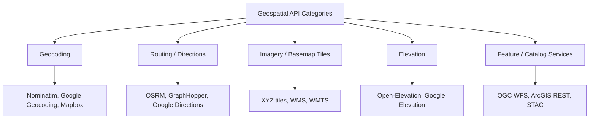
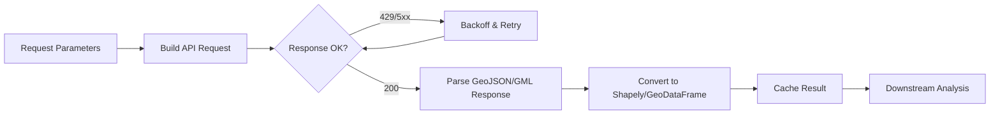

## Working with Geospatial APIs


### Overview

Geospatial APIs expose remote geographic data and services — geocoding, routing, imagery, elevation, and feature datasets — over HTTP, removing the need to store and maintain large datasets locally. Working with them effectively requires understanding common request/response patterns (REST, query parameters, pagination), authentication schemes (API keys, OAuth), rate limiting, and how to parse geospatial response formats (GeoJSON, WKT, vendor-specific schemas) back into standard Python/R geometry objects.



### API Categories

#### Geocoding & Reverse Geocoding

**Key Points**

- Geocoding converts addresses/place names to coordinates; reverse geocoding converts coordinates to addresses
- Common providers: Nominatim (OpenStreetMap-based, free, usage-policy rate-limited), Google Geocoding API (paid, high accuracy), Mapbox Geocoding, HERE
- `geopy` (Python) provides a unified interface across many geocoding providers via a common `Geocoder` abstraction
- Nominatim's usage policy requires a custom `User-Agent` header identifying the application, and restricts request rate (commonly cited as roughly one request per second for the public instance) — self-hosting is recommended for production-volume use `[Unverified: exact current rate limit should be confirmed against Nominatim's current usage policy]`

**Example**

```python
from geopy.geocoders import Nominatim
import time

geolocator = Nominatim(user_agent="batac_dms_geocoder")

location = geolocator.geocode("Batac City, Ilocos Norte, Philippines")
print(location.address, location.latitude, location.longitude)

# Reverse geocoding
reverse = geolocator.reverse((18.0594, 120.5629))
print(reverse.address)

# Respect rate limits on batch geocoding
addresses = ["Batac City Hall", "Mariano Marcos State University", "Paoay Church"]
results = []
for addr in addresses:
    loc = geolocator.geocode(addr)
    results.append(loc)
    time.sleep(1)  # Nominatim usage-policy compliance
```

#### Routing & Directions

**Key Points**

- Returns route geometries, distances, durations, and turn-by-turn instructions between coordinates
- Open-source: OSRM (Open Source Routing Machine), GraphHopper, Valhalla — typically self-hosted or accessed via public demo servers (public demo servers are generally unsuitable for production due to rate limits and no SLA)
- Commercial: Google Directions API, Mapbox Directions API, HERE Routing
- Response geometries commonly use encoded polylines or GeoJSON `LineString` — encoded polylines require a decoding step before use as standard geometry objects

**Example**

```python
import requests
import polyline  # for decoding encoded polyline geometries

# OSRM public demo server (not for production use)
start = "120.5629,18.0594"  # lon,lat
end = "120.5750,18.0700"

url = f"http://router.project-osrm.org/route/v1/driving/{start};{end}"
params = {"overview": "full", "geometries": "geojson"}

response = requests.get(url, params=params)
response.raise_for_status()
data = response.json()

route = data["routes"][0]
print(f"Distance: {route['distance']} m, Duration: {route['duration']} s")

geometry = route["geometry"]  # already GeoJSON since geometries=geojson was requested
```

#### Tile Services (XYZ, WMS, WMTS)

**Key Points**

- **XYZ/Slippy Map tiles** — pre-rendered raster image tiles addressed by `{z}/{x}/{y}` (zoom/column/row); used by most modern web map libraries (Leaflet, Mapbox GL, OpenLayers)
- **WMS (Web Map Service)** — OGC standard; server renders and returns an image for an arbitrary bounding box/CRS/size, requested via query parameters rather than fixed tile addressing
- **WMTS (Web Map Tile Service)** — OGC standard combining tiled delivery (like XYZ) with a formal service specification and capabilities document
- Rate limiting and attribution requirements are common on public tile providers (OpenStreetMap tile usage policy, for instance, restricts bulk/heavy automated use)

**Example — WMS request**

```python
import requests
from io import BytesIO
from PIL import Image

wms_url = "https://example-wms-server.gov/geoserver/wms"
params = {
    "SERVICE": "WMS",
    "VERSION": "1.3.0",
    "REQUEST": "GetMap",
    "LAYERS": "hazard:flood_zones",
    "BBOX": "120.5,18.0,120.7,18.2",
    "CRS": "EPSG:4326",
    "WIDTH": "800",
    "HEIGHT": "600",
    "FORMAT": "image/png"
}

response = requests.get(wms_url, params=params)
img = Image.open(BytesIO(response.content))
```

#### Feature Services (WFS, ArcGIS REST, STAC)

**Key Points**

- **WFS (Web Feature Service)** — OGC standard for querying and retrieving vector features (not just rendered images), typically returning GML or GeoJSON
- **ArcGIS REST Feature Services** — Esri's proprietary but widely deployed API for querying hosted feature layers, commonly used by government/municipal GIS portals
- **STAC (SpatioTemporal Asset Catalog)** — a specification for cataloging and searching satellite/aerial imagery collections (e.g., Sentinel-2, Landsat via services like Microsoft Planetary Computer, AWS Earth Search)

**Example — WFS via GeoPandas (GDAL handles the protocol)**

```python
import geopandas as gpd

wfs_url = (
    "https://example-server.gov/geoserver/wfs?"
    "service=WFS&version=2.0.0&request=GetFeature"
    "&typeName=admin:barangay_boundaries&outputFormat=application/json"
)

gdf = gpd.read_file(wfs_url)
print(gdf.head())
```

**Example — ArcGIS REST Feature Service query**

```python
import requests
import geopandas as gpd

feature_url = "https://services.arcgis.com/example/arcgis/rest/services/Barangays/FeatureServer/0/query"
params = {
    "where": "1=1",
    "outFields": "*",
    "f": "geojson"
}

response = requests.get(feature_url, params=params)
gdf = gpd.GeoDataFrame.from_features(response.json()["features"])
```

**Example — STAC search (via pystac-client)**

```python
from pystac_client import Client

catalog = Client.open("https://earth-search.aws.element84.com/v1")

search = catalog.search(
    collections=["sentinel-2-l2a"],
    bbox=[120.4, 17.9, 120.7, 18.3],  # Batac City area
    datetime="2024-01-01/2024-06-30",
    query={"eo:cloud_cover": {"lt": 20}}
)

items = list(search.items())
print(f"Found {len(items)} scenes")
for item in items[:3]:
    print(item.id, item.datetime, item.properties["eo:cloud_cover"])
```

### Authentication Patterns

**Key Points**

- **API key in query parameter or header** — most common for commercial APIs (Google, Mapbox, HERE); keys should never be hardcoded in committed source code
- **OAuth 2.0** — used by some enterprise/government geospatial platforms; requires token exchange flow before making data requests
- **No authentication** — many public OGC services (WFS/WMS) and OSM-based services are open, but subject to usage-policy rate limits rather than key-based quotas

**Example — environment-variable-based key handling**

```python
import os
import requests

API_KEY = os.environ.get("MAPBOX_API_KEY")
if not API_KEY:
    raise EnvironmentError("MAPBOX_API_KEY not set")

url = "https://api.mapbox.com/geocoding/v5/mapbox.places/Batac City.json"
params = {"access_token": API_KEY, "country": "ph"}

response = requests.get(url, params=params)
response.raise_for_status()
```

### Rate Limiting, Retries, and Resilience

**Key Points**

- Production integrations should implement exponential backoff on `429 Too Many Requests` and `5xx` responses rather than immediate hard failure
- Caching responses (locally or via a cache layer) reduces redundant calls for data that doesn't change frequently (e.g., static administrative boundaries)
- Batch/bulk endpoints, where offered by a provider, are generally preferable to looping single-item requests, since they reduce request count and are less likely to trigger rate limits

**Example — retry with exponential backoff**

```python
import requests
import time

def fetch_with_retry(url, params=None, max_retries=5):
    for attempt in range(max_retries):
        response = requests.get(url, params=params, timeout=10)
        if response.status_code == 200:
            return response.json()
        if response.status_code == 429:
            wait = 2 ** attempt
            time.sleep(wait)
            continue
        response.raise_for_status()
    raise RuntimeError(f"Failed after {max_retries} retries: {url}")
```

### Parsing API Responses into Geometry Objects

**Key Points**

- Most modern geospatial APIs return GeoJSON, which Shapely (`shapely.geometry.shape()`) and GeoPandas (`GeoDataFrame.from_features()`) parse directly
- Legacy or enterprise APIs (older WFS, some ArcGIS services) may return GML or Esri JSON, which require conversion — GDAL/OGR generally handles GML transparently when read via `gpd.read_file()`
- Coordinate order in API responses is a frequent source of bugs: GeoJSON specifies `[longitude, latitude]` order, while some APIs (and casual documentation) present `latitude, longitude` — this must be verified per-API rather than assumed

**Example**

```python
from shapely.geometry import shape
import requests

response = requests.get(url, params=params)
geojson_data = response.json()

for feature in geojson_data["features"]:
    geom = shape(feature["geometry"])  # GeoJSON dict -> Shapely geometry
    print(geom.geom_type, geom.bounds)
```

### Practical Integration Pattern



**Next Steps**

- OGC standards in depth (WMS, WFS, WMTS, WCS specifications and capabilities documents)
- STAC and cloud-native imagery search/access workflows
- Building and self-hosting routing engines (OSRM, Valhalla) for production use
- API authentication patterns: OAuth 2.0 flows for enterprise geospatial platforms
- Designing a local geospatial API response cache (file-based or Redis-backed)
- Rate limit and quota management strategies for multi-provider API integrations
- GeoJSON, TopoJSON, and Esri JSON format differences and conversion