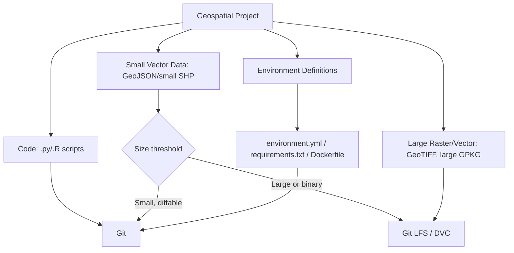
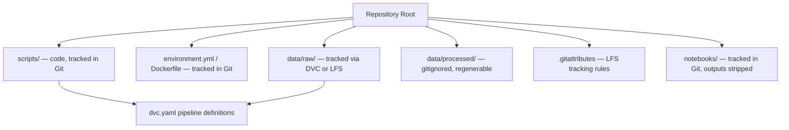

## Version Control for Geospatial Code


### Overview

Version control for geospatial projects presents challenges beyond standard software version control: geospatial data files (Shapefiles, GeoTIFFs, GeoPackages) are frequently large binary formats, and Git's line-based diffing is not meaningful for them. Effective workflows separate concerns — Git for code, configuration, and small vector data; Git LFS or dedicated tools (e.g., DVC) for large binary datasets; and reproducible environment definitions to ensure geospatial library versions (GDAL, PROJ, GEOS) are pinned across collaborators.



### Why Standard Git Handling Falls Short for Geospatial Data

**Key Points**

- Binary geospatial formats (Shapefile's `.shp`/`.dbf`/`.shx`, GeoTIFF, GeoPackage's SQLite-based `.gpkg`) are not human-readable and produce no meaningful line diffs — Git stores them as opaque blobs, and every version is retained in full in repository history
- Repeated commits of large rasters cause repository bloat, since Git does not natively deduplicate or delta-compress binary changes the way it does text
- A Shapefile is technically a multi-file format (`.shp`, `.shx`, `.dbf`, `.prj`, optionally `.cpg`) — all associated files must be tracked together, or the dataset becomes unreadable; `.gitignore` misconfiguration commonly causes partial-shapefile commits
- `[Inference]` GeoJSON and other text-based formats (WKT, CSV with WKT columns) diff reasonably in Git for small-to-moderate datasets, since they are plain text, but large GeoJSON files (many thousands of vertices) produce diffs that are technically line-based but not practically human-reviewable

### Git LFS (Large File Storage) for Geospatial Binaries

**Key Points**

- Git LFS replaces large binary files in the repository with lightweight text pointers, storing actual file content in separate LFS storage — this keeps the core Git repository small while still versioning large files
- Requires `git lfs install` (one-time per machine) and `.gitattributes` configuration specifying which file patterns are tracked via LFS
- Collaborators must have Git LFS installed locally, or checkouts will retrieve pointer files instead of actual data — a common source of confusion for new contributors

**Example — Git LFS setup for a geospatial repository**

```bash
git lfs install

git lfs track "*.tif"
git lfs track "*.tiff"
git lfs track "*.gpkg"
git lfs track "*.shp"
git lfs track "*.shx"
git lfs track "*.dbf"

git add .gitattributes
git commit -m "Configure Git LFS for geospatial binary formats"
```



```
# .gitattributes (result of git lfs track commands)
*.tif filter=lfs diff=lfs merge=lfs -text
*.tiff filter=lfs diff=lfs merge=lfs -text
*.gpkg filter=lfs diff=lfs merge=lfs -text
*.shp filter=lfs diff=lfs merge=lfs -text
*.shx filter=lfs diff=lfs merge=lfs -text
*.dbf filter=lfs diff=lfs merge=lfs -text
```

`[Unverified]` Git LFS storage quotas and bandwidth limits vary by hosting provider (GitHub, GitLab) and plan tier; large raster archives may exceed free-tier LFS quotas, which should be checked against the specific hosting provider's current terms.

### DVC (Data Version Control) as an Alternative

**Key Points**

- DVC is purpose-built for versioning datasets and ML/data pipelines alongside Git, storing data in remote storage (S3, GCS, Azure Blob, local network drives) while Git tracks small metadata files (`.dvc` files) that point to specific data versions
- More suited than Git LFS when a project needs pipeline reproducibility (tracking which script version produced which data version) rather than just binary storage
- `dvc.yaml` defines pipeline stages, allowing `dvc repro` to re-run only the stages affected by upstream changes — relevant for geospatial ETL pipelines with multiple processing steps (download → reproject → clip → analyze)

**Example**

```bash
dvc init
dvc remote add -d storage s3://my-bucket/geospatial-data

dvc add data/raw/landsat_scenes/
git add data/raw/landsat_scenes.dvc .gitignore
git commit -m "Track Landsat scenes with DVC"

dvc push  # uploads actual data to remote storage
```

```yaml
# dvc.yaml — pipeline stage example
stages:
  reproject:
    cmd: python scripts/reproject.py data/raw/dem.tif data/processed/dem_utm.tif
    deps:
      - scripts/reproject.py
      - data/raw/dem.tif
    outs:
      - data/processed/dem_utm.tif
```

### Diff-Friendly Practices for Vector Data

**Key Points**

- Where feasible, storing vector data as GeoJSON (or newline-delimited GeoJSON) rather than Shapefile improves diff readability for small datasets, since it is plain text and avoids the multi-file Shapefile problem
- Sorting features by a stable key (e.g., feature ID) before committing reduces spurious diffs caused by non-deterministic feature ordering from some export tools
- Coordinate precision should be constrained deliberately (e.g., rounding to a fixed decimal count appropriate to the data's real accuracy) — many tools export excessive floating-point precision, inflating file size and diff noise without adding real accuracy
- Tools like `ogr2ogr` can be used in pre-commit hooks to normalize precision and formatting before commit

**Example — precision normalization with GDAL**

```bash
ogr2ogr -f GeoJSON -lco COORDINATE_PRECISION=6 output_normalized.geojson input.geojson
```

### Reproducible Environments

**Key Points**

- GDAL, GEOS, and PROJ version mismatches between collaborators are a common source of "works on my machine" failures in geospatial projects, since these C libraries evolve their supported formats, CRS databases, and behavior across versions
- `conda`/`mamba` environment files (`environment.yml`) pin exact versions of the full geospatial stack, and should be committed alongside code
- Docker containers provide the strongest reproducibility guarantee, since they pin the entire OS-level library stack, not just Python/R package versions

**Example — environment.yml**

```yaml
name: geo-project
channels:
  - conda-forge
dependencies:
  - python=3.11
  - gdal=3.8.4
  - geopandas=0.14.3
  - rasterio=1.3.9
  - shapely=2.0.3
  - pyproj=3.6.1
```

**Example — Dockerfile for reproducible geospatial environment**

```dockerfile
FROM osgeo/gdal:ubuntu-small-3.8.4

RUN pip install --no-cache-dir \
    geopandas==0.14.3 \
    rasterio==1.3.9 \
    shapely==2.0.3

WORKDIR /app
COPY . /app

CMD ["python", "run_pipeline.py"]
```

### .gitignore Patterns for Geospatial Projects

**Key Points**

- Large processed outputs, temporary GDAL cache files, and local database files are common candidates for exclusion rather than versioning (they should be regenerable from source data + scripts)
- Shapefile sidecar/lock files (`.shp.xml`, `.lock`) generated by some desktop GIS software during editing sessions should typically be excluded

**Example**



```
# .gitignore
*.aux.xml
*.shp.xml
*.lock
/data/processed/
/data/cache/
*.qgz~
.ipynb_checkpoints/
__pycache__/
```

### Recommended Workflow Structure



**Key Points**

- Jupyter notebooks used for geospatial exploration should have output cells stripped before commit (via `nbstripout` or similar), since rendered map/plot outputs embedded in notebook JSON inflate repository size similarly to binary data
- A clear separation between "raw" (immutable source) and "processed" (regenerable) data directories, with only raw data versioned, keeps repositories manageable and pipelines auditable

**Next Steps**

- DVC pipeline design for multi-stage geospatial ETL reproducibility
- Setting up remote storage backends (S3/GCS) for DVC or Git LFS
- Pre-commit hooks for geospatial data validation and precision normalization
- Docker/containerization strategies for GDAL-dependent geospatial applications
- Collaborative QGIS project file (.qgz) version control challenges and mitigation
- CI/CD pipelines for automated geospatial data testing and validation
- Semantic versioning conventions for evolving geospatial datasets and schemas