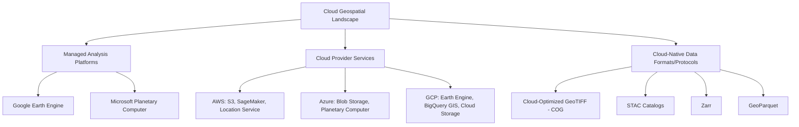
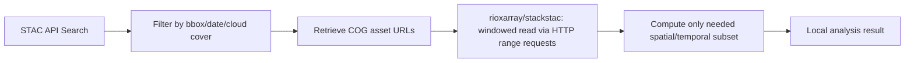

## Cloud Geospatial Platform Overview


### Overview

Cloud geospatial platforms shift storage, compute, and analysis of large spatial datasets from local infrastructure to managed cloud environments, addressing the scale limitations of desktop GIS when working with global satellite archives, high-frequency time series, or nationwide vector datasets. The landscape spans three broad categories: analysis-ready-data platforms with built-in compute (Google Earth Engine), general-purpose cloud provider geospatial services (AWS, Azure, GCP), and open cloud-native data formats/protocols (COG, STAC, Zarr) that any of these platforms — or self-hosted infrastructure — can consume.



### Managed Analysis Platforms

#### Google Earth Engine (GEE)

**Key Points**

- Provides a multi-petabyte catalog of satellite imagery (Landsat, Sentinel, MODIS) and geospatial datasets alongside server-side compute, avoiding the need to download raw imagery for analysis
- Access via a JavaScript Code Editor (browser-based) or the Python API (`earthengine-api`); computation is executed server-side and only results (statistics, thumbnails, exported files) return to the client
- Core abstraction is server-side lazy evaluation: operations on `ee.Image`/`ee.ImageCollection`/`ee.FeatureCollection` objects build a computation graph that only executes when a result is explicitly requested (`.getInfo()`, `.export()`)
- `[Unverified]` Free-tier usage limits, commercial licensing terms, and quota structures have changed over time and should be verified against Earth Engine's current terms for any production or institutional use

**Example**

```python
import ee
ee.Authenticate()
ee.Initialize(project="my-gee-project")

# Sentinel-2 surface reflectance, cloud-filtered, over a region
region = ee.Geometry.Rectangle([120.4, 17.9, 120.7, 18.3])  # Batac City area

collection = (
    ee.ImageCollection("COPERNICUS/S2_SR_HARMONIZED")
    .filterBounds(region)
    .filterDate("2024-01-01", "2024-06-30")
    .filter(ee.Filter.lt("CLOUDY_PIXEL_PERCENTAGE", 20))
)

median_composite = collection.median().clip(region)

ndvi = median_composite.normalizedDifference(["B8", "B4"]).rename("NDVI")

task = ee.batch.Export.image.toDrive(
    image=ndvi,
    description="batac_ndvi_2024",
    scale=10,
    region=region,
    fileFormat="GeoTIFF"
)
task.start()
```

`[Inference]` Because Earth Engine computation is lazy and server-side, debugging requires calling `.getInfo()` on intermediate objects to inspect values, which triggers actual execution and can be slow for large computations — this differs from the eager-execution model typical of local Python geospatial libraries.

#### Microsoft Planetary Computer

**Key Points**

- Provides a STAC-based catalog of open geospatial datasets (Sentinel, Landsat, NAIP, climate data) hosted on Azure, with data accessible directly via standard STAC API clients rather than a proprietary query language
- Notable for integrating with the standard open-source Python stack (`pystac-client`, `stackstac`, `rioxarray`) rather than requiring a platform-specific API, in contrast to Earth Engine's dedicated `ee` API
- Offers a hosted JupyterHub environment for interactive analysis co-located with the data (reducing data transfer)

**Example**

```python
from pystac_client import Client
import planetary_computer
import stackstac

catalog = Client.open(
    "https://planetarycomputer.microsoft.com/api/stac/v1",
    modifier=planetary_computer.sign_inplace
)

search = catalog.search(
    collections=["sentinel-2-l2a"],
    bbox=[120.4, 17.9, 120.7, 18.3],
    datetime="2024-01-01/2024-06-30",
    query={"eo:cloud_cover": {"lt": 20}}
)

items = list(search.items())
stack = stackstac.stack(items, assets=["B04", "B08"], resolution=10)
```

### Cloud Provider Geospatial Services

#### AWS

**Key Points**

- **S3** hosts most major public geospatial data archives (Sentinel, Landsat via Earth Search, NAIP) as Cloud-Optimized GeoTIFFs, accessible directly via range requests without full-file download
- **AWS Location Service** — managed geocoding, routing, and map-tile services, positioned as an AWS-native alternative to Google Maps Platform/Mapbox for applications already on AWS infrastructure
- Large-scale geospatial compute typically runs on general-purpose AWS compute (EC2, Lambda, Batch, SageMaker) using the standard open-source stack (GDAL, GeoPandas, Rasterio) rather than a geospatial-specific compute service

#### Microsoft Azure

**Key Points**

- **Azure Blob Storage** serves a similar role to S3 for hosting large geospatial datasets, including the Planetary Computer's data holdings
- **Azure Maps** provides geocoding, routing, and rendering services analogous to AWS Location Service
- Azure Synapse and Azure Databricks are commonly used for large-scale geospatial data processing when integrated with broader enterprise data pipelines

#### Google Cloud Platform (GCP)

**Key Points**

- **BigQuery GIS** extends BigQuery's SQL engine with native geography types (`GEOGRAPHY`) and spatial functions (`ST_INTERSECTS`, `ST_DISTANCE`, `ST_BUFFER`), enabling spatial queries at data-warehouse scale directly in SQL
- **Cloud Storage** hosts raster/vector datasets similarly to S3/Blob Storage
- Earth Engine is itself a Google Cloud product, with tighter integration available for projects already using GCP billing/IAM

**Example — BigQuery GIS**

```sql
SELECT
  barangay_name,
  ST_AREA(geometry) AS area_sqm
FROM
  `project.dataset.barangay_boundaries`
WHERE
  ST_INTERSECTS(
    geometry,
    ST_GEOGFROMTEXT('POLYGON((120.5 18.0, 120.6 18.0, 120.6 18.1, 120.5 18.1, 120.5 18.0))')
  )
```

### Cloud-Native Data Formats and Protocols

#### Cloud-Optimized GeoTIFF (COG)

**Key Points**

- A GeoTIFF variant with internal tiling and overviews (pre-computed lower-resolution pyramids) organized so that HTTP range requests can fetch only the needed spatial subset and resolution level, without downloading the entire file
- Standard output format for most cloud-hosted imagery archives (Earth Search, Planetary Computer); created from standard GeoTIFFs using `gdal_translate` with COG-specific creation options, or GDAL's dedicated `COG` driver

**Example**

```bash
gdal_translate input.tif output_cog.tif \
    -of COG \
    -co COMPRESS=DEFLATE \
    -co BLOCKSIZE=512
```

#### STAC (SpatioTemporal Asset Catalog)

**Key Points**

- A JSON-based specification for describing and searching collections of geospatial assets (primarily satellite/aerial imagery), standardizing metadata (bounding box, datetime, cloud cover, bands) so any STAC-compliant client can query any STAC-compliant catalog with a common API
- `pystac-client` is the standard Python client for querying STAC APIs regardless of which provider hosts the catalog (AWS Earth Search, Planetary Computer, or self-hosted)

#### Zarr

**Key Points**

- A chunked, compressed, N-dimensional array storage format designed for cloud object storage, commonly used for large climate/weather datasets (analogous to NetCDF but designed for cloud-native parallel/chunked access rather than single-file sequential access)
- Integrates with `xarray` for analysis, allowing lazy loading of only the requested data chunks rather than an entire dataset

#### GeoParquet

**Key Points**

- An extension of the Apache Parquet columnar storage format adding standardized geometry column encoding, positioned as a cloud-native alternative to Shapefile/GeoPackage for large vector datasets
- Benefits from Parquet's columnar compression and predicate pushdown (query engines can skip irrelevant row groups), making it well suited to large vector datasets queried by analytical engines (DuckDB, Spark, BigQuery)

`[Unverified]` GeoParquet adoption and tooling support (which libraries fully support reading/writing it, and which version of the GeoParquet spec they support) has been evolving; current library compatibility should be checked against the GeoParquet specification's current status before committing to it as a primary storage format.

### Platform Selection Considerations

| Factor | Google Earth Engine | Planetary Computer | Self-Managed (AWS/Azure/GCP + open-source stack) |
| --- | --- | --- | --- |
| Setup complexity | Low (hosted, managed) | Low-Medium (hosted, open API) | High (requires infrastructure setup) |
| API lock-in | High (proprietary `ee` API) | Low (standard STAC/Python stack) | None |
| Compute location | Server-side (Google's) | Hybrid (hosted Jupyter or local) | Full control |
| Cost model | Free tier / commercial licensing | Data free; compute costs if self-run | Pay-as-you-go cloud compute + storage |
| Best fit | Rapid large-scale remote sensing analysis | Open, portable STAC-based workflows | Custom pipelines, existing cloud infrastructure |

`[Inference]` For an LGU-scale document/GIS system rather than a remote-sensing-heavy application, self-managed cloud storage (S3/Blob-compatible object storage) paired with standard open-source tooling is likely more appropriate than committing to a proprietary analysis platform like Earth Engine, since the workload is more likely to be vector-heavy (parcels, permits, boundaries) than large-scale imagery time-series analysis.

### Typical Cloud-Native Access Pattern



**Next Steps**

- Cloud-Optimized GeoTIFF internals and creation best practices
- STAC catalog querying and building custom STAC catalogs
- Google Earth Engine Python API in depth (server-side vs client-side evaluation)
- BigQuery GIS and SQL-based spatial analysis at scale
- Object storage architecture for large-scale geospatial data (S3-compatible storage, access patterns)
- Zarr and xarray for large climate/array data on cloud storage
- Cost optimization strategies for cloud geospatial compute and storage
- GeoParquet adoption and DuckDB spatial extension for large vector analytics