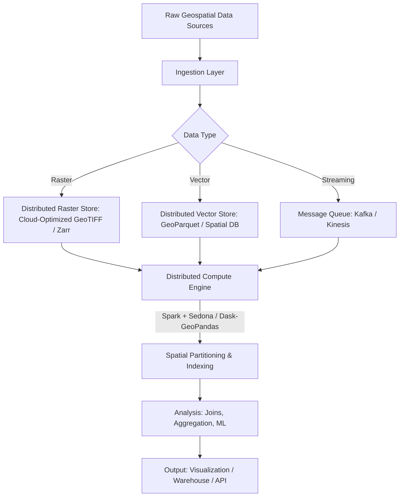
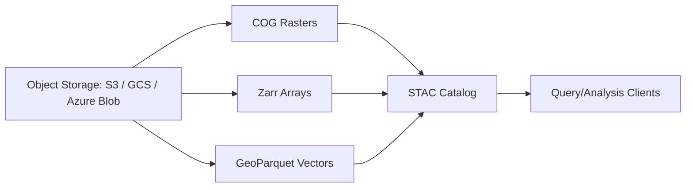

## Big Data Concepts for Geospatial Analysis


### Overview

Big geospatial data refers to spatial datasets whose volume, velocity, variety, or complexity exceed the practical processing capacity of traditional desktop GIS or single-node relational databases. This includes satellite imagery archives, high-frequency GPS/IoT sensor streams, global vector datasets (e.g., OpenStreetMap), LiDAR point clouds, and crowd-sourced geotagged social media. Handling these datasets requires distributed storage, parallel processing frameworks, and spatial indexing strategies that differ substantially from conventional GIS workflows.

### The 5 V's of Geospatial Big Data

- **Volume**: Petabyte-scale archives (e.g., NASA's EOSDIS, Copernicus Sentinel data exceeding 20TB/day)
- **Velocity**: Real-time streams from IoT sensors, vehicle telematics, and satellite constellations with sub-daily revisit times
- **Variety**: Raster (imagery), vector (points/lines/polygons), point clouds (LiDAR), trajectories (GPS tracks), and unstructured (geotagged text/images)
- **Veracity**: Positional uncertainty, sensor noise, and inconsistent coordinate reference systems (CRS) across sources
- **Value**: Extracting actionable insight (e.g., deforestation detection, urban growth modeling) that justifies the processing cost

### Key Points

- Traditional GIS tools (desktop software, single-server PostGIS) struggle beyond a threshold typically in the range of hundreds of gigabytes to low terabytes, depending on hardware [Inference — exact thresholds vary by system configuration]
- Spatial big data problems are compounded by the "curse of dimensionality" in spatial indexing and the non-uniform distribution of spatial phenomena (Tobler's First Law: nearby things are more related than distant things)
- Parallelization of spatial operations is non-trivial because many algorithms (e.g., polygon overlay, nearest-neighbor search) require awareness of neighboring data that may reside on different compute nodes

### Core Technical Challenges

#### 1. Spatial Partitioning

Unlike tabular big data, geospatial data cannot be split arbitrarily across nodes without breaking spatial relationships. Common partitioning strategies include:

- **Grid-based partitioning**: Dividing space into uniform tiles (e.g., quadtree, geohash)
- **KD-tree/R-tree partitioning**: Adaptive partitioning based on data density
- **Space-filling curves**: Hilbert curve or Z-order curve mapping 2D/3D coordinates to 1D indices for efficient distributed sorting and range queries

$$d_{hilbert}(x, y) \rightarrow i \in \mathbb{Z}$$

where $d_{hilbert}$ maps a 2D coordinate to a 1D index $i$ that preserves spatial locality.

#### 2. The Boundary/Edge Problem

When data is partitioned across nodes, spatial operations near partition boundaries (e.g., a buffer analysis or join) may miss neighboring features on adjacent partitions. This is typically solved via:

- **Duplication with buffer zones**: Replicating a margin of data across adjacent partitions
- **Two-phase distributed joins**: Local join per partition, followed by a global deduplication/merge phase

#### 3. Indexing at Scale

- **R-tree**: Standard spatial index for bounding-box queries; used in PostGIS, but doesn't natively distribute
- **Geohash**: Encodes lat/lon into a base-32 string; prefix-based, enabling range queries in distributed key-value stores
- **S2 Geometry** (Google): Hierarchical decomposition of the sphere into cells, avoiding the distortion issues of flat-earth geohashing
- **H3** (Uber): Hexagonal hierarchical spatial index, popular for uniform-area analytics and ride-hailing/logistics use cases

### Distributed Processing Architectures



### Key Frameworks and Tools

#### Apache Sedona (formerly GeoSpark)

Extends Apache Spark with spatial RDDs, spatial SQL, and spatial indexing (R-tree, Quad-tree). Supports spatial joins, range queries, and KNN queries at cluster scale.

```python
from sedona.spark import SedonaContext

sedona = SedonaContext.create(spark)

df = sedona.read.format("geoparquet").load("s3://bucket/parcels.parquet")
df.createOrReplaceTempView("parcels")

result = sedona.sql("""
    SELECT a.id, b.id AS neighbor_id
    FROM parcels a, parcels b
    WHERE ST_Intersects(a.geometry, b.geometry) AND a.id != b.id
""")
result.show()
```

#### Dask-GeoPandas

Parallelizes GeoPandas operations across cores/clusters using partitioned spatial indexes, suitable for medium-scale (multi-GB to low-TB) workloads without a full Spark cluster.

```python
import dask_geopandas as dgpd

ddf = dgpd.read_parquet("data/parcels/*.parquet")
ddf = ddf.spatial_shuffle()  # repartition using Hilbert curve ordering
result = ddf.sjoin(ddf_boundaries, predicate="within").compute()
```

#### Google Earth Engine

A cloud-based planetary-scale geospatial analysis platform with a petabyte-scale catalog of satellite imagery and a server-side JavaScript/Python API, abstracting away distributed raster processing entirely.

```python
import ee
ee.Initialize()

collection = ee.ImageCollection("COPERNICUS/S2_SR") \
    .filterDate("2024-01-01", "2024-12-31") \
    .filterBounds(ee.Geometry.Point(121.05, 14.58))

ndvi = collection.map(lambda img: img.normalizedDifference(["B8", "B4"]))
```

#### Cloud-Native Data Formats

| Format | Data Type | Key Advantage |
| --- | --- | --- |
| Cloud-Optimized GeoTIFF (COG) | Raster | HTTP range-request support for partial reads |
| Zarr | Multi-dim array (raster/climate) | Chunked, compressed, cloud-object-store-native |
| GeoParquet | Vector | Columnar storage, efficient filtering, interoperable with Spark/Dask |
| FlatGeobuf | Vector | Streamable, spatially indexed binary format |

### Distributed Storage Layer



The **SpatioTemporal Asset Catalog (STAC)** specification has become the de facto standard for indexing and discovering cloud-hosted geospatial assets, providing a JSON-based metadata schema queryable via API (STAC API) without downloading full datasets.

### Practical Example: Spatial Join at Scale

**Scenario**: Joining 50 million geotagged points (e.g., mobile device pings) against 3,000 administrative boundary polygons to assign each point to a district.

**Naive approach (fails at scale)**: Nested-loop join — $O(n \times m)$ comparisons, computationally prohibitive for large $n$.

**Scalable approach**:

1. Build a spatial index (R-tree/Quad-tree) on the smaller dataset (boundaries)
2. Partition the point dataset using a space-filling curve (Hilbert/Z-order)
3. Broadcast the indexed boundary dataset to all worker nodes (since it is small)
4. Perform local point-in-polygon tests per partition in parallel
5. Merge results

```python
# Apache Sedona example: broadcast join optimization
sedona.sql("""
    SELECT /*+ BROADCAST(boundaries) */ p.id, b.district_name
    FROM points p, boundaries b
    WHERE ST_Contains(b.geometry, p.geometry)
""")
```

**Output**: A joined dataset attributing each of the 50M points to one of 3,000 districts, executed in minutes on a cluster versus potentially hours/days on a single machine [Inference — actual performance depends on cluster size, data skew, and index quality].

### Coordinate Reference System (CRS) Considerations at Scale

Large geospatial big data pipelines frequently ingest data in mixed CRSs (WGS84, UTM zones, Web Mercator). Reprojecting at scale is computationally expensive, so best practice is:

- Standardize to a single CRS at ingestion (commonly EPSG:4326 for storage, EPSG:3857 for web visualization)
- Avoid repeated reprojection in iterative pipeline stages
- Use area-preserving projections (e.g., Equal Earth, Albers) when computing area/distance-based aggregate statistics to avoid distortion errors

### Machine Learning on Geospatial Big Data

- **Feature engineering at scale**: Zonal statistics, spatial lag variables, and distance-to-nearest-feature computations parallelized via Sedona/Dask
- **Deep learning on imagery**: Distributed training pipelines (e.g., TorchGeo, PyTorch + Ray) for semantic segmentation of satellite tiles
- **Spatial cross-validation**: Standard random k-fold cross-validation violates independence assumptions due to spatial autocorrelation; block or buffered cross-validation is used instead to avoid data leakage between train/test spatial neighbors

### Common Pitfalls

- **Ignoring spatial skew**: Point/feature density is rarely uniform (e.g., urban vs. rural), causing severe partition imbalance ("data skew") and straggler nodes in distributed jobs
- **Over-partitioning small datasets**: Introduces unnecessary network shuffle overhead
- **Treating raster and vector pipelines identically**: Raster big data (chunked arrays) and vector big data (discrete geometries) require fundamentally different indexing and partitioning strategies
- **CRS mismatches silently producing wrong results**: A join or distance calculation across two datasets with different CRSs will execute without error but return incorrect results

### Related Topics

- Distributed Spatial Databases (PostGIS Citus, CockroachDB spatial extensions)
- Cloud-Optimized GeoTIFF (COG) and STAC Catalog Architecture
- Apache Sedona Deep Dive: Spatial SQL and RDD APIs
- H3 and S2 Hierarchical Spatial Indexing
- Satellite Data Pipelines with Google Earth Engine
- Spatiotemporal Data Cubes (Zarr, Xarray, Open Data Cube)
- Distributed Machine Learning for Remote Sensing (TorchGeo, Ray)
- Kafka/Kinesis for Real-Time Geospatial Streaming (GPS trajectories, IoT)