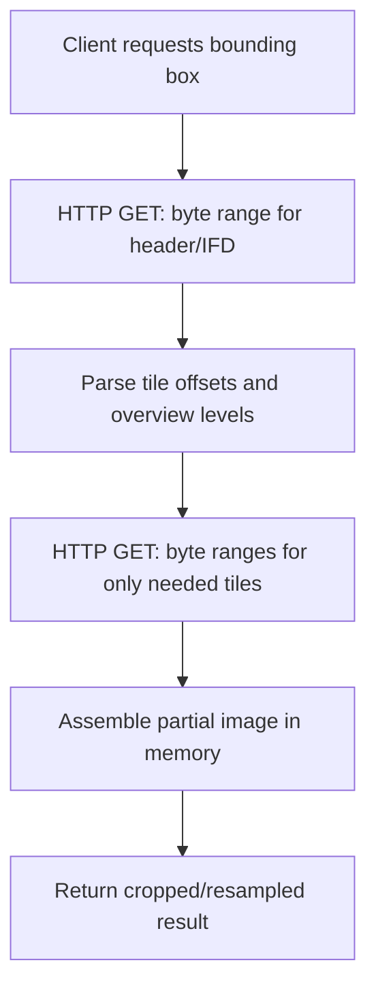

## Cloud-Native Geospatial Data Formats


### Overview

Cloud-native geospatial formats are data structures purpose-built for storage on object storage (S3, GCS, Azure Blob) and access over HTTP, enabling partial reads, parallel access, and analysis without downloading entire files. They replace legacy formats (Shapefile, uncompressed GeoTIFF) that assume local filesystem access and require full-file downloads before any processing can begin.

### Key Points

- Legacy geospatial formats were designed for local disk I/O, where random-access reads are cheap; object storage has no true random access, only HTTP range requests, so format design must minimize the number of round trips
- Cloud-native formats generally share three properties: internal chunking/tiling, embedded spatial/attribute indexes, and support for HTTP range-request reads of arbitrary byte ranges
- The shift to cloud-native formats parallels the broader "bring compute to the data" paradigm, where analysis runs in the same cloud region as storage rather than downloading data to a workstation

### Why Legacy Formats Fail in the Cloud

| Legacy Format | Limitation on Object Storage |
| --- | --- |
| Shapefile | Multi-file format (.shp/.shx/.dbf), no internal spatial index, must fetch entire file to read any feature |
| Uncompressed GeoTIFF | No internal tiling in older variants; full download required for a small crop |
| GeoJSON | Plain text, unindexed, entire file must be parsed to find any single feature |
| File Geodatabase | Proprietary binary blob, effectively unreadable via partial HTTP reads |

### Raster: Cloud-Optimized GeoTIFF (COG)

A COG is a standard GeoTIFF internally organized with:

- **Tiling**: Image divided into internal tiles (e.g., 256×256 px) rather than stored as scanlines
- **Overviews (pyramids)**: Pre-computed lower-resolution versions embedded in the same file for fast zoomed-out rendering
- **IFD (Image File Directory) ordering**: Metadata placed at the beginning of the file so a client can read the header first and then issue targeted range requests only for needed tiles



```bash
# Convert a standard GeoTIFF to COG using GDAL
gdal_translate input.tif output_cog.tif \
    -of COG \
    -co COMPRESS=DEFLATE \
    -co BLOCKSIZE=256 \
    -co OVERVIEWS=AUTO
```

```python
# Validate a COG
from rio_cogeo.cogeo import cog_validate

is_valid, errors, warnings = cog_validate("output_cog.tif")
print(is_valid, errors)
```

### Multi-Dimensional Arrays: Zarr

Zarr is a format for chunked, compressed, N-dimensional arrays, well suited to climate, oceanographic, and time-series raster data (e.g., datacubes with time × latitude × longitude × band dimensions). Each chunk is stored as a separate object in the store, enabling parallel reads/writes across a cluster.

```python
import xarray as xr

# Open a cloud-hosted Zarr store lazily (no full download)
ds = xr.open_zarr("gs://bucket/climate-data.zarr", consolidated=True)

subset = ds["temperature"].sel(
    time=slice("2024-01-01", "2024-01-31"),
    lat=slice(10, 20),
    lon=slice(120, 130)
)
result = subset.compute()  # triggers only the needed chunk reads
```

Key Zarr characteristics:

- Chunks stored as individual keys/objects (e.g., `0.0.1`, `0.0.2`) in the underlying store
- Metadata (`.zattrs`, `.zarray`) stored separately in small JSON files, enabling cheap metadata-only reads
- Compression codecs (Blosc, Zstandard) applied per-chunk

### Vector: GeoParquet

GeoParquet extends the Apache Parquet columnar format with a standardized geometry column encoding (WKB by default) and embedded bounding-box metadata for spatial predicate pushdown.

```python
import geopandas as gpd

gdf = gpd.read_file("parcels.shp")
gdf.to_parquet("parcels.parquet")  # writes GeoParquet with geo metadata

# Cloud read with column + row-group pruning
gdf2 = gpd.read_parquet(
    "s3://bucket/parcels.parquet",
    columns=["geometry", "owner_name"]
)
```

Key GeoParquet characteristics:

- Columnar storage allows reading only requested attribute columns, skipping others entirely
- Row-group-level statistics (min/max bounding boxes) allow spatial filter pushdown without scanning full file
- Interoperable across Spark, Dask, DuckDB, and desktop GIS tools

### Vector: FlatGeobuf

A binary vector format designed for both efficient bulk loading and streaming access, using a packed R-tree spatial index embedded directly in the file, enabling bounding-box queries via HTTP range requests without a separate index file.

```bash
# Convert Shapefile to FlatGeobuf
ogr2ogr -f FlatGeobuf output.fgb input.shp
```

```javascript
// Streaming spatial-filtered read in a browser via flatgeobuf.js
import { deserialize } from 'flatgeobuf/lib/mjs/geojson.js';

const rect = { minX: 120, minY: 14, maxX: 121, maxY: 15 };
for await (const feature of deserialize("https://example.com/data.fgb", rect)) {
    console.log(feature);
}
```

### Catalog and Discovery: STAC (SpatioTemporal Asset Catalog)

STAC is a JSON-based specification for describing and indexing geospatial assets (typically COGs or Zarr stores), enabling discovery via a queryable STAC API without touching the underlying pixel data.

```json
{
  "type": "Feature",
  "stac_version": "1.0.0",
  "id": "sentinel2_20240615_manila",
  "geometry": { "type": "Polygon", "coordinates": [[[120.9, 14.4],[121.2, 14.4],[121.2, 14.7],[120.9, 14.7],[120.9, 14.4]]] },
  "properties": { "datetime": "2024-06-15T02:30:00Z", "eo:cloud_cover": 8.2 },
  "assets": {
    "B04": { "href": "https://bucket/B04.tif", "type": "image/tiff; application=geotiff; profile=cloud-optimized" }
  }
}
```

```python
from pystac_client import Client

catalog = Client.open("https://earth-search.aws.element84.com/v1")
search = catalog.search(
    collections=["sentinel-2-l2a"],
    bbox=[120.9, 14.4, 121.2, 14.7],
    datetime="2024-06-01/2024-06-30",
    query={"eo:cloud_cover": {"lt": 10}}
)
items = list(search.items())
```

### Format Comparison Summary

| Format | Data Model | Internal Index | Primary Use Case |
| --- | --- | --- | --- |
| COG | Raster (2D) | Tile offsets + overviews | Imagery, DEMs |
| Zarr | N-dimensional array | Chunk-key mapping | Climate/time-series cubes |
| GeoParquet | Vector (columnar) | Row-group bbox stats | Large tabular vector analytics |
| FlatGeobuf | Vector (binary stream) | Embedded packed R-tree | Streaming/web vector delivery |
| STAC | Metadata catalog | N/A (indexes other assets) | Discovery across archives |

### Practical Example: End-to-End Cloud-Native Workflow

**Scenario**: Find cloud-free Sentinel-2 imagery over a region and compute NDVI without downloading full scenes.

```python
import rioxarray
from pystac_client import Client

# 1. Discover assets via STAC
catalog = Client.open("https://earth-search.aws.element84.com/v1")
items = catalog.search(
    collections=["sentinel-2-l2a"],
    bbox=[120.9, 14.4, 121.2, 14.7],
    datetime="2024-06-01/2024-06-30",
    query={"eo:cloud_cover": {"lt": 5}}
).item_collection()

item = items[0]

# 2. Lazily open COG assets (only headers fetched initially)
red = rioxarray.open_rasterio(item.assets["red"].href)
nir = rioxarray.open_rasterio(item.assets["nir"].href)

# 3. Compute NDVI — triggers only the necessary tile reads within the bbox
ndvi = (nir - red) / (nir + red)
ndvi_clip = ndvi.rio.clip_box(minx=120.9, miny=14.4, maxx=121.2, maxy=14.7)
```

**Output**: An NDVI raster computed over a small area of interest, having fetched only the relevant byte ranges of two spectral bands, rather than downloading full-scene GeoTIFFs. [Inference — actual bytes transferred depend on tile size, AOI size, and client-side caching behavior]

### Common Pitfalls

- **Assuming any GeoTIFF is a COG**: A GeoTIFF must be explicitly structured (tiled + overviews + optimized IFD) to behave efficiently over HTTP; a non-optimized GeoTIFF served from cloud storage will silently trigger full-file downloads
- **Ignoring compression/chunk-size tradeoffs**: Overly small chunks increase the number of HTTP requests (latency-bound); overly large chunks waste bandwidth on unneeded data
- **Skipping STAC metadata validation**: Malformed STAC items break automated discovery pipelines silently
- **Treating GeoParquet bbox pushdown as guaranteed**: Predicate pushdown effectiveness depends on the reading library's support for Parquet statistics and correct row-group sizing at write time

### Related Topics

- Cloud-Optimized GeoTIFF (COG) Internals and GDAL Drivers
- Zarr and Xarray for Multi-Dimensional Climate Data Cubes
- GeoParquet Specification and Ecosystem Tooling
- STAC API and Dynamic Catalog Querying (pystac-client, stac-fastapi)
- HTTP Range Requests and the GDAL `/vsicurl/` Virtual File System
- Big Data Concepts for Geospatial Analysis
- Serverless Geospatial Processing (AWS Lambda, Google Cloud Functions with GDAL layers)