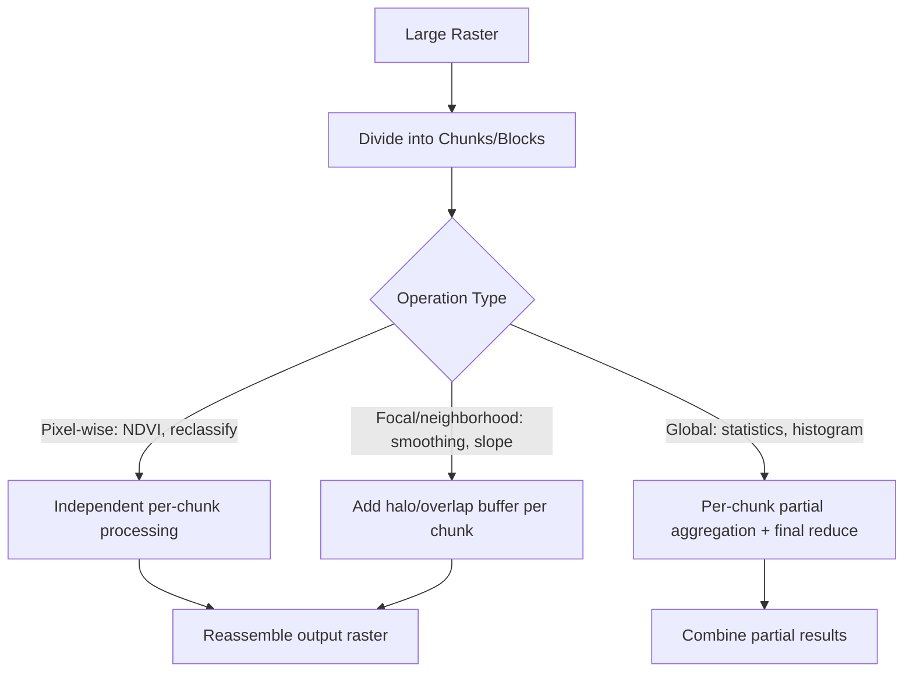

## Distributed Processing of Large Raster Datasets


### Overview

Distributed raster processing refers to techniques and frameworks for performing computation—reprojection, band math, mosaicking, classification, time-series aggregation—on raster datasets that are too large to fit in a single machine's memory or to process efficiently on a single core. This is achieved by decomposing rasters into chunks (tiles/blocks) that can be processed independently and in parallel across multiple cores or nodes, then reassembled or aggregated.

### Key Points

- The dominant strategy is **chunked/tiled parallelism**: rasters are logically divided into blocks, each processed independently, exploiting the fact that most raster algebra operations (map algebra) are embarrassingly parallel at the pixel or block level
- Operations that require neighborhood context (convolution, focal statistics, hydrological flow routing) break simple tiling because they need pixels from adjacent tiles, requiring overlap/halo regions
- Two broad architectural approaches exist: **task-parallel** frameworks (Dask, Spark) that schedule chunk-level operations as a task graph, and **purpose-built geospatial engines** (Google Earth Engine, Microsoft Planetary Computer) that abstract distribution away entirely behind a declarative API

### Chunking Strategy and the Halo Problem



For focal operations, a halo of $n$ pixels (matching the kernel radius) must be included from neighboring chunks:

$$\text{chunk}_{padded} = \text{chunk}_{core} \cup \text{halo}(n)$$

Without this padding, edge pixels within each chunk would compute incorrect values due to missing neighborhood context — a common source of visible "seam artifacts" at chunk boundaries in naively parallelized outputs.

### Dask for Distributed Raster Arrays

Dask parallelizes NumPy-like array operations by representing a raster as a graph of chunked blocks (`dask.array`), commonly used via `rioxarray`/`xarray` for geospatial-aware chunking.

```python
import rioxarray
import xarray as xr

# Open with chunking — creates a lazy, chunked dask-backed array
da = rioxarray.open_rasterio(
    "s3://bucket/large_scene.tif",
    chunks={"x": 1024, "y": 1024}
)

# Operations build a task graph; nothing computes yet
ndvi = (da.sel(band=4) - da.sel(band=3)) / (da.sel(band=4) + da.sel(band=3))

# Triggers actual distributed computation across available workers
ndvi_result = ndvi.compute()
```

```python
from dask.distributed import Client

# Launch a local or remote Dask cluster
client = Client(n_workers=8, threads_per_worker=2)

# Focal mean with overlap handling via map_overlap
import dask.array as da_array

def focal_mean(block):
    from scipy.ndimage import uniform_filter
    return uniform_filter(block, size=5)

smoothed = da_array.map_overlap(focal_mean, raster_chunks, depth=2, boundary="reflect")
```

### Apache Spark for Raster: RasterFrames / Sedona Raster

Spark-based raster processing represents each tile as a row in a DataFrame, enabling SQL-style raster queries and joins with vector data at scale.

```python
from sedona.spark import SedonaContext

sedona = SedonaContext.create(spark)

raster_df = sedona.read.format("raster").load("s3://bucket/tiles/")
raster_df.createOrReplaceTempView("tiles")

result = sedona.sql("""
    SELECT RS_MapAlgebra(band_data, 'D', 'out = (rast[3] - rast[2]) / (rast[3] + rast[2]);') AS ndvi
    FROM tiles
""")
```

### Google Earth Engine: Server-Side Abstraction

Earth Engine hides distributed execution entirely; operations expressed on `ee.Image` objects are lazily built into a computation graph and executed server-side across Google's infrastructure, with automatic tiling handled internally.

```python
import ee
ee.Initialize()

img = ee.Image("COPERNICUS/S2_SR/20240615T023601_20240615T023601_T51PXM")
ndvi = img.normalizedDifference(["B8", "B4"])

# Server-side reduction over a large region — tiling is automatic and internal
mean_ndvi = ndvi.reduceRegion(
    reducer=ee.Reducer.mean(),
    geometry=ee.Geometry.Rectangle([120.9, 14.4, 121.2, 14.7]),
    scale=10,
    maxPixels=1e9
)
print(mean_ndvi.getInfo())
```

### GDAL Virtual Rasters (VRT) for Lightweight Distribution

A VRT is an XML file referencing underlying raster tiles without duplicating pixel data, enabling mosaicking and lightweight parallel-friendly access patterns without physically merging files.

```bash
gdalbuildvrt mosaic.vrt tile1.tif tile2.tif tile3.tif tile4.tif

# Parallel per-tile processing, then reference all outputs via VRT
gdal_translate -of GTiff mosaic.vrt output_full.tif --config GDAL_NUM_THREADS ALL_CPUS
```

### Comparison of Approaches

| Framework | Abstraction Level | Best Suited For |
| --- | --- | --- |
| Dask + rioxarray | Array-level (NumPy-like) | Custom pixel/array algorithms, Python-native pipelines |
| Apache Sedona / RasterFrames | DataFrame/SQL-level | Joint raster-vector analytics at cluster scale |
| Google Earth Engine | Fully declarative | Planetary-scale analysis without infrastructure management |
| GDAL VRT + multiprocessing | File-level | Simple mosaicking/reprojection pipelines, single-machine parallelism |

### Practical Example: Distributed Reprojection and Mosaicking

**Scenario**: Reproject and mosaic 500 Landsat scenes (each ~1GB) covering a country into a single analysis-ready raster.

```python
import dask
from dask.distributed import Client
import rioxarray

client = Client(n_workers=16)

@dask.delayed
def reproject_scene(path, dst_crs="EPSG:32651"):
    da = rioxarray.open_rasterio(path)
    return da.rio.reproject(dst_crs)

scene_paths = [f"s3://bucket/scene_{i}.tif" for i in range(500)]
tasks = [reproject_scene(p) for p in scene_paths]

# Executes across 16 workers in parallel
reprojected_scenes = dask.compute(*tasks)
```

**Output**: 500 reprojected scenes processed in parallel batches determined by available worker count, followed by a mosaic step (e.g., `rioxarray.merge.merge_arrays`); total wall-clock time scales roughly with $n_{scenes} / n_{workers}$, though actual speedup is bounded by I/O bandwidth and task scheduling overhead. [Inference — real-world scaling depends on network throughput, chunk size, and cluster configuration]

### Common Pitfalls

- **Seam artifacts from missing halos**: Focal/neighborhood operations applied per-tile without overlap padding produce visible discontinuities at tile boundaries
- **Over-chunking causing scheduler overhead**: Extremely small chunks increase task-graph overhead in Dask/Spark, sometimes making distributed execution slower than single-threaded processing
- **Memory spikes from implicit reprojection**: Reprojecting on-the-fly without specifying output resolution/bounds can produce unexpectedly large intermediate arrays
- **Ignoring data locality**: Reading raster chunks from a different cloud region than the compute cluster introduces significant network latency and egress cost

### Related Topics

- Cloud-Native Geospatial Data Formats (COG, Zarr)
- Big Data Concepts for Geospatial Analysis
- Map Algebra and Focal/Zonal Statistics at Scale
- Dask Cluster Deployment (Kubernetes, YARN, Coiled)
- Distributed Deep Learning for Satellite Image Segmentation
- Serverless Geospatial Processing Architectures
- Google Earth Engine App Development and Export Pipelines