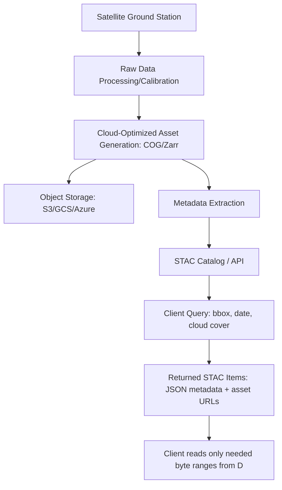

## Cloud-Based Satellite Data Catalogs


### Overview

Cloud-based satellite data catalogs are hosted platforms and APIs that index, store, and serve Earth observation imagery directly from cloud object storage, eliminating the traditional workflow of manually browsing archives and downloading full scenes. They combine searchable metadata (spatial extent, acquisition date, cloud cover, sensor type) with direct links to cloud-native assets (typically COGs), enabling programmatic discovery and analysis-ready access at scale.

### Key Points

- Catalogs decouple **metadata search** from **pixel data access**: querying a catalog returns lightweight JSON describing matching scenes, while actual pixel reads happen later and only for the specific bytes needed
- Most modern catalogs implement or are compatible with the **STAC (SpatioTemporal Asset Catalog)** specification, enabling a common client library (`pystac-client`) to query across multiple providers with consistent syntax
- The shift to cloud-hosted catalogs co-located with compute (same cloud region as processing infrastructure) removes the historical bottleneck of downloading terabytes of imagery to a local workstation before analysis

### Architecture of a Satellite Data Catalog



### Major Cloud-Based Catalogs

| Catalog | Provider | Key Datasets | Access Pattern |
| --- | --- | --- | --- |
| Earth Search | Element 84 (AWS) | Sentinel-2, Landsat Collection 2 | STAC API |
| Microsoft Planetary Computer | Microsoft | Sentinel, Landsat, NAIP, climate, DEMs | STAC API + Python SDK |
| Google Earth Engine Data Catalog | Google | Sentinel, Landsat, MODIS, climate, socioeconomic | Earth Engine API (non-STAC) |
| USGS EarthExplorer / M2M API | USGS | Landsat archive (full historical) | Web UI + REST API |
| Copernicus Data Space Ecosystem | ESA | Sentinel-1/2/3/5P | STAC API + OData |
| Radiant MLHub | Radiant Earth | ML-ready training datasets | STAC API |

### Querying via STAC API

```python
from pystac_client import Client

# Connect to a STAC-compliant catalog
catalog = Client.open("https://earth-search.aws.element84.com/v1")

search = catalog.search(
    collections=["sentinel-2-l2a"],
    bbox=[120.9, 14.4, 121.2, 14.7],       # Manila area
    datetime="2024-01-01/2024-12-31",
    query={"eo:cloud_cover": {"lt": 10}},
    max_items=50
)

items = list(search.items())
print(f"Found {len(items)} matching scenes")

for item in items[:3]:
    print(item.id, item.datetime, item.properties["eo:cloud_cover"])
```

### Microsoft Planetary Computer: SAS Token Authentication

Planetary Computer requires short-lived SAS (Shared Access Signature) tokens to access underlying Azure Blob assets, obtained via a signing step after STAC search.

```python
import planetary_computer
from pystac_client import Client

catalog = Client.open(
    "https://planetarycomputer.microsoft.com/api/stac/v1",
    modifier=planetary_computer.sign_inplace  # auto-signs asset URLs
)

search = catalog.search(
    collections=["landsat-c2-l2"],
    bbox=[120.9, 14.4, 121.2, 14.7],
    datetime="2024-06-01/2024-06-30"
)

items = list(search.items())
signed_href = items[0].assets["red"].href  # already includes SAS token
```

### Google Earth Engine Data Catalog: Non-STAC Alternative

Earth Engine uses its own catalog and server-side compute model rather than STAC, trading interoperability for tight integration with a planetary-scale processing backend.

```python
import ee
ee.Initialize()

collection = ee.ImageCollection("LANDSAT/LC09/C02/T1_L2") \
    .filterBounds(ee.Geometry.Point(121.05, 14.58)) \
    .filterDate("2024-01-01", "2024-12-31") \
    .filter(ee.Filter.lt("CLOUD_COVER", 10))

print(collection.size().getInfo())
```

### Practical Example: Multi-Provider Time-Series Assembly

**Scenario**: Build a cloud-free NDVI time series for a farm boundary by combining Sentinel-2 (10m, 5-day revisit) and Landsat 8/9 (30m, 16-day revisit) from two different catalogs.

```python
from pystac_client import Client
import planetary_computer
import rioxarray

pc_catalog = Client.open(
    "https://planetarycomputer.microsoft.com/api/stac/v1",
    modifier=planetary_computer.sign_inplace
)

bbox = [120.95, 14.50, 121.00, 14.55]

s2_items = pc_catalog.search(
    collections=["sentinel-2-l2a"],
    bbox=bbox, datetime="2024-01-01/2024-06-30",
    query={"eo:cloud_cover": {"lt": 15}}
).item_collection()

ls_items = pc_catalog.search(
    collections=["landsat-c2-l2"],
    bbox=bbox, datetime="2024-01-01/2024-06-30",
    query={"eo:cloud_cover": {"lt": 15}}
).item_collection()

def compute_ndvi(item, red_band, nir_band):
    red = rioxarray.open_rasterio(item.assets[red_band].href).rio.clip_box(*bbox)
    nir = rioxarray.open_rasterio(item.assets[nir_band].href).rio.clip_box(*bbox)
    return (nir - red) / (nir + red)

s2_ndvi_series = [compute_ndvi(i, "red", "nir") for i in s2_items]
ls_ndvi_series = [compute_ndvi(i, "red", "nir08") for i in ls_items]
```

**Output**: Two aligned NDVI time series at different native resolutions, merged by acquisition date into a combined temporal signal for the farm boundary — resampling/harmonization to a common grid is typically required before merging. [Inference — exact harmonization approach depends on downstream analysis requirements]

### Query Optimization Considerations

- **Spatial extent narrowing**: Always constrain `bbox`/`intersects` as tightly as possible; catalogs index spatially, but overly broad queries return unnecessarily large item collections
- **Cloud cover filtering at the metadata level**: Filtering by `eo:cloud_cover` in the query avoids downloading and inspecting scenes that are unusable due to cloud contamination
- **Pagination handling**: Large result sets are paginated; client libraries like `pystac-client` handle this transparently but very broad queries can still return thousands of items requiring careful iteration
- **Asset selection before read**: STAC items often expose dozens of assets (individual bands, thumbnails, metadata sidecars); requesting only needed asset hrefs avoids unnecessary reads

### Common Pitfalls

- **Confusing catalog search latency with data read latency**: A STAC search returning quickly does not mean pixel access will be fast; actual raster reads depend on COG structure and network path to storage
- **Ignoring authentication/token expiry**: SAS tokens (Planetary Computer) and similar signed URLs expire after a fixed window, causing failures in long-running batch jobs unless tokens are refreshed
- **Assuming universal STAC compliance**: Not all "catalogs" are strictly STAC-compliant; some (e.g., Earth Engine) require entirely separate client libraries and query semantics
- **Egress cost blindness**: Reading data from a catalog hosted in one cloud provider's region while computing in another can incur significant data egress charges [Inference — exact costs are provider- and volume-dependent]

### Related Topics

- Cloud-Native Geospatial Data Formats (COG, Zarr, GeoParquet)
- STAC Specification Deep Dive (Collections, Extensions, API)
- Distributed Processing of Large Raster Datasets
- Analysis-Ready Data (ARD) Concepts in Remote Sensing
- Google Earth Engine App Development and Export Pipelines
- Data Egress Cost Management in Multi-Cloud Geospatial Pipelines
- Automated Change Detection Using Satellite Time Series