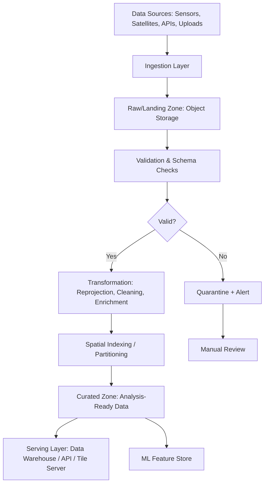

## Scalable Geospatial Data Pipelines


### Overview

Scalable geospatial data pipelines are orchestrated, automated workflows that move spatial data through ingestion, transformation, validation, and delivery stages while handling growth in volume, frequency, and complexity without requiring redesign. Unlike ad hoc scripts, these pipelines are built with idempotency, fault tolerance, monitoring, and horizontal scalability as first-class design goals, typically leveraging workflow orchestrators combined with the distributed processing and cloud-native storage patterns covered elsewhere in this chapter.

### Key Points

- A geospatial pipeline differs from a generic data pipeline primarily in its **transformation stage**: spatial joins, reprojection, resampling, and geometry validation require spatially aware libraries and often benefit from spatial partitioning strategies (covered under Big Data Concepts)
- Production pipelines are built around **orchestration frameworks** (Apache Airflow, Prefect, Dagster) that manage task dependencies, retries, scheduling, and failure alerting, rather than relying on cron jobs or manually triggered scripts
- **Idempotency** — the property that re-running a pipeline stage produces the same result without duplicating or corrupting data — is critical for geospatial pipelines because reprocessing (e.g., after a schema change or corrected input) is common

### General Pipeline Architecture



### Pipeline Stages in Detail

#### 1. Ingestion

Data enters from heterogeneous sources: satellite catalogs (STAC APIs), IoT/GPS streams (Kafka/Kinesis), file uploads (Shapefiles, CSVs with coordinates), and third-party APIs. Ingestion should write to an immutable "raw/landing zone" before any transformation, preserving an auditable original copy.

```python
# Airflow DAG task: ingest new STAC items daily
from airflow.decorators import task
from pystac_client import Client

@task
def fetch_new_scenes(execution_date):
    catalog = Client.open("https://earth-search.aws.element84.com/v1")
    search = catalog.search(
        collections=["sentinel-2-l2a"],
        datetime=f"{execution_date}/{execution_date}",
        bbox=[120.9, 14.4, 121.2, 14.7]
    )
    return [item.to_dict() for item in search.items()]
```

#### 2. Validation

Geometry validation catches malformed inputs before they propagate downstream — invalid polygons (self-intersections), null geometries, and CRS mismatches are among the most common failure modes in spatial pipelines.

```python
from shapely.validation import make_valid, explain_validity
import geopandas as gpd

def validate_geometries(gdf: gpd.GeoDataFrame) -> gpd.GeoDataFrame:
    invalid_mask = ~gdf.geometry.is_valid
    if invalid_mask.any():
        invalid_reasons = gdf.loc[invalid_mask, "geometry"].apply(explain_validity)
        print(f"Found {invalid_mask.sum()} invalid geometries")
        gdf.loc[invalid_mask, "geometry"] = gdf.loc[invalid_mask, "geometry"].apply(make_valid)
    return gdf
```

#### 3. Transformation

Standardizing CRS, resampling resolution, and enriching with derived attributes (zonal statistics, spatial joins against reference boundaries) happen here — typically using the distributed frameworks (Dask-GeoPandas, Apache Sedona) covered under Big Data Concepts and Distributed Raster Processing.

```python
def transform_stage(gdf: gpd.GeoDataFrame, target_crs="EPSG:32651") -> gpd.GeoDataFrame:
    gdf = gdf.to_crs(target_crs)
    gdf["area_sqm"] = gdf.geometry.area
    gdf["centroid"] = gdf.geometry.centroid
    return gdf
```

#### 4. Loading / Serving

Curated data lands in formats optimized for the consumption pattern: GeoParquet or a spatial database for analytical queries, vector tiles for web maps, or a feature store for ML pipelines.

```python
def load_to_curated(gdf: gpd.GeoDataFrame, output_path: str):
    gdf.to_parquet(output_path, index=False)  # GeoParquet output
```

### Orchestration with Apache Airflow

Airflow represents pipelines as Directed Acyclic Graphs (DAGs) of tasks, with built-in retry logic, scheduling, and dependency management.

```python
from airflow import DAG
from airflow.decorators import task
from datetime import datetime, timedelta

default_args = {
    "retries": 3,
    "retry_delay": timedelta(minutes=5),
}

with DAG(
    dag_id="satellite_ndvi_pipeline",
    schedule="@daily",
    start_date=datetime(2024, 1, 1),
    default_args=default_args,
    catchup=False,
) as dag:

    @task
    def ingest():
        ...

    @task
    def validate(raw_data):
        ...

    @task
    def transform(valid_data):
        ...

    @task
    def load(transformed_data):
        ...

    raw = ingest()
    valid = validate(raw)
    transformed = transform(valid)
    load(transformed)
```

### Orchestration with Prefect (Modern Alternative)

Prefect offers a more Python-native, dynamic task graph model with less boilerplate than Airflow, popular for teams prioritizing developer velocity.

```python
from prefect import flow, task
from prefect.tasks import task_input_hash
from datetime import timedelta

@task(retries=3, retry_delay_seconds=60, cache_key_fn=task_input_hash, cache_expiration=timedelta(hours=1))
def fetch_scenes(date: str):
    ...

@task
def process_scenes(scenes):
    ...

@flow(name="geospatial-ingestion-flow")
def pipeline(date: str):
    scenes = fetch_scenes(date)
    result = process_scenes(scenes)
    return result

if __name__ == "__main__":
    pipeline(date="2024-06-15")
```

### Scalability Patterns

| Pattern | Purpose |
| --- | --- |
| **Partitioned writes** (by date/region/tile) | Enables incremental processing and parallel downstream reads |
| **Idempotent upserts** | Re-running a pipeline stage overwrites rather than duplicates records |
| **Backfill support** | Ability to reprocess historical date ranges after logic changes |
| **Dead-letter queues** | Failed records routed to a separate store for inspection rather than blocking the pipeline |
| **Autoscaling compute** (Kubernetes, managed Spark/Dask clusters) | Worker count scales with data volume rather than being fixed |
| **Schema evolution handling** | New attribute columns or CRS changes don't break the entire pipeline |

### Practical Example: Streaming GPS Trajectory Pipeline

**Scenario**: Ingest continuous GPS pings from a delivery fleet, validate positions, and aggregate into hourly trajectory summaries.

```python
from kafka import KafkaConsumer
import json
from shapely.geometry import Point
from datetime import datetime

consumer = KafkaConsumer(
    "gps-pings",
    bootstrap_servers=["kafka-broker:9092"],
    value_deserializer=lambda m: json.loads(m.decode("utf-8"))
)

def is_valid_ping(ping: dict) -> bool:
    lat, lon = ping.get("lat"), ping.get("lon")
    return lat is not None and lon is not None and -90 <= lat <= 90 and -180 <= lon <= 180

buffer = []
for message in consumer:
    ping = message.value
    if is_valid_ping(ping):
        ping["geometry"] = Point(ping["lon"], ping["lat"])
        buffer.append(ping)
    # Periodic flush to curated storage (e.g., every 1000 records or time interval)
    if len(buffer) >= 1000:
        # write buffer to partitioned GeoParquet, keyed by hour
        buffer = []
```

**Output**: A continuously updated set of hourly-partitioned GeoParquet files representing validated vehicle positions, ready for downstream route analytics or anomaly detection. [Inference — actual flush cadence and partitioning scheme depend on downstream query patterns and latency requirements]

### Monitoring and Observability

- **Data quality metrics**: Track invalid geometry rate, null coordinate rate, and CRS mismatch counts per run
- **Pipeline SLAs**: Alert when a scheduled run fails to complete within an expected time window
- **Lineage tracking**: Tools like OpenLineage or Airflow's built-in lineage integrate with orchestrators to trace how a curated dataset was derived from raw sources
- **Cost monitoring**: Cloud compute and egress costs should be tracked per pipeline run, especially for pipelines processing large raster volumes

### Common Pitfalls

- **No idempotency guarantees**: Re-running a failed pipeline stage duplicates records or corrupts partitioned outputs
- **Missing geometry validation**: Malformed geometries silently propagate downstream, causing failures in unrelated later stages (e.g., a spatial join failing on an invalid polygon)
- **Tight coupling between stages**: Pipelines that cannot be partially re-run (e.g., must restart from ingestion after a transformation bug) waste compute and delay fixes
- **Ignoring backpressure in streaming pipelines**: Unbounded buffers in streaming ingestion can cause memory exhaustion during traffic spikes
- **Underestimating schema drift**: Upstream API or sensor firmware changes silently altering field names/types can break transformation logic without clear error messages

### Related Topics

- Big Data Concepts for Geospatial Analysis
- Distributed Processing of Large Raster Datasets
- Cloud-Based Satellite Data Catalogs
- Apache Airflow and Prefect Orchestration Deep Dive
- Real-Time Geospatial Streaming with Kafka/Kinesis
- Data Quality and Geometry Validation Frameworks
- MLOps for Geospatial Feature Stores