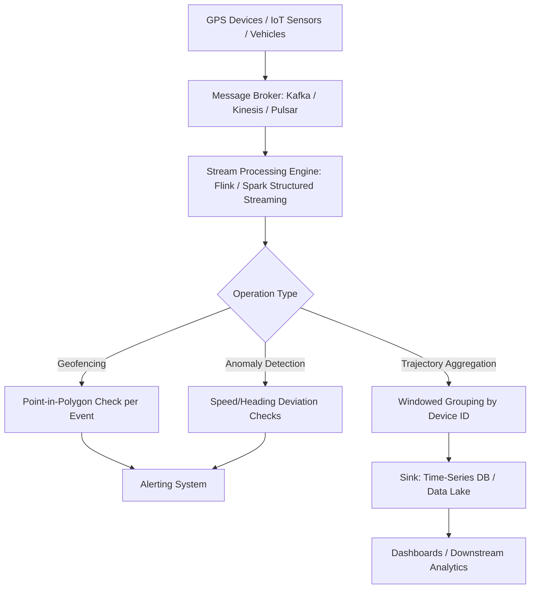

## Real-Time Geospatial Data Streaming


### Overview

Real-time geospatial data streaming involves continuously ingesting, processing, and analyzing location-based data as it is generated, rather than in scheduled batches. This is essential for use cases with low-latency requirements: fleet tracking, ride-hailing dispatch, disaster/emergency response, IoT sensor networks, and live map applications. It combines general-purpose stream processing infrastructure (Kafka, Kinesis, Flink) with spatial indexing and windowing techniques adapted for continuously moving or updating geometries.

### Key Points

- Streaming pipelines process data as unbounded, continuously arriving events rather than finite datasets, requiring **windowing** (time-based or count-based grouping) to perform aggregations that would otherwise be trivial in batch processing
- Spatial operations on streams (e.g., "alert when a vehicle enters a geofence") must be evaluated incrementally per event rather than via a single batch spatial join, since the full dataset never exists at once
- **Event time vs. processing time** distinction matters significantly for geospatial streams: GPS devices may buffer and send delayed batches, so systems must handle out-of-order arrival relative to when the position was actually recorded

### Streaming Architecture



### Geofencing: Incremental Point-in-Polygon Evaluation

Geofencing requires testing each incoming point against one or more polygons in near-real time. Since polygon sets are typically small and relatively static compared to the event stream, they are usually loaded into memory and spatially indexed (R-tree) once, then reused across all incoming events.

```python
from shapely.geometry import Point, shape
from rtree import index
import json

# Load geofences once at startup
geofences = []
idx = index.Index()
with open("geofences.geojson") as f:
    features = json.load(f)["features"]
    for i, feature in enumerate(features):
        geom = shape(feature["geometry"])
        geofences.append((feature["properties"]["name"], geom))
        idx.insert(i, geom.bounds)

def check_geofence(lat: float, lon: float):
    pt = Point(lon, lat)
    candidate_ids = list(idx.intersection(pt.bounds))
    for i in candidate_ids:
        name, geom = geofences[i]
        if geom.contains(pt):
            return name
    return None
```

### Apache Flink for Geospatial Stream Processing

Flink is a common choice for stateful, low-latency stream processing with native support for event-time windowing and exactly-once processing semantics.

```java
// Conceptual Flink DataStream pipeline (Java)
DataStream<GpsPing> pings = env
    .addSource(new FlinkKafkaConsumer<>("gps-pings", schema, props))
    .assignTimestampsAndWatermarks(
        WatermarkStrategy.<GpsPing>forBoundedOutOfOrderness(Duration.ofSeconds(10))
            .withTimestampAssigner((ping, ts) -> ping.getEventTime())
    );

DataStream<GeofenceAlert> alerts = pings
    .keyBy(GpsPing::getVehicleId)
    .process(new GeofenceCheckFunction(geofenceIndex));

alerts.addSink(new AlertSink());
```

### Spark Structured Streaming with Spatial Joins (via Sedona)

```python
from sedona.spark import SedonaContext

sedona = SedonaContext.create(spark)

stream_df = spark.readStream \
    .format("kafka") \
    .option("kafka.bootstrap.servers", "kafka-broker:9092") \
    .option("subscribe", "gps-pings") \
    .load()

parsed_df = stream_df.selectExpr("CAST(value AS STRING) as json_str") \
    .select(from_json(col("json_str"), ping_schema).alias("data")) \
    .select("data.*")

geofences_df = sedona.read.format("geojson").load("geofences.geojson")

joined = parsed_df.withColumn(
    "point_geom", expr("ST_Point(lon, lat)")
).join(
    geofences_df,
    expr("ST_Contains(geofences_df.geometry, point_geom)")
)

query = joined.writeStream \
    .format("console") \
    .outputMode("append") \
    .start()
```

### Windowed Trajectory Aggregation

Grouping continuous GPS pings into per-vehicle trajectory segments over sliding or tumbling time windows enables computing derived metrics (average speed, distance traveled, dwell time) without waiting for a full batch cycle.

```python
from pyspark.sql.functions import window, col, avg

trajectory_agg = parsed_df \
    .withWatermark("event_time", "1 minute") \
    .groupBy(
        col("vehicle_id"),
        window(col("event_time"), "5 minutes", "1 minute")  # sliding window
    ) \
    .agg(avg("speed").alias("avg_speed"))
```

$$v_{avg} = \frac{1}{n}\sum_{i=1}^{n} v_i \quad \text{for events within window } [t, t+\Delta t]$$

### Managed Cloud Streaming Services

| Service | Provider | Notes |
| --- | --- | --- |
| Amazon Kinesis Data Streams | AWS | Integrates with Kinesis Analytics for windowed SQL |
| Amazon MSK (Managed Kafka) | AWS | Fully managed Kafka clusters |
| Google Pub/Sub + Dataflow | Google Cloud | Dataflow (Apache Beam) for stream/batch unification |
| Azure Event Hubs + Stream Analytics | Microsoft | Native geospatial functions in Stream Analytics SQL |
| Confluent Cloud | Confluent | Managed Kafka with ksqlDB for stream SQL |

### Practical Example: Live Fleet Anomaly Detection

**Scenario**: Detect vehicles deviating significantly from an expected route in real time.

```python
from shapely.geometry import LineString, Point

def deviation_distance(current_point: Point, expected_route: LineString) -> float:
    return current_point.distance(expected_route)

DEVIATION_THRESHOLD_METERS = 500

def process_ping(ping: dict, route: LineString):
    pt = Point(ping["lon"], ping["lat"])
    # Note: for accurate meter-based distance, geometries should be
    # in a projected CRS (e.g., UTM), not geographic WGS84 degrees
    dist = deviation_distance(pt, route)
    if dist > DEVIATION_THRESHOLD_METERS:
        return {
            "vehicle_id": ping["vehicle_id"],
            "alert": "route_deviation",
            "distance_m": dist,
            "timestamp": ping["event_time"]
        }
    return None
```

**Output**: A stream of alert events emitted only when a vehicle's live position exceeds the deviation threshold from its assigned route, consumable by a downstream dashboard or notification service. [Inference — real-world alert latency depends on message broker throughput, processing parallelism, and network conditions]

### Handling Late and Out-of-Order Events

- **Watermarks**: A declared threshold (e.g., "tolerate up to 10 seconds of lateness") after which the stream processor considers a window closed and stops waiting for further events
- **Allowed lateness**: Some frameworks (Flink) support emitting updated results even after a window closes if sufficiently late data still arrives, at the cost of additional state retention
- **Session windows**: Useful for trip/trajectory segmentation, where a "session" (e.g., a delivery trip) is defined by a gap in activity rather than a fixed time interval

### Common Pitfalls

- **Using geographic (degree-based) distance for geofencing thresholds**: Distance and buffer calculations in WGS84 degrees do not correspond to consistent real-world distances; projected CRS or haversine-based calculations are required for accurate metric thresholds
- **Unbounded state growth**: Keeping all historical points per device in memory for trajectory reconstruction without eviction policies leads to memory exhaustion over long-running streams
- **Ignoring event-time vs. processing-time**: Aggregating strictly by arrival time rather than the device's recorded timestamp produces misleading results when network delays cause bursty, delayed delivery
- **Static geofence assumptions**: Reloading geofence definitions requires care in streaming systems to avoid processing pauses or inconsistent state across parallel task instances

### Related Topics

- Scalable Geospatial Data Pipelines
- Big Data Concepts for Geospatial Analysis
- Apache Kafka and Flink Architecture Fundamentals
- Trajectory Data Mining and Movement Pattern Analysis
- IoT Sensor Networks for Environmental Monitoring
- Time-Series Databases for Geospatial Data (TimescaleDB, InfluxDB)
- Geofencing Algorithms and Spatial Indexing (R-tree, H3)