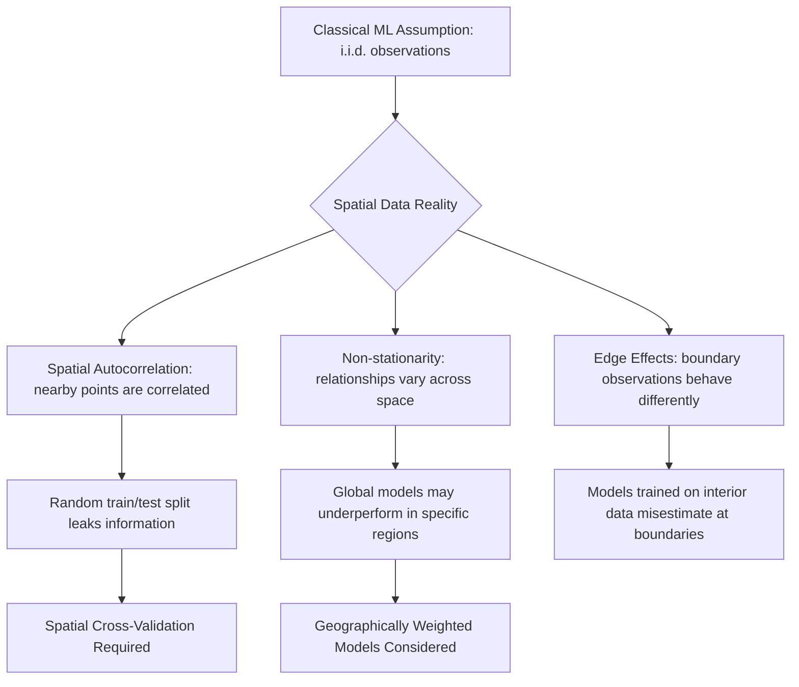

## Machine Learning Fundamentals for Spatial Data


### Overview

Machine learning on spatial data applies standard ML paradigms—supervised, unsupervised, and increasingly deep learning—to datasets where location is not merely an attribute but a fundamental structural property influencing relationships between observations. This chapter foundation covers why spatial data violates core assumptions of classical ML (independence of observations), and the adapted techniques required to model, validate, and interpret results correctly.

### Key Points

- **Spatial autocorrelation** (Tobler's First Law: "everything is related to everything else, but near things are more related than distant things") violates the i.i.d. (independent and identically distributed) assumption underlying most classical statistical learning theory
- Standard k-fold cross-validation randomly shuffles observations, which for spatial data causes **spatial leakage**: training and test points that are geographically adjacent share so much spatial autocorrelation that validation metrics become overly optimistic and unrepresentative of true generalization
- Spatial data introduces unique feature engineering opportunities absent in tabular ML: distance-to-nearest-feature, spatial lag variables, zonal statistics, and neighborhood aggregations

### Why Spatial Data Breaks Classical ML Assumptions



### Measuring Spatial Autocorrelation: Moran's I

Moran's I is the standard statistic for quantifying spatial autocorrelation in a variable, indicating whether similar values cluster spatially, are dispersed, or occur randomly.

$$I = \frac{n}{W} \cdot \frac{\sum_{i}\sum_{j} w_{ij}(x_i - \bar{x})(x_j - \bar{x})}{\sum_{i}(x_i - \bar{x})^2}$$

where $n$ is the number of observations, $w_{ij}$ is a spatial weight between locations $i$ and $j$, and $W$ is the sum of all weights. Values near $+1$ indicate strong positive spatial autocorrelation (clustering); values near $-1$ indicate dispersion; values near $0$ suggest spatial randomness.

```python
from esda.moran import Moran
from libpysal.weights import Queen
import geopandas as gpd

gdf = gpd.read_file("study_area.geojson")
w = Queen.from_dataframe(gdf)
w.transform = "r"

moran = Moran(gdf["target_variable"], w)
print(f"Moran's I: {moran.I:.4f}, p-value: {moran.p_sim:.4f}")
```

### Feature Engineering for Spatial ML

#### Spatial Lag Variables

A spatial lag feature summarizes the values of a target variable among a location's neighbors, capturing local spatial context as a predictive feature.

```python
import libpysal
from libpysal.weights import KNN

w = KNN.from_dataframe(gdf, k=5)
w.transform = "r"

gdf["spatial_lag"] = libpysal.weights.lag_spatial(w, gdf["target_variable"])
```

#### Distance-to-Feature

```python
from shapely.ops import nearest_points

def distance_to_nearest(point, feature_gdf):
    nearest_geom = feature_gdf.geometry.unary_union
    nearest = nearest_points(point, nearest_geom)[1]
    return point.distance(nearest)

gdf["dist_to_road"] = gdf.geometry.apply(lambda p: distance_to_nearest(p, roads_gdf))
```

#### Zonal Statistics as Features

```python
from rasterstats import zonal_stats

stats = zonal_stats(gdf, "elevation.tif", stats=["mean", "std", "min", "max"])
gdf["elev_mean"] = [s["mean"] for s in stats]
```

### Spatial Cross-Validation Strategies

Standard random k-fold cross-validation should be avoided for spatial models due to leakage. Alternatives include:

| Strategy | Description |
| --- | --- |
| **Spatial block CV** | Divide study area into contiguous blocks; assign entire blocks to train/test folds |
| **Buffered leave-one-out** | Exclude a buffer radius around each test point from the training set |
| **Spatial clustering CV** | Cluster locations (e.g., k-means on coordinates) and use clusters as folds |
| **Leave-region-out** | Hold out an entire geographic region (e.g., a province) as the test set |

```python
from sklearn.model_selection import BaseCrossValidator
import numpy as np

class SpatialBlockCV(BaseCrossValidator):
    def __init__(self, n_blocks=5, block_col="block_id"):
        self.n_blocks = n_blocks
        self.block_col = block_col

    def split(self, X, y=None, groups=None):
        blocks = X[self.block_col].unique()
        np.random.shuffle(blocks)
        fold_blocks = np.array_split(blocks, self.n_blocks)
        for test_blocks in fold_blocks:
            test_idx = X[X[self.block_col].isin(test_blocks)].index.values
            train_idx = X[~X[self.block_col].isin(test_blocks)].index.values
            yield train_idx, test_idx

    def get_n_splits(self, X=None, y=None, groups=None):
        return self.n_blocks
```

### Geographically Weighted Regression (GWR)

Unlike a global regression model that assumes constant relationships across the entire study area, GWR fits a separate local regression at each location, weighted by proximity, capturing spatial non-stationarity in relationships between variables.

$$y_i = \beta_0(u_i, v_i) + \sum_{k} \beta_k(u_i, v_i) x_{ik} + \epsilon_i$$

where $(u_i, v_i)$ are the coordinates of location $i$, and coefficients $\beta_k$ vary by location rather than being fixed globally.

```python
from mgwr.gwr import GWR
from mgwr.sel_bw import Sel_BW

coords = list(zip(gdf.geometry.x, gdf.geometry.y))
y = gdf["target_variable"].values.reshape(-1, 1)
X = gdf[["feature1", "feature2"]].values

bw_selector = Sel_BW(coords, y, X)
bandwidth = bw_selector.search()

gwr_model = GWR(coords, y, X, bandwidth)
results = gwr_model.fit()
print(results.summary())
```

### Common Spatial ML Model Types

| Model Family | Spatial Adaptation |
| --- | --- |
| Random Forest / Gradient Boosting | Feature-engineered spatial lags, distances, zonal stats fed as standard tabular inputs |
| Geographically Weighted Regression | Location-varying coefficients |
| Spatial Autoregressive Models (SAR, CAR) | Explicit spatial dependency term in the model equation |
| Graph Neural Networks | Spatial adjacency represented as graph edges |
| Convolutional Neural Networks | Applied to raster/imagery inputs, exploiting local pixel neighborhoods |
| Kriging / Gaussian Processes | Geostatistical interpolation with explicit spatial covariance modeling |

### Practical Example: Predicting Land Value with Spatial Features

**Scenario**: Predict parcel land value using a Random Forest model enriched with spatially engineered features, validated using spatial block cross-validation.

```python
import geopandas as gpd
from sklearn.ensemble import RandomForestRegressor
from sklearn.metrics import mean_absolute_error
import numpy as np

gdf = gpd.read_file("parcels.geojson")

# Feature engineering
w = KNN.from_dataframe(gdf, k=8)
w.transform = "r"
gdf["value_spatial_lag"] = libpysal.weights.lag_spatial(w, gdf["land_value"])
gdf["dist_to_cbd"] = gdf.geometry.apply(lambda p: p.distance(cbd_point))

feature_cols = ["parcel_size", "value_spatial_lag", "dist_to_cbd", "zoning_code"]
X = gdf[feature_cols]
y = gdf["land_value"]

# Assign spatial blocks (e.g., via grid cell id) for CV
gdf["block_id"] = (gdf.geometry.x // 5000).astype(str) + "_" + (gdf.geometry.y // 5000).astype(str)

cv = SpatialBlockCV(n_blocks=5, block_col="block_id")
mae_scores = []

for train_idx, test_idx in cv.split(gdf):
    model = RandomForestRegressor(n_estimators=200, random_state=42)
    model.fit(X.iloc[train_idx], y.iloc[train_idx])
    preds = model.predict(X.iloc[test_idx])
    mae_scores.append(mean_absolute_error(y.iloc[test_idx], preds))

print(f"Mean Spatial CV MAE: {np.mean(mae_scores):.2f}")
```

**Output**: A cross-validated MAE estimate that reflects realistic generalization to unseen geographic regions, typically higher (more conservative) than the MAE obtained from naive random k-fold CV on the same data due to the removal of spatial leakage. [Inference — the magnitude of the difference depends on the strength of spatial autocorrelation in the specific dataset]

### Common Pitfalls

- **Using random k-fold CV on spatial data**: Produces overly optimistic performance estimates due to spatial leakage between train and test sets
- **Ignoring coordinate reference system when computing distances**: Distance-based features computed in geographic (degree-based) coordinates rather than a projected CRS yield distorted, non-metric values
- **Treating spatial lag features as fully independent inputs**: Spatial lag variables encode information about the target variable itself; care is needed to avoid target leakage into these engineered features
- **Assuming global model relationships hold everywhere**: A single global model can mask important regional heterogeneity that GWR or region-stratified models would reveal
- **Overlooking edge effects**: Locations near the boundary of a study area have fewer/incomplete neighbors, which can bias spatial lag and zonal statistic calculations

### Related Topics

- Deep Learning for Satellite Image Classification and Segmentation
- Spatial Interpolation and Geostatistics (Kriging)
- Graph Neural Networks for Spatial Network Data
- Distributed Processing of Large Raster Datasets
- Feature Engineering Pipelines for Environmental Prediction Models
- Spatial Statistics: Hot Spot Analysis and Cluster Detection
- Geographically Weighted Regression and Multiscale GWR (MGWR)