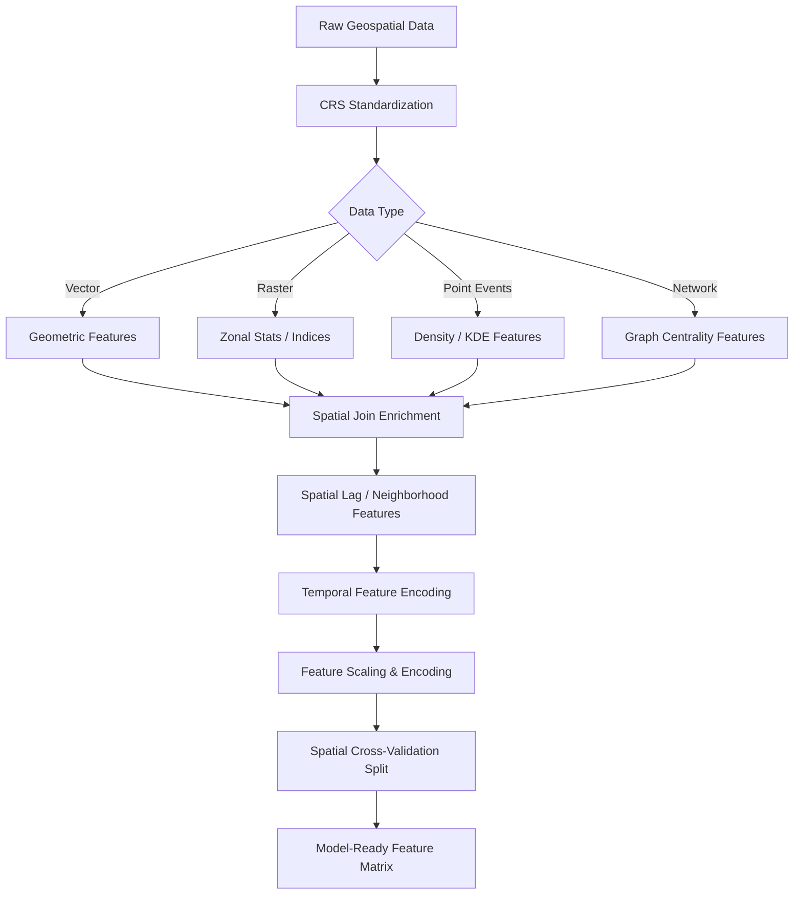

## Feature Engineering for Geospatial Datasets

### Overview

Feature engineering for geospatial datasets is the process of transforming raw spatial, temporal, and attribute data into predictive variables suitable for machine learning models. Unlike tabular data engineering, geospatial feature engineering must account for spatial autocorrelation, coordinate reference systems (CRS), scale dependency (the Modifiable Areal Unit Problem), multi-source data fusion (raster, vector, point cloud), and temporal dynamics. The goal is to encode spatial relationships—proximity, adjacency, density, connectivity, and context—into numeric or categorical features that a model can consume.

**Key Points**

- Geospatial features fall into four broad families: geometric/positional, neighborhood/context, raster-derived, and network-based.
- Spatial autocorrelation (Tobler's First Law: "everything is related to everything else, but near things are more related than distant things") must be explicitly engineered or accounted for, or models will underperform or leak information.
- CRS consistency and projection choice materially affect distance- and area-based features.
- Feature engineering pipelines should be reproducible and CRS-aware, typically built with GeoPandas, Rasterio, PySAL, and scikit-learn `Pipeline`/`ColumnTransformer` objects.

### Foundational Concepts

#### Coordinate Reference Systems and Projections

Raw latitude/longitude (EPSG:4326) is angular and unsuitable for direct distance or area calculations because degrees do not correspond to constant linear distances. Before deriving distance, area, or density features, data should be reprojected into an equal-area or equidistant projected CRS appropriate to the study region (e.g., UTM zone, Albers Equal Area, or a national grid system).

$$d_{planar} = \sqrt{(x_2 - x_1)^2 + (y_2 - y_1)^2}$$

For large-extent or global datasets, great-circle (haversine) distance is used instead:

$$d_{haversine} = 2r \cdot \arcsin\left(\sqrt{\sin^2\left(\frac{\Delta\phi}{2}\right) + \cos\phi_1 \cos\phi_2 \sin^2\left(\frac{\Delta\lambda}{2}\right)}\right)$$

where $\phi$ is latitude, $\lambda$ is longitude, and $r$ is Earth's radius.

#### The Modifiable Areal Unit Problem (MAUP)

Aggregating point data (e.g., crime incidents, sensor readings) into polygons (census tracts, grid cells) can produce different statistical results depending on the zoning scheme and scale chosen. Feature engineering decisions—cell size for gridding, choice of administrative boundary—should be treated as hyperparameters and tested for sensitivity. [Inference: the degree of sensitivity is dataset- and task-dependent and should be validated empirically rather than assumed.]

### Feature Categories

#### 1. Geometric and Positional Features

Derived directly from geometry objects (points, lines, polygons):

| Feature | Description | Applicable Geometry |
| --- | --- | --- |
| Centroid coordinates (x, y) | Representative point of a polygon | Polygon |
| Area | Planar area in projected units | Polygon |
| Perimeter | Boundary length | Polygon |
| Compactness / shape index | e.g., Polsby-Popper: $4\pi \cdot A / P^2$ | Polygon |
| Length | Total length of a line feature | Line |
| Sinuosity | Path length / straight-line distance | Line |
| Bounding box dimensions | Width, height, aspect ratio | Any |
| Elevation, slope, aspect | From DEM sampling at point location | Point |
| Orientation | Principal axis angle | Polygon/Line |

**Example**

```python
import geopandas as gpd

gdf = gpd.read_file("parcels.shp").to_crs(epsg=32633)  # UTM zone for planar accuracy

gdf["area_m2"] = gdf.geometry.area
gdf["perimeter_m"] = gdf.geometry.length
gdf["centroid_x"] = gdf.geometry.centroid.x
gdf["centroid_y"] = gdf.geometry.centroid.y
gdf["compactness"] = (4 * 3.14159 * gdf["area_m2"]) / (gdf["perimeter_m"] ** 2)
```

#### 2. Proximity and Distance-Based Features

Encode relationships to reference features (roads, water bodies, points of interest):

- **Euclidean/network distance to nearest feature** (e.g., distance to nearest hospital, highway, fault line)
- **Distance to k-th nearest neighbor** of the same feature type
- **Inverse distance weighting (IDW)** aggregates: $w_i = 1/d_i^p$
- **Travel-time or cost-distance** (via network analysis or friction surfaces)

```python
from sklearn.neighbors import BallTree
import numpy as np

coords_target = np.radians(gdf[["lat", "lon"]].values)
coords_ref = np.radians(hospitals[["lat", "lon"]].values)

tree = BallTree(coords_ref, metric="haversine")
dist, idx = tree.query(coords_target, k=1)
gdf["dist_to_hospital_km"] = dist.flatten() * 6371  # Earth radius in km
```

#### 3. Neighborhood and Density Features

Capture local spatial context using a defined neighborhood (radius, k-nearest, or polygon adjacency):

- **Kernel density estimation (KDE)** — smoothed intensity surface of point events
- **Count within buffer** — e.g., number of retail stores within 500m
- **Local averages/sums of attributes** — mean income within 1km
- **Spatial lag features** — weighted average of a target variable among neighbors, commonly built with a spatial weights matrix $W$:

$$\text{lag}(y_i) = \sum_{j} w_{ij} \, y_j$$

This is foundational to spatial econometric models and is implemented via PySAL's `libpysal.weights`.

```python
import libpysal
from libpysal.weights import KNN

w = KNN.from_dataframe(gdf, k=8)
w.transform = "r"  # row-standardized

gdf["spatial_lag_income"] = libpysal.weights.lag_spatial(w, gdf["income"])
```

**Caution:** spatial lag features computed from a target variable are prone to target leakage if not constructed with strict spatial cross-validation (excluding a point's own value and using only training-fold neighbors).

#### 4. Raster and Remote-Sensing-Derived Features

For pixel-based or point-sampled features extracted from raster surfaces (satellite imagery, DEMs, climate grids):

- **Spectral indices**: NDVI $= (NIR - Red)/(NIR + Red)$, NDWI, NDBI, EVI, SAVI
- **Terrain derivatives**: slope, aspect, curvature, topographic wetness index (TWI), hillshade — typically computed via `richdem` or `rasterio` + `numpy` gradient operations
- **Texture features**: Gray-Level Co-occurrence Matrix (GLCM) statistics (contrast, homogeneity, entropy) via `scikit-image`
- **Zonal statistics**: mean, std, min, max, percentile of raster values within a polygon, computed with `rasterstats`
- **Time-series raster aggregates**: seasonal NDVI amplitude, growing degree days, anomaly from climatological mean

```python
import rasterstats

stats = rasterstats.zonal_stats(
    "parcels.shp", "ndvi_2024.tif",
    stats=["mean", "std", "min", "max"],
    geojson_out=False
)
gdf["ndvi_mean"] = [s["mean"] for s in stats]
```

#### 5. Network-Based and Topological Features

For data tied to graph structures (road networks, river networks, utility grids):

- **Node degree / connectivity** — number of edges incident to a node
- **Betweenness / closeness centrality** — importance within the network (via `networkx` or `osmnx`)
- **Accessibility indices** — gravity-model or cumulative-opportunity accessibility to amenities
- **Network distance** vs. straight-line distance ratio (detour index)

```python
import osmnx as ox
import networkx as nx

G = ox.graph_from_place("Manila, Philippines", network_type="drive")
centrality = nx.betweenness_centrality(G, weight="length")
```

#### 6. Temporal and Spatiotemporal Features

For datasets with a time dimension (mobility traces, sensor time series, land-cover change):

- **Lag features** at previous time steps for the same location
- **Rolling statistics** (moving average, rolling std) over time windows
- **Seasonality encodings**: cyclical encoding of day-of-year, month using sine/cosine transforms to preserve periodicity:

$$\sin\left(\frac{2\pi \cdot \text{day}}{365}\right), \quad \cos\left(\frac{2\pi \cdot \text{day}}{365}\right)$$

- **Rate of change** between time-stamped observations at the same location (e.g., deforestation rate, urban expansion rate)
- **Space-time kriging residuals** as anomaly features

#### 7. Categorical and Contextual Encoding

- **Spatial join enrichment**: attaching administrative zone, land-use class, soil type, or climate zone via point-in-polygon join
- **One-hot or target encoding** of categorical zone identifiers
- **H3 / S2 / Geohash spatial indexing**: discretizing continuous coordinates into hierarchical hexagonal or grid cells, useful as categorical features or for aggregation keys

```python
import h3

gdf["h3_index"] = gdf.apply(
    lambda row: h3.latlng_to_cell(row["lat"], row["lon"], resolution=8),
    axis=1
)
```

### Spatial Autocorrelation Diagnostics

Before and after engineering features, it is standard practice to quantify spatial autocorrelation using **Moran's I**:

$$I = \frac{n}{\sum_i \sum_j w_{ij}} \cdot \frac{\sum_i \sum_j w_{ij}(x_i - \bar{x})(x_j - \bar{x})}{\sum_i (x_i - \bar{x})^2}$$

A significantly positive Moran's I confirms clustering, justifying inclusion of spatial-lag or neighborhood-based features. This is computed via `esda.Moran` in PySAL.

### Pipeline Diagram



### Avoiding Spatial Data Leakage

Standard k-fold cross-validation randomly shuffles observations, but spatially autocorrelated data violates the independence assumption, causing training and validation folds to contain near-duplicate spatial neighbors. This inflates validation performance. Mitigations:

- **Spatial blocking / spatial k-fold**: partition folds by geographic block rather than randomly (e.g., via `scikit-learn`'s `GroupKFold` using a spatial block ID, or dedicated tools like `spacv`)
- **Buffer/exclusion zones** around validation points to remove nearby training points
- Recompute neighborhood/lag features **within each fold** using only training-fold data

**Example**

```python
from spacv import SKCV

skcv = SKCV(n_splits=5, buffer_radius=1000)  # meters
for train_idx, test_idx in skcv.split(gdf):
    X_train, X_test = X.iloc[train_idx], X.iloc[test_idx]
```

### Scaling and Normalization Considerations

- Distance and area features typically require log-transformation due to right-skewed distributions.
- Features derived from different CRS units (degrees vs. meters) must be harmonized before scaling.
- Min-max or standard scaling should be fit only on training folds to avoid leakage, consistent with general ML practice, but applied per spatial fold in geospatial contexts.

### Practical Workflow Summary

1. Standardize CRS across all input layers.
2. Extract geometric and positional features from vector layers.
3. Compute zonal statistics and spectral indices from raster layers.
4. Build a spatial weights matrix and derive neighborhood/lag features.
5. Enrich with categorical context via spatial joins.
6. Encode temporal dynamics if applicable.
7. Diagnose spatial autocorrelation (Moran's I) to validate the need for spatial features.
8. Split data using spatial cross-validation, not random splits.
9. Scale/encode features within each fold.

**Related Topics**

- Spatial Autocorrelation and Moran's I / Geary's C
- Spatial Cross-Validation Strategies
- Kriging and Geostatistical Interpolation
- Graph Neural Networks for Spatial Data
- Remote Sensing Time-Series Feature Extraction
- H3/S2 Hierarchical Spatial Indexing
- Land Use/Land Cover Classification with Deep Learning
- Geographically Weighted Regression (GWR)