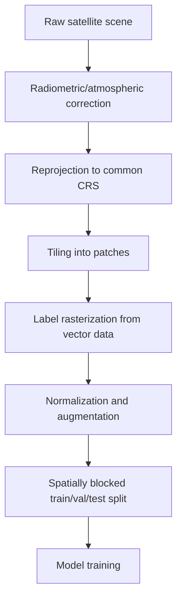

## Deep Learning for Image Classification

### Overview

Deep learning for image classification in geospatial contexts refers to the use of convolutional neural networks (CNNs) and related architectures to assign category labels to satellite or aerial imagery — either at the scene level (e.g., "this tile is agricultural land") or, more commonly in geospatial workflows, at the pixel level (semantic segmentation for land cover mapping). Deep learning models automatically learn hierarchical spatial-spectral features directly from raw pixel data, removing the need for hand-engineered features that dominated traditional remote sensing classification (e.g., NDVI thresholds, texture metrics, decision trees).

**Key Points**

- Scene classification assigns one label per image/tile (e.g., EuroSAT: forest, residential, river).
- Semantic segmentation assigns a label per pixel (e.g., land cover mapping: water, forest, urban, bare soil).
- Object detection identifies and localizes discrete objects (e.g., buildings, ships, vehicles) with bounding boxes.
- Multispectral and hyperspectral imagery requires architectural adaptation beyond standard RGB-trained CNNs.
- Domain-specific challenges include class imbalance, limited labeled data, atmospheric variation, and multi-temporal/multi-sensor inconsistency.

### Why Deep Learning for Geospatial Imagery

Traditional pixel-based classifiers (maximum likelihood, random forest, SVM) treat each pixel independently or rely on shallow spatial context (texture windows). CNNs instead learn spatial hierarchies — edges, textures, shapes, and object-level patterns — through successive convolutional layers, which is particularly valuable for distinguishing spectrally similar but spatially distinct classes (e.g., asphalt roads vs. asphalt rooftops).

Geospatial imagery differs from typical computer vision datasets (ImageNet) in several important ways:

| Property | Natural Images | Geospatial Imagery |
| --- | --- | --- |
| Viewpoint | Ground-level, canonical orientation | Nadir/oblique, rotation-invariant |
| Channels | RGB (3) | Multispectral (4–13+), hyperspectral (100s) |
| Object scale | Large, centered | Small, scattered across large scenes |
| Resolution | Fixed pixel grid | Variable ground sample distance (GSD) |
| Temporal dimension | Usually absent | Often critical (crop phenology, change detection) |
| Labels | Abundant, crowd-sourced | Scarce, expert-annotated, expensive |

### Core Architectures

#### Convolutional Neural Networks (CNNs)

The foundational architecture. A CNN applies learnable filters (kernels) across the image via convolution, producing feature maps that are progressively downsampled (pooling/strided convolution) while increasing in channel depth.

$$y_{i,j,k} = \sigma\left(\sum_{m,n,c} w_{m,n,c,k} \cdot x_{i+m,j+n,c} + b_k\right)$$

where $w$ is the learned kernel, $x$ is the input feature map, $b_k$ is a bias term, and $\sigma$ is a nonlinear activation (commonly ReLU).

Common backbone families used in geospatial classification:

- **ResNet** (ResNet-18/34/50/101) — residual connections mitigate vanishing gradients, widely used as a transfer-learning backbone.
- **EfficientNet** — compound scaling of depth/width/resolution for parameter efficiency, popular for resource-constrained deployment (edge inference on drones/satellites).
- **VGG** — simple, uniform architecture, still used as a baseline in remote sensing benchmarks.
- **DenseNet** — dense connectivity improves feature reuse, useful with limited labeled data.

#### Vision Transformers (ViT) and Hybrid Architectures

Vision Transformers split an image into patches, linearly embed them, and process them with self-attention rather than convolution. In geospatial applications, ViTs and hybrid CNN-Transformer models (e.g., Swin Transformer) have shown strong performance on scene classification benchmarks, particularly when pretrained on large remote sensing corpora, because self-attention captures long-range spatial dependencies (e.g., relating a field's shape to distant field boundaries) that convolution's local receptive field handles less naturally. [Inference — relative performance depends on dataset size, pretraining corpus, and task; ViTs generally require more training data than CNNs to reach comparable accuracy without strong pretraining.]

#### Semantic Segmentation Architectures

For pixel-level land cover/land use classification:

- **U-Net** — encoder-decoder with skip connections; the dominant architecture in remote sensing segmentation due to strong performance with limited training data.
- **DeepLabv3+** — atrous (dilated) convolutions capture multi-scale context without losing spatial resolution.
- **SegFormer** — transformer-based encoder with a lightweight MLP decoder, efficient for high-resolution imagery.
- **Feature Pyramid Network (FPN)** — multi-scale feature fusion, useful for detecting objects/classes at varying spatial scales (e.g., individual trees vs. forest stands).

**Example**

A U-Net for binary building footprint segmentation from a 4-band (RGBN) satellite tile:

```python
import torch
import torch.nn as nn

class DoubleConv(nn.Module):
    def __init__(self, in_ch, out_ch):
        super().__init__()
        self.block = nn.Sequential(
            nn.Conv2d(in_ch, out_ch, 3, padding=1),
            nn.BatchNorm2d(out_ch),
            nn.ReLU(inplace=True),
            nn.Conv2d(out_ch, out_ch, 3, padding=1),
            nn.BatchNorm2d(out_ch),
            nn.ReLU(inplace=True),
        )

    def forward(self, x):
        return self.block(x)

class UNet(nn.Module):
    def __init__(self, in_channels=4, out_channels=1):
        super().__init__()
        self.enc1 = DoubleConv(in_channels, 64)
        self.enc2 = DoubleConv(64, 128)
        self.pool = nn.MaxPool2d(2)
        self.bottleneck = DoubleConv(128, 256)
        self.up2 = nn.ConvTranspose2d(256, 128, 2, stride=2)
        self.dec2 = DoubleConv(256, 128)
        self.up1 = nn.ConvTranspose2d(128, 64, 2, stride=2)
        self.dec1 = DoubleConv(128, 64)
        self.out = nn.Conv2d(64, out_channels, 1)

    def forward(self, x):
        e1 = self.enc1(x)
        e2 = self.enc2(self.pool(e1))
        b = self.bottleneck(self.pool(e2))
        d2 = self.dec2(torch.cat([self.up2(b), e2], dim=1))
        d1 = self.dec1(torch.cat([self.up1(d2), e1], dim=1))
        return torch.sigmoid(self.out(d1))
```

This uses skip connections (`torch.cat`) to preserve fine spatial detail lost during downsampling — critical for delineating building edges accurately.

### Handling Multispectral and Hyperspectral Inputs

Standard CNN backbones (ResNet, EfficientNet) pretrained on ImageNet expect 3-channel RGB input. Adapting to multispectral (e.g., Sentinel-2's 13 bands) or hyperspectral (100+ narrow bands) data requires one of:

1. **First-layer modification** — replace the input convolution to accept $N$ channels, initializing new channel weights by averaging or duplicating RGB weights.
2. **Band selection/composite** — reduce to 3 representative bands (e.g., false-color composites) to reuse pretrained weights unmodified, at the cost of discarding spectral information.
3. **Dimensionality reduction** — apply PCA or autoencoders to compress hyperspectral cubes before feeding a standard CNN.
4. **3D CNNs** — convolve jointly across spatial and spectral dimensions, common in hyperspectral classification (e.g., HybridSN) to exploit spectral correlation between adjacent bands.

$$y = \sigma\left(\sum_{d,m,n} w_{d,m,n} \cdot x_{i+m,j+n,k+d} + b\right)$$

where the additional index $d$ convolves across the spectral dimension $k$.

### Transfer Learning and Domain-Specific Pretraining

Because labeled geospatial data is expensive to produce, transfer learning is standard practice:

- **ImageNet pretraining** — a reasonable starting point for RGB or RGB-like composites, though there is a documented domain gap between ground-level natural images and nadir overhead imagery.
- **Remote-sensing-specific pretraining** — foundation models trained directly on satellite imagery corpora (e.g., SatMAE, Prithvi, SSL4EO-S12, Clay) via self-supervised learning (masked autoencoding, contrastive learning) generally transfer better to downstream geospatial tasks than ImageNet weights. [Inference — the magnitude of improvement is task- and dataset-dependent and should be benchmarked per use case.]
- **Fine-tuning strategy** — freeze early layers (generic edge/texture features) and fine-tune later layers on the target dataset; unfreeze progressively as labeled data volume increases.

### Data Preparation Pipeline

**Key Points**

- Tiling: large scenes (e.g., a full Sentinel-2 granule, ~100km × 100km) must be split into fixed-size patches (e.g., 256×256) for model input.
- Normalization: reflectance values typically scaled to [0,1] or standardized per-band using dataset-wide mean/std, since raw digital number ranges vary by sensor.
- Augmentation: geospatial imagery supports aggressive rotation (0°, 90°, 180°, 270°) and flipping since there is no canonical "up" orientation, unlike natural images.
- Label alignment: rasterized vector labels (shapefiles/GeoJSON) must be reprojected and resampled to match imagery resolution and CRS exactly.
- Train/val/test splitting should be spatially blocked (not random pixel/tile shuffling) to prevent spatial autocorrelation from leaking information between splits.



### Loss Functions

- **Cross-entropy loss** — standard for multi-class scene classification.
- **Weighted cross-entropy** — addresses class imbalance (e.g., "water" pixels vastly outnumbered by "urban" in most scenes).
- **Dice loss / Jaccard (IoU) loss** — preferred for segmentation tasks with severe class imbalance (e.g., small building footprints against large background).
- **Focal loss** — down-weights easy examples, useful when rare classes (e.g., wildfire burn scars) are heavily underrepresented.

$$\text{Dice Loss} = 1 - \frac{2\sum p_i g_i}{\sum p_i + \sum g_i}$$

where $p_i$ is the predicted probability and $g_i$ is the ground truth label for pixel $i$.

### Evaluation Metrics

| Metric | Use Case | Formula/Notes |
| --- | --- | --- |
| Overall Accuracy | Scene classification | Correct predictions / total |
| Kappa coefficient | Accounts for chance agreement | Standard in remote sensing accuracy assessment |
| IoU / Jaccard Index | Segmentation | $\frac{TP}{TP+FP+FN}$ per class |
| F1-score | Imbalanced classes | Harmonic mean of precision/recall |
| Confusion matrix | Per-class error analysis | Reveals systematic class confusion (e.g., shadow vs. water) |

### Architecture Diagram

<svg xmlns="http://www.w3.org/2000/svg" viewBox="0 0 900 340">
<text x="450" y="24" font-size="16" font-weight="bold" text-anchor="middle" fill="#1a1a1a">Deep Learning Image Classification Pipeline (svg_diagram)</text>
<rect x="20" y="70" width="110" height="60" rx="6" fill="#dbeafe" stroke="#1e40af" />
<text x="75" y="95" font-size="12" text-anchor="middle" fill="#1a1a1a">Multispectral</text>
<text x="75" y="110" font-size="12" text-anchor="middle" fill="#1a1a1a">Input Tile</text>
<line x1="130" y1="100" x2="180" y2="100" stroke="#1a1a1a" stroke-width="2" marker-end="url(#arrow)" />
<rect x="180" y="60" width="120" height="80" rx="6" fill="#dcfce7" stroke="#166534" />
<text x="240" y="95" font-size="12" text-anchor="middle" fill="#1a1a1a">CNN Backbone</text>
<text x="240" y="110" font-size="12" text-anchor="middle" fill="#1a1a1a">(ResNet/EfficientNet)</text>
<line x1="300" y1="100" x2="350" y2="100" stroke="#1a1a1a" stroke-width="2" marker-end="url(#arrow)" />
<rect x="350" y="60" width="120" height="80" rx="6" fill="#fef3c7" stroke="#92400e" />
<text x="410" y="90" font-size="12" text-anchor="middle" fill="#1a1a1a">Feature Maps</text>
<text x="410" y="105" font-size="12" text-anchor="middle" fill="#1a1a1a">(multi-scale)</text>
<line x1="470" y1="100" x2="520" y2="100" stroke="#1a1a1a" stroke-width="2" marker-end="url(#arrow)" />
<rect x="520" y="30" width="140" height="60" rx="6" fill="#ede9fe" stroke="#5b21b6" />
<text x="590" y="55" font-size="12" text-anchor="middle" fill="#1a1a1a">Classification Head</text>
<text x="590" y="70" font-size="11" text-anchor="middle" fill="#1a1a1a">(scene label)</text>
<rect x="520" y="110" width="140" height="60" rx="6" fill="#fee2e2" stroke="#991b1b" />
<text x="590" y="135" font-size="12" text-anchor="middle" fill="#1a1a1a">Segmentation Head</text>
<text x="590" y="150" font-size="11" text-anchor="middle" fill="#1a1a1a">(per-pixel mask)</text>
<line x1="470" y1="100" x2="520" y2="60" stroke="#1a1a1a" stroke-width="2" marker-end="url(#arrow)" />
<line x1="470" y1="100" x2="520" y2="140" stroke="#1a1a1a" stroke-width="2" marker-end="url(#arrow)" />
<line x1="660" y1="60" x2="720" y2="60" stroke="#1a1a1a" stroke-width="2" marker-end="url(#arrow)" />
<line x1="660" y1="140" x2="720" y2="140" stroke="#1a1a1a" stroke-width="2" marker-end="url(#arrow)" />
<rect x="720" y="30" width="150" height="60" rx="6" fill="#e0f2fe" stroke="#0369a1" />
<text x="795" y="55" font-size="12" text-anchor="middle" fill="#1a1a1a">Land Cover Class</text>
<text x="795" y="70" font-size="11" text-anchor="middle" fill="#1a1a1a">e.g., "Forest"</text>
<rect x="720" y="110" width="150" height="60" rx="6" fill="#e0f2fe" stroke="#0369a1" />
<text x="795" y="135" font-size="12" text-anchor="middle" fill="#1a1a1a">GeoTIFF Mask</text>
<text x="795" y="150" font-size="11" text-anchor="middle" fill="#1a1a1a">per-pixel labels</text>
<rect x="180" y="220" width="600" height="90" rx="6" fill="#f9fafb" stroke="#6b7280" stroke-dasharray="4" />
<text x="480" y="245" font-size="12" text-anchor="middle" fill="#1a1a1a">Training Loop: forward pass → loss (CE/Dice/Focal) → backprop</text>
<text x="480" y="265" font-size="12" text-anchor="middle" fill="#1a1a1a">→ optimizer step (Adam/SGD) → validation IoU/accuracy → checkpoint</text>
<text x="480" y="285" font-size="12" text-anchor="middle" fill="#1a1a1a">Augmentation: rotation, flip, spectral jitter, atmospheric simulation</text>
</svg>

### Common Benchmark Datasets

| Dataset | Task | Classes | Sensor |
| --- | --- | --- | --- |
| EuroSAT | Scene classification | 10 | Sentinel-2 |
| BigEarthNet | Multi-label classification | 19–43 | Sentinel-1/2 |
| DeepGlobe Land Cover | Segmentation | 7 | High-res aerial |
| SpaceNet (buildings/roads) | Segmentation/detection | Building/road | WorldView |
| UC Merced Land Use | Scene classification | 21 | Aerial |
| DOTA | Object detection | 15–18 | Aerial |

### Operational Considerations

- **Compute constraints for onboard/edge inference**: satellite or drone-based inference requires lightweight architectures (MobileNet, quantized EfficientNet) due to power and hardware limits.
- **Atmospheric and illumination variability**: models trained on cloud-free, single-season imagery often generalize poorly to different seasons, sun angles, or atmospheric conditions; domain adaptation or multi-temporal training data mitigates this. [Inference — degree of generalization loss varies by sensor, region, and training data diversity.]
- **Georeferencing of outputs**: predicted masks/classifications must retain or be reprojected back to the original coordinate reference system (CRS) and affine transform for integration into GIS pipelines (e.g., writing results as GeoTIFF with rasterio).
- **MLOps for geospatial**: versioning of both model weights and the specific imagery/label dataset (including acquisition date and preprocessing parameters) is necessary for reproducibility, given how sensitive geospatial models are to sensor and atmospheric conditions.

**Example**

Writing model predictions back to a georeferenced GeoTIFF using `rasterio`:

```python
import rasterio
import numpy as np

with rasterio.open("input_tile.tif") as src:
    profile = src.profile
    transform = src.transform
    crs = src.crs

profile.update(dtype=rasterio.uint8, count=1)

with rasterio.open("prediction_mask.tif", "w", **profile) as dst:
    dst.write(prediction_array.astype(np.uint8), 1)
```

This preserves the original CRS and affine transform so the output mask aligns correctly with the source imagery in GIS software (QGIS, ArcGIS).

### Common Pitfalls

- Random (non-spatial) train/test splitting inflates accuracy due to spatial autocorrelation between nearby tiles.
- Ignoring class imbalance leads to models that trivially predict the majority class (e.g., background/non-building).
- Applying ImageNet normalization statistics to multispectral data without recomputing dataset-specific band statistics degrades convergence.
- Failing to account for edge effects at tile boundaries causes visible seams/artifacts when mosaicking segmentation outputs back into large-area maps; overlapping tiles with blending (e.g., Gaussian-weighted stitching) mitigate this.

**Next Steps**

- Semantic Segmentation Architectures for Land Cover Mapping (U-Net, DeepLabv3+ deep dive)
- Self-Supervised and Foundation Models for Remote Sensing (SatMAE, Prithvi, Clay)
- Object Detection in Aerial and Satellite Imagery (YOLO, Faster R-CNN, DOTA benchmark)
- Change Detection with Deep Learning (Siamese networks, multi-temporal CNNs)
- Hyperspectral Image Classification (3D CNNs, spectral-spatial attention)
- Handling Class Imbalance and Data Scarcity in Remote Sensing ML
- Model Deployment for Edge/Onboard Satellite Inference
- Accuracy Assessment and Validation Standards in Remote Sensing Classification