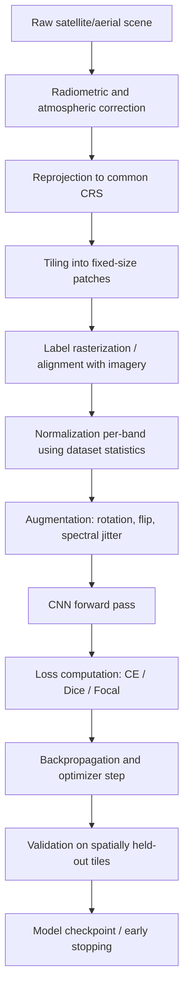

## Convolutional Neural Networks in Remote Sensing

### Overview

Convolutional Neural Networks (CNNs) are a class of deep learning architectures that use learnable spatial filters (kernels) convolved across an image to extract hierarchical features — from low-level edges and textures in early layers to complex spatial-semantic patterns in deeper layers. In remote sensing, CNNs underpin scene classification, semantic segmentation, object detection, change detection, and super-resolution tasks, replacing earlier pixel-based and shallow-feature classifiers by learning spatial context directly from raw or minimally processed imagery.

**Key Points**

- CNNs exploit local spatial correlation and translation invariance, both well-suited to imagery where object appearance does not depend on absolute pixel position.
- Weight sharing across spatial locations drastically reduces parameter count relative to fully connected networks, making CNNs tractable for large satellite scenes.
- Remote sensing imagery introduces domain-specific constraints — multispectral/hyperspectral channels, variable ground sample distance (GSD), lack of canonical orientation, and atmospheric/illumination variability — that shape how CNN architectures are adapted from standard computer vision use.

### Core CNN Operations

#### Convolution

A convolutional layer slides a small kernel over the input, computing a weighted sum at each spatial location:

$$y_{i,j,k} = \sigma\left(\sum_{m,n,c} w_{m,n,c,k} \cdot x_{i+m,j+n,c} + b_k\right)$$

where $x$ is the input feature map, $w_{m,n,c,k}$ is the kernel weight connecting input channel $c$ to output channel $k$ at spatial offset $(m,n)$, $b_k$ is a bias, and $\sigma$ is a nonlinear activation function (commonly ReLU: $\sigma(z) = \max(0,z)$).

Key hyperparameters:

- **Kernel size** — typically $3\times3$ or $5\times5$; larger receptive fields capture broader spatial context (useful for large homogeneous classes like water bodies) at higher computational cost.
- **Stride** — step size of the sliding window; stride $>1$ downsamples spatial resolution.
- **Padding** — "same" padding preserves spatial dimensions; "valid" padding shrinks them, relevant when tile-edge information matters for mosaicking.
- **Dilation (atrous convolution)** — expands the receptive field without increasing parameters or losing resolution, widely used in segmentation architectures (e.g., DeepLabv3+) to capture multi-scale context in land cover mapping.

#### Pooling

Pooling layers (max or average) downsample feature maps, reducing spatial dimensions while retaining dominant activations, which improves computational efficiency and provides a degree of translation invariance.

#### Batch Normalization

Normalizes activations within a mini-batch, stabilizing and accelerating training — particularly useful in remote sensing where per-band reflectance ranges vary substantially and can cause unstable gradients without normalization.

### Why CNNs Suit Remote Sensing Imagery

| Property | Natural Images | Remote Sensing Imagery | CNN Implication |
| --- | --- | --- | --- |
| Orientation | Canonical (up is up) | Arbitrary (nadir view) | Rotational augmentation is valid and standard |
| Channels | RGB (3) | Multispectral (4–13+), hyperspectral (100s) | Input layer and early kernels must be adapted |
| Object scale | Large, centered | Small, scattered, multi-scale | Multi-scale architectures (FPN, dilated convs) needed |
| Spatial resolution | Fixed | Variable GSD across sensors | Resampling/normalization required before fusion |
| Context | Local | Often needs wide receptive field (field boundaries, urban blocks) | Deeper networks or dilated convolutions |

### CNN Architectures Used in Remote Sensing

#### Classification Backbones

- **AlexNet/VGG** — early adopters in remote sensing benchmarks (e.g., UC Merced Land Use), now largely superseded but still used as simple baselines.
- **ResNet** — residual (skip) connections address vanishing gradients, allowing much deeper networks; the most common transfer-learning backbone in remote sensing classification.
- **DenseNet** — dense connectivity maximizes feature reuse, empirically effective when labeled remote sensing data is limited.
- **EfficientNet** — compound scaling balances depth, width, and resolution, favored for onboard/edge deployment on satellites and UAVs due to parameter efficiency.

$$\text{Residual block: } y = F(x, \{W_i\}) + x$$

The identity shortcut $+x$ allows gradients to flow directly through skip connections, enabling networks of 50+ layers to train effectively — important because remote sensing tasks often benefit from deep networks to capture both fine texture (crop rows) and broad context (field boundaries).

#### Segmentation Architectures (Fully Convolutional)

- **Fully Convolutional Networks (FCN)** — replace dense layers with convolutional layers, enabling dense pixel-wise prediction directly, foundational for land cover mapping.
- **U-Net** — encoder-decoder with skip connections between corresponding encoder/decoder stages; the dominant architecture for remote sensing segmentation given its strong performance with limited training data.
- **DeepLabv3+** — atrous spatial pyramid pooling (ASPP) captures multi-scale context; widely used for land cover and impervious surface mapping.
- **PSPNet** — pyramid pooling module aggregates context at multiple grid scales, useful for scenes with mixed-scale objects (buildings next to farmland).

#### Detection Architectures

- **Faster R-CNN** — two-stage detector (region proposal + classification), used for object detection (ships, aircraft, vehicles) in high-resolution imagery.
- **YOLO variants** — single-stage detectors trading some accuracy for inference speed, relevant for near-real-time monitoring applications.
- **Rotated bounding box detectors** (e.g., oriented R-CNN) — remote sensing objects (ships, vehicles) appear at arbitrary rotations unlike ground-level imagery, requiring rotation-aware detection heads.

### Adapting CNNs for Multispectral and Hyperspectral Data

Standard CNN backbones pretrained on ImageNet expect 3-channel RGB input. Common adaptation strategies:

1. **Modify the first convolutional layer** to accept $N$ input channels, initializing new channel weights by replicating or averaging pretrained RGB filter weights.
2. **Band selection or false-color composites** — select or combine 3 bands to reuse pretrained weights without architectural modification, at the cost of discarding spectral information from unused bands.
3. **3D convolutions** — convolve jointly across spatial dimensions and the spectral axis, common in hyperspectral classification (e.g., HybridSN) to exploit correlation between adjacent spectral bands.
4. **Spectral attention modules** — learn to weight informative bands more heavily, mitigating the curse of dimensionality inherent to hyperspectral cubes (100+ bands with high inter-band redundancy).

$$y_{i,j,k} = \sigma\left(\sum_{d,m,n} w_{d,m,n,k} \cdot x_{i+m,j+n,k_0+d} + b_k\right)$$

where the additional summation index $d$ convolves across the spectral dimension around center band $k_0$, characteristic of 3D-CNN hyperspectral classifiers.

**Example**

Modifying a pretrained ResNet's first layer to accept Sentinel-2's 13 bands:

```python
import torch
import torchvision.models as models

model = models.resnet50(weights="IMAGENET1K_V2")
old_conv = model.conv1  # originally Conv2d(3, 64, kernel_size=7, stride=2, padding=3)

new_conv = torch.nn.Conv2d(13, 64, kernel_size=7, stride=2, padding=3, bias=False)
with torch.no_grad():
    # Average pretrained RGB weights and replicate across new channels
    mean_weight = old_conv.weight.mean(dim=1, keepdim=True)
    new_conv.weight[:] = mean_weight.repeat(1, 13, 1, 1)

model.conv1 = new_conv
```

This preserves useful low-level edge/texture filters learned from natural images while extending the model to the full Sentinel-2 band stack.

### Training Pipeline



**Key Points**

- Tiling large scenes into fixed patches (e.g., 224×224 or 256×256) is necessary since full scenes vastly exceed typical GPU memory.
- Per-band normalization (mean/std computed over the training dataset) is preferred over ImageNet normalization statistics, since reflectance distributions differ substantially by sensor and band.
- Rotational augmentation (0°/90°/180°/270°, plus flips) is valid and standard in remote sensing because nadir imagery has no canonical orientation, unlike ground-level photography.
- Spatially blocked train/validation/test splits (rather than random pixel/tile shuffling) prevent spatial autocorrelation from leaking information across splits and inflating reported accuracy.

### Loss Functions for Remote Sensing CNNs

| Loss | Use Case | Notes |
| --- | --- | --- |
| Cross-entropy | Multi-class scene/pixel classification | Standard baseline |
| Weighted cross-entropy | Class imbalance | Weights inversely proportional to class frequency |
| Dice / Jaccard loss | Segmentation with imbalance | Directly optimizes overlap metric (IoU) |
| Focal loss | Rare-class detection (e.g., burn scars, small objects) | Down-weights easy/majority-class examples |

$$\text{Dice Loss} = 1 - \frac{2\sum p_i g_i}{\sum p_i + \sum g_i}$$

### Architecture Diagram

<svg xmlns="http://www.w3.org/2000/svg" viewBox="0 0 900 320">
<text x="450" y="24" font-size="16" font-weight="bold" text-anchor="middle" fill="#1a1a1a">CNN Feature Hierarchy for Remote Sensing (svg_diagram)</text>
<rect x="20" y="80" width="110" height="70" rx="6" fill="#dbeafe" stroke="#1e40af" />
<text x="75" y="110" font-size="12" text-anchor="middle" fill="#1a1a1a">Input Tile</text>
<text x="75" y="125" font-size="11" text-anchor="middle" fill="#1a1a1a">(N bands)</text>
<line x1="130" y1="115" x2="175" y2="115" stroke="#1a1a1a" stroke-width="2" marker-end="url(#arrow2)" />
<rect x="175" y="80" width="110" height="70" rx="6" fill="#dcfce7" stroke="#166534" />
<text x="230" y="105" font-size="12" text-anchor="middle" fill="#1a1a1a">Conv Block 1</text>
<text x="230" y="120" font-size="11" text-anchor="middle" fill="#1a1a1a">edges/texture</text>
<line x1="285" y1="115" x2="330" y2="115" stroke="#1a1a1a" stroke-width="2" marker-end="url(#arrow2)" />
<rect x="330" y="80" width="110" height="70" rx="6" fill="#fef3c7" stroke="#92400e" />
<text x="385" y="105" font-size="12" text-anchor="middle" fill="#1a1a1a">Conv Block 2</text>
<text x="385" y="120" font-size="11" text-anchor="middle" fill="#1a1a1a">shapes/patterns</text>
<line x1="440" y1="115" x2="485" y2="115" stroke="#1a1a1a" stroke-width="2" marker-end="url(#arrow2)" />
<rect x="485" y="80" width="110" height="70" rx="6" fill="#ede9fe" stroke="#5b21b6" />
<text x="540" y="105" font-size="12" text-anchor="middle" fill="#1a1a1a">Conv Block 3</text>
<text x="540" y="120" font-size="11" text-anchor="middle" fill="#1a1a1a">objects/context</text>
<line x1="595" y1="115" x2="640" y2="115" stroke="#1a1a1a" stroke-width="2" marker-end="url(#arrow2)" />
<rect x="640" y="60" width="110" height="50" rx="6" fill="#fee2e2" stroke="#991b1b" />
<text x="695" y="90" font-size="11" text-anchor="middle" fill="#1a1a1a">Global Pool + FC</text>
<rect x="640" y="130" width="110" height="50" rx="6" fill="#e0f2fe" stroke="#0369a1" />
<text x="695" y="155" font-size="11" text-anchor="middle" fill="#1a1a1a">Decoder (U-Net)</text>
<line x1="750" y1="85" x2="800" y2="85" stroke="#1a1a1a" stroke-width="2" marker-end="url(#arrow2)" />
<line x1="750" y1="155" x2="800" y2="155" stroke="#1a1a1a" stroke-width="2" marker-end="url(#arrow2)" />

<text x="850" y="90" font-size="11" text-anchor="middle" fill="`#1a1a1a`">Scene Label</text>

<text x="850" y="160" font-size="11" text-anchor="middle" fill="`#1a1a1a`">Pixel Mask</text>

<text x="230" y="230" font-size="10" text-anchor="middle" fill="`#4b5563`">Receptive field: small</text>

<text x="540" y="230" font-size="10" text-anchor="middle" fill="`#4b5563`">Receptive field: large</text>

<line x1="80" y1="245" x2="750" y2="245" stroke="`#9ca3af`" stroke-width="1" marker-end="url(#arrow2)" />

<text x="415" y="265" font-size="11" text-anchor="middle" fill="`#4b5563`">Increasing depth → increasing abstraction and spatial context</text>

</svg>

### Transfer Learning Considerations

- **ImageNet-pretrained weights** provide a useful initialization for RGB or RGB-like composites but exhibit a documented domain gap relative to nadir overhead imagery (different object scale, viewpoint, and texture statistics).
- **Remote-sensing-specific self-supervised pretraining** (e.g., SatMAE, SSL4EO-S12, Prithvi, Clay) trains directly on large unlabeled satellite corpora using masked autoencoding or contrastive objectives, generally transferring better to downstream remote sensing tasks than ImageNet weights. [Inference — the magnitude of improvement depends on target task similarity to the pretraining corpus and should be validated empirically per use case.]
- **Progressive unfreezing** — freezing early (generic) layers and fine-tuning later (task-specific) layers is a common strategy when labeled target data is scarce, gradually unfreezing more layers as more labeled data becomes available.

### Common Benchmark Datasets

| Dataset | Task | Sensor | Notes |
| --- | --- | --- | --- |
| EuroSAT | Scene classification | Sentinel-2 | 10 land use/cover classes |
| BigEarthNet | Multi-label classification | Sentinel-1/2 | Large-scale, multi-label |
| ISPRS Vaihingen/Potsdam | Segmentation | Aerial | Fine-grained urban land cover |
| SpaceNet | Building/road segmentation | WorldView | High-resolution, multiple cities |
| DOTA | Oriented object detection | Aerial | Rotated bounding boxes |
| So2Sat LCZ42 | Local climate zone classification | Sentinel-1/2 | Urban structure classes |

### Operational and Deployment Considerations

- **Onboard/edge inference**: satellite and UAV platforms have strict power/compute budgets, motivating lightweight CNNs (MobileNet, quantized EfficientNet) and model pruning/quantization for near-real-time inference.
- **Mosaicking artifacts**: tile-based inference can produce visible seams at patch boundaries; overlapping tiles with weighted blending (e.g., Gaussian-weighted stitching) mitigate discontinuities when reassembling large-area maps.
- **Georeferencing preservation**: predicted outputs must retain the original coordinate reference system (CRS) and affine transform to integrate correctly into GIS pipelines (commonly handled via `rasterio` in Python).
- **Atmospheric/seasonal generalization**: models trained on single-season, cloud-free imagery often generalize poorly across seasons or sun angles; multi-temporal training data or domain adaptation techniques help mitigate this. [Inference — the extent of generalization loss is sensor- and region-dependent.]

### Common Pitfalls

- Applying ImageNet mean/std normalization directly to multispectral bands without recomputing dataset-specific statistics slows or destabilizes convergence.
- Using random (non-spatially-blocked) data splits inflates validation accuracy due to spatial autocorrelation between nearby tiles.
- Treating all spectral bands as equally informative without band selection or attention mechanisms increases computational cost without proportional accuracy gains, particularly in hyperspectral settings.
- Neglecting rotation/flip augmentation despite nadir imagery having no canonical orientation, unlike typical ground-level photography where such augmentation may be less appropriate.

**Next Steps**

- Deep Learning for Image Classification (scene-level and pixel-level classification workflows)
- Semantic Segmentation Architectures for Land Cover Mapping (U-Net, DeepLabv3+ deep dive)
- Self-Supervised and Foundation Models for Remote Sensing (SatMAE, Prithvi, Clay)
- Object Detection in Aerial and Satellite Imagery (rotated bounding boxes, DOTA benchmark)
- Hyperspectral Image Classification (3D CNNs, spectral-spatial attention)
- Vision Transformers for Geospatial Applications
- Change Detection with Deep Learning (Siamese CNNs, multi-temporal architectures)
- Model Compression and Edge Deployment for Onboard Satellite Inference