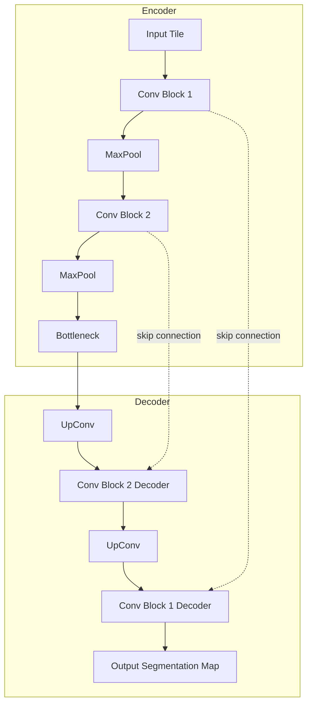
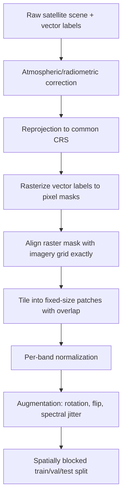

## Semantic Segmentation of Satellite Imagery

### Overview

Semantic segmentation assigns a class label to every pixel in an image, producing a dense prediction map rather than a single scene-level label. In satellite and aerial imagery, this underpins land cover/land use mapping, building and road footprint extraction, crop type mapping, deforestation monitoring, and impervious surface detection. Unlike scene classification, semantic segmentation preserves precise spatial boundaries, making it the standard formulation for most operational geospatial mapping products derived from deep learning.

**Key Points**

- Output is a per-pixel class map (a raster) with the same spatial dimensions as the input, typically stored as a georeferenced GeoTIFF.
- Semantic segmentation distinguishes classes but not individual object instances (a field of 50 buildings labeled "building" is one connected region); instance segmentation (e.g., Mask R-CNN) is required when individual object counts/boundaries matter.
- The dominant architectural paradigm is the encoder-decoder with skip connections (U-Net family), given strong performance with the modest labeled datasets typical in remote sensing.
- Class imbalance is pervasive and severe (e.g., "background"/non-building pixels vastly outnumber "building" pixels), directly shaping loss function choice.

### Task Formulation

Given an input image $X \in \mathbb{R}^{H \times W \times C}$ (height, width, spectral channels), semantic segmentation learns a function $f_\theta$ producing a per-pixel class probability distribution:

$$f_\theta(X) = \hat{Y} \in \mathbb{R}^{H \times W \times K}$$

where $K$ is the number of classes and each pixel's $K$-length vector is typically passed through a softmax (multi-class, mutually exclusive) or sigmoid (multi-label/binary) to produce class probabilities.

### Core Architectures

#### Fully Convolutional Networks (FCN)

The foundational approach: replace a classification CNN's fully connected layers with $1\times1$ convolutions, allowing the network to output a spatial map rather than a single vector. Upsampling (transposed convolution or bilinear interpolation) restores the output to the input's spatial resolution.

#### U-Net

The dominant architecture in remote sensing segmentation. An encoder progressively downsamples the input, extracting increasingly abstract features; a symmetric decoder progressively upsamples back to full resolution. Skip connections concatenate encoder feature maps directly into the corresponding decoder stage, preserving fine spatial detail (object edges) that would otherwise be lost during downsampling.



#### DeepLabv3+

Uses atrous (dilated) spatial pyramid pooling (ASPP) to capture multi-scale context without reducing spatial resolution, applying convolutions with multiple dilation rates in parallel and concatenating the results. This is particularly effective in remote sensing for scenes containing both small objects (individual trees, vehicles) and large homogeneous regions (water bodies, agricultural fields) within the same tile.

$$y_{i} = \sum_{k} x_{i + r \cdot k} \cdot w_k$$

where $r$ is the dilation rate; increasing $r$ expands the receptive field without adding parameters or downsampling.

#### PSPNet (Pyramid Scene Parsing Network)

Aggregates context via a pyramid pooling module that pools feature maps at multiple grid scales (e.g., $1\times1$, $2\times2$, $3\times3$, $6\times6$) before fusing, effective for scenes with strong global context dependency (e.g., distinguishing "urban" from "suburban" requires more than local texture).

#### SegFormer and Transformer-Based Segmentation

A hierarchical transformer encoder paired with a lightweight MLP decoder. Self-attention captures long-range spatial dependencies (relevant for large-scale patterns like river networks or road grids) more naturally than convolution's local receptive field, and the architecture's efficiency makes it practical for high-resolution satellite tiles. [Inference — relative performance versus CNN-based segmentation depends on dataset size and available pretraining, since transformers typically require more data or stronger pretraining to match CNN performance on small remote sensing datasets.]

### Multispectral and Multi-Temporal Adaptation

**Key Points**

- Input channels extend beyond RGB — Sentinel-2 provides 13 bands, requiring first-layer modification of pretrained encoders as with classification networks.
- Multi-temporal segmentation (e.g., crop type mapping requiring phenological signal across a growing season) uses stacked time-series inputs or recurrent/temporal-attention modules (ConvLSTM, temporal transformers) fused with the spatial encoder.
- Spectral indices (NDVI, NDWI, NDBI) are sometimes precomputed and stacked as additional input channels alongside raw bands, injecting domain knowledge directly into the input representation.

**Example**

Constructing a multi-temporal input stack for crop segmentation using two Sentinel-2 acquisitions plus NDVI:

```python
import numpy as np

def stack_multitemporal(bands_t1, bands_t2):
    """
    bands_t1, bands_t2: arrays of shape (H, W, 4) — Blue, Green, Red, NIR
    Returns: stacked array of shape (H, W, 10) — 4 bands x2 dates + 2 NDVI
    """
    def ndvi(bands):
        red, nir = bands[..., 2], bands[..., 3]
        return (nir - red) / (nir + red + 1e-8)

    ndvi_t1 = ndvi(bands_t1)[..., np.newaxis]
    ndvi_t2 = ndvi(bands_t2)[..., np.newaxis]

    return np.concatenate([bands_t1, ndvi_t1, bands_t2, ndvi_t2], axis=-1)
```

### Loss Functions

Class imbalance is the central challenge in satellite segmentation (e.g., building footprints often occupy <5% of pixels in a tile).

| Loss | Formula/Behavior | Use Case |
| --- | --- | --- |
| Weighted cross-entropy | Per-class weights inversely proportional to frequency | General imbalance |
| Dice loss | $1 - \frac{2\sum p_i g_i}{\sum p_i + \sum g_i}$ | Directly optimizes overlap; robust to imbalance |
| Focal loss | $-\alpha(1-p_t)^\gamma \log(p_t)$ | Down-weights easy/majority pixels |
| Combined Dice + CE | Weighted sum of both losses | Common in practice; balances pixel-wise and region-level accuracy |
| Boundary/edge loss | Penalizes error near class boundaries | Improves precise delineation (building edges, field boundaries) |

$$\text{Focal Loss} = -\alpha (1-p_t)^\gamma \log(p_t)$$

where $\gamma$ controls the down-weighting of well-classified (easy) examples and $\alpha$ balances class frequency.

### Data Preparation Pipeline



**Key Points**

- Label rasterization must align pixel-perfectly with imagery — even a 1-pixel misalignment from reprojection error introduces systematic label noise.
- Tiling with overlap (e.g., 25–50%) allows discarding low-confidence predictions near patch edges when reassembling the full-scene output.
- Spatially blocked splitting (withholding entire geographic regions rather than randomly sampling tiles) is essential, since spatially adjacent tiles share strong autocorrelation and randomly split tiles leak information between train and test sets, inflating reported accuracy.
- Augmentation should reflect the sensor domain: rotation and flipping are valid (nadir imagery has no canonical orientation), but color-jitter style augmentations common in natural image pipelines require care since they can distort physically meaningful reflectance relationships used for band-ratio indices.

### Evaluation Metrics

| Metric | Formula | Notes |
| --- | --- | --- |
| Pixel accuracy | Correct pixels / total pixels | Misleading under class imbalance |
| Mean IoU (mIoU) | Average of per-class $\frac{TP}{TP+FP+FN}$ | Standard segmentation benchmark metric |
| F1-score | $\frac{2 \cdot P \cdot R}{P + R}$ | Per-class, useful for minority classes |
| Boundary IoU | IoU computed only near class boundaries | Evaluates edge precision specifically |
| Kappa coefficient | Accounts for chance agreement | Traditional remote sensing accuracy standard |

$$\text{IoU} = \frac{TP}{TP + FP + FN}$$

**Example**

Computing per-class IoU from a confusion matrix in Python:

```python
import numpy as np

def compute_iou(conf_matrix):
    """conf_matrix: KxK array, rows=true, cols=predicted"""
    intersection = np.diag(conf_matrix)
    union = (
        conf_matrix.sum(axis=1) + conf_matrix.sum(axis=0) - intersection
    )
    iou = intersection / np.maximum(union, 1)
    return iou  # per-class IoU array
```

### Architecture Diagram

<svg xmlns="http://www.w3.org/2000/svg" viewBox="0 0 900 360">
<text x="450" y="24" font-size="16" font-weight="bold" text-anchor="middle" fill="#1a1a1a">U-Net Segmentation for Satellite Imagery (svg_diagram)</text>
<rect x="30" y="60" width="90" height="50" rx="4" fill="#dbeafe" stroke="#1e40af" />
<text x="75" y="90" font-size="11" text-anchor="middle" fill="#1a1a1a">256x256xN</text>
<rect x="150" y="70" width="80" height="40" rx="4" fill="#dcfce7" stroke="#166534" />
<text x="190" y="95" font-size="10" text-anchor="middle" fill="#1a1a1a">128x128x64</text>
<rect x="260" y="80" width="70" height="30" rx="4" fill="#dcfce7" stroke="#166534" />
<text x="295" y="100" font-size="10" text-anchor="middle" fill="#1a1a1a">64x64x128</text>
<rect x="360" y="90" width="60" height="20" rx="4" fill="#fef3c7" stroke="#92400e" />
<text x="390" y="104" font-size="9" text-anchor="middle" fill="#1a1a1a">32x32x256</text>
<line x1="120" y1="85" x2="150" y2="90" stroke="#1a1a1a" stroke-width="2" marker-end="url(#arrow3)" />
<line x1="230" y1="90" x2="260" y2="95" stroke="#1a1a1a" stroke-width="2" marker-end="url(#arrow3)" />
<line x1="330" y1="95" x2="360" y2="100" stroke="#1a1a1a" stroke-width="2" marker-end="url(#arrow3)" />
<line x1="420" y1="100" x2="460" y2="100" stroke="#1a1a1a" stroke-width="2" marker-end="url(#arrow3)" />
<rect x="480" y="90" width="60" height="20" rx="4" fill="#fef3c7" stroke="#92400e" />
<text x="510" y="104" font-size="9" text-anchor="middle" fill="#1a1a1a">64x64x128</text>
<rect x="560" y="80" width="70" height="30" rx="4" fill="#ede9fe" stroke="#5b21b6" />
<text x="595" y="100" font-size="10" text-anchor="middle" fill="#1a1a1a">128x128x64</text>
<rect x="650" y="70" width="80" height="40" rx="4" fill="#ede9fe" stroke="#5b21b6" />
<text x="690" y="95" font-size="10" text-anchor="middle" fill="#1a1a1a">256x256x32</text>
<rect x="750" y="60" width="90" height="50" rx="4" fill="#fee2e2" stroke="#991b1b" />
<text x="795" y="90" font-size="11" text-anchor="middle" fill="#1a1a1a">256x256xK</text>
<line x1="540" y1="100" x2="560" y2="95" stroke="#1a1a1a" stroke-width="2" marker-end="url(#arrow3)" />
<line x1="630" y1="95" x2="650" y2="90" stroke="#1a1a1a" stroke-width="2" marker-end="url(#arrow3)" />
<line x1="730" y1="90" x2="750" y2="85" stroke="#1a1a1a" stroke-width="2" marker-end="url(#arrow3)" />
<path d="M 190 70 Q 375 20 595 80" fill="none" stroke="#6b7280" stroke-width="1.5" stroke-dasharray="5,3" />
<path d="M 295 80 Q 400 40 510 90" fill="none" stroke="#6b7280" stroke-width="1.5" stroke-dasharray="5,3" />
<text x="450" y="35" font-size="10" text-anchor="middle" fill="#6b7280">skip connections</text>

<text x="75" y="140" font-size="10" text-anchor="middle" fill="`#4b5563`">Encoder</text>

<text x="795" y="140" font-size="10" text-anchor="middle" fill="`#4b5563`">Decoder</text>

<rect x="200" y="200" width="500" height="90" rx="6" fill="#f9fafb" stroke="#6b7280" stroke-dasharray="4" />
<text x="450" y="225" font-size="11" text-anchor="middle" fill="#1a1a1a">Output: per-pixel softmax over K land cover classes</text>
<text x="450" y="245" font-size="11" text-anchor="middle" fill="#1a1a1a">Loss: weighted CE + Dice, back-propagated end-to-end</text>
<text x="450" y="265" font-size="11" text-anchor="middle" fill="#1a1a1a">Post-process: argmax → GeoTIFF mask with preserved CRS</text>
</svg>

### Post-Processing and Georeferencing

Raw softmax/argmax outputs benefit from post-processing before use as an operational map product:

- **Conditional Random Fields (CRF)** — refines segmentation boundaries by incorporating pairwise pixel similarity, reducing noisy/speckled predictions.
- **Morphological operations** — opening/closing to remove isolated misclassified pixels or fill small gaps within predicted regions.
- **Tile mosaicking with blending** — overlapping inference tiles combined with distance-weighted blending (e.g., Gaussian weighting toward tile centers) to eliminate visible seams at patch boundaries.
- **Vectorization** — converting the raster prediction mask to vector polygons (e.g., via `rasterio.features.shapes` or GDAL) for integration into standard GIS vector workflows.

**Example**

Writing a segmentation prediction to a georeferenced GeoTIFF, preserving the source CRS and transform:

```python
import rasterio
import numpy as np

with rasterio.open("input_tile.tif") as src:
    profile = src.profile
    profile.update(dtype=rasterio.uint8, count=1, compress="lzw")

with rasterio.open("segmentation_output.tif", "w", **profile) as dst:
    dst.write(predicted_mask.astype(np.uint8), 1)
```

### Common Benchmark Datasets

| Dataset | Classes | Sensor | Notes |
| --- | --- | --- | --- |
| ISPRS Vaihingen/Potsdam | 6 (impervious, building, vegetation, tree, car, clutter) | Aerial | Fine-grained urban segmentation |
| DeepGlobe Land Cover | 7 | High-res aerial | Standard land cover benchmark |
| SpaceNet | Building/road | WorldView | Multi-city building footprint extraction |
| LandCover.ai | 4 | Aerial | Poland-focused land cover |
| Sen1Floods11 | Flood/non-flood | Sentinel-1/2 | Binary flood segmentation |
| Massachusetts Roads/Buildings | Road/building | Aerial | Long-standing benchmark |

### Common Pitfalls

- Using standard (unweighted) cross-entropy on highly imbalanced classes causes the model to trivially predict the majority class.
- Random (non-spatial) tile splitting inflates validation mIoU due to spatial autocorrelation leakage.
- Label rasterization misalignment (from reprojection or resampling error) introduces systematic boundary noise that degrades training regardless of model capacity.
- Applying color/brightness jitter augmentations designed for natural RGB images can distort band ratios used for spectral indices, potentially degrading rather than improving generalization. [Inference — the degree of degradation depends on which augmentations are applied and whether spectral indices are part of the model input.]
- Ignoring tile-edge effects during inference produces visible seams when mosaicking; overlapping-tile blending mitigates this.

**Next Steps**

- Convolutional Neural Networks in Remote Sensing (architectural foundations)
- Object Detection in Aerial and Satellite Imagery (instance-level extraction)
- Change Detection with Deep Learning (multi-temporal segmentation)
- Self-Supervised and Foundation Models for Remote Sensing (SatMAE, Prithvi, Clay)
- Accuracy Assessment and Validation Standards in Remote Sensing Classification
- Crop Type Mapping and Time-Series Classification
- Post-Processing Techniques for Segmentation Outputs (CRF, vectorization)
- Hyperspectral Image Classification