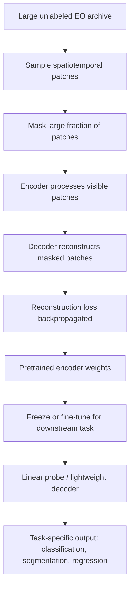

## Geospatial Foundation Models and Embeddings


### Overview

Geospatial Foundation Models (GFMs) are large-scale neural networks pretrained on vast amounts of unlabeled Earth observation data — typically via self-supervised objectives like masked autoencoding — to produce general-purpose representations (embeddings) of the Earth's surface. Rather than training a task-specific CNN from scratch for each new mapping problem, practitioners extract embeddings from a pretrained GFM and train a lightweight downstream model (linear probe, shallow MLP, or small decoder) on top, dramatically reducing the labeled data required for a given task. This mirrors the foundation model paradigm from NLP and general computer vision (BERT, CLIP), adapted to satellite imagery's distinguishing characteristics: many spectral bands, multiple sensor modalities, irregular temporal revisit cadence, and inherent georeferencing.

**Key Points**

- The core value proposition is labeled-data efficiency: tasks once requiring tens of thousands of labeled tiles can often be addressed with hundreds to a few thousand using fine-tuned or probed foundation model embeddings.
- GFMs are typically pretrained via masked reconstruction — a satellite image (or spatiotemporal cube) is split into patches, a large fraction is masked, and the model learns to reconstruct the missing content, forcing it to learn structurally meaningful spatial-spectral-temporal representations.
- Vision Transformers (ViT) and hybrid Transformer/convolutional architectures dominate the GFM landscape due to their ability to model long-range spatial and temporal dependencies and incorporate location/time as explicit conditioning inputs.
- As of 2026, production-relevant GFMs include Prithvi-EO-2.0 (NASA/IBM), Clay (open-source foundation model consortium), and AlphaEarth Foundations (Google DeepMind) — each with different architectures, training data, and output granularity, discussed below.

### Foundation Model Pretraining Paradigm



The pretraining objective is reconstruction: a satellite image cube is split into 3D patches (time × height × width), a large fraction of patches is masked, and the model is trained to reconstruct the missing pixels. This masked autoencoder (MAE) pretraining, adapted to satellite imagery's quirks — many spectral bands, multiple sensors, irregular temporal cadence, georeferenced inputs — forms the lineage of the geospatial foundation model field. [Medium](https://medium.com/@brian-curry-research/geospatial-foundation-models-for-agricultural-machine-learning-a3cd0169d256)

$$\mathcal{L}_{\text{MAE}} = \frac{1}{|M|} \sum_{i \in M} \| \hat{x}_i - x_i \|^2$$

where $M$ is the set of masked patch indices, $x_i$ is the true patch content, and $\hat{x}_i$ is the reconstructed patch.

### Major Geospatial Foundation Models

#### Prithvi (NASA-IBM)

Prithvi-EO-2.0, released in December 2024, is built on the Vision Transformer architecture and incorporates temporal and location embeddings, enabling it to more effectively capture the complex spatiotemporal patterns found in EO data. The model was pretrained on a large-scale dataset of 4.2 million time series samples from the HLS (Harmonized Landsat-Sentinel) archive, providing imagery at 30-meter resolution. Downstream applications include multi-temporal crop classification, flood mapping, and landslide detection, typically via lightweight UNet or UPerNet decoders attached to the frozen or fine-tuned Prithvi encoder. [arxiv](https://arxiv.org/pdf/2506.20174)[arxiv](https://arxiv.org/pdf/2506.20174)

Compact variants of the Prithvi-300M encoder have been evaluated for downstream tasks including landslide detection (via UNet decoder) and above-ground biomass estimation (via UPerNet decoder), and Prithvi has been demonstrated for on-orbit inference directly aboard satellite hardware, reflecting increasing interest in edge deployment of GFMs. [arxiv](https://arxiv.org/pdf/2512.01181)

#### Clay Foundation Model

The Clay Foundation Model is an open-source foundation model for Earth observation designed for flexibility across different data sources and resolutions. Clay is community-developed and emphasizes broad sensor interoperability (Sentinel-1, Sentinel-2, Landsat, NAIP, and others) within a single pretrained encoder, positioning it as an accessible alternative to proprietary or institution-specific GFMs for practitioners who need multi-sensor flexibility without training separate models per sensor. [Kili Technology](https://kili-technology.com/blog/a-guide-to-geospatial-foundation-models-transforming-earth-observation-through-ai)

#### AlphaEarth Foundations (Google DeepMind)

AlphaEarth Foundations represents a distinct design point: rather than releasing a model practitioners fine-tune directly, Google DeepMind publishes precomputed global embeddings. AlphaEarth Foundations employs a Space–Time Precision (STP) encoder, a hybrid Transformer/convolutional architecture, to fuse spatial, temporal, and measurement context from multi-source remote sensing data. The model outputs annual 64-dimensional embeddings at 10-meter spatial resolution worldwide, providing a standardized, analysis-ready input for downstream tasks across environmental science, disaster management, and urban analytics. [Emergent Mind](https://www.emergentmind.com/topics/alphaearth)[Emergent Mind](https://www.emergentmind.com/topics/alphaearth)

Architecturally, AlphaEarth integrates diverse Earth observation sources — Sentinel-1/2, Landsat, GEDI, ERA5-Land, GRACE, and others — through the STP encoder, which combines spatial and temporal attention with convolutional operations. It is trained as a multi-modal autoencoder with implicit decoders that reconstruct missing observations across time and modalities, regularized by teacher-student consistency and contrastive alignment losses. This is a notably richer pretraining signal than single-sensor MAE approaches, since it forces the embedding to be predictive across heterogeneous modalities (optical, radar, gravimetric, climate) rather than just spatially coherent within one sensor type. [arxiv](https://arxiv.org/pdf/2508.18829)

Each 10-meter pixel in the released dataset is a 64-dimensional representation, or "embedding vector," encoding temporal trajectories of surface conditions at and around that pixel as measured by various Earth observation instruments, over a single calendar year. Unlike conventional spectral inputs and indices, where bands correspond to physical measurements, these embeddings are feature vectors that summarize relationships across multi-source, multi-modal observations in a less directly interpretable, but more powerful way. The dataset is distributed via Google Earth Engine and covers 2017–2024. [Google](https://developers.google.com/earth-engine/datasets/catalog/GOOGLE_SATELLITE_EMBEDDING_V1_ANNUAL)[Google](https://developers.google.com/earth-engine/datasets/catalog/GOOGLE_SATELLITE_EMBEDDING_V1_ANNUAL)

**Key Points**

- AlphaEarth embeddings are used as fixed, precomputed features rather than fine-tuned end-to-end — practitioners typically train a shallow classifier/regressor (e.g., XGBoost, random forest, linear model) directly on the 64-dimensional vectors.
- This workflow removes the need for GPU-based fine-tuning infrastructure entirely for many downstream tasks, at the cost of losing the flexibility to adapt the underlying representation to a specific domain.
- Because embeddings summarize a full calendar year, fine-grained sub-annual temporal dynamics (e.g., exact planting date) are not directly recoverable from a single embedding vector. [Inference — the degree to which this limits specific applications depends on whether the downstream task requires sub-annual temporal resolution.]

#### Other Notable Models

- **SatMAE** — leverages masked autoencoder techniques to learn robust representations from unlabeled satellite imagery, an early and influential MAE-based GFM that established the reconstruction-pretraining approach later scaled by Prithvi and others. [Kili Technology](https://kili-technology.com/blog/a-guide-to-geospatial-foundation-models-transforming-earth-observation-through-ai)
- **SpectralGPT** — emphasizes spectral structure, targeting hyperspectral and multispectral understanding specifically.
- **DOFA / Hiera** — architectures evaluated in comparative GFM benchmarking (e.g., GEO-Bench) alongside Prithvi, representing continued architectural experimentation in the space.
- **Google SKAI / Weather/Next** — Google's broader geospatial model suite includes SKAI for disaster response tasks like real-time flood and wildfire boundary mapping, and Weather/Next, a generative model for high-resolution weather forecasting, often integrated with a Gemini-powered reasoning engine to analyze geospatial datasets from sources like Google Earth Engine. [Kili Technology](https://kili-technology.com/blog/a-guide-to-geospatial-foundation-models-transforming-earth-observation-through-ai)

### Comparative Summary

| Model | Developer | Architecture | Output | Distribution |
| --- | --- | --- | --- | --- |
| Prithvi-EO-2.0 | NASA/IBM | ViT with temporal/location embeddings | Encoder for fine-tuning with task decoders | Open weights (Hugging Face) |
| Clay | Open-source consortium | ViT, multi-sensor | Encoder for fine-tuning | Open weights |
| AlphaEarth Foundations | Google DeepMind | Hybrid Transformer/CNN (STP encoder) | Precomputed 64-dim annual embeddings, 10m | Google Earth Engine dataset |
| SatMAE | Academic (Stanford et al.) | ViT, MAE pretraining | Encoder for fine-tuning | Open weights |
| SpectralGPT | Academic | Spectral-aware transformer | Encoder for fine-tuning | Open weights |

### Downstream Usage Patterns

Two dominant deployment patterns exist for applying GFMs to a new task:

1. **Fine-tuning pattern** (Prithvi, Clay, SatMAE) — attach a task-specific decoder (UNet, UPerNet, linear head) to the pretrained encoder and fine-tune end-to-end or with a frozen backbone, requiring GPU infrastructure but allowing full adaptation to task-specific spatial resolution and spectral configuration.
2. **Precomputed embedding pattern** (AlphaEarth) — treat embeddings as a fixed, off-the-shelf feature layer and train a lightweight downstream model (gradient-boosted trees, linear models, shallow MLPs) directly on embedding vectors, requiring minimal compute and no deep learning infrastructure.

**Example**

Using precomputed AlphaEarth embeddings for a downstream classification task via Google Earth Engine and a standard ML library:

```python
import ee
import numpy as np
from sklearn.ensemble import RandomForestClassifier

ee.Initialize()

embeddings = ee.ImageCollection("GOOGLE/SATELLITE_EMBEDDING/V1/ANNUAL") \
    .filterDate("2023-01-01", "2023-12-31") \
    .first()

# Sample embeddings at labeled training point locations
sampled = embeddings.sampleRegions(
    collection=training_points,  # ee.FeatureCollection with 'class' property
    scale=10,
    geometries=False
)

# Export to a feature array and train a standard classifier
features = sampled.getInfo()["features"]
X = np.array([[f["properties"][f"A{i:02d}"] for i in range(64)] for f in features])
y = np.array([f["properties"]["class"] for f in features])

clf = RandomForestClassifier(n_estimators=200)
clf.fit(X, y)
```

**Example**

Fine-tuning a Prithvi-style encoder for multi-temporal crop classification with a lightweight decoder:

```python
import torch
import torch.nn as nn

class PrithviCropClassifier(nn.Module):
    def __init__(self, prithvi_encoder, num_classes, embed_dim=768):
        super().__init__()
        self.encoder = prithvi_encoder  # pretrained, loaded from checkpoint
        # Optionally freeze early layers
        for param in list(self.encoder.parameters())[:-20]:
            param.requires_grad = False

        self.decoder = nn.Sequential(
            nn.Conv2d(embed_dim, 256, kernel_size=3, padding=1),
            nn.ReLU(inplace=True),
            nn.Upsample(scale_factor=4, mode="bilinear", align_corners=False),
            nn.Conv2d(256, num_classes, kernel_size=1),
        )

    def forward(self, x, temporal_coords, location_coords):
        features = self.encoder(x, temporal_coords, location_coords)
        return self.decoder(features)
```

### Architecture Diagram

<svg xmlns="http://www.w3.org/2000/svg" viewBox="0 0 900 340">
<text x="450" y="24" font-size="16" font-weight="bold" text-anchor="middle" fill="#1a1a1a">Geospatial Foundation Model Workflow (svg_diagram)</text>
<rect x="20" y="70" width="130" height="70" rx="6" fill="#dbeafe" stroke="#1e40af" />
<text x="85" y="100" font-size="11" text-anchor="middle" fill="#1a1a1a">Multi-source EO</text>
<text x="85" y="115" font-size="11" text-anchor="middle" fill="#1a1a1a">archive (unlabeled)</text>
<line x1="150" y1="105" x2="195" y2="105" stroke="#1a1a1a" stroke-width="2" marker-end="url(#arrow4)" />
<rect x="195" y="60" width="140" height="90" rx="6" fill="#dcfce7" stroke="#166534" />
<text x="265" y="90" font-size="11" text-anchor="middle" fill="#1a1a1a">Self-supervised</text>
<text x="265" y="105" font-size="11" text-anchor="middle" fill="#1a1a1a">pretraining</text>
<text x="265" y="120" font-size="10" text-anchor="middle" fill="#1a1a1a">(masked reconstruction)</text>
<line x1="335" y1="105" x2="380" y2="105" stroke="#1a1a1a" stroke-width="2" marker-end="url(#arrow4)" />
<rect x="380" y="70" width="130" height="70" rx="6" fill="#fef3c7" stroke="#92400e" />
<text x="445" y="100" font-size="11" text-anchor="middle" fill="#1a1a1a">Pretrained</text>
<text x="445" y="115" font-size="11" text-anchor="middle" fill="#1a1a1a">GFM Encoder</text>
<line x1="510" y1="90" x2="560" y2="60" stroke="#1a1a1a" stroke-width="2" marker-end="url(#arrow4)" />
<line x1="510" y1="120" x2="560" y2="150" stroke="#1a1a1a" stroke-width="2" marker-end="url(#arrow4)" />
<rect x="560" y="20" width="150" height="60" rx="6" fill="#ede9fe" stroke="#5b21b6" />
<text x="635" y="45" font-size="11" text-anchor="middle" fill="#1a1a1a">Fine-tune + decoder</text>
<text x="635" y="60" font-size="10" text-anchor="middle" fill="#1a1a1a">(Prithvi, Clay)</text>
<rect x="560" y="150" width="150" height="60" rx="6" fill="#fee2e2" stroke="#991b1b" />
<text x="635" y="175" font-size="11" text-anchor="middle" fill="#1a1a1a">Precomputed</text>
<text x="635" y="190" font-size="10" text-anchor="middle" fill="#1a1a1a">embeddings (AlphaEarth)</text>
<line x1="710" y1="50" x2="760" y2="50" stroke="#1a1a1a" stroke-width="2" marker-end="url(#arrow4)" />
<line x1="710" y1="180" x2="760" y2="180" stroke="#1a1a1a" stroke-width="2" marker-end="url(#arrow4)" />
<rect x="760" y="20" width="120" height="60" rx="6" fill="#e0f2fe" stroke="#0369a1" />
<text x="820" y="45" font-size="10" text-anchor="middle" fill="#1a1a1a">Segmentation/</text>
<text x="820" y="60" font-size="10" text-anchor="middle" fill="#1a1a1a">classification map</text>
<rect x="760" y="150" width="120" height="60" rx="6" fill="#e0f2fe" stroke="#0369a1" />
<text x="820" y="175" font-size="10" text-anchor="middle" fill="#1a1a1a">Shallow classifier</text>
<text x="820" y="190" font-size="10" text-anchor="middle" fill="#1a1a1a">(RF/XGBoost)</text>

<text x="450" y="260" font-size="11" text-anchor="middle" fill="`#4b5563`">Deployment pattern determines infrastructure needs:</text>

<text x="450" y="280" font-size="11" text-anchor="middle" fill="`#4b5563`">fine-tuning requires GPU compute; embedding-based probing requires only CPU/tabular ML</text>

</svg>

### Evaluation and Benchmarking

Benchmark efforts such as GEO-Bench evaluate GFMs across multiple sensor modalities, spatial resolutions, and task types. GEO-Bench has been used to evaluate models including Prithvi, Hiera, and DOFA across eleven datasets covering a range of spatial resolutions, sensor modalities, and task types. [arXiv](https://arxiv.org/html/2506.20174v1)

A key open question in the field concerns geographic generalization. Existing crop-mapping benchmarks often fail to test true generalization — PASTIS, BreizhCrop, Sen4AgriNet, and EuroCropsML are confined to Europe, while GEO-Bench randomly subsamples chips, removing the spatial structure needed to test transfer to new regions. Under regional distribution shift, models often concentrate on dominant crop classes while failing to detect minority crops, and adapting models to a shared input configuration affects their pretrained representations unequally, complicating direct architectural comparison. This underscores that GFM benchmark results from one region or dataset should not be assumed to transfer directly to a new geography without validation. [Inference — the magnitude of this generalization gap is model- and task-specific and should be empirically tested for any new deployment region.] [arxiv](https://arxiv.org/pdf/2606.29664)[arxiv](https://arxiv.org/pdf/2606.29664)

### Practical Impact and Current Adoption (2026)

As of 2026, foundation models have moved from research novelty to production-ready infrastructure for a specific set of agricultural ML problems — primarily field-to-region scale tasks where labeled data is scarce and the underlying signal is dominated by surface reflectance and phenology. The labeled-data economics have genuinely changed: a team that needed 50,000 labeled tiles to train a competitive crop-type model in 2022 can now do it with 5,000, sometimes 500, using Prithvi or Clay fine-tuning, and a team that needed a multi-stage feature pipeline plus a custom ViT to produce a county yield forecast can now run AlphaEarth embeddings through XGBoost in an afternoon. [Medium](https://medium.com/@brian-curry-research/geospatial-foundation-models-for-agricultural-machine-learning-a3cd0169d256)[Medium](https://medium.com/@brian-curry-research/geospatial-foundation-models-for-agricultural-machine-learning-a3cd0169d256)

However, what hasn't changed is the rest of the stack — spatial-temporal cross-validation and other established best practices remain necessary regardless of whether features come from a foundation model or a hand-engineered pipeline. This means core geospatial ML rigor — spatially blocked validation, awareness of label noise, careful handling of class imbalance — remains essential even when using foundation model embeddings; GFMs reduce labeled-data requirements but do not eliminate the need for sound experimental design. [Medium](https://medium.com/@brian-curry-research/geospatial-foundation-models-for-agricultural-machine-learning-a3cd0169d256)

### Common Pitfalls

- Treating foundation model embeddings as universally superior without benchmarking against simpler baselines (spectral indices, traditional classifiers) for the specific task and region at hand.
- Applying random (non-spatial) cross-validation when evaluating GFM-based downstream models, which inflates apparent generalization performance, exactly as with any other geospatial ML pipeline.
- Assuming GFM performance reported on one geography or benchmark transfers directly to a new region without validation, given documented generalization gaps under regional distribution shift.
- For precomputed embedding datasets (AlphaEarth), assuming sub-annual temporal precision is available when the underlying embedding is an annual summary.
- Conflating "fine-tunable encoder" models (Prithvi, Clay) with "fixed embedding" models (AlphaEarth) when planning infrastructure — the two paradigms have very different compute and MLOps requirements.

**Next Steps**

- Deep Learning for Image Classification (foundational architectures GFMs build upon)
- Convolutional Neural Networks in Remote Sensing (CNN backbones vs. transformer-based GFMs)
- Semantic Segmentation of Satellite Imagery (typical downstream task for fine-tuned GFMs)
- Self-Supervised Learning Objectives for Earth Observation (masked autoencoding, contrastive learning in depth)
- Crop Type Mapping and Time-Series Classification (a leading GFM application domain)
- Transfer Learning and Domain Adaptation for Remote Sensing
- Vision Transformers for Geospatial Applications
- MLOps and Reproducibility for Geospatial Machine Learning Pipelines