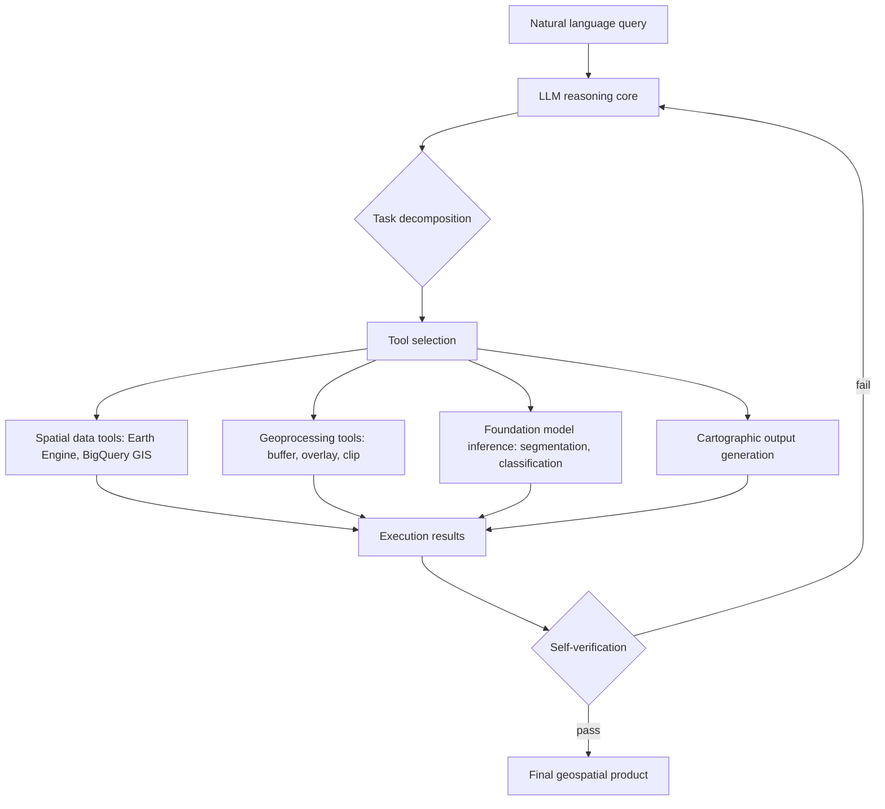

## Generative AI for Geospatial Reasoning


### Overview

Generative AI for geospatial reasoning refers to the application of large language models (LLMs), multimodal LLMs, and LLM-driven autonomous agents to understand, plan, and execute geospatial analysis tasks — translating natural language queries into geoprocessing workflows, generating and executing spatial analysis code, reasoning over spatial relationships, and orchestrating calls to GIS tools, remote sensing foundation models, and geospatial data infrastructure. Unlike the perception-focused deep learning covered under image classification and segmentation, this domain concerns reasoning, planning, and tool orchestration: using an LLM as a decision-making core that interprets user intent and coordinates the execution of a geospatial workflow.

**Key Points**

- Generative AI's abilities in reasoning, text and code generation, vision, and general knowledge are "general" capabilities that map naturally onto a GIS analyst's typical workflow of interpreting a request, selecting tools, and executing analysis.
- Generative AI powers autonomous agents that can make decisions based on environmental changes rather than relying on pre-defined rules or strategies, which is the conceptual basis for the emerging "Autonomous GIS" paradigm.
- This field sits at the intersection of GeoAI (the broader integration of AI with geographic information science) and the general LLM-agent literature, adapted to the specific demands of spatial data, coordinate systems, and geoprocessing tool ecosystems.
- As of 2026, the field has moved from early feasibility studies (can an LLM pass a GIS exam) toward practical agentic systems, benchmarks grounded in real practitioner tasks, and production frameworks from major geospatial platform vendors.

### The Autonomous GIS Paradigm

Autonomous GIS is defined as AI-powered next-generation geographic information systems that leverage generative AI's general abilities in natural language understanding, reasoning, and coding for addressing geospatial problems with automatic spatial data collection, analysis, and product generation. This contrasts with traditional GIS software, which acts as a passive tool for human-led analysis; autonomous systems instead use LLMs to bridge the gap between natural language intent and computational execution.

Five core autonomous capabilities are commonly envisioned for next-generation GIS systems:

| Capability | Description |
| --- | --- |
| Self-generating | Automatically producing workflow plans from natural language intent |
| Self-organizing | Structuring multi-step analyses into coherent execution graphs |
| Self-executing | Running generated code/tool calls without manual intervention |
| Self-verifying | Checking outputs against expected results or constraints |
| Self-growing | Learning from prior executions to improve future workflows |

A representative early implementation, LLM-Geo, enables seamless, end-to-end execution of spatial analyses by integrating a GPT-4-based reasoning engine with a Python runtime environment, where each operation node in a workflow graph corresponds to a discrete function for which the language model is iteratively prompted to generate executable Python code; these modular code snippets are then assembled into a comprehensive program and executed, producing structured outputs such as maps, summary tables, and quantitative statistics. LLM-Geo incorporates the self-generating, self-organizing, and self-executing capabilities, with self-verifying and self-growing identified as extensions achieved through workflow logging and reuse of validated procedures.

### Architectural Patterns



#### Function Calling vs. Code Generation

Two dominant patterns exist for connecting an LLM to geospatial execution:

1. **Function/tool calling** — the LLM selects from a predefined set of geospatial functions (buffer, spatial join, reprojection, zonal statistics) with structured arguments, offering more predictable and constrained execution at the cost of flexibility limited to pre-registered tools.
2. **Code generation** — the LLM writes and executes arbitrary code (typically Python with GIS libraries like GeoPandas, rasterio, or GDAL bindings), offering greater flexibility for novel analyses at the cost of less predictable execution and higher risk of runtime errors or incorrect logic.

Comparative frameworks such as GeoJSON Agents explicitly study this tradeoff — function calling versus code generation — as a multi-agent architecture design choice for geospatial analysis. [Inference — the relative reliability of each approach is task-dependent and remains an active area of empirical study rather than settled practice.]

#### Multi-Agent Architectures

Rather than a single monolithic LLM handling an entire workflow, several frameworks decompose geospatial reasoning across specialized agents. A representative multi-agent architecture integrates Chain of Thought (CoT) reasoning with collaboration and tool-use across multiple agents to enhance geospatial task execution accuracy relative to a single-agent approach, addressing the limitation that many single-LLM approaches remain constrained by simplistic task execution, restricted tool integration, and a lack of contextual reasoning when interacting with professional GIS software.

Named systems in this space include:

- **MapAgent** — introduces hierarchical structures for geospatial reasoning.
- **ShapefileGPT** — enables automated vector data manipulation via natural language.
- **MapGPT** — a lightweight agent that autonomously generates cartographic products from textual prompts, integrating LLM and cartography tools.
- **GeoGraphRAG** — a graph-based retrieval-augmented generation approach for empowering LLMs in automated geospatial modeling, grounding LLM reasoning in structured spatial knowledge graphs rather than relying solely on parametric knowledge.
- **Geode** — a zero-shot geospatial question-answering agent with explicit reasoning and precise spatio-temporal retrieval.

### Google Geospatial Reasoning Framework (Case Study)

Google's Geospatial Reasoning framework is a production-oriented example of this architecture, bringing together foundation models with generative AI to accelerate geospatial problem solving. Its architecture consists of an agentic back-end implemented as a LangGraph agent deployed using Vertex AI Agent Engine, with LLM-accessible tools for accessing Earth Engine, BigQuery, Google Maps Platform, and Google Cloud Storage — performing routine geospatial operations such as translating between natural language and geospatial geometries, and invoking remote sensing foundation model inference endpoints deployed on Vertex AI.

A representative application demonstrated post-hurricane damage assessment, where the system was configured with access to high-resolution aerial imagery, pre-processed using AI capabilities for geolocation and identification of critical infrastructure. This illustrates the typical composition pattern in production geospatial-reasoning systems: an LLM orchestration layer coordinating calls to (1) data access APIs, (2) perception/foundation models (e.g., segmentation for damage detection), and (3) geoprocessing operations, rather than the LLM performing spatial computation itself.

Separately, Gemini capabilities have been piloted directly within Google Earth to create custom data layers, conduct GIS operations, and derive geospatial insights within a no-code environment, representing a consumer-facing variant of the same underlying pattern.

**Example**

A simplified LangGraph-style agent tool definition for geospatial reasoning, illustrating the function-calling pattern:

```python
from langgraph.graph import StateGraph
from langchain_core.tools import tool

@tool
def get_ndvi_composite(region_geojson: str, start_date: str, end_date: str) -> str:
    """Compute a median NDVI composite for a region and date range using Earth Engine."""
    import ee
    geom = ee.Geometry(json.loads(region_geojson))
    collection = (
        ee.ImageCollection("COPERNICUS/S2_SR")
        .filterBounds(geom)
        .filterDate(start_date, end_date)
        .map(lambda img: img.normalizedDifference(["B8", "B4"]).rename("NDVI"))
    )
    composite = collection.median().clip(geom)
    return composite.getMapId()["tile_fetcher"].url_format

@tool
def zonal_statistics(raster_asset: str, zones_geojson: str, stat: str = "mean") -> dict:
    """Compute zonal statistics for a raster over vector zones."""
    # Implementation delegates to Earth Engine reduceRegions or a local GDAL call
    ...

tools = [get_ndvi_composite, zonal_statistics]
# Agent graph binds these tools to the LLM reasoning node,
# which selects and sequences calls based on the natural language request.
```

### Spatial Reasoning Capabilities and Limitations

Research evaluating LLMs directly on spatial reasoning tasks has examined their ability to reason about travel networks, estimate distances and elevations, and analyze routes and supply chains, alongside efforts like GIS Copilot for GIS software integration, and studies of LLMs' ability to correctly understand and apply GIS tools. Related work has explored fine-tuning LLMs to process natural language queries into executable code, and multi-agent frameworks combining several LLMs to increase the efficiency of spatial data processing for tasks such as automated vector data processing in shapefile format.

**Key Points**

- LLMs exhibit measurable but inconsistent spatial reasoning ability; performance varies substantially by task type (e.g., qualitative direction reasoning vs. precise distance/area computation).
- Because LLMs are not inherently numerically precise, geospatial reasoning systems typically delegate exact computation (distances, areas, zonal statistics, reprojections) to deterministic GIS libraries or APIs rather than having the LLM compute these values directly from its parametric knowledge.
- Retrieval-augmented approaches (e.g., GeoGraphRAG) that ground LLM reasoning in structured spatial knowledge graphs or databases are used to reduce hallucination on geospatial facts, since LLMs' training data can be sparse or outdated for specific geographic entities.
- Emerging benchmarks specifically probe the boundaries of geospatial knowledge and reasoning — for example, frameworks for iterative self-refinement designed to probe geospatial knowledge boundaries.

### Benchmarking and Evaluation

Evaluating LLM agents on real-world geospatial tasks is an active area, with growing recognition that earlier benchmarks had significant limitations. Benchmarks evaluating tool-calling agents on multi-step geospatial tasks have historically drawn from textbooks, tutorials, or LLM-generated seeds rather than practitioner-sourced tasks, and have remained limited in size (50–202 tasks) and depth (reference trajectories of 5–7 tool calls on average, at most 17); critically, none provided an executable ground truth output, relying instead on surrogate signals such as code similarity, trajectory matching, or LLM/VLM judges, which can conflate workflow resemblance with actual task correctness.

More recent benchmarks address this gap directly. GISAgentBench introduces 349 multi-step GIS tasks curated from GIS Stack Exchange — the largest public question-and-answer forum for GIS practitioners — instantiated on real public datasets across six geographic areas of interest, explicitly designed to reflect authentic practitioner workflows rather than synthetic or textbook-derived tasks. Similarly, GeoBenchX focuses specifically on benchmarking LLMs as agents solving multistep geospatial tasks.

**Key Points**

- The shift toward practitioner-sourced benchmarks with executable ground truth reflects growing awareness that code/trajectory similarity metrics can overstate real-world reliability.
- Professional GIS work remains tedious, time-consuming, and error-prone when performed manually, motivating the practical case for agentic automation — but current benchmarks suggest meaningful gaps remain between agent and human-analyst reliability on complex multi-step tasks. [Inference — the precise reliability gap varies by task complexity and specific benchmark; readers should consult the cited benchmark papers directly for quantitative results, as this synthesis does not assert specific accuracy figures.]

### Architecture Diagram

<svg xmlns="http://www.w3.org/2000/svg" viewBox="0 0 900 320">
<text x="450" y="24" font-size="16" font-weight="bold" text-anchor="middle" fill="#1a1a1a">Agentic Geospatial Reasoning Architecture (svg_diagram)</text>
<rect x="20" y="60" width="140" height="60" rx="6" fill="#dbeafe" stroke="#1e40af" />
<text x="90" y="85" font-size="11" text-anchor="middle" fill="#1a1a1a">Natural language</text>
<text x="90" y="100" font-size="11" text-anchor="middle" fill="#1a1a1a">query</text>
<line x1="160" y1="90" x2="205" y2="90" stroke="#1a1a1a" stroke-width="2" marker-end="url(#arrow5)" />
<rect x="205" y="50" width="150" height="80" rx="6" fill="#dcfce7" stroke="#166534" />
<text x="280" y="80" font-size="11" text-anchor="middle" fill="#1a1a1a">LLM Orchestrator</text>
<text x="280" y="95" font-size="10" text-anchor="middle" fill="#1a1a1a">(planning + CoT reasoning)</text>
<text x="280" y="110" font-size="10" text-anchor="middle" fill="#1a1a1a">task decomposition</text>
<line x1="355" y1="90" x2="400" y2="90" stroke="#1a1a1a" stroke-width="2" marker-end="url(#arrow5)" />
<rect x="400" y="20" width="130" height="40" rx="4" fill="#fef3c7" stroke="#92400e" />
<text x="465" y="44" font-size="10" text-anchor="middle" fill="#1a1a1a">Earth Engine / BigQuery</text>
<rect x="400" y="70" width="130" height="40" rx="4" fill="#fef3c7" stroke="#92400e" />
<text x="465" y="94" font-size="10" text-anchor="middle" fill="#1a1a1a">Geoprocessing tools</text>
<rect x="400" y="120" width="130" height="40" rx="4" fill="#fef3c7" stroke="#92400e" />
<text x="465" y="144" font-size="10" text-anchor="middle" fill="#1a1a1a">Foundation model inference</text>
<line x1="530" y1="40" x2="580" y2="90" stroke="#1a1a1a" stroke-width="1.5" marker-end="url(#arrow5)" />
<line x1="530" y1="90" x2="580" y2="90" stroke="#1a1a1a" stroke-width="1.5" marker-end="url(#arrow5)" />
<line x1="530" y1="140" x2="580" y2="90" stroke="#1a1a1a" stroke-width="1.5" marker-end="url(#arrow5)" />
<rect x="580" y="60" width="140" height="60" rx="6" fill="#ede9fe" stroke="#5b21b6" />
<text x="650" y="85" font-size="11" text-anchor="middle" fill="#1a1a1a">Execution results</text>
<text x="650" y="100" font-size="10" text-anchor="middle" fill="#1a1a1a">aggregation</text>
<line x1="720" y1="90" x2="765" y2="90" stroke="#1a1a1a" stroke-width="2" marker-end="url(#arrow5)" />
<rect x="765" y="55" width="110" height="70" rx="6" fill="#fee2e2" stroke="#991b1b" />
<text x="820" y="80" font-size="10" text-anchor="middle" fill="#1a1a1a">Final product</text>
<text x="820" y="95" font-size="10" text-anchor="middle" fill="#1a1a1a">map / table /</text>
<text x="820" y="110" font-size="10" text-anchor="middle" fill="#1a1a1a">statistics</text>
<path d="M 650 120 Q 400 220 280 130" fill="none" stroke="#6b7280" stroke-width="1.5" stroke-dasharray="5,3" marker-end="url(#arrow5)" />
<text x="450" y="235" font-size="10" text-anchor="middle" fill="#6b7280">self-verification / re-planning loop</text>
</svg>

### Domain-Specific Applications

| Application | Description |
| --- | --- |
| Disaster response | Post-hurricane/wildfire damage assessment combining natural language querying with foundation model inference on aerial/satellite imagery |
| Precision agriculture | Agentic AI systems for smart and sustainable precision agriculture, coordinating multi-source data collection and analysis |
| Urban modeling | Specialized agents for urban planning and modeling tasks |
| Remote sensing | Agentic frameworks specifically for remote sensing task automation, with taxonomies emerging to characterize these systems |
| Cartography | Automated cartographic design agents that generate maps from natural language specifications |
| UAV autonomy | LLM-driven autonomy for UAVs with integrated tool-calling and cognitive reasoning for mission planning |
| Accessibility | Barrier-free geospatial question-answering portals using multi-agent LLMs and semantic search for natural language interaction with GIS data |

### Governance and Reliability Considerations

**Key Points**

- Reliable agentic AI for GIS development requires explicit governance frameworks, as autonomous systems executing geoprocessing workflows can propagate errors (incorrect coordinate reference systems, flawed spatial joins, misapplied statistical assumptions) without human review at each step.
- The transition from predictive models to generative and agentic frameworks represents a broader evolution in the GeoAI field, with systematic reviews now characterizing a growing ecosystem of task-specific intelligent agents.
- Because LLM-generated code or tool calls can silently produce plausible-looking but incorrect geospatial outputs (e.g., a spatial join with a subtly wrong CRS), production systems benefit from self-verification steps and, where feasible, comparison against deterministic checks (area/extent sanity bounds, known reference values) rather than trusting agent output uncritically. [Inference — the specific verification mechanisms needed are task-dependent and remain an active design question rather than a settled standard.]

### Common Pitfalls

- Allowing an LLM to compute precise numerical geospatial quantities (areas, distances, statistics) directly from its parametric knowledge rather than delegating to deterministic GIS libraries, risking silently incorrect results.
- Evaluating agentic geospatial systems using code-similarity or trajectory-matching metrics alone, which can conflate superficial workflow resemblance with actual task correctness rather than verifying against executable ground truth.
- Assuming single-agent LLM systems generalize well to complex, multi-step professional GIS workflows without accounting for the documented limitations around tool integration and contextual reasoning that motivate multi-agent architectures.
- Deploying agentic geospatial workflows in production without spatial sanity-checking or self-verification steps, given the demonstrated risk of plausible-but-incorrect outputs in unreviewed automated geoprocessing.
- Treating benchmark results from textbook- or tutorial-derived task sets as representative of real practitioner workflow difficulty, given documented gaps between such benchmarks and practitioner-sourced task sets.

**Next Steps**

- Geospatial Foundation Models and Embeddings (the perception layer these agents often invoke)
- Retrieval-Augmented Generation for Spatial Knowledge Grounding
- Multi-Agent Systems Design for Geospatial Workflows
- Natural Language to Geoprocessing Code Generation
- Evaluation Benchmarks for GeoAI Agents (GISAgentBench, GeoBenchX)
- Vision-Language Models for Remote Sensing Interpretation
- Autonomous GIS Governance and Verification Frameworks
- LLM Spatial Reasoning: Capabilities and Failure Modes