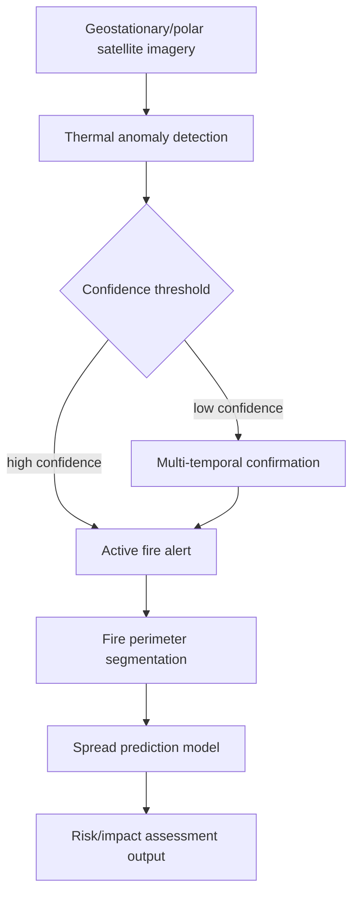
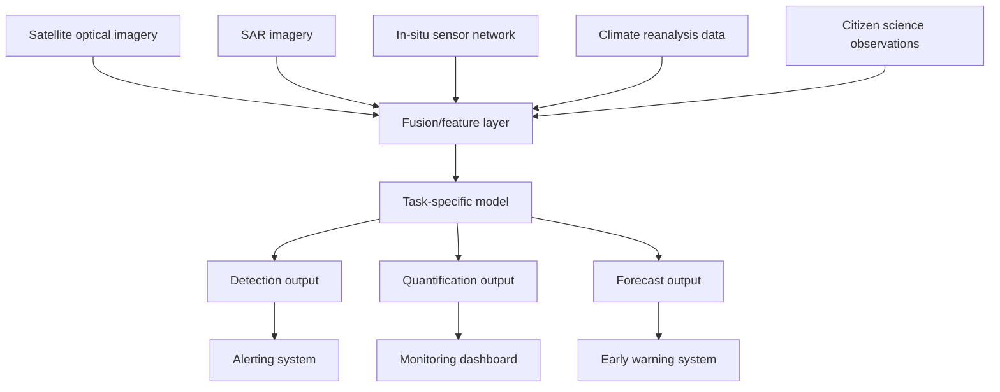

## AI-Assisted Environmental Monitoring


### Overview

AI-assisted environmental monitoring applies machine learning and deep learning methods to observational data — satellite imagery, sensor networks, acoustic recordings, camera traps, and climate model outputs — to detect, quantify, and forecast environmental conditions and change at scale. This spans deforestation and land cover change detection, air and water quality estimation, wildfire and flood detection, biodiversity monitoring, greenhouse gas emissions tracking, and climate impact assessment. The unifying theme is using AI to convert high-volume, often noisy or sparse environmental observations into actionable, spatially and temporally resolved information for scientists, regulators, and decision-makers.

**Key Points**

- Environmental monitoring tasks typically fall into three categories: detection (is an event/condition present, e.g., wildfire smoke), quantification (how much, e.g., biomass or pollutant concentration), and forecasting (what will happen, e.g., flood extent in 48 hours).
- Data sources are heterogeneous by nature — combining optical/SAR satellite imagery, in-situ sensor networks, weather/climate reanalysis data, and increasingly citizen science or crowdsourced observations.
- Label scarcity and class imbalance are pervasive, since environmental events of interest (wildfires, illegal deforestation, pollution spikes) are rare relative to background "normal" conditions.
- Deep learning components (CNNs, segmentation architectures, geospatial foundation models) discussed elsewhere in this chapter serve as building blocks within larger environmental monitoring pipelines that also include time-series analysis, sensor fusion, and domain-specific physical modeling.

### Core Application Domains

#### Deforestation and Land Cover Change Detection

Monitoring systems compare imagery across time to detect forest loss, typically using change-detection CNNs, Siamese network architectures (paired encoders comparing before/after imagery), or time-series anomaly detection on vegetation indices (NDVI, EVI). Operational systems such as Global Forest Watch integrate satellite-derived alerts to flag deforestation events near-real-time, combining optical (Landsat, Sentinel-2) and SAR (which penetrates cloud cover, valuable in persistently cloudy tropical regions) data sources.

**Key Points**

- Cloud cover is a major practical obstacle for optical-imagery-based forest monitoring in tropical regions; SAR-based approaches (Sentinel-1) or gap-filling/compositing across return visits are common mitigations.
- Siamese network architectures process co-registered image pairs (or the same location at two dates) through shared-weight encoders, learning a difference representation that highlights change rather than absolute appearance.
- False positive control (distinguishing genuine deforestation from cloud shadow, seasonal defoliation, or agricultural harvest cycles) is a central design challenge, often addressed via multi-temporal confirmation (requiring a change signal to persist across multiple observations before triggering an alert).

#### Wildfire Detection and Monitoring

AI-assisted wildfire monitoring spans early smoke detection (often from geostationary satellite imagery or ground-based camera networks), active fire perimeter mapping (from thermal/infrared satellite bands), and burn severity assessment (post-fire segmentation comparing pre/post imagery).



**Key Points**

- Thermal infrared bands are the primary physical signal for active fire detection, since combustion produces a distinct spectral signature detectable even through moderate smoke.
- Fire spread prediction models increasingly combine deep learning (learning historical spread patterns from satellite-observed fire progression) with physical fire behavior models (fuel type, wind, terrain slope), since purely data-driven models may not generalize well to novel fuel/weather combinations outside their training distribution. [Inference — the degree of benefit from hybrid physical/ML approaches versus pure ML varies by region and available training data density.]
- Burn severity mapping commonly uses the differenced Normalized Burn Ratio (dNBR), computed from pre- and post-fire near-infrared and shortwave-infrared reflectance, sometimes combined with CNN-based severity classification for finer-grained categorization.

$$\text{NBR} = \frac{\text{NIR} - \text{SWIR}}{\text{NIR} + \text{SWIR}}, \quad \text{dNBR} = \text{NBR}_{\text{pre-fire}} - \text{NBR}_{\text{post-fire}}$$

#### Flood Detection and Mapping

Flood extent mapping commonly uses SAR imagery (Sentinel-1), since water's smooth surface produces a distinctively low backscatter signature detectable regardless of cloud cover — a critical advantage during storm events when optical imagery is typically unavailable. Deep learning approaches for flood segmentation are trained to distinguish water from other low-backscatter surfaces (e.g., asphalt, shadow) that can otherwise cause false positives in simpler thresholding approaches.

**Example**

A simplified flood segmentation inference pipeline using a pretrained U-Net-style model on Sentinel-1 SAR data:

```python
import rasterio
import numpy as np
import torch

def preprocess_sar(vv_path, vh_path):
    with rasterio.open(vv_path) as src_vv, rasterio.open(vh_path) as src_vh:
        vv = src_vv.read(1).astype(np.float32)
        vh = src_vh.read(1).astype(np.float32)
        profile = src_vv.profile

    # Convert to dB scale (standard SAR preprocessing)
    vv_db = 10 * np.log10(np.clip(vv, 1e-10, None))
    vh_db = 10 * np.log10(np.clip(vh, 1e-10, None))

    stacked = np.stack([vv_db, vh_db], axis=0)
    return torch.from_numpy(stacked).unsqueeze(0), profile

def run_flood_inference(model, vv_path, vh_path, output_path):
    input_tensor, profile = preprocess_sar(vv_path, vh_path)
    with torch.no_grad():
        pred = torch.sigmoid(model(input_tensor))
        flood_mask = (pred > 0.5).squeeze().numpy().astype(np.uint8)

    profile.update(count=1, dtype=rasterio.uint8)
    with rasterio.open(output_path, "w", **profile) as dst:
        dst.write(flood_mask, 1)
```

#### Air and Water Quality Estimation

Ground-based sensor networks provide sparse but high-accuracy point measurements (particulate matter, NO₂, water turbidity/chemistry), while satellite-derived proxies (aerosol optical depth, chlorophyll-a concentration, water color indices) provide dense spatial coverage at lower accuracy. AI models — typically gradient-boosted trees or shallow neural networks — are trained to fuse sparse ground truth with dense satellite covariates, producing spatially continuous pollutant/quality maps calibrated against ground station measurements.

**Key Points**

- This is fundamentally a spatial interpolation/regression problem under label scarcity, where satellite imagery and reanalysis meteorological data serve as covariates and sparse ground sensors provide calibration targets.
- Spatial and temporal autocorrelation must be explicitly handled in cross-validation (spatially/temporally blocked splits), since nearby sensors or consecutive time steps are highly correlated and naive splitting inflates apparent model accuracy.
- Model outputs are commonly validated against held-out ground stations not used in training, and uncertainty quantification (e.g., prediction intervals) is important given the indirect nature of the satellite-to-ground-truth relationship. [Inference — specific accuracy figures are dataset- and pollutant-specific and should be evaluated per deployment.]

#### Biodiversity and Wildlife Monitoring

Camera trap image classification, bioacoustic monitoring (classifying species from audio recordings), and satellite-based habitat mapping combine to support biodiversity assessment at scales impractical for manual survey alone.

- **Camera trap classification** — CNN-based species identification from motion-triggered camera images, often facing severe class imbalance (rare species vastly underrepresented relative to common ones) and significant domain shift between camera locations/lighting conditions.
- **Bioacoustic monitoring** — audio spectrograms processed through CNN or transformer architectures to classify vocalizations (bird calls, whale songs, insect activity), enabling passive, continuous monitoring at remote sites.
- **Habitat and species distribution modeling** — combines satellite-derived environmental covariates (land cover, temperature, precipitation) with species occurrence records (often from citizen science platforms) to model and predict species range and habitat suitability.

### Sensor Fusion Architecture



**Key Points**

- Multi-source fusion improves robustness (e.g., SAR fills optical gaps during cloud cover) but requires careful handling of differing spatial resolutions, revisit frequencies, and coordinate reference systems before combination.
- Temporal alignment across sources with different revisit cadences (daily geostationary vs. 5-day Sentinel-2 vs. continuous ground sensors) is a common engineering challenge, often addressed via interpolation, compositing, or explicit temporal-embedding architectures (as used in geospatial foundation models).
- Late fusion (combining model outputs from separately trained per-source models) versus early fusion (combining raw or feature-level data before a single model) is an architectural choice with tradeoffs: early fusion can capture cross-source interactions but requires all sources to be available and aligned at inference time, while late fusion degrades more gracefully when a source is temporarily missing.

### Time-Series and Anomaly Detection Methods

Beyond static image classification, environmental monitoring heavily relies on temporal modeling to detect anomalies against expected seasonal/historical baselines:

| Method | Use Case |
| --- | --- |
| Seasonal decomposition (STL) | Establishing expected seasonal baseline for a time series (e.g., NDVI phenology) |
| LSTM / temporal CNN | Learning complex temporal dependencies for forecasting (e.g., streamflow, air quality) |
| ConvLSTM | Joint spatial-temporal modeling for gridded data (e.g., precipitation nowcasting) |
| Change point detection | Identifying abrupt shifts in a time series (e.g., sudden land cover change) |
| Isolation forests / autoencoder reconstruction error | Unsupervised anomaly detection when labeled anomalies are scarce |

$$\text{Anomaly score} = \| x_t - \hat{x}_t \|^2$$

where $\hat{x}_t$ is a model's prediction/reconstruction of the expected value at time $t$ given historical context, and large deviations flag anomalous conditions.

### Evaluation Considerations Specific to Environmental Monitoring

**Key Points**

- Rare-event detection tasks (wildfire ignition, illegal deforestation, pollution spikes) require metrics beyond accuracy — precision/recall, F1, and especially recall-at-fixed-false-positive-rate, since missed detections often carry disproportionate real-world cost relative to false alarms.
- Latency matters operationally: for time-critical applications (wildfire, flood), the time from satellite overpass to alert generation is often as important as raw detection accuracy, favoring architectures compatible with near-real-time inference pipelines.
- Ground truth for environmental events is frequently itself uncertain or delayed (e.g., confirmed deforestation reports lag actual events by weeks), complicating both training label quality and evaluation.
- Geographic and seasonal generalization must be explicitly tested, since a model trained on one region's forest type, fire regime, or pollution sources may not transfer reliably to a different ecological or climatic context. [Inference — the extent of transfer failure is highly region- and task-specific.]

### Architecture Diagram

<svg xmlns="http://www.w3.org/2000/svg" viewBox="0 0 900 340">
<text x="450" y="24" font-size="16" font-weight="bold" text-anchor="middle" fill="#1a1a1a">AI-Assisted Environmental Monitoring Pipeline (svg_diagram)</text>
<rect x="20" y="60" width="120" height="50" rx="5" fill="#dbeafe" stroke="#1e40af" />
<text x="80" y="90" font-size="10" text-anchor="middle" fill="#1a1a1a">Optical imagery</text>
<rect x="20" y="120" width="120" height="50" rx="5" fill="#dbeafe" stroke="#1e40af" />
<text x="80" y="150" font-size="10" text-anchor="middle" fill="#1a1a1a">SAR imagery</text>
<rect x="20" y="180" width="120" height="50" rx="5" fill="#dbeafe" stroke="#1e40af" />
<text x="80" y="210" font-size="10" text-anchor="middle" fill="#1a1a1a">In-situ sensors</text>
<line x1="140" y1="85" x2="200" y2="130" stroke="#1a1a1a" stroke-width="1.5" marker-end="url(#arrow6)" />
<line x1="140" y1="145" x2="200" y2="140" stroke="#1a1a1a" stroke-width="1.5" marker-end="url(#arrow6)" />
<line x1="140" y1="205" x2="200" y2="150" stroke="#1a1a1a" stroke-width="1.5" marker-end="url(#arrow6)" />
<rect x="200" y="110" width="140" height="70" rx="6" fill="#dcfce7" stroke="#166534" />
<text x="270" y="140" font-size="11" text-anchor="middle" fill="#1a1a1a">Spatial-temporal</text>
<text x="270" y="155" font-size="11" text-anchor="middle" fill="#1a1a1a">alignment / fusion</text>
<line x1="340" y1="145" x2="390" y2="145" stroke="#1a1a1a" stroke-width="2" marker-end="url(#arrow6)" />
<rect x="390" y="110" width="140" height="70" rx="6" fill="#fef3c7" stroke="#92400e" />
<text x="460" y="140" font-size="11" text-anchor="middle" fill="#1a1a1a">CNN/segmentation +</text>
<text x="460" y="155" font-size="11" text-anchor="middle" fill="#1a1a1a">temporal anomaly model</text>
<line x1="530" y1="145" x2="580" y2="145" stroke="#1a1a1a" stroke-width="2" marker-end="url(#arrow6)" />
<rect x="580" y="60" width="130" height="50" rx="5" fill="#ede9fe" stroke="#5b21b6" />
<text x="645" y="90" font-size="10" text-anchor="middle" fill="#1a1a1a">Detection alert</text>
<rect x="580" y="120" width="130" height="50" rx="5" fill="#ede9fe" stroke="#5b21b6" />
<text x="645" y="150" font-size="10" text-anchor="middle" fill="#1a1a1a">Quantified map</text>
<rect x="580" y="180" width="130" height="50" rx="5" fill="#ede9fe" stroke="#5b21b6" />
<text x="645" y="210" font-size="10" text-anchor="middle" fill="#1a1a1a">Forecast</text>
<line x1="530" y1="130" x2="580" y2="85" stroke="#1a1a1a" stroke-width="1.5" marker-end="url(#arrow6)" />
<line x1="530" y1="150" x2="580" y2="145" stroke="#1a1a1a" stroke-width="1.5" marker-end="url(#arrow6)" />
<line x1="530" y1="170" x2="580" y2="205" stroke="#1a1a1a" stroke-width="1.5" marker-end="url(#arrow6)" />
<line x1="710" y1="85" x2="760" y2="85" stroke="#1a1a1a" stroke-width="2" marker-end="url(#arrow6)" />
<line x1="710" y1="145" x2="760" y2="145" stroke="#1a1a1a" stroke-width="2" marker-end="url(#arrow6)" />
<line x1="710" y1="205" x2="760" y2="205" stroke="#1a1a1a" stroke-width="2" marker-end="url(#arrow6)" />
<rect x="760" y="60" width="120" height="170" rx="6" fill="#fee2e2" stroke="#991b1b" />
<text x="820" y="85" font-size="10" text-anchor="middle" fill="#1a1a1a">Decision support:</text>
<text x="820" y="105" font-size="10" text-anchor="middle" fill="#1a1a1a">alerting system,</text>
<text x="820" y="125" font-size="10" text-anchor="middle" fill="#1a1a1a">monitoring dashboard,</text>
<text x="820" y="145" font-size="10" text-anchor="middle" fill="#1a1a1a">early warning</text>
</svg>

### Operational Deployment Considerations

- **Alert fatigue management**: high false-positive rates in automated monitoring systems erode trust and lead to alerts being ignored; confidence thresholds and multi-temporal confirmation logic are commonly tuned to balance sensitivity against alert volume.
- **Data latency vs. accuracy tradeoffs**: near-real-time monitoring (wildfire, flood) often uses lower-latency but lower-resolution or noisier data sources; higher-accuracy analysis (e.g., cloud-free composite deforestation mapping) may be deferred to periodic (monthly/quarterly) reporting cycles.
- **Integration with existing institutional workflows**: environmental monitoring AI outputs typically feed into established regulatory, conservation, or emergency response processes, requiring outputs in formats and update cadences compatible with those institutional workflows rather than purely optimizing for model accuracy in isolation.
- **Uncertainty communication**: environmental decision-makers benefit from calibrated uncertainty estimates (not just point predictions), particularly for quantification tasks (pollutant concentration, biomass) where downstream regulatory or scientific use requires known confidence bounds.

### Common Pitfalls

- Training detection models on historical event data without accounting for reporting/labeling delay, which can introduce subtle label leakage or mismatched temporal alignment between imagery and ground truth event dates.
- Ignoring severe class imbalance in rare-event detection (e.g., treating wildfire detection as standard binary classification without class weighting or focal loss), producing models that default to predicting "no event."
- Applying models trained in one ecological/climatic region to a substantially different region without validating transfer performance, given known generalization gaps across land cover types, fire regimes, and pollution source profiles.
- Using randomly split (rather than spatially/temporally blocked) validation for sensor-fusion regression tasks (air/water quality), inflating apparent accuracy due to autocorrelation between nearby stations or consecutive time steps.
- Treating satellite-derived proxy measurements (e.g., aerosol optical depth as a proxy for ground-level PM2.5) as direct measurements without accounting for the indirect, sometimes weak, physical relationship between the proxy and the target quantity.

**Next Steps**

- Semantic Segmentation of Satellite Imagery (core technique for burn/flood/deforestation mapping)
- Geospatial Foundation Models and Embeddings (increasingly used as the backbone for environmental monitoring tasks)
- Change Detection with Deep Learning (Siamese networks, multi-temporal architectures)
- Time-Series Forecasting for Environmental Data (LSTM, ConvLSTM, temporal transformers)
- Sensor Networks and IoT for Environmental Data Collection
- Climate Model Downscaling with Machine Learning
- Citizen Science Data Integration for Biodiversity Modeling
- Uncertainty Quantification in Environmental ML Models