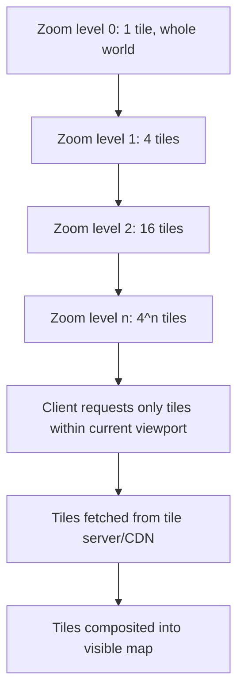
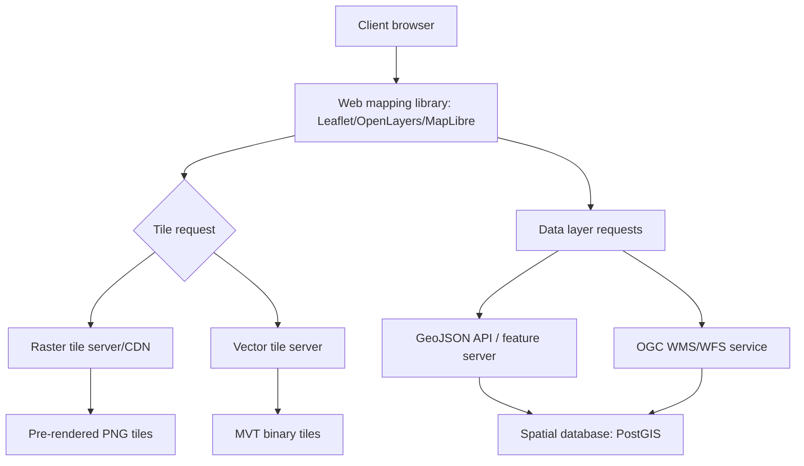

## Web Mapping Fundamentals


### Overview

Web mapping is the practice of displaying, navigating, and interacting with geospatial data through browser-based interfaces, typically rendered as tiled or vector-based map layers over the internet. It underpins nearly all modern geospatial applications — from consumer navigation apps to enterprise GIS dashboards — by combining standardized data delivery protocols, client-side rendering libraries, and server-side geospatial data services. This topic establishes the foundational concepts (tiling, projections, rendering models, and core libraries) that subsequent Web GIS development topics build upon.

**Key Points**

- Web maps are composed of layers: typically a basemap (reference geography — roads, terrain, labels) overlaid with one or more data layers (points, lines, polygons, or raster imagery representing the application's subject matter).
- Two dominant rendering paradigms exist: raster tile-based maps (pre-rendered image tiles served at discrete zoom levels) and vector tile-based maps (geometry and styling data sent to the client, rendered in real time, typically via WebGL).
- Nearly all web maps use the Web Mercator projection (EPSG:3857) for display, despite its distortion of area at high latitudes, because it enables efficient square tile generation and was adopted as a de facto standard by early major mapping platforms.
- Core client-side libraries (Leaflet, OpenLayers, Mapbox GL JS/MapLibre GL JS) abstract tile-fetching, projection handling, and interaction (pan/zoom/click) behind a JavaScript API.

### Coordinate Reference Systems for Web Mapping

Web maps must reconcile the geographic coordinate systems used for underlying data (commonly WGS84, EPSG:4326 — latitude/longitude in degrees) with the projected coordinate system used for on-screen rendering.

$$x = R \cdot \lambda, \quad y = R \cdot \ln\left[\tan\left(\frac{\pi}{4} + \frac{\phi}{2}\right)\right]$$

where $\lambda$ is longitude in radians, $\phi$ is latitude in radians, and $R$ is the Earth's radius (Web Mercator uses a spherical approximation rather than an ellipsoidal model, trading positional accuracy at the sub-meter level for computational simplicity).

**Key Points**

- EPSG:4326 (WGS84) is the standard for storing and exchanging geographic data (GeoJSON, GPS coordinates) as latitude/longitude pairs.
- EPSG:3857 (Web Mercator) is the standard for rendering — nearly universal among tile providers (OpenStreetMap, Google Maps, Mapbox) because Mercator's conformal (angle-preserving) property keeps square tiles square at every zoom level, simplifying the tiling scheme.
- Web Mercator significantly distorts area at high latitudes (Greenland appears comparable in size to Africa despite being roughly 1/14th the area), a well-documented and widely discussed limitation that specialized applications requiring accurate area representation must account for by choosing an alternative equal-area projection for analysis, even while retaining Web Mercator for display.
- Client libraries handle reprojection between data (typically 4326) and display (3857) transparently in most cases, but developers performing spatial analysis client-side must be aware of which CRS a given calculation is operating in.

### Tiling Schemes

Web maps divide the world into a pyramid of square tiles at discrete zoom levels to enable efficient, incremental loading rather than transmitting an entire map image at once.



At zoom level $z$, the world is divided into $2^z \times 2^z$ tiles, each conventionally 256×256 pixels. The tile coordinate $(x, y)$ for a given longitude/latitude is computed as:

$$x = \left\lfloor \frac{(\lambda + 180)}{360} \cdot 2^z \right\rfloor$$


$$y = \left\lfloor \frac{1}{2}\left(1 - \frac{\ln[\tan(\phi) + \sec(\phi)]}{\pi}\right) \cdot 2^z \right\rfloor$$

**Key Points**

- Standard tile URL templates follow the pattern `{z}/{x}/{y}.png` (raster) or `.pbf`/`.mvt` (vector tiles), allowing clients to construct tile requests deterministically from the current viewport and zoom.
- Raster tiles are pre-rendered images; the server (or a pre-generation pipeline) renders each tile once and serves it repeatedly, trading flexibility (styling is fixed at render time) for serving simplicity and broad client compatibility.
- Vector tiles (commonly Mapbox Vector Tile format, `.mvt`, a Protocol Buffers-encoded binary format) transmit geometry and attribute data rather than pixels, allowing the client to render, restyle, and interact with features (e.g., dynamic highlighting, label collision avoidance, rotation) without re-fetching data from the server.

### Raster Tiles vs. Vector Tiles

| Aspect | Raster Tiles | Vector Tiles |
| --- | --- | --- |
| Format | PNG/JPEG images | Protocol Buffer-encoded geometry (MVT) |
| Styling | Fixed at render time (server-side) | Dynamic, client-side (via style specification) |
| File size | Larger, fixed per tile | Typically smaller; scales with feature density |
| Rendering | Simple image compositing | Requires WebGL-capable client rendering engine |
| Interactivity | Limited (no per-feature styling without re-render) | Rich (hover, dynamic filtering, real-time restyle) |
| Rotation/pitch (3D) | Not well supported | Natively supported (WebGL) |
| Client compatibility | Universal (any ``-capable browser) | Requires WebGL support |
| Typical use | Simple basemaps, legacy systems | Modern interactive applications, custom styling |

### Core Web Mapping Libraries

#### Leaflet

A lightweight, widely adopted JavaScript library focused on simplicity and a small footprint, using raster or (via plugins) vector tiles, DOM/SVG-based rendering for vector overlays, and a large plugin ecosystem.

```javascript
// Leaflet basic map initialization
const map = L.map('map').setView([14.5995, 120.9842], 12);

L.tileLayer('https://{s}.tile.openstreetmap.org/{z}/{x}/{y}.png', {
  attribution: '© OpenStreetMap contributors',
  maxZoom: 19
}).addTo(map);

const marker = L.marker([14.5995, 120.9842]).addTo(map);
marker.bindPopup("Manila");
```

#### OpenLayers

A more comprehensive library supporting a broader range of projections, data formats, and advanced GIS-style functionality (feature editing, WMS/WMTS integration) out of the box, commonly used in enterprise GIS applications requiring OGC service compatibility.

```javascript
// OpenLayers basic map initialization
import Map from 'ol/Map';
import View from 'ol/View';
import TileLayer from 'ol/layer/Tile';
import OSM from 'ol/source/OSM';

const map = new Map({
  target: 'map',
  layers: [new TileLayer({ source: new OSM() })],
  view: new View({
    center: [120.9842, 14.5995],
    zoom: 12,
    projection: 'EPSG:4326'
  })
});
```

#### Mapbox GL JS / MapLibre GL JS

WebGL-based libraries designed for vector tile rendering, supporting smooth zooming/rotation/pitch, dynamic styling via a declarative JSON style specification, and 3D terrain/building extrusion. MapLibre GL JS is the open-source fork maintained after Mapbox's license change, offering equivalent core functionality without commercial licensing requirements.

```javascript
// MapLibre GL JS basic map initialization
const map = new maplibregl.Map({
  container: 'map',
  style: 'https://demotiles.maplibre.org/style.json',
  center: [120.9842, 14.5995],
  zoom: 12
});

map.addSource('points', {
  type: 'geojson',
  data: geojsonData
});

map.addLayer({
  id: 'point-layer',
  type: 'circle',
  source: 'points',
  paint: { 'circle-radius': 6, 'circle-color': '#e63946' }
});
```

### Data Formats for Web Mapping

| Format | Type | Notes |
| --- | --- | --- |
| GeoJSON | Vector, text-based | Human-readable, widely supported, verbose for large datasets |
| TopoJSON | Vector, text-based | Extends GeoJSON with topology encoding, reduces file size for shared boundaries |
| Mapbox Vector Tiles (MVT) | Vector, binary | Tiled, compact, standard for vector tile serving |
| KML | Vector, XML-based | Common in legacy/Google Earth-oriented workflows |
| GeoTIFF (Cloud-Optimized) | Raster | Supports partial/range reads for efficient web serving of large rasters |
| PNG/JPEG tiles | Raster | Standard raster tile image formats |

### Web Mapping Architecture



**Key Points**

- A typical production web mapping stack separates basemap tile serving (often a third-party provider or self-hosted tile server like Tileserver GL or Martin) from application-specific data layers (served via a custom API or OGC-standard service).
- Spatial databases (PostGIS being the most common open-source option) commonly serve as the backend data store, with an API layer (REST, GraphQL, or OGC services) translating spatial queries into GeoJSON or vector tiles for client consumption.
- Tile caching (via CDN or dedicated tile cache like GeoWebCache) is standard practice for performance, since basemap tiles are requested extremely frequently and are expensive to regenerate on every request.

### OGC Web Services

The Open Geospatial Consortium (OGC) defines standardized protocols for serving geospatial data that predate and coexist with modern tile-based approaches, particularly common in enterprise and government GIS contexts:

- **WMS (Web Map Service)** — returns rendered map images for a given bounding box, CRS, and layer selection; server-side rendering, analogous conceptually to raster tiles but with flexible (non-tiled) extents.
- **WFS (Web Feature Service)** — returns raw vector feature data (typically GML or GeoJSON) for a given query, enabling client-side rendering and feature-level interaction.
- **WMTS (Web Map Tile Service)** — a tiled variant of WMS, serving pre-rendered raster tiles at standardized zoom levels, combining WMS's cartographic control with tile caching efficiency.
- **WCS (Web Coverage Service)** — serves raster coverage data (e.g., elevation, continuous scientific data) rather than rendered images, preserving underlying numeric values for analysis.

### Performance Considerations

**Key Points**

- Tile pyramid pre-generation (rendering all tiles at all zoom levels in advance) trades storage cost for consistent low-latency serving, standard for high-traffic basemap layers.
- For vector tile applications, simplifying geometry at lower zoom levels (fewer vertices for the same feature when zoomed out) reduces payload size without perceptible visual loss, commonly handled automatically by vector tile generation tools (e.g., Tippecanoe).
- Client-side feature clustering (grouping nearby point markers into a single cluster icon at low zoom levels) is standard practice for datasets with thousands of point features, preventing rendering slowdown and visual clutter.
- Debouncing tile/data requests during rapid pan/zoom interactions prevents redundant network requests for viewport states the user has already moved past.

**Example**

Simplified point clustering configuration in Leaflet using the MarkerCluster plugin:

```javascript
const markers = L.markerClusterGroup();

geojsonData.features.forEach(feature => {
  const [lng, lat] = feature.geometry.coordinates;
  markers.addLayer(L.marker([lat, lng]));
});

map.addLayer(markers);
```

### Architecture Diagram

<svg xmlns="http://www.w3.org/2000/svg" viewBox="0 0 900 300">
<text x="450" y="24" font-size="16" font-weight="bold" text-anchor="middle" fill="#1a1a1a">Web Mapping Request Flow (svg_diagram)</text>
<rect x="20" y="60" width="130" height="60" rx="6" fill="#dbeafe" stroke="#1e40af" />
<text x="85" y="85" font-size="11" text-anchor="middle" fill="#1a1a1a">Browser</text>
<text x="85" y="100" font-size="11" text-anchor="middle" fill="#1a1a1a">(map library)</text>
<line x1="150" y1="90" x2="200" y2="90" stroke="#1a1a1a" stroke-width="2" marker-end="url(#arrow7)" />
<rect x="200" y="30" width="140" height="50" rx="5" fill="#dcfce7" stroke="#166534" />
<text x="270" y="60" font-size="10" text-anchor="middle" fill="#1a1a1a">Basemap tile CDN</text>
<rect x="200" y="100" width="140" height="50" rx="5" fill="#fef3c7" stroke="#92400e" />
<text x="270" y="130" font-size="10" text-anchor="middle" fill="#1a1a1a">Application data API</text>
<line x1="150" y1="80" x2="200" y2="55" stroke="#1a1a1a" stroke-width="1.5" marker-end="url(#arrow7)" />
<line x1="150" y1="100" x2="200" y2="125" stroke="#1a1a1a" stroke-width="1.5" marker-end="url(#arrow7)" />
<line x1="340" y1="125" x2="390" y2="125" stroke="#1a1a1a" stroke-width="2" marker-end="url(#arrow7)" />
<rect x="390" y="100" width="130" height="50" rx="5" fill="#ede9fe" stroke="#5b21b6" />
<text x="455" y="130" font-size="10" text-anchor="middle" fill="#1a1a1a">PostGIS database</text>
<rect x="200" y="180" width="140" height="50" rx="5" fill="#fee2e2" stroke="#991b1b" />
<text x="270" y="205" font-size="10" text-anchor="middle" fill="#1a1a1a">OGC WMS/WFS</text>
<text x="270" y="220" font-size="9" text-anchor="middle" fill="#1a1a1a">service (optional)</text>
<line x1="150" y1="110" x2="200" y2="205" stroke="#1a1a1a" stroke-width="1.5" marker-end="url(#arrow7)" stroke-dasharray="4" />
<line x1="340" y1="205" x2="390" y2="150" stroke="#1a1a1a" stroke-width="1.5" marker-end="url(#arrow7)" stroke-dasharray="4" />

<text x="270" y="260" font-size="10" text-anchor="middle" fill="`#4b5563`">Client renders composited tiles + feature data via WebGL/Canvas/SVG</text>

</svg>

### Common Pitfalls

- Performing area or distance calculations directly on Web Mercator (EPSG:3857) coordinates, which produces significantly distorted results, especially at higher latitudes; such calculations should use an appropriate equal-area or geodesic method instead.
- Loading entire large GeoJSON datasets (thousands of complex polygons) directly into the client without tiling, simplification, or clustering, causing severe rendering and interaction performance degradation.
- Mismatching coordinate order — GeoJSON uses `[longitude, latitude]` while many mapping libraries and conventions expect `[latitude, longitude]` — a frequent source of "points plotted in the ocean" bugs.
- Failing to set appropriate `maxZoom`/`minZoom` and attribution requirements when using third-party tile providers, which can violate usage terms or produce blank/broken tiles at unsupported zoom levels.
- Not accounting for high-DPI ("retina") displays when serving raster tiles, resulting in blurry basemap rendering on modern devices unless 2x tile variants are served.

**Next Steps**

- Vector Tile Generation and Styling (Tippecanoe, Mapbox Style Specification deep dive)
- PostGIS Fundamentals for Spatial Data Storage
- OGC Web Services in Depth (WMS, WFS, WMTS, WCS)
- Building Interactive Dashboards with MapLibre GL JS
- Spatial APIs and REST/GraphQL Design for Geospatial Data
- 3D Web Mapping and Terrain Visualization
- Web GIS Application Architecture and Deployment
- Performance Optimization for Large-Scale Web Maps