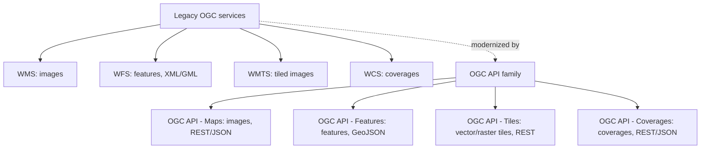
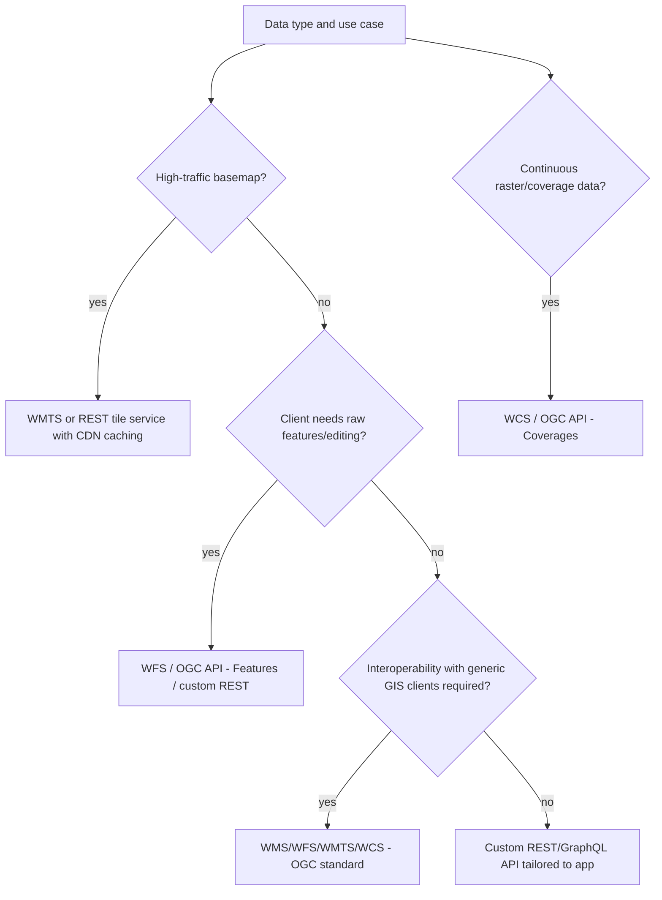

## Web Map Services and APIs

### Overview

Web map services and APIs are the server-side protocols and interfaces through which geospatial data — raster imagery, vector features, coverages, and processed analytical results — are published, queried, and delivered to client applications over HTTP. They provide the standardized (or, increasingly, custom REST/GraphQL) contracts that let a web mapping client (Leaflet, OpenLayers, MapLibre GL JS) or any other consumer request exactly the geospatial data it needs, in a format it can render or process, without needing direct access to the underlying data store. This topic covers the OGC standards family, modern tile services, and contemporary REST/GraphQL API patterns used to serve geospatial data on the web.

**Key Points**

- OGC (Open Geospatial Consortium) standards — WMS, WFS, WMTS, WCS, and the newer OGC API family — provide vendor-neutral, interoperable protocols widely used in government, enterprise, and scientific GIS.
- Modern web mapping increasingly favors lightweight, tile- or GeoJSON-based REST APIs over full OGC service stacks for public-facing consumer applications, reserving OGC services for enterprise/interoperability contexts.
- Service choice involves tradeoffs between standardization/interoperability (OGC), performance/simplicity (tile services), and flexibility (custom REST/GraphQL APIs).
- Authentication, rate limiting, and caching strategy differ substantially between raster tile serving, vector tile serving, and feature/attribute query services, and a production system often combines several service types for different layers.

### OGC Web Services

#### WMS (Web Map Service)

Returns a rendered map image (PNG/JPEG) for a specified bounding box, coordinate reference system, layer selection, and image dimensions. Rendering (symbology, color, labeling) happens entirely server-side; the client receives a static picture with no access to underlying feature geometry or attributes.



```
GET /wms?SERVICE=WMS&VERSION=1.3.0&REQUEST=GetMap
    &LAYERS=landuse&CRS=EPSG:4326
    &BBOX=14.5,120.9,14.7,121.1
    &WIDTH=800&HEIGHT=600&FORMAT=image/png
```

**Key Points**

- WMS is stateless and non-tiled — each request specifies an arbitrary bounding box and image size, giving flexibility (any zoom/extent) but no inherent caching benefit the way fixed tile grids provide.
- The `GetCapabilities` request returns an XML document describing available layers, supported CRSs, and styling options, enabling client auto-discovery of a WMS endpoint's contents.
- WMS is well suited to cartographically complex layers requiring server-side rendering control (e.g., graduated symbology, label placement) but is inefficient for interactive panning/zooming at scale compared to tiled alternatives.

#### WFS (Web Feature Service)

Returns raw vector feature data (geometry plus attributes), typically as GML or GeoJSON, allowing the client to render, style, and analyze features locally rather than receiving a pre-rendered image.



```
GET /wfs?SERVICE=WFS&VERSION=2.0.0&REQUEST=GetFeature
    &TYPENAME=parcels&OUTPUTFORMAT=application/json
    &BBOX=120.9,14.5,121.1,14.7,EPSG:4326
```

**Key Points**

- WFS supports both read (`GetFeature`) and, via WFS-T (Transactional), write operations (`Insert`, `Update`, `Delete`), making it one of the few standardized protocols for web-based vector data editing.
- Because WFS returns raw features rather than rendered images, response size scales with feature count and complexity, making pagination (`COUNT`/`STARTINDEX` parameters) and bounding-box filtering essential for large datasets.
- WFS supports OGC Filter Encoding for attribute and spatial queries (e.g., "parcels where zoning = 'residential' AND intersects(geometry, bbox)"), providing standardized server-side filtering beyond simple bounding-box requests.

#### WMTS (Web Map Tile Service)

A tiled variant of WMS: instead of arbitrary bounding boxes, WMTS serves pre-rendered raster tiles at standardized zoom levels and tile grid positions, combining WMS's server-side cartographic rendering with the caching efficiency of a fixed tile pyramid.



```
GET /wmts?SERVICE=WMTS&VERSION=1.0.0&REQUEST=GetTile
    &LAYER=landuse&TILEMATRIXSET=GoogleMapsCompatible
    &TILEMATRIX=12&TILEROW=1653&TILECOL=3298
    &FORMAT=image/png
```

**Key Points**

- WMTS's fixed tile grid (typically matching the standard Web Mercator quadtree) allows aggressive HTTP/CDN caching, since identical tile requests can be served from cache rather than re-rendered per request — a major performance advantage over plain WMS for high-traffic basemap serving.
- RESTful WMTS endpoints (`/wmts/{layer}/{z}/{x}/{y}.png`) are common alongside the KVP (key-value-pair) query-string style shown above, aligning WMTS more closely with the tile URL conventions used by non-OGC tile services.

#### WCS (Web Coverage Service)

Serves raster coverage data — continuous numeric grids such as elevation, temperature, or scientific model output — preserving underlying data values rather than a rendered visual representation, enabling the client to perform analysis (not just display) on the retrieved data.

**Key Points**

- WCS is distinct from WMS in intent: WMS delivers a picture of data; WCS delivers the data itself, subsettable by spatial extent, band, and sometimes time.
- Common in scientific and environmental data delivery contexts (climate model output, digital elevation models) where downstream analysis on numeric values, not visualization, is the primary goal.

#### Comparative Summary

| Service | Returns | Primary Use | Caching Efficiency |
| --- | --- | --- | --- |
| WMS | Rendered image | Cartographic display | Low (arbitrary extents) |
| WFS | Raw vector features | Client-side rendering/analysis, editing | Low-moderate |
| WMTS | Pre-rendered tiles | High-traffic basemap serving | High (fixed grid) |
| WCS | Raster coverage data | Scientific/analytical raster access | Moderate |

### The OGC API Family

The newer OGC API suite (OGC API - Features, OGC API - Tiles, OGC API - Coverages, OGC API - Maps) modernizes the older WMS/WFS/WMTS/WCS standards by adopting RESTful, JSON-first design (OpenAPI-documented, resource-oriented URLs) in place of the older XML/KVP query-string conventions, aiming to lower the integration barrier for web developers accustomed to conventional REST APIs while preserving OGC's interoperability goals.



**Key Points**

- OGC API - Features exposes collections and individual features as resource-oriented, browsable URLs (e.g., `/collections/parcels/items`), returning GeoJSON by default, making it substantially easier to consume from standard HTTP client code than WFS's XML/GML responses.
- The OGC API family is designed to be incrementally adoptable — an implementation can support a subset of conformance classes rather than requiring the full legacy service specification, easing implementation for smaller or newer service providers.

### Modern Vector and Raster Tile Services

Outside the OGC standards track, a widely adopted convention for serving Mapbox Vector Tiles (MVT) and raster tiles uses simple RESTful URL templates, popularized by commercial providers and now implemented by numerous open-source tile servers.



```
GET /tiles/{z}/{x}/{y}.mvt      // vector tile
GET /tiles/{z}/{x}/{y}.png      // raster tile
```

**Key Points**

- Popular open-source tile-serving software includes Martin (serves MVT directly from PostGIS), Tileserver GL (serves pre-generated `.mbtiles` archives), and pg_tileserv, each optimized for different data-source and deployment scenarios.
- Because these services follow the same `{z}/{x}/{y}` tiling convention as WMTS but without the OGC KVP overhead, they integrate directly with the tile-layer APIs of Leaflet, OpenLayers, and MapLibre GL JS with minimal configuration.
- Vector tiles served this way typically originate from a spatial database (commonly PostGIS, using its `ST_AsMVT` function to generate tiles directly via SQL) or from pre-generated static tile archives built with tools like Tippecanoe.

**Example**

Generating a vector tile directly from PostGIS using `ST_AsMVT`:

```sql
SELECT ST_AsMVT(tile, 'parcels', 4096, 'geom')
FROM (
    SELECT
        id,
        zoning,
        ST_AsMVTGeom(
            geometry,
            ST_TileEnvelope(12, 3298, 1653),
            4096, 64, true
        ) AS geom
    FROM parcels
    WHERE geometry && ST_TileEnvelope(12, 3298, 1653)
) AS tile;
```

This query dynamically generates a vector tile for zoom 12, tile column 3298, row 1653, clipping geometries to the tile envelope and encoding them in the standard MVT binary format for direct client consumption.

### Custom REST and GraphQL Geospatial APIs

Many applications forgo standardized OGC protocols entirely in favor of custom REST or GraphQL APIs tailored to application-specific query patterns, particularly when the consuming client is a bespoke frontend rather than a generic GIS client.

**Example**

A simple REST endpoint returning GeoJSON features within a bounding box, built with a typical web framework and PostGIS backend:

```python
from flask import Flask, request, jsonify
import psycopg2

app = Flask(__name__)

@app.route("/api/features")
def get_features():
    bbox = request.args.get("bbox")  # "minlon,minlat,maxlon,maxlat"
    minlon, minlat, maxlon, maxlat = map(float, bbox.split(","))

    conn = psycopg2.connect(dsn="postgresql://...")
    cur = conn.cursor()
    cur.execute("""
        SELECT jsonb_build_object(
            'type', 'FeatureCollection',
            'features', jsonb_agg(
                jsonb_build_object(
                    'type', 'Feature',
                    'geometry', ST_AsGeoJSON(geom)::jsonb,
                    'properties', jsonb_build_object('name', name, 'category', category)
                )
            )
        )
        FROM locations
        WHERE geom && ST_MakeEnvelope(%s, %s, %s, %s, 4326)
    """, (minlon, minlat, maxlon, maxlat))

    result = cur.fetchone()[0]
    return jsonify(result)
```

**Key Points**

- Custom APIs allow response shaping precisely matched to client needs (reducing over-fetching relative to generic WFS responses), at the cost of losing standardized interoperability with generic GIS clients (QGIS, ArcGIS) that expect OGC-compliant endpoints.
- GraphQL geospatial APIs (e.g., built atop PostGraphile or Hasura with PostGIS) allow clients to request precisely the geometry precision, attribute fields, and nested relations needed per query, useful for applications with heterogeneous client needs (web, mobile, dashboard) sharing one backend.
- Spatial query parameters in custom APIs commonly follow either simple bounding-box filtering (as above) or more expressive filter syntax mirroring OGC Filter Encoding concepts (attribute comparisons combined with spatial predicates like intersects, within, contains).

### Service Selection Architecture



### Authentication and Access Control

**Key Points**

- API key or OAuth-based authentication is standard for commercial tile/data providers (Mapbox, Google Maps Platform, HERE), typically enforced via signed URL parameters or bearer tokens on each tile/feature request.
- Rate limiting is commonly applied per API key or per IP, particularly for tile services given the high request volume generated by normal map panning/zooming.
- Row-level or attribute-level access control (restricting which features or fields a given user can query) is more naturally implemented in custom REST/GraphQL APIs or via database-level row security (e.g., PostgreSQL row-level security policies) than in traditional OGC service implementations, which historically assumed relatively coarse, layer-level access control.

### Caching Strategy

| Layer Type | Typical Caching Approach |
| --- | --- |
| Basemap raster/vector tiles | CDN edge caching, long TTL, fixed tile grid enables high cache hit rate |
| WMS (arbitrary bbox) | Difficult to cache effectively due to non-fixed request parameters; server-side render caching (e.g., GeoWebCache) sometimes used |
| Feature/attribute queries (WFS, REST) | Shorter TTL or no caching for frequently updated data; ETags/conditional requests for bandwidth efficiency |
| Static pre-generated tiles (.mbtiles) | Effectively infinite cache lifetime until source data regeneration |

### Common Pitfalls

- Serving WMS for high-traffic interactive basemaps instead of WMTS or a tile service, resulting in poor caching efficiency and higher server load under panning/zooming traffic.
- Returning unbounded WFS/REST feature queries without pagination or bounding-box filtering, risking excessive response sizes and server load for large datasets.
- Mismatched coordinate reference systems between request parameters and stored data (e.g., sending a bounding box in EPSG:4326 to a service expecting EPSG:3857) without explicit reprojection, producing empty or incorrect results.
- Exposing a full-featured WFS-T (transactional) endpoint without adequate authentication/authorization, allowing unauthorized data modification.
- Over-fetching via generic OGC services when a purpose-built REST/GraphQL endpoint would return a smaller, more precisely shaped payload for a known client's needs — a tradeoff to weigh explicitly against the interoperability benefits of standard OGC services.

**Next Steps**

- Web Mapping Fundamentals (client-side rendering and tiling concepts)
- PostGIS Fundamentals for Spatial Data Storage
- Vector Tile Generation and Styling (Tippecanoe, Martin, pg_tileserv deep dive)
- Building Interactive Dashboards with MapLibre GL JS
- Spatial Database Design and Query Optimization
- API Authentication and Rate Limiting Patterns for Geospatial Services
- OGC API - Features Implementation Deep Dive
- GraphQL for Geospatial Data (PostGraphile, Hasura with PostGIS)