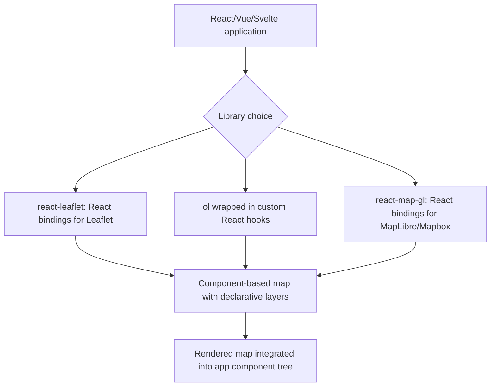
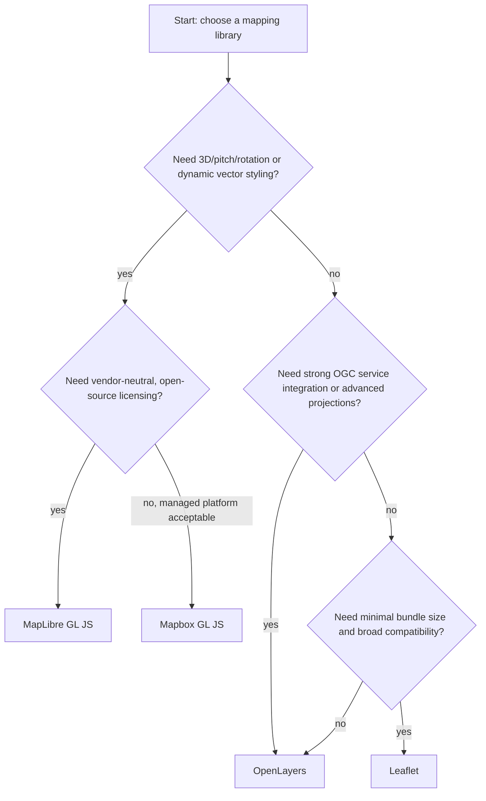

## JavaScript Mapping Libraries


### Overview

JavaScript mapping libraries provide the client-side APIs used to render, style, and interact with geospatial data in the browser — handling tile fetching, projection, panning/zooming, marker/feature rendering, and user interaction. The three dominant open-source libraries in 2026 are Leaflet, OpenLayers, and MapLibre GL JS, each optimized for a different point in the tradeoff space between simplicity, feature completeness, and rendering performance. Library choice shapes an application's rendering model (DOM/Canvas/SVG vs. WebGL), vector tile support, 3D capability, and bundle size, making it one of the earliest and most consequential architectural decisions in web GIS application development.

**Key Points**

- Leaflet remains the most widely adopted library by raw usage (roughly 6.67M weekly npm downloads as of August 2026), valued for its small footprint (~42KB gzipped) and simplicity, using SVG/Canvas rendering rather than WebGL.
- MapLibre GL JS (~4.02M weekly downloads) is the community-governed, BSD-3-Clause-licensed WebGL renderer that emerged as an open-source fork after Mapbox GL JS moved to a proprietary license in December 2020; it is the standard choice for vector tile rendering, dynamic styling, and 3D visualization without commercial licensing constraints.
- OpenLayers is the most comprehensive toolkit of the three, with the broadest built-in support for projections, OGC service integration (WMS/WFS/WMTS), and advanced GIS-style feature editing, commonly favored in enterprise and scientific GIS applications.
- Mapbox GL JS remains available as a commercial, managed option with usage-based billing and tight integration with Mapbox's own hosted styles and services (~3.80M weekly downloads), for teams willing to accept vendor lock-in and licensing terms in exchange for an integrated managed platform.

### Library Comparison

| Aspect | Leaflet | OpenLayers | MapLibre GL JS | Mapbox GL JS |
| --- | --- | --- | --- | --- |
| Rendering | SVG/Canvas (DOM-based) | Canvas (with WebGL renderer available) | WebGL | WebGL |
| License | BSD-2-Clause | BSD-2-Clause | BSD-3-Clause | Proprietary (Mapbox TOS) |
| Vector tiles | Via plugin only | Fully supported natively | Native, primary use case | Native, primary use case |
| 3D/pitch/rotation | Not supported | Limited | Native support | Native support |
| Bundle size | Small (~42KB gzipped) | Larger, modular | Moderate | Moderate |
| OGC service integration | Via plugins | Strong built-in support | Limited, via plugins | Limited, via plugins |
| Best suited for | Simple maps, quick deployment, broad compatibility | Enterprise GIS, complex projections, OGC interoperability | Modern styleable vector maps, 3D, data viz | Managed platform integration, Mapbox ecosystem |
| Requires WebGL | No | No (optional) | Yes | Yes |

### Leaflet

A lightweight, DOM/Canvas/SVG-rendering library focused on simplicity and broad browser compatibility, with a large plugin ecosystem covering functionality (clustering, drawing tools, heatmaps) not included in the small core. Leaflet is ideal for simpler maps, quick deployments, or projects requiring broad browser compatibility, such as basic location maps or maps with minimal interactivity — its versatility extends even to non-traditional uses like in-game navigation maps.

```javascript
// Leaflet: basic map with a GeoJSON layer and popup
const map = L.map('map').setView([14.5995, 120.9842], 12);

L.tileLayer('https://{s}.tile.openstreetmap.org/{z}/{x}/{y}.png', {
  attribution: '© OpenStreetMap contributors',
  maxZoom: 19
}).addTo(map);

L.geoJSON(geojsonData, {
  style: { color: '#3388ff', weight: 2 },
  onEachFeature: (feature, layer) => {
    layer.bindPopup(feature.properties.name);
  }
}).addTo(map);
```

**Key Points**

- Leaflet does not natively support vector tiles; vector tile rendering requires a plugin such as `maplibre-gl-leaflet`, which bridges MapLibre GL JS's WebGL rendering into Leaflet's familiar API surface, actively maintained as of 2026.
- Leaflet's plugin ecosystem is a major practical advantage — clustering (`Leaflet.markercluster`), drawing/editing (`Leaflet.draw`), and heatmap (`Leaflet.heat`) plugins cover common needs without requiring custom implementation.
- Because Leaflet renders via DOM/SVG/Canvas rather than WebGL, it has broader compatibility with older or constrained browser environments, at the cost of lower rendering performance for very large numbers of simultaneously visible features.

### OpenLayers

The most feature-complete of the major open-source libraries, with native support for a wide range of projections, direct OGC service integration (WMS, WFS, WMTS sources built into the core library), and advanced vector feature editing/interaction capabilities out of the box.

```javascript
// OpenLayers: WMS layer plus a vector layer with editing interaction
import Map from 'ol/Map';
import View from 'ol/View';
import TileLayer from 'ol/layer/Tile';
import VectorLayer from 'ol/layer/Vector';
import VectorSource from 'ol/source/Vector';
import TileWMS from 'ol/source/TileWMS';
import { Modify } from 'ol/interaction';

const wmsLayer = new TileLayer({
  source: new TileWMS({
    url: 'https://example.com/wms',
    params: { LAYERS: 'landuse', TILED: true }
  })
});

const vectorSource = new VectorSource({ url: '/api/parcels.geojson', format: new GeoJSON() });
const vectorLayer = new VectorLayer({ source: vectorSource });

const map = new Map({
  target: 'map',
  layers: [wmsLayer, vectorLayer],
  view: new View({ center: [120.9842, 14.5995], zoom: 12, projection: 'EPSG:4326' })
});

map.addInteraction(new Modify({ source: vectorSource }));
```

**Key Points**

- OpenLayers' strong built-in OGC service support (direct `TileWMS`, `ImageWMS`, `WMTS`, and vector `WFS`-compatible source types) makes it a common choice when interoperability with enterprise or government GIS infrastructure is a primary requirement.
- Native support for arbitrary projections (via integration with the Proj4js library) exceeds Leaflet's and is comparable to or exceeds MapLibre's, relevant for applications working outside standard Web Mercator (e.g., polar region mapping, national grid systems).
- OpenLayers' modular architecture (importing only needed submodules) allows bundle size optimization, though its full feature surface is larger than Leaflet's minimalist core.

### MapLibre GL JS

A WebGL-based renderer for vector tiles, forked from Mapbox GL JS v1 after Mapbox's late-2020 license change, and now developed independently under community governance with a BSD-3-Clause license. It is best suited for complex, feature-rich maps, data visualization applications, and any project needing dynamic styling or 3D rendering, and is not tied to a single tile provider — it works with any standards-compliant vector tile source.

```javascript
// MapLibre GL JS: vector tile source with declarative styling and 3D terrain
const map = new maplibregl.Map({
  container: 'map',
  style: 'https://demotiles.maplibre.org/style.json',
  center: [120.9842, 14.5995],
  zoom: 12,
  pitch: 45
});

map.on('load', () => {
  map.addSource('terrain', {
    type: 'raster-dem',
    url: 'https://example.com/terrain-tiles.json',
    tileSize: 256
  });
  map.setTerrain({ source: 'terrain', exaggeration: 1.5 });

  map.addLayer({
    id: 'buildings-3d',
    type: 'fill-extrusion',
    source: 'vector-source',
    'source-layer': 'buildings',
    paint: {
      'fill-extrusion-height': ['get', 'height'],
      'fill-extrusion-color': '#aaa'
    }
  });
});
```

**Key Points**

- MapLibre's JSON-based style specification allows declarative, data-driven styling (expressions referencing feature properties directly in paint/layout rules) without writing imperative styling code per feature.
- 3D capabilities — pitch, rotation, terrain (raster-DEM based hillshading/extrusion), and `fill-extrusion` for building massing — are native and well-supported, distinguishing it from Leaflet and giving it feature parity with Mapbox GL JS for most use cases.
- Because MapLibre requires WebGL, it has a harder compatibility floor than Leaflet (older devices/browsers without WebGL support cannot render MapLibre maps at all), which should be weighed for applications targeting very broad device compatibility.
- MapLibre GL JS continues active development independent of Mapbox — for example, version 5.22 introduced incremental improvements to the style specification, reflecting ongoing evolution separate from the commercial Mapbox GL JS line.

### Framework Integration Patterns



**Key Points**

- Framework-specific binding libraries (`react-leaflet`, `react-map-gl`) wrap the underlying imperative mapping library API in declarative, component-based patterns matching the surrounding framework's conventions, reducing boilerplate for lifecycle management (mount/unmount, prop-to-map-state synchronization).
- Direct imperative use of the underlying library (bypassing framework bindings) remains common for complex applications needing fine-grained control over map state and performance, since abstraction layers can introduce overhead or limit access to advanced library features.

### Choosing a Library



**Key Points**

- The rendering model is the primary architectural fork: WebGL-based libraries (MapLibre, Mapbox) suit vector tile-heavy, style-dynamic, or 3D applications; DOM/Canvas-based libraries (Leaflet, OpenLayers' default renderer) suit simpler raster-tile or moderate-complexity vector overlay applications with broader compatibility needs.
- For applications requiring both Leaflet's simplicity/plugin ecosystem and MapLibre's vector tile rendering, the `maplibre-gl-leaflet` binding provides a practical middle path rather than forcing an exclusive choice.
- Enterprise and government GIS contexts requiring strict OGC standard compliance and interoperability with tools like QGIS/ArcGIS commonly favor OpenLayers given its native, comprehensive OGC service support.

### Common Pitfalls

- Choosing a WebGL-based library (MapLibre/Mapbox) for a project with strict legacy-browser or low-end-device compatibility requirements without verifying WebGL availability across the target device range.
- Loading large raw GeoJSON datasets directly as a Leaflet or OpenLayers vector layer without tiling, simplification, or clustering, causing severe rendering slowdown as feature count grows — this remains a common pitfall regardless of library choice.
- Mixing imperative library calls with a declarative framework's reactive state model without a proper binding layer (e.g., manually calling MapLibre methods inside React without `react-map-gl` or equivalent), leading to state synchronization bugs and memory leaks from improperly cleaned-up map instances.
- Assuming feature parity between Mapbox GL JS and MapLibre GL JS for every API surface — while the projects share lineage, they have evolved separately since the 2020 fork, and specific newer Mapbox-exclusive features may not have MapLibre equivalents. [Inference — the exact scope of divergence changes over time as both projects continue independent development; current API differences should be checked against each project's documentation for a specific feature.]
- Underestimating OpenLayers' steeper learning curve relative to Leaflet when simplicity, not OGC interoperability or advanced projection handling, is the actual project priority.

**Next Steps**

- Web Mapping Fundamentals (tiling, projections, and rendering concepts underlying these libraries)
- Web Map Services and APIs (server-side services these libraries consume)
- Vector Tile Generation and Styling (Tippecanoe, MapLibre Style Specification deep dive)
- Building Interactive Dashboards with MapLibre GL JS
- 3D Web Mapping and Terrain Visualization
- React/Vue Integration Patterns for Web Mapping
- Performance Optimization for Large-Scale Web Maps
- Mobile Web GIS Application Development