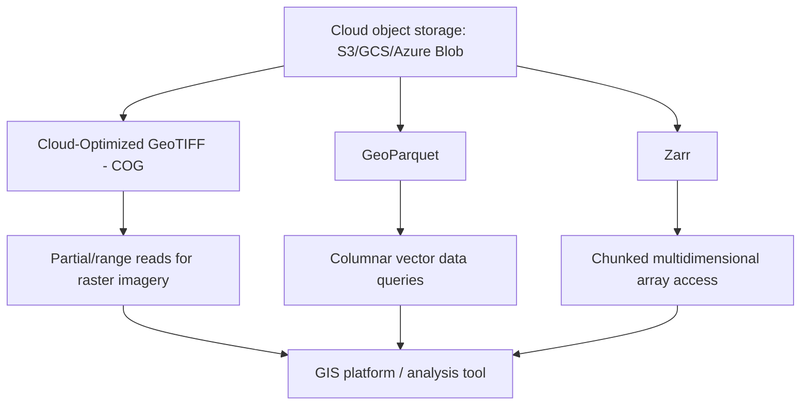
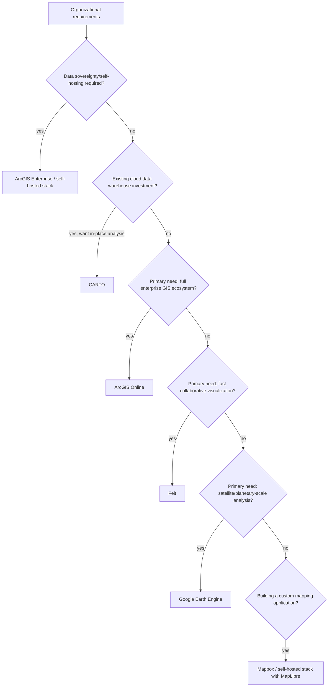

## Cloud GIS Hosting Platforms

### Overview

Cloud GIS hosting platforms deliver spatial data storage, analysis, mapping, and collaboration capabilities as managed cloud services, removing the need for organizations to provision and maintain their own GIS servers, databases, and tile infrastructure. The landscape spans enterprise SaaS platforms (ArcGIS Online), collaborative browser-first mapping tools (Felt), warehouse-native location intelligence platforms (CARTO), planetary-scale analysis platforms (Google Earth Engine), and the broader cloud-native geospatial ecosystem built around modern columnar and cloud-optimized data formats. Platform choice depends heavily on organizational scale, existing data infrastructure, analysis requirements, and the tradeoff between managed convenience and self-hosted control.

**Key Points**

- The GIS landscape has shifted dramatically toward cloud-based platforms, offering organizations a way to deploy mapping and spatial analysis capabilities without managing server infrastructure directly.
- Platforms differ fundamentally in data locality model: some (ArcGIS Online, Felt) host and manage data within their own platform, while others (CARTO) are explicitly designed to query data in place within a customer's existing cloud data warehouse rather than requiring data migration.
- Cloud-native geospatial data formats — Cloud-Optimized GeoTIFF (COG), GeoParquet, and Zarr — underpin much of this ecosystem, enabling efficient partial/range reads and analysis directly against cloud object storage without full-file downloads.
- Self-hosted enterprise options (ArcGIS Enterprise) remain available for organizations with data sovereignty, security, or regulatory requirements that preclude fully managed SaaS hosting.

### Major Platform Categories

#### Enterprise SaaS GIS Platforms

**ArcGIS Online**, Esri's software-as-a-service web GIS platform released in 2012, runs entirely in web browsers, enabling users to create interactive maps, perform spatial analysis, and share geospatial content without installing desktop applications. It functions as both a mapping tool and a content management system for spatial data, with organizations hosting feature layers and tile layers while controlling access through role-based permissions, offloading processing to Esri's cloud infrastructure rather than requiring local computing resources.

For organizations with stricter infrastructure requirements, **ArcGIS Enterprise** is offered as self-hosted software, letting organizations choose where to host servers to satisfy their unique data sovereignty and security conditions, while still forming part of the broader ArcGIS ecosystem alongside ArcGIS Online. Together, ArcGIS Online and ArcGIS Enterprise are positioned as an open, interoperable, and secure IT backbone with built-in observability tools for administrators to monitor system performance, usage, and health, extensible with advanced modules for real-time data feeds, large-volume image processing, and field work orchestration.

**Key Points**

- ArcGIS Online uses a tiered user-type structure (Creator, Professional, Professional Plus) combined with a pay-as-you-go credit system for consuming premium capabilities (geocoding, advanced analysis), which requires active credit management as part of ongoing platform administration.
- The platform's IT architecture emphasizes standards-based openness — designed to connect to desktop (ArcGIS Pro), web, mobile, and developer interfaces from a single central cloud/enterprise deployment.
- Reported user feedback notes ArcGIS can be resource-intensive with occasional performance issues, a tradeoff for its comprehensive feature breadth relative to lighter-weight alternatives. [Inference — specific performance characteristics vary by deployment scale, data volume, and configuration, and should be evaluated for a given organization's use case.]

#### Collaborative Browser-First Mapping Platforms

**Felt** represents a newer category of cloud GIS platform emphasizing ease of collaboration and rapid data visualization over comprehensive desktop-GIS feature parity. It integrates with cloud data sources including Postgres, Snowflake, and Google Cloud, instantly visualizing various file formats, geocoding addresses, and parsing geometry columns to streamline data processing, with dashboard functionality for charting data across time series, filtering categories, and highlighting statistics without requiring custom development. Felt is enterprise-ready, supporting connections to cloud sources like Postgres, Snowflake, and Databricks while meeting enterprise security standards including GDPR and SOC 2 Type II compliance, and offers extensibility via a Python SDK and QGIS plugin alongside encryption, permission controls, and SSO integration.

#### Warehouse-Native Location Intelligence Platforms

**CARTO** is a cloud-native location intelligence platform designed for enterprises and data analysts performing advanced spatial analytics and building custom geospatial applications directly within modern data warehouses without moving data. It distinguishes itself through native integration with leading cloud data warehouses including Snowflake, BigQuery, Redshift, and Databricks, enabling organizations to execute spatial SQL queries and analysis at massive scale where their data already resides, eliminating the performance bottlenecks and security risks associated with data extraction. Its spatial analytics toolbox provides capabilities including isochrone analysis, geocoding enrichment, network routing, and spatial statistics, accessible through Python and R libraries, and its integration with Google Cloud services provides access to advanced analytics and machine learning capabilities, including geospatial foundation model embeddings (as covered under Geospatial Foundation Models and Embeddings).

**Key Points**

- The warehouse-native architectural pattern — analyzing data in place rather than importing it into a proprietary platform store — is a significant departure from traditional GIS platform design, aligning cloud GIS more closely with modern data engineering/analytics stack conventions (ELT rather than ETL for geospatial data).
- This pattern particularly benefits organizations with large existing data warehouse investments, since it avoids duplicating storage and keeps spatial analysis governed by the same access controls and data lineage as the rest of the organization's analytics.

#### Planetary-Scale Analysis Platforms

**Google Earth Engine** provides cloud-based access to a multi-petabyte catalog of satellite imagery and geospatial datasets combined with parallelized cloud computation, positioning it as effectively unmatched for planetary-scale satellite imagery analysis relative to general-purpose GIS platforms, given its purpose-built architecture for exactly this analysis pattern. It underlies several capabilities discussed elsewhere in this syllabus, including serving the AlphaEarth Foundations embedding dataset (see Geospatial Foundation Models and Embeddings).

#### Developer-Focused Platforms

**Mapbox** is commonly positioned as offering the strongest developer experience and APIs for teams building custom mapping applications rather than using a GIS platform's built-in analysis UI directly, aligning with the JavaScript Mapping Libraries and Web Map Services and APIs topics covered elsewhere in this chapter.

#### Lightweight Visualization Tools

**Kepler.gl**, an open-source geospatial data visualization tool, is commonly cited for its ability to handle large datasets with strong visual output and zero setup — useful for exploratory data visualization rather than as a full GIS analysis or hosting platform.

### Platform Comparison

| Platform | Data Model | Primary Strength | Best Fit |
| --- | --- | --- | --- |
| ArcGIS Online | Platform-hosted | Comprehensive enterprise GIS ecosystem | Large organizations needing full desktop-to-cloud-to-mobile GIS stack |
| ArcGIS Enterprise | Self-hosted | Data sovereignty, security control | Regulated/government orgs needing infrastructure control |
| Felt | Platform-hosted + cloud source connections | Ease of collaboration, rapid visualization | Teams needing fast, low-friction collaborative mapping |
| CARTO | Warehouse-native (in-place query) | Spatial SQL at data-warehouse scale | Organizations with existing Snowflake/BigQuery/Databricks investment |
| Google Earth Engine | Platform-hosted catalog + compute | Planetary-scale satellite imagery analysis | Remote sensing research, environmental monitoring at scale |
| Mapbox | Platform-hosted + developer APIs | Custom application development | Teams building bespoke mapping products |
| QGIS (self-hosted/desktop) | Self-managed | Free, professional-grade desktop GIS | Budget-conscious power users, full control |

### Cloud-Native Geospatial Data Formats

Cloud-Native Geospatial represents a significant shift in how geospatial data is processed, stored, and analyzed, offering greater scalability to handle massive datasets without relying on traditional, often limited, on-premise infrastructure, while enhancing collaboration by enabling multiple users to access and work on shared datasets in real time regardless of physical location, helping eliminate data silos.

**Key Points**

- Column-based storage formats like GeoParquet, instead of the row-based approach of traditional GIS file formats, provide efficient compression and are well-suited for fast access and analysis of large vector datasets, including geometries and attribute tables.
- Cloud-Optimized GeoTIFF (COG) enables HTTP range-request-based partial reads of large raster files, so a client can fetch only the pixels needed for a given viewport or analysis window without downloading the entire file.
- Integrating cloud-native geospatial formats starts with selecting appropriate tools and frameworks; many widely used GIS platforms already support these formats because core geospatial libraries such as GDAL, GeoPandas, and R's raster package support COG, Zarr, and GeoParquet directly.
- This format ecosystem is what allows warehouse-native platforms (CARTO) and code-based analysis tools to operate efficiently against cloud storage without the traditional GIS pattern of downloading and locally processing full datasets.

### Platform Selection Architecture

### Security and Compliance Considerations

**Key Points**

- Enterprise-tier cloud GIS platforms commonly support GDPR and SOC 2 Type II compliance, encryption, granular permission controls, and SSO integration — standard requirements for organizational adoption beyond individual or small-team use.
- Self-hosted deployment options (ArcGIS Enterprise) exist specifically to satisfy data sovereignty requirements that fully managed SaaS platforms cannot meet for certain regulated industries or government contexts.
- Role-based access control for hosted feature layers and tile layers is standard across enterprise platforms, though the granularity (layer-level vs. feature/attribute-level) varies by platform, echoing the access control considerations discussed under Web Map Services and APIs.

### Cost Model Considerations

**Key Points**

- Credit-based/consumption pricing (as used by ArcGIS Online for premium operations like geocoding and advanced analysis) requires ongoing usage monitoring and can introduce cost unpredictability compared to flat-rate subscription models.
- Warehouse-native platforms (CARTO) shift a portion of cost to the underlying data warehouse's own compute pricing (e.g., BigQuery/Snowflake query costs), meaning total cost of ownership must account for both the GIS platform's subscription fee and the warehouse compute consumed by spatial queries.
- Flat-rate subscription models (as seen with collaborative tools like Felt) offer more predictable budgeting at the cost of potentially less granular cost attribution to specific usage patterns.

### Common Pitfalls

- Selecting a fully platform-hosted GIS solution when an organization's data already lives in a cloud data warehouse, resulting in unnecessary data duplication, synchronization overhead, and duplicated governance/security policy management.
- Underestimating credit or consumption-based costs for premium operations (geocoding, advanced spatial analysis) on usage-billed platforms, leading to unexpected cost overruns without active monitoring.
- Choosing a fully managed SaaS platform for workloads with strict data sovereignty or regulatory requirements that actually necessitate self-hosted infrastructure, discovering the mismatch only after significant platform investment.
- Ignoring cloud-native format compatibility (COG, GeoParquet, Zarr) when architecting a new cloud GIS data pipeline, missing substantial performance and cost benefits available from partial-read, cloud-object-storage-native access patterns.
- Assuming feature parity between a lightweight collaborative visualization tool and a full enterprise GIS platform, leading to workflow gaps when advanced geoprocessing or desktop-GIS-equivalent capabilities are later required.

**Next Steps**

- Web Mapping Fundamentals (client-side rendering underlying most cloud GIS platform front-ends)
- Web Map Services and APIs (protocols these platforms expose or consume)
- PostGIS Fundamentals for Spatial Data Storage (common self-hosted alternative/complement)
- Cloud-Native Geospatial Data Formats in Depth (COG, GeoParquet, Zarr)
- Spatial SQL and Warehouse-Native Geospatial Analysis
- Enterprise GIS Architecture and Deployment Patterns
- Data Governance and Security for Cloud Geospatial Platforms
- Google Earth Engine for Large-Scale Remote Sensing Analysis