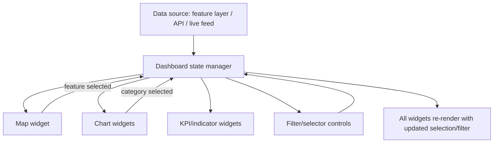
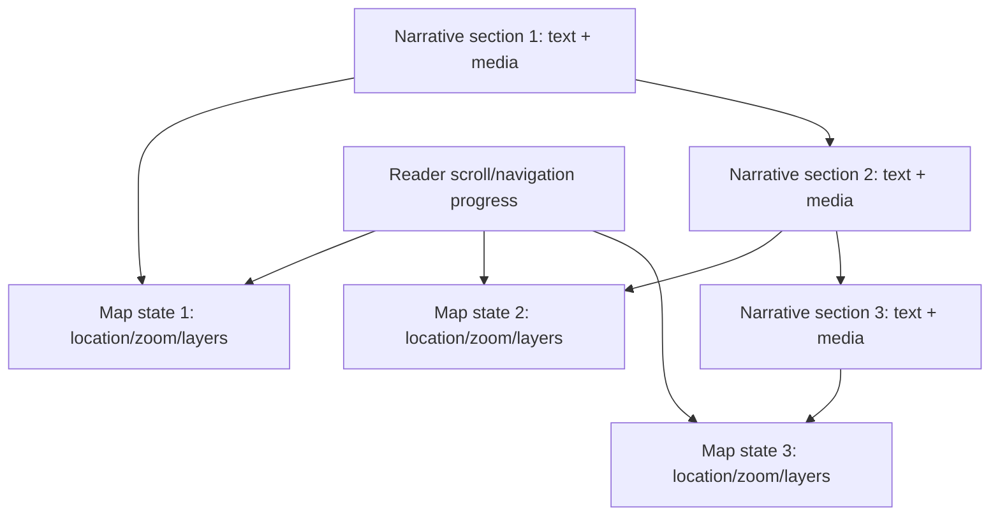

## Interactive Dashboards and Story Maps


### Overview

Interactive dashboards and story maps are two related but distinct patterns for communicating geospatial insight to an audience: dashboards prioritize real-time or near-real-time monitoring of multiple linked data views (maps, charts, KPIs) for operational or analytical decision-making, while story maps prioritize narrative-driven, sequential presentation combining maps, text, and media to guide a reader through a spatial story. Both build on the web mapping and API foundations covered earlier in this chapter, adding layout, interactivity, and narrative/monitoring-specific design patterns on top of the core rendering stack.

**Key Points**

- Dashboards emphasize simultaneity — multiple linked views updating together, often from live or frequently refreshed data sources, designed for ongoing monitoring or exploratory analysis.
- Story maps emphasize sequence — a controlled, often scrollytelling-driven narrative arc where the map view changes in response to the reader's progress through accompanying text, designed for one-time consumption and communication.
- Both patterns are commonly built either with no-code/low-code authoring tools (ArcGIS Dashboards, ArcGIS StoryMaps, Felt) or as custom-coded applications using the JavaScript mapping libraries and APIs covered earlier in this chapter.
- Linked interactivity — selecting a feature on the map updates a chart, or vice versa — is a defining technical characteristic of dashboards and a common enhancement in interactive story maps.

### Interactive Dashboards

#### Core Design Pattern

A geospatial dashboard combines a map view with supporting visualizations (charts, gauges, tables, KPI indicators) in a single-screen layout, with all components typically bound to the same underlying dataset or a set of related datasets, updating together as data refreshes or as the user filters/selects.



**Key Points**

- The dashboard state manager pattern — a central store of current filters, selections, and time range that all widgets read from and write to — is the architectural core enabling linked interactivity; without it, widgets operate independently and lose the "select on one view, highlight everywhere" behavior that defines a dashboard.
- Time-series data (sensor readings, incident logs, environmental monitoring feeds as discussed under AI-Assisted Environmental Monitoring) is a particularly common dashboard data type, often paired with a time slider control that filters the map and charts simultaneously to a selected time window.
- Refresh cadence (real-time via WebSocket/polling vs. periodic batch refresh) is a key architectural decision driven by the underlying data source's update frequency and the operational criticality of freshness for the use case.

#### Authoring Approaches

| Approach | Description | Tradeoffs |
| --- | --- | --- |
| No-code platform (e.g., ArcGIS Dashboards, Felt dashboards) | Drag-and-drop widget configuration bound to hosted feature layers | Fast to build, limited to platform's supported widget types and interactions |
| Low-code / BI-adjacent tools | Configuration-driven with some custom expression/scripting support | More flexibility than pure no-code, still bounded by platform architecture |
| Custom-coded (React/Vue + mapping library + charting library) | Full control over layout, interaction logic, and data sources | Highest development effort, unlimited flexibility |

**Example**

A simplified custom dashboard linking a MapLibre GL JS map to a chart, sharing a common selection state:

```javascript
// Shared state
let selectedRegionId = null;

function onMapFeatureClick(e) {
  selectedRegionId = e.features[0].properties.id;
  map.setFilter('region-highlight', ['==', ['get', 'id'], selectedRegionId]);
  updateChart(selectedRegionId);
}

function onChartBarClick(regionId) {
  selectedRegionId = regionId;
  map.setFilter('region-highlight', ['==', ['get', 'id'], regionId]);
  map.flyTo({ center: getRegionCentroid(regionId), zoom: 10 });
}

function updateChart(regionId) {
  const data = fetchTimeSeriesForRegion(regionId);
  chart.data.datasets[0].data = data;
  chart.update();
}

map.on('click', 'regions-layer', onMapFeatureClick);
```

This illustrates the bidirectional linking pattern: a map click updates the chart, and (symmetrically) a chart interaction updates the map's highlight and viewport — the defining interactive behavior of a dashboard.

#### Dashboard Widget Types

- **Map widget** — the primary spatial view, often supporting click-to-select, hover tooltips, and filter-driven feature highlighting.
- **Time series/trend charts** — line or bar charts showing a metric over time, frequently linked to a time slider that also filters the map.
- **Category/comparison charts** — bar or pie charts breaking down a metric by category (region, type, status), commonly clickable to filter the map to that category.
- **KPI indicators** — single-value summary metrics (total count, average, percent change) providing at-a-glance status, often with conditional formatting (color change on threshold breach).
- **Data tables/lists** — sortable, filterable tabular views of underlying features, often synchronized with map selection.
- **Gauge/threshold widgets** — visual indicators for metrics against defined operational thresholds, common in monitoring/alerting contexts (e.g., the environmental monitoring alerting patterns discussed earlier in this chapter).

### Story Maps

#### Core Design Pattern

A story map presents a sequence of narrative sections, each pairing text/media with a specific map state (location, zoom, visible layers, highlighted features), designed to guide the reader through a spatial narrative rather than inviting open-ended exploration.



**Key Points**

- The "scrollytelling" pattern — map state transitions triggered by the reader's scroll position through accompanying text — is the most common interaction model for web-based story maps, implemented via scroll-position listeners that trigger `flyTo`/`easeTo` map camera transitions.
- Story maps commonly use smooth camera animation (easing between geographic states) rather than instantaneous jumps, reinforcing the narrative's sense of guided movement through space.
- Unlike dashboards, story maps typically present a fixed, author-controlled sequence rather than open-ended filtering/exploration, though many implementations allow readers to pause and interact with the current map state before continuing the narrative.

#### Authoring Approaches

- **No-code platforms** (ArcGIS StoryMaps, Felt's narrative features) — template-driven authoring where a non-developer author assembles sections, uploads media, and configures map views through a visual editor, the dominant approach for content-focused (journalism, education, public communication) use cases.
- **Custom-coded scrollytelling** — built with a mapping library (commonly MapLibre GL JS or Mapbox GL JS given their smooth camera animation support) combined with a scroll-triggering library (e.g., Scrollama) or framework-native scroll-observer patterns, used when the narrative requires interaction patterns beyond what no-code platforms support.

**Example**

A simplified scrollytelling pattern using the Scrollama library pattern with MapLibre GL JS:

```javascript
const scroller = scrollama();

const storySteps = [
  { center: [120.98, 14.60], zoom: 11, layers: ['basemap'] },
  { center: [120.95, 14.55], zoom: 14, layers: ['basemap', 'flood-zones'] },
  { center: [120.92, 14.52], zoom: 16, layers: ['basemap', 'flood-zones', 'evacuation-routes'] }
];

scroller
  .setup({ step: '.story-section', offset: 0.5 })
  .onStepEnter(response => {
    const state = storySteps[response.index];
    map.flyTo({ center: state.center, zoom: state.zoom, duration: 2000 });
    setVisibleLayers(state.layers);
  });
```

Each narrative section (`.story-section` in the DOM) triggers a corresponding map camera and layer-visibility transition as the reader scrolls it into view, implementing the core scrollytelling pattern.

### Dashboard vs. Story Map Comparison

| Aspect | Dashboard | Story Map |
| --- | --- | --- |
| Primary goal | Ongoing monitoring, exploratory analysis | One-time narrative communication |
| Interaction model | Open-ended filtering, linked selection | Sequential, author-controlled progression |
| Data freshness | Often real-time or frequently refreshed | Typically static/point-in-time |
| Audience | Analysts, operators, decision-makers | General public, stakeholders, educational audiences |
| Typical authoring tool | ArcGIS Dashboards, custom BI-style tools | ArcGIS StoryMaps, custom scrollytelling |
| Reusability | Reused repeatedly for ongoing monitoring | Consumed once (or occasionally) as a finished piece |

### Architecture Diagram

<svg xmlns="http://www.w3.org/2000/svg" viewBox="0 0 900 320">
<text x="450" y="24" font-size="16" font-weight="bold" text-anchor="middle" fill="#1a1a1a">Dashboard vs. Story Map Interaction Models (svg_diagram)</text>

<text x="220" y="55" font-size="13" font-weight="bold" text-anchor="middle" fill="`#1a1a1a`">Dashboard</text>

<rect x="80" y="70" width="120" height="50" rx="5" fill="#dbeafe" stroke="#1e40af" />
<text x="140" y="100" font-size="10" text-anchor="middle" fill="#1a1a1a">Map widget</text>
<rect x="220" y="70" width="120" height="50" rx="5" fill="#dcfce7" stroke="#166534" />
<text x="280" y="100" font-size="10" text-anchor="middle" fill="#1a1a1a">Chart widget</text>
<rect x="150" y="150" width="120" height="50" rx="5" fill="#fef3c7" stroke="#92400e" />
<text x="210" y="180" font-size="10" text-anchor="middle" fill="#1a1a1a">Shared state</text>
<line x1="140" y1="120" x2="180" y2="150" stroke="#1a1a1a" stroke-width="1.5" marker-end="url(#arrow8)" />
<line x1="180" y1="150" x2="140" y2="120" stroke="#1a1a1a" stroke-width="1.5" marker-end="url(#arrow8)" />
<line x1="280" y1="120" x2="240" y2="150" stroke="#1a1a1a" stroke-width="1.5" marker-end="url(#arrow8)" />
<line x1="240" y1="150" x2="280" y2="120" stroke="#1a1a1a" stroke-width="1.5" marker-end="url(#arrow8)" />
<text x="210" y="225" font-size="9" text-anchor="middle" fill="#4b5563">bidirectional linking, open-ended</text>
<line x1="450" y1="60" x2="450" y2="260" stroke="#9ca3af" stroke-width="1" stroke-dasharray="4" />

<text x="680" y="55" font-size="13" font-weight="bold" text-anchor="middle" fill="`#1a1a1a`">Story Map</text>

<rect x="560" y="70" width="100" height="40" rx="5" fill="#ede9fe" stroke="#5b21b6" />
<text x="610" y="94" font-size="9" text-anchor="middle" fill="#1a1a1a">Section 1</text>
<rect x="680" y="70" width="100" height="40" rx="5" fill="#ede9fe" stroke="#5b21b6" />
<text x="730" y="94" font-size="9" text-anchor="middle" fill="#1a1a1a">Section 2</text>
<rect x="560" y="150" width="100" height="40" rx="5" fill="#fee2e2" stroke="#991b1b" />
<text x="610" y="174" font-size="9" text-anchor="middle" fill="#1a1a1a">Map state 1</text>
<rect x="680" y="150" width="100" height="40" rx="5" fill="#fee2e2" stroke="#991b1b" />
<text x="730" y="174" font-size="9" text-anchor="middle" fill="#1a1a1a">Map state 2</text>
<line x1="610" y1="110" x2="610" y2="150" stroke="#1a1a1a" stroke-width="1.5" marker-end="url(#arrow8)" />
<line x1="730" y1="110" x2="730" y2="150" stroke="#1a1a1a" stroke-width="1.5" marker-end="url(#arrow8)" />
<line x1="660" y1="90" x2="680" y2="90" stroke="#1a1a1a" stroke-width="1.5" marker-end="url(#arrow8)" />
<text x="680" y="225" font-size="9" text-anchor="middle" fill="#4b5563">unidirectional sequence, author-controlled</text>
</svg>

### Data Architecture Considerations

**Key Points**

- Dashboards drawing from live/frequently updated sources need a defined refresh strategy — WebSocket push for true real-time needs, or polling at an interval appropriate to the data's actual update frequency (over-polling wastes resources without improving perceived freshness beyond the source's actual refresh rate).
- Story maps, being typically static content, can pre-fetch or bundle all required data/media at build time rather than making live API calls during reader consumption, improving load performance and reliability for a narrative that won't change.
- Both patterns benefit from the tile and vector data serving patterns discussed under Web Map Services and APIs — dashboards particularly benefit from vector tiles for dynamic, filterable map layers, while story maps often use simpler pre-styled basemap tiles since their map states are author-defined rather than user-explored.

### Accessibility and UX Considerations

**Key Points**

- Dashboards with dense, simultaneously updating widgets should provide clear visual hierarchy and avoid overwhelming users with excessive simultaneous change; progressive disclosure (drill-down from summary to detail) is a common mitigation.
- Story maps should provide navigation controls beyond pure scroll (e.g., a table of contents or section jump-links) to accommodate readers who prefer to skip ahead or revisit sections, rather than forcing linear scroll-only consumption.
- Both patterns should consider mobile/responsive layout carefully — dashboards often require significant layout restructuring (stacking widgets vertically, simplifying chart complexity) for small screens, while story maps' sequential nature adapts more naturally to mobile scroll interaction.
- Color and symbology choices for both dashboards and story maps should account for colorblind accessibility, particularly for choropleth/category-based map styling where color is the primary information-encoding channel.

### Common Pitfalls

- Building a dashboard without a genuine linked-state architecture, resulting in a collection of independent widgets that merely share a page rather than a true interactive dashboard with cross-widget selection/filtering.
- Over-polling live data sources for a dashboard when the underlying data source updates far less frequently than the polling interval, wasting resources without improving actual freshness.
- Using instantaneous map jumps instead of smooth camera easing in a scrollytelling story map, breaking the narrative's sense of guided spatial movement.
- Designing dashboards with excessive simultaneous widget density that overwhelms users, rather than applying progressive disclosure or summary/drill-down patterns.
- Building story maps with scroll-only navigation and no way to jump to or revisit specific sections, frustrating readers who don't want a strictly linear reading experience.
- Choosing a no-code platform for a use case that ultimately requires custom interaction logic beyond the platform's supported widget/template set, requiring a costly migration to custom-coded development mid-project.

**Next Steps**

- Web Mapping Fundamentals (core rendering concepts underlying both patterns)
- JavaScript Mapping Libraries (MapLibre GL JS camera animation for scrollytelling)
- Web Map Services and APIs (data serving patterns for dashboard and story map layers)
- Real-Time Data Streaming for Geospatial Dashboards (WebSocket architectures)
- Cloud GIS Hosting Platforms (no-code dashboard/story map authoring tools)
- Data Visualization Design Principles for Geospatial Data
- Mobile-Responsive Web GIS Application Design
- Accessibility Standards for Interactive Web Maps