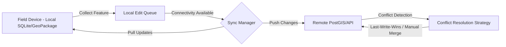
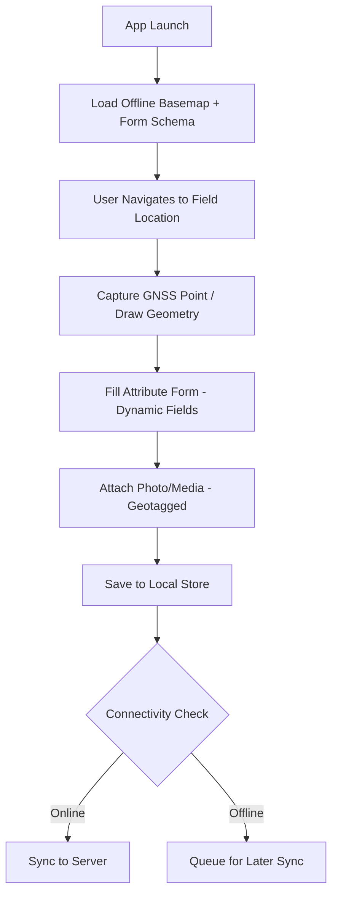
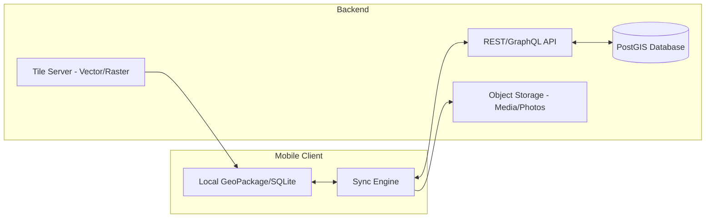

## Mobile Geospatial App Development

### Overview

Mobile Geospatial App Development refers to the design, engineering, and deployment of location-aware applications that run on smartphones, tablets, and rugged field devices. These applications integrate positioning technologies (GPS/GNSS), sensor data (accelerometer, gyroscope, compass, barometer), offline/online map rendering, and spatial data collection or visualization capabilities. This domain sits at the intersection of mobile software engineering and Geographic Information Systems (GIS), and is foundational to field data collection, asset inspection, navigation, environmental monitoring, disaster response, and citizen-science applications.

### Core Architectural Components

**Key Points**

- **Positioning Layer**: Interfaces with device GNSS chipsets (GPS, GLONASS, Galileo, BeiDou) via platform-native location APIs (Android `FusedLocationProviderClient`, iOS `CoreLocation`).
- **Rendering Engine**: Handles map tile rendering, vector overlay drawing, and camera/viewport manipulation (e.g., MapLibre GL Native, Mapbox Maps SDK, Esri ArcGIS Runtime, OSMDroid).
- **Data Layer**: Manages local storage (SQLite/GeoPackage, Realm, SpatiaLite) and synchronization with remote spatial databases (PostGIS via REST/GraphQL APIs).
- **Offline Cache Manager**: Downloads and stores vector/raster tiles, basemaps, and feature data for connectivity-constrained field use.
- **Sensor Fusion Module**: Combines GNSS with IMU (Inertial Measurement Unit) data to improve positional accuracy, especially in urban canyons or indoor environments.

### Platform and Framework Landscape

#### Native Development

| Platform | Language | Primary Geospatial SDK |
| --- | --- | --- |
| Android | Kotlin/Java | Google Maps SDK, ArcGIS Runtime SDK for Android, OSMDroid |
| iOS | Swift/Objective-C | MapKit, ArcGIS Runtime SDK for iOS, Mapbox Maps SDK |

Native development provides direct access to hardware sensors, background location services, and platform-specific optimizations, at the cost of maintaining two separate codebases.

#### Cross-Platform Frameworks

- **React Native**: Uses bridges/native modules for map rendering (`react-native-maps`, `@rnmapbox/maps`, `@maplibre/maplibre-react-native`). Popular for teams already using a React/TypeScript stack.
- **Flutter**: Dart-based, uses platform channels for map plugins (`flutter_map`, `mapbox_maps_flutter`, `google_maps_flutter`). Known for consistent rendering across platforms via Skia.
- **.NET MAUI / Xamarin**: C#-based cross-platform option with Esri ArcGIS Runtime SDK support.
- **Capacitor/Cordova (WebView-based)**: Wraps a web-based Leaflet or OpenLayers map in a native shell; simplest to build but weakest for offline performance and sensor access.

[Inference] The choice between native and cross-platform is typically driven by team skillset, required depth of sensor integration, and offline data volume — native is generally preferred for apps requiring heavy background GNSS logging or custom sensor fusion.

### GNSS Positioning and Accuracy

Consumer-grade smartphone GNSS chips typically report horizontal accuracy of 3–8 meters under open-sky conditions. Accuracy degrades significantly in dense urban areas (multipath interference) and under canopy cover.

**Key Points**

- **Accuracy Improvement Techniques**:
  - **Dual-frequency GNSS**: Modern chipsets (post-2018 flagship devices) support L1+L5 bands, improving accuracy to 1–3 meters.
  - **RTK/PPK Correction**: External Bluetooth-connected RTK receivers (e.g., Emlid Reach, Trimble Catalyst) paired with mobile apps can achieve centimeter-level accuracy via correction streams (NTRIP protocol).
  - **Kalman Filtering**: Software-side sensor fusion smooths noisy raw GNSS fixes using IMU data.
- **Android**: `LocationRequest.PRIORITY_HIGH_ACCURACY` combined with `GnssStatus.Callback` for raw satellite data access.
- **iOS**: `CLLocationManager` with `desiredAccuracy = kCLLocationAccuracyBest`, though iOS restricts raw GNSS measurement access more than Android.

### Offline Map and Data Strategies

Field-based geospatial applications (agriculture, forestry, utility inspection, disaster response) frequently operate without reliable connectivity, making offline capability a core architectural requirement rather than an optional feature.

#### Offline Basemap Approaches

1. **Vector Tile Packages (MBTiles/PMTiles)**: Pre-rendered or on-device rendered vector tiles stored locally, styled at runtime via style JSON (Mapbox Style Spec/MapLibre Style Spec).
2. **Raster Tile Caching**: Simpler but larger storage footprint; tiles are pre-downloaded PNG/JPEG images at fixed zoom levels.
3. **GeoPackage (OGC standard)**: A SQLite-based container format supporting both vector features and raster tiles in a single portable file — widely used in field data collection tools (QField, Mergin Maps, ArcGIS Field Maps).

#### Offline Feature Data Sync Pattern

**Conflict Resolution Strategies**:

- **Last-Write-Wins (LWW)**: Simplest, risks silent data loss.
- **Version Vector / Timestamp-based Merge**: Tracks per-field change history.
- **Manual Review Queue**: Flags conflicting edits for human resolution — common in multi-surveyor field campaigns.

### Data Collection Workflow Design

**Example**

A typical field data collection app workflow:

Form-driven data collection frameworks such as **ODK (Open Data Kit)**, **KoboToolbox**, and **Esri Survey123** use standardized form definition formats (XLSForm) to generate mobile data entry UIs without custom app development.

### Popular Frameworks and SDKs (Detailed)

#### Esri ArcGIS Field Maps / ArcGIS Runtime SDK

Enterprise-grade platform supporting offline map areas, geodatabase replicas, and high-accuracy GNSS receiver integration. Uses the ArcGIS Runtime SDK (available for Android, iOS, .NET, Qt) which wraps geodatabase read/write, geometry engines, and network analysis directly on-device.

#### QField / QGIS Mobile Ecosystem

Open-source field data collection app built on the QGIS core engine (C++/QML), allowing direct use of QGIS project files (`.qgz`) on mobile devices. Strong in academic, humanitarian, and environmental science use cases due to its open data model and GeoPackage-native workflow.

#### Mapbox / MapLibre GL Native

Vector tile rendering engines using GPU-accelerated rendering (OpenGL ES/Metal). MapLibre is the open-source fork maintained after Mapbox's license change in 2020, widely adopted for cost-sensitive or fully open-source stacks. [Unverified] Exact current feature parity between Mapbox GL and MapLibre GL should be checked against each project's latest release notes, as both evolve independently.

#### OpenLayers/Leaflet in WebView Wrappers

Used when rapid prototyping or code reuse from an existing web GIS is prioritized over native performance; suffers from WebView rendering overhead and constrained background GNSS access.

### Sensor Integration Beyond GNSS

**Key Points**

- **Barometer**: Improves vertical accuracy (altitude) and can detect floor-level changes in multi-story structures.
- **Magnetometer/Compass**: Provides heading for augmented reality (AR) overlays and bearing-based navigation.
- **Accelerometer/Gyroscope**: Used in dead-reckoning algorithms when GNSS signal is lost (e.g., tunnels, dense forest).
- **Camera + AR Frameworks**: ARKit (iOS) and ARCore (Android) enable geospatial AR — overlaying subsurface utility data, property boundaries, or environmental sensor readings onto the live camera feed. Google's ARCore Geospatial API anchors AR content to real-world VPS (Visual Positioning System) coordinates using Street View imagery.

### Performance Optimization Considerations

- **Tile Pyramid Management**: Load only visible zoom-level tiles; implement LRU (Least Recently Used) cache eviction for memory-constrained devices.
- **Vector Simplification**: Apply Douglas-Peucker or Visvalingam algorithms to reduce vertex count for complex polygons at lower zoom levels.
- **Background Location Throttling**: Excessive GNSS polling drains battery rapidly; adaptive sampling (reducing frequency when device is stationary, detected via accelerometer) is a common battery-conservation pattern.
- **Spatial Indexing On-Device**: R-tree indexes (via SQLite's R-Tree module) accelerate local bounding-box queries for large offline feature sets.

[Inference] Battery consumption from continuous high-accuracy GNSS polling is one of the most common user-reported issues in field data collection apps; adaptive polling strategies are widely recommended as a mitigation, though optimal thresholds are application-specific.

### Environmental Science Application Patterns

**Example**

Common mobile geospatial workflows specific to environmental and earth science fieldwork:

- **Species Occurrence Logging**: GPS-tagged photo + taxonomic form (e.g., iNaturalist, eBird architecture pattern).
- **Water Quality Sampling**: Point capture with attached sensor readings (pH, turbidity) via Bluetooth Low Energy (BLE) probe integration.
- **Vegetation Plot Surveys**: Polygon/transect capture with nested attribute forms for canopy cover, species composition.
- **Air Quality Monitoring**: Continuous track logging combined with onboard/external sensor streaming (e.g., low-cost PM2.5 sensors via BLE), producing a moving spatial time-series.
- **Disaster/Hazard Rapid Assessment**: Offline-first damage assessment forms with photo capture, synced in batches once connectivity is restored (used extensively in humanitarian GIS, e.g., OpenStreetMap Humanitarian Team / Missing Maps workflows).

### Backend Integration Architecture

A common backend stack pairs **PostGIS** for spatial querying, a **tile server** (e.g., Martin, TileServer GL, GeoServer) for basemap/vector tile delivery, and a lightweight API layer (REST or GraphQL) exposing CRUD operations on spatial features, often authenticated via OAuth2/JWT for multi-user field teams.

### Security and Data Integrity Considerations

- **Local Data Encryption**: SQLCipher for encrypting local SQLite/GeoPackage stores containing sensitive location data (e.g., protected species locations, critical infrastructure).
- **Location Data Privacy**: Compliance with platform-level permission models (Android runtime permissions, iOS "When In Use" vs "Always" location authorization) and regulatory frameworks (GDPR Article 4 classifies precise location as personal data).
- **Coordinate Obfuscation**: For sensitive environmental data (e.g., endangered species nesting sites), applying deliberate coordinate fuzzing/generalization before public data sharing is a common practice in conservation GIS.

### Testing and QA Considerations

**Key Points**

- **GNSS Simulation**: Android emulators and iOS simulators support mock/simulated GPX route playback for testing navigation logic without field deployment.
- **Offline Mode Testing**: Explicit airplane-mode test cycles to validate sync queue behavior and conflict resolution.
- **Device Fragmentation**: Android's broad hardware diversity (chipset-dependent GNSS accuracy) necessitates testing across multiple device tiers; iOS fragmentation is comparatively lower.

### Related Topics

- Offline-First Application Architecture and Sync Conflict Resolution
- GeoPackage (OGC Standard) Deep Dive
- RTK/PPK GNSS Correction Workflows and NTRIP Protocol
- Augmented Reality for Geospatial Visualization (ARCore Geospatial API, ARKit)
- PostGIS Backend Design for Mobile Sync Endpoints
- Vector Tile Specifications (Mapbox Vector Tile / MVT Format)
- XLSForm and Form-Driven Data Collection Design (ODK, KoboToolbox)
- Battery-Efficient Continuous Location Tracking Patterns
- Humanitarian and Citizen-Science GIS Mobile Workflows